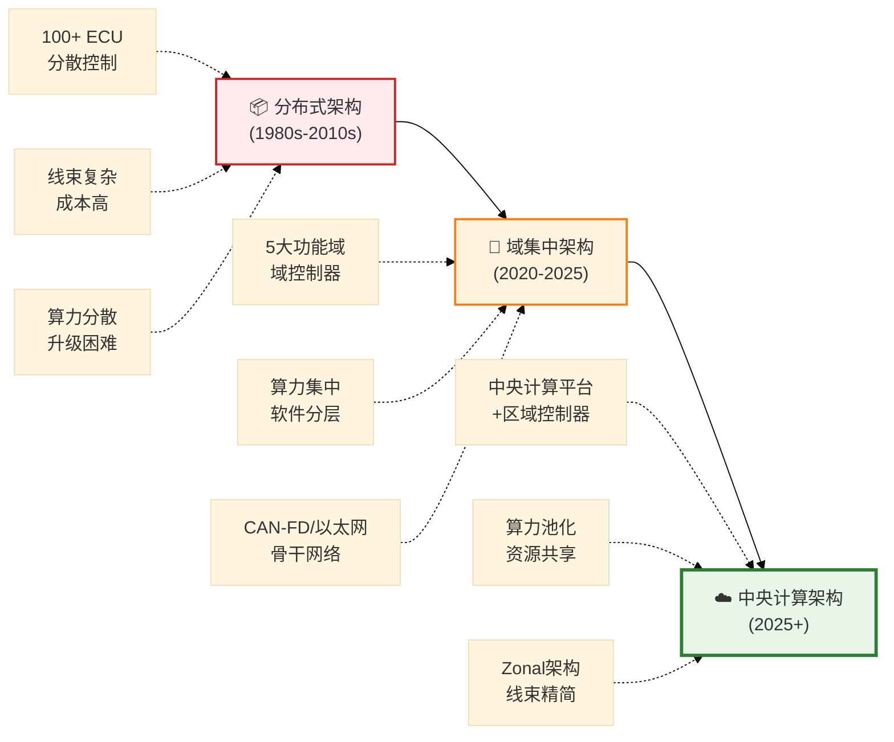
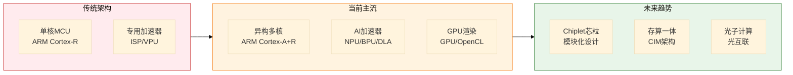
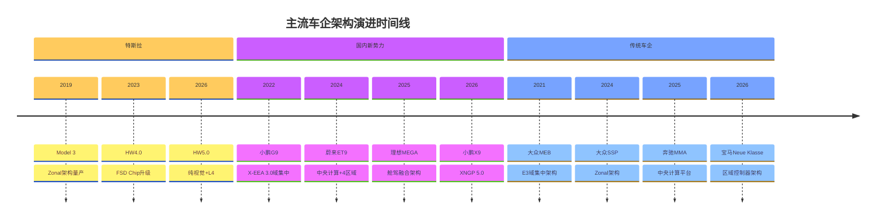

# 2026年车载芯片架构演进分析

> 来源：EEPW汽车电子产研社  
> 文章标题：《2026年车载芯片架构演进：从域控制到中央计算的跨越》  > 分析时间：2026-03-13

---

## 一、架构演进脉络

### 1.1 三代架构对比



### 1.2 演进驱动力

| 驱动力 | 分布式→域集中 | 域集中→中央计算 |
|--------|---------------|-----------------|
| **功能需求** | ADAS普及 | 高阶智驾+大模型 |
| **算力需求** | 10-100 TOPS | 500-2000+ TOPS |
| **软件定义** | 功能域软件集中 | 整车软件融合 |
| **成本压力** | 减少ECU数量 | 线束精简70%+ |
| **OTA升级** | 域级别更新 | 整车统一升级 |

---

## 二、Zonal架构深度解析

### 2.1 Zonal架构核心特征

```mermaid
%%{init: {'theme': 'base'}}%%
flowchart TB
    subgraph Central["☁️ 中央计算平台"]
        C1["智能座舱计算"]
        C2["自动驾驶计算"]
        C3["整车控制计算"]
        C4["冗余安全计算"
    end
    
    subgraph Zonal["🌐 Zonal区域控制器"]
        Z1["Zone-1\n前部区域"]
        Z2["Zone-2\n左部区域"]
        Z3["Zone-3\n右部区域"]
        Z4["Zone-4\n后部区域"]
    end
    
    subgraph ECU["⚙️ 边缘执行单元"]
        E1["传感器\n摄像头/雷达"]
        E2["执行器\n电机/电磁阀"]
    end
    
    C1 --- Z1
    C2 --- Z1
    C3 --- Z2
    C3 --- Z3
    C4 --- Z4
    
    Z1 --- E1
    Z2 --- E2
    Z3 --- E1
    Z4 --- E2
    
    style Central fill:#e3f2fd,stroke:#1565c0,stroke-width:3px
    style Zonal fill:#fff8e1,stroke:#ffa000,stroke-width:2px
    style ECU fill:#e8f5e9,stroke:#2e7d32,stroke-width:2px
```

### 2.2 Zonal vs 功能域对比

| 维度 | 功能域架构 | Zonal架构 |
|------|-----------|-----------|
| **划分逻辑** | 按功能（智驾/座舱/底盘） | 按物理位置（前后左右） |
| **线束长度** | 长（跨域连接） | 短（就近连接） |
| **算力部署** | 域控制器各自独立 | 中央计算平台统一 |
| **软件架构** | 功能域隔离 | 软硬解耦、服务化 |
| **代表车型** | 大众MEB、小鹏G9 | 特斯拉Model 3、蔚来ET9 |
| **量产时间** | 2020-2023 | 2024-2026 |

---

## 三、芯片选型趋势分析

### 3.1 主流芯片算力对比（2026年）

| 厂商 | 芯片 | 架构 | 算力 | 典型应用 |
|------|------|------|------|----------|
| **英伟达** | Thor | CPU+GPU+DLA | 2000 TOPS | 高阶智驾 |
| **高通** | 8797 | CPU+GPU+NPU | 300 TOPS | 舱驾融合 |
| **地平线** | J6P | CPU+BPU+DSP | 560 TOPS | 智驾域控 |
| **华为** | MDC 810 | CPU+AI Core | 400 TOPS | 智驾域控 |
| **Mobileye** | EyeQ6H | CPU+GPU+VPU | 34 TOPS | L2+智驾 |
| **德州仪器** | TDA4VH | CPU+GPU+DSP | 32 TOPS | 前视一体机 |

### 3.2 芯片架构演进趋势



---

## 四、头部车企布局

### 4.1 2026年量产车型架构对比

| 车企 | 车型/平台 | 架构类型 | 中央算力 | 区域控制器 | 芯片方案 |
|------|-----------|----------|----------|------------|----------|
| **特斯拉** | Model 3/Y | Zonal | 144 TOPS | 左/右/前 | FSD Chip |
| **蔚来** | ET9/NT3.0 | Zonal | 1000+ TOPS | 4区域 | 英伟达Orin/Thor |
| **小鹏** | X9/XNGP 5.0 | 跨域融合 | 508 TOPS | 3域融合 | 英伟达Orin-X |
| **理想** | MEGA/M9 | 中央计算 | 128 TOPS | 区域控制 | 地平线J5/英伟达Orin |
| **大众** | SSP平台 | Zonal | 1500 TOPS | 4区域 | 高通/Rivian |
| **奔驰** | MMA平台 | 中央计算 | 未公布 | 4区域 | 英伟达Orin |

### 4.2 架构演进路线图



---

## 五、关键洞察

### 5.1 2026年芯片选型关键词

```
🔥 舱驾融合 (Cockpit-Driving Integration)
   └─ 单芯片同时处理座舱+智驾，减少芯片数量
   
🔥 Chiplet芯粒 (Chiplet Architecture)
   └─ 模块化设计，灵活组合计算/存储/AI单元
   
🔥 存算一体 (Computing-in-Memory)
   └─ 突破内存墙，提升AI推理效率
   
🔥 车规级大模型 (Auto LLM)
   └─ 支持端侧部署的Transformer加速
```

### 5.2 技术挑战

| 挑战 | 描述 | 解决方向 |
|------|------|----------|
| **散热** | 1000+ TOPS功耗超100W | 液冷+先进封装 |
| **延迟** | 跨域通信实时性 | 时间敏感网络(TSN) |
| **安全** | 中央节点失效风险 | 冗余设计+功能安全 |
| **成本** | 高算力芯片价格高昂 | 国产化替代+规模效应 |

---

## 六、总结

2026年车载芯片架构正处于**域集中向中央计算跨越**的关键节点：

1. **Zonal架构成为主流**：特斯拉、蔚来等头部车企已实现量产
2. **算力需求持续攀升**：从200 TOPS向2000 TOPS演进
3. **芯片架构异构化**：CPU+GPU+NPU+DSP融合成为标配
4. **舱驾融合加速**：单芯片多场景处理成为趋势
5. **国产化突围**：地平线、华为等国内厂商快速崛起

**未来展望**：2027-2030年，随着L4级自动驾驶普及和车载大模型应用，车载芯片将向**万亿级算力**演进，Chiplet和存算一体技术将成为破局关键。

---

> 🏷️ **标签**：`车载芯片`, `Zonal架构`, `中央计算`, `域控制器`, `舱驾融合`, `2026趋势`
