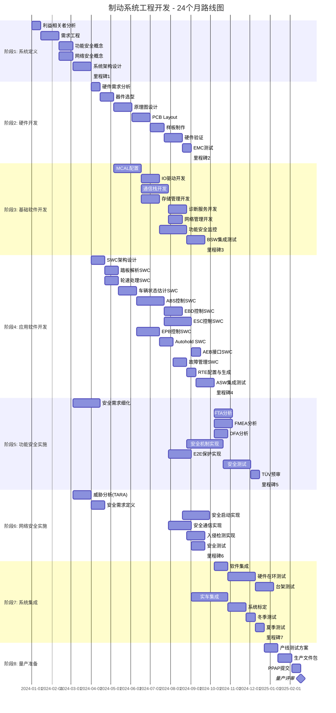
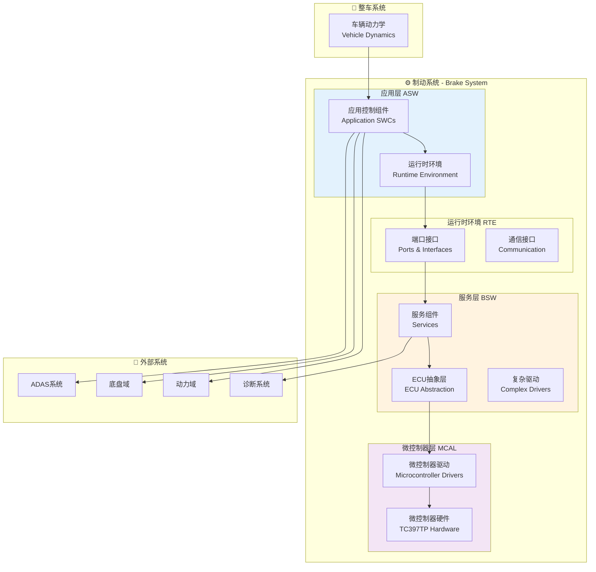

# 制动系统完整工程开发项目规划

> **项目代号**: BRAKE-SYS-2026  
> **项目类型**: 汽车电子制动控制系统（ASIL-D）  
> **技术栈**: AUTOSAR Classic Platform + Adaptive Platform  
> **开发周期**: 24个月  
> **团队规模**: 35人

---

## 1. 项目总体规划

### 1.1 项目目标

开发一套完整的、符合ASIL-D功能安全等级的电子制动控制系统，包括：
- **应用层 (ASW)**: 完整的制动控制算法和应用软件组件
- **运行时环境 (RTE)**: 组件间接口和通信机制
- **基础软件 (BSW)**: 完整的服务层、ECU抽象层、微控制器驱动
- **微控制器配置 (MCAL)**: 底层硬件驱动配置
- **功能安全**: ISO 26262全流程实施
- **网络安全**: ISO/SAE 21434合规

### 1.2 系统能力矩阵

| 功能模块 | 能力等级 | ASIL等级 | 响应时间 | 控制精度 |
|----------|----------|----------|----------|----------|
| 常规制动 | ASIL-D | D | < 200ms | ±0.1bar |
| ABS防抱死 | ASIL-D | D | < 100ms | ±5%滑移率 |
| EBD分配 | ASIL-D | D | < 150ms | ±2%制动力 |
| ESC稳定 | ASIL-D | D | < 80ms | ±2°横摆角 |
| EPB驻车 | ASIL-C | C | < 2s | ±0.05g |
| Autohold | ASIL-B | B | < 500ms | 静态保持 |
| AEB触发 | ASIL-D | D | < 50ms | 全制动 |

### 1.3 项目阶段划分



---

## 2. 系统架构总览

### 2.1 分层架构视图



---

## 3. 目录结构规划

```
autosar/engineering/brake-system/
├── 00-project-management/          # 项目管理
│   ├── project-plan.md            # 项目总体规划
│   ├── resource-allocation.md     # 资源分配
│   └── risk-management.md         # 风险管理
│
├── 01-system-design/              # 系统设计
│   ├── system-architecture.md     # 系统架构设计
│   ├── functional-safety-concept.md # 功能安全概念
│   └── cybersecurity-concept.md   # 网络安全概念
│
├── 02-requirements/               # 需求工程
│   ├── stakeholder-requirements.md # 利益相关者需求
│   ├── technical-requirements.md  # 技术需求规格
│   ├── safety-requirements.md     # 安全需求
│   └── interface-requirements.md  # 接口需求
│
├── 03-architecture/               # 架构设计
│   ├── logical-architecture.md    # 逻辑架构
│   ├── technical-architecture.md  # 技术架构
│   └── software-architecture.md   # 软件架构
│
├── 04-asw-design/                 # 应用层设计
│   ├── swc-overview.md            # SWC总览
│   ├── swc-brake-control.md       # 制动控制SWC
│   ├── swc-abs.md                 # ABS控制SWC
│   ├── swc-esc.md                 # ESC控制SWC
│   ├── swc-epb.md                 # EPB控制SWC
│   ├── swc-fault-management.md    # 故障管理SWC
│   ├── rte-configuration.md       # RTE配置
│   └── data-types.md              # 数据类型定义
│
├── 05-bsw-design/                 # 服务层设计
│   ├── bsw-overview.md            # BSW总览
│   ├── services/                  # 服务组件
│   │   ├── com-services.md        # 通信服务
│   │   ├── diag-services.md       # 诊断服务
│   │   ├── nm-services.md         # 网络管理
│   │   └── mem-services.md        # 存储服务
│   ├── ecu-abstraction/           # ECU抽象层
│   │   ├── io-abstraction.md      # IO抽象
│   │   ├── com-abstraction.md     # 通信抽象
│   │   └── mem-abstraction.md     # 存储抽象
│   └── complex-drivers/           # 复杂驱动
│       ├── valve-driver.md        # 阀驱动
│       └── motor-driver.md        # 电机驱动
│
├── 06-mcal-config/                # MCAL配置
│   ├── mcal-overview.md           # MCAL总览
│   ├── adc-config.md              # ADC配置
│   ├── pwm-config.md              # PWM配置
│   ├── can-config.md              # CAN配置
│   ├── dio-config.md              # DIO配置
│   └── wdg-config.md              # 看门狗配置
│
├── 07-integration/                # 集成
│   ├── integration-strategy.md    # 集成策略
│   ├── integration-plan.md        # 集成计划
│   └── integration-reports/       # 集成报告
│
├── 08-testing/                    # 测试
│   ├── test-strategy.md           # 测试策略
│   ├── test-plans/                # 测试计划
│   └── test-reports/              # 测试报告
│
└── 09-release/                    # 发布
    ├── release-notes.md           # 发布说明
    ├── user-manual.md             # 用户手册
    └── maintenance-guide.md       # 维护指南
```

---

## 4. 实施计划

### 4.1 第一阶段：系统定义 (3个月)

**目标**: 完成系统级定义，确定技术路线和开发基线

| 任务 | 负责人 | 交付物 | 工期 |
|------|--------|--------|------|
| 利益相关者分析 | 系统工程师×2 | 利益相关者矩阵 | 2周 |
| 需求工程 | 系统工程师×3 | 需求规格书 (SRS) | 4周 |
| 功能安全概念 | 安全工程师×2 | 安全概念文档 | 3周 |
| 网络安全概念 | 安全工程师×1 | TARA报告 | 3周 |
| 系统架构设计 | 架构师×2 | 系统架构文档 | 4周 |

**里程碑1**: 系统定义冻结 (M1)

### 4.2 第二阶段：硬件开发 (6个月)

**目标**: 完成硬件设计、制作和验证

| 任务 | 负责人 | 交付物 | 工期 |
|------|--------|--------|------|
| 硬件需求分析 | 硬件工程师×2 | 硬件需求规格 | 2周 |
| 器件选型 | 硬件工程师×3 | 选型报告、BOM | 3周 |
| 原理图设计 | 硬件工程师×3 | 原理图、DFMEA | 4周 |
| PCB Layout | Layout工程师×2 | PCB文件、Gerber | 4周 |
| 样板制作 | 硬件工程师×2 | 样板、测试报告 | 3周 |
| 硬件验证 | 测试工程师×3 | 硬件测试报告 | 4周 |
| EMC测试 | EMC工程师×2 | EMC测试报告 | 2周 |

**里程碑2**: 硬件冻结 (M2)

### 4.3 第三阶段：基础软件开发 (6个月)

**目标**: 完成BSW开发，达到可集成状态

| 任务 | 负责人 | 交付物 | 工期 |
|------|--------|--------|------|
| MCAL配置 | 底层工程师×3 | MCAL配置、代码 | 6周 |
| IO驱动开发 | 底层工程师×2 | IO驱动、测试 | 4周 |
| 通信栈开发 | 通信工程师×3 | COM栈、NM栈 | 6周 |
| 存储管理开发 | 底层工程师×2 | NVM/FEE驱动 | 4周 |
| 诊断服务开发 | 诊断工程师×3 | DCM/DEM、UDS服务 | 4周 |
| 功能安全监控 | 安全工程师×3 | 安全监控BSW | 6周 |
| BSW集成测试 | 测试工程师×3 | BSW测试报告 | 4周 |

**里程碑3**: BSW就绪 (M3)

### 4.4 第四阶段：应用软件开发 (7个月)

**目标**: 完成ASW开发，实现全部功能

| 任务 | 负责人 | 交付物 | 工期 |
|------|--------|--------|------|
| SWC架构设计 | 架构师×2 | SWC设计文档 | 3周 |
| 踏板解析SWC | 应用工程师×2 | 踏板解析组件 | 3周 |
| 轮速处理SWC | 应用工程师×2 | 轮速处理组件 | 3周 |
| 车辆状态估计 | 算法工程师×3 | 状态估计算法 | 4周 |
| ABS控制SWC | 算法工程师×3 | ABS算法、标定 | 6周 |
| EBD控制SWC | 算法工程师×2 | EBD算法 | 4周 |
| ESC控制SWC | 算法工程师×3 | ESC算法、标定 | 6周 |
| EPB控制SWC | 应用工程师×3 | EPB控制逻辑 | 5周 |
| Autohold SWC | 应用工程师×2 | Autohold逻辑 | 3周 |
| AEB接口SWC | 应用工程师×2 | AEB接口 | 2周 |
| 故障管理SWC | 应用工程师×2 | 故障管理 | 3周 |
| RTE配置 | 集成工程师×2 | RTE配置、代码 | 2周 |
| ASW集成测试 | 测试工程师×4 | ASW测试报告 | 4周 |

**里程碑4**: ASW就绪 (M4)

---

## 5. 质量与合规

### 5.1 功能安全 (ISO 26262)

- **ASIL等级**: 全系统ASIL-D
- **安全活动**: HARA、FTA、FMEA、DFA全覆盖
- **TÜV认证**: 项目收尾阶段正式认证

### 5.2 网络安全 (ISO/SAE 21434)

- **TARA分析**: 项目初期完成威胁分析
- **安全机制**: 安全启动、安全通信、入侵检测
- **合规审计**: 第三方安全审计

### 5.3 ASPICE

- **流程级别**: ASPICE Level 3
- **过程域**: SYS.1-SYS.5, SWE.1-SWE.6全覆盖
- **评估节点**: M2, M4, M7

---

## 6. 项目管理

### 6.1 团队组织

```
项目总监 (1人)
    ├── 系统架构组 (5人)
    │       ├── 系统架构师×2
    │       ├── 功能安全工程师×2
    │       └── 网络安全工程师×1
    │
    ├── 硬件开发组 (8人)
    │       ├── 硬件工程师×5
    │       ├── Layout工程师×2
    │       └── EMC工程师×1
    │
    ├── 软件开发组 (18人)
    │       ├── 基础软件组 (8人)
    │       │       ├── MCAL工程师×3
    │       │       ├── 通信工程师×3
    │       │       └── 诊断工程师×2
    │       └── 应用软件组 (10人)
    │               ├── 应用工程师×4
    │               ├── 算法工程师×5
    │               └── 集成工程师×1
    │
    ├── 测试验证组 (6人)
    │       ├── HIL测试工程师×2
    │       ├── 台架测试工程师×2
    │       └── 实车测试工程师×2
    │
    └── 项目管理组 (2人)
            ├── 项目经理×1
            └── 质量工程师×1
```

### 6.2 工具链

| 类别 | 工具 | 用途 |
|------|------|------|
| 需求管理 | IBM DOORS / Polarion | 需求追踪与管理 |
| 架构设计 | Enterprise Architect | UML/SysML建模 |
| 软件开发 | EB tresos / DaVinci | AUTOSAR配置与开发 |
| 版本控制 | Git / Bitbucket | 代码版本管理 |
| CI/CD | Jenkins / GitLab CI | 持续集成 |
| 测试管理 | Vector CANoe | HIL测试 |
| 缺陷管理 | Jira | 问题追踪 |

---

*制动系统工程开发项目规划*  
*这是一个系统工程，面向汽车开发的主体命题*  
*关键词: 制动系统, AUTOSAR, ASIL-D, 系统工程, 汽车电子*