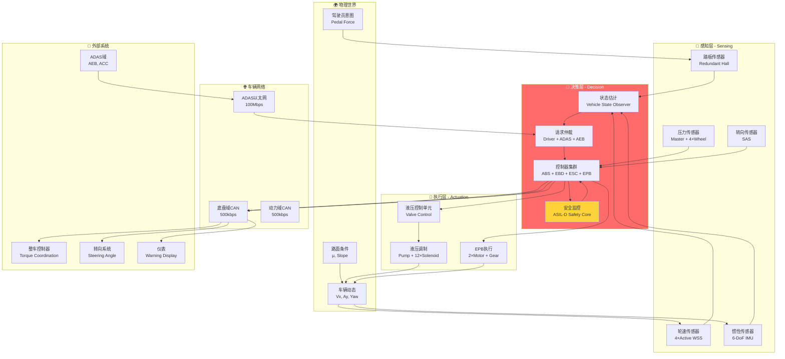
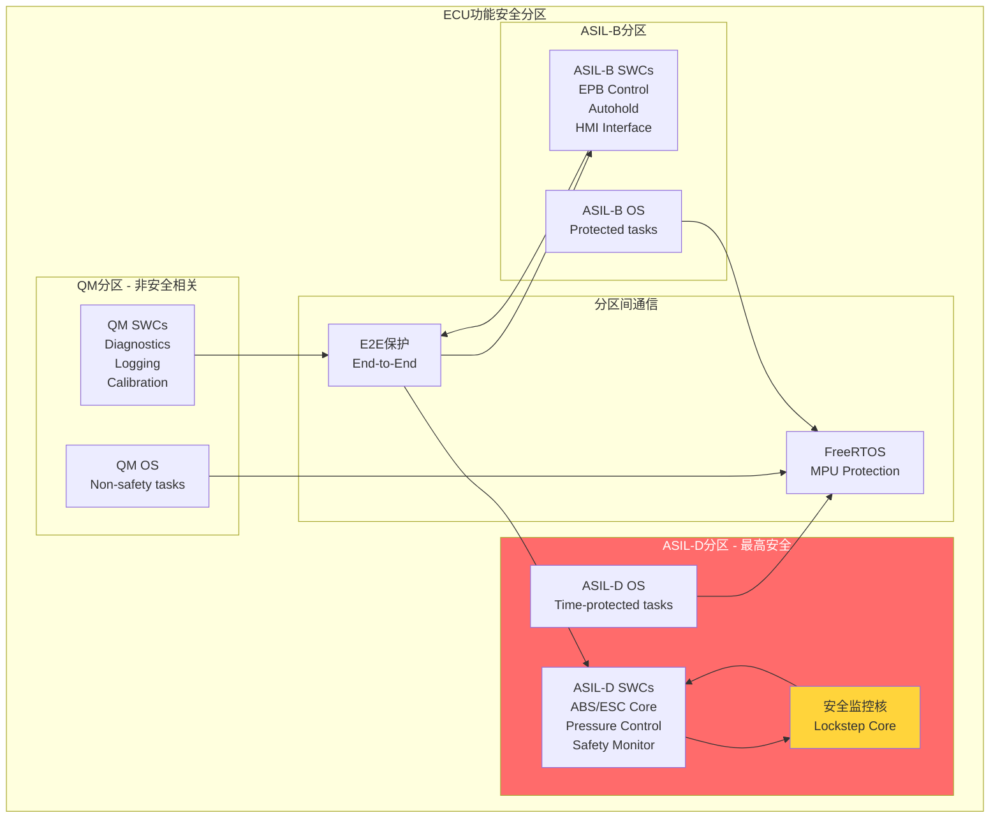
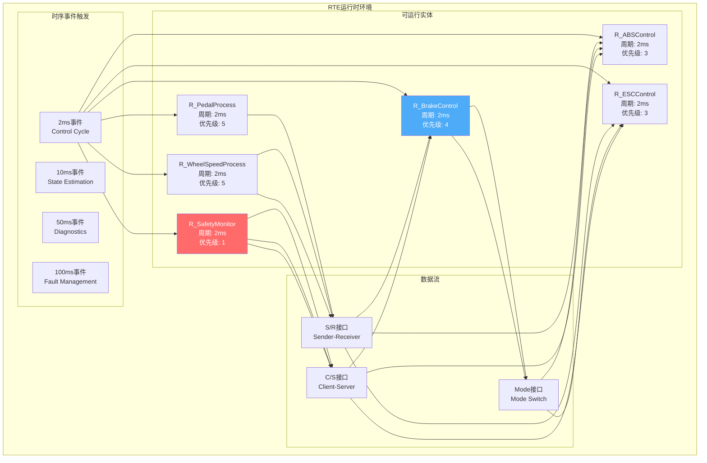
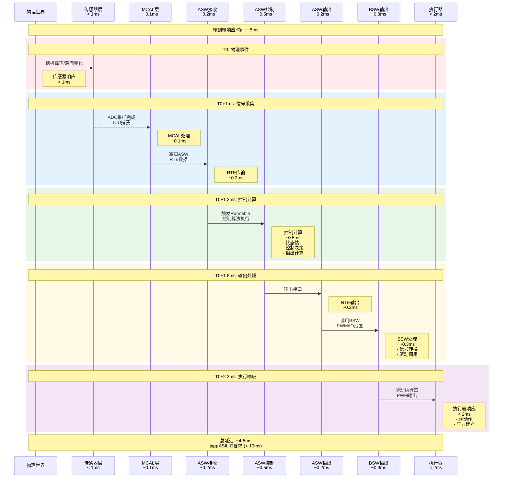
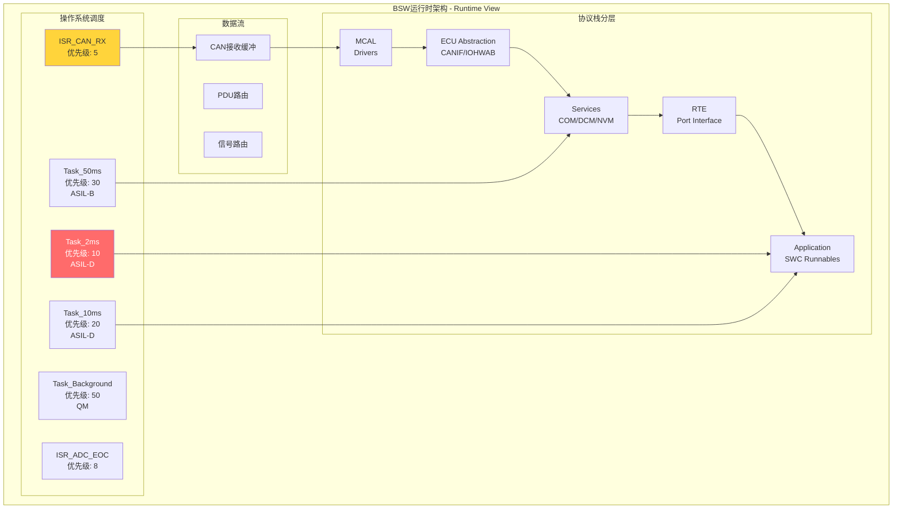
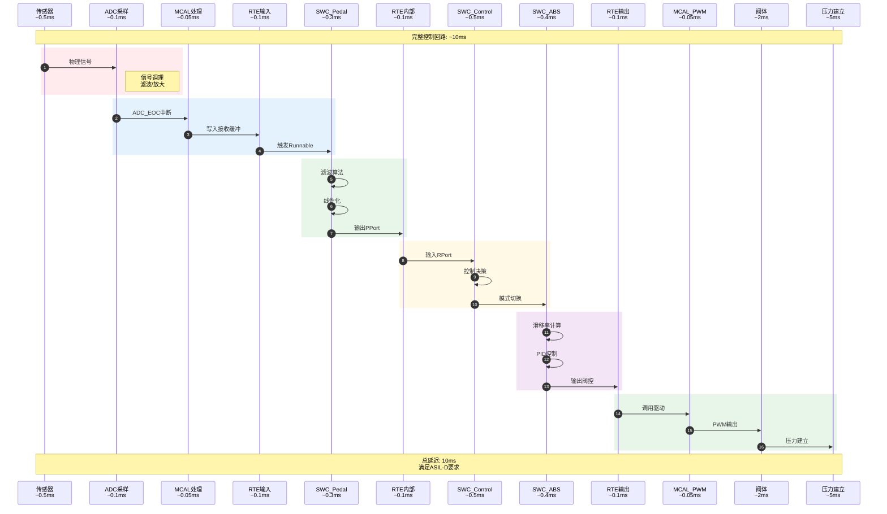
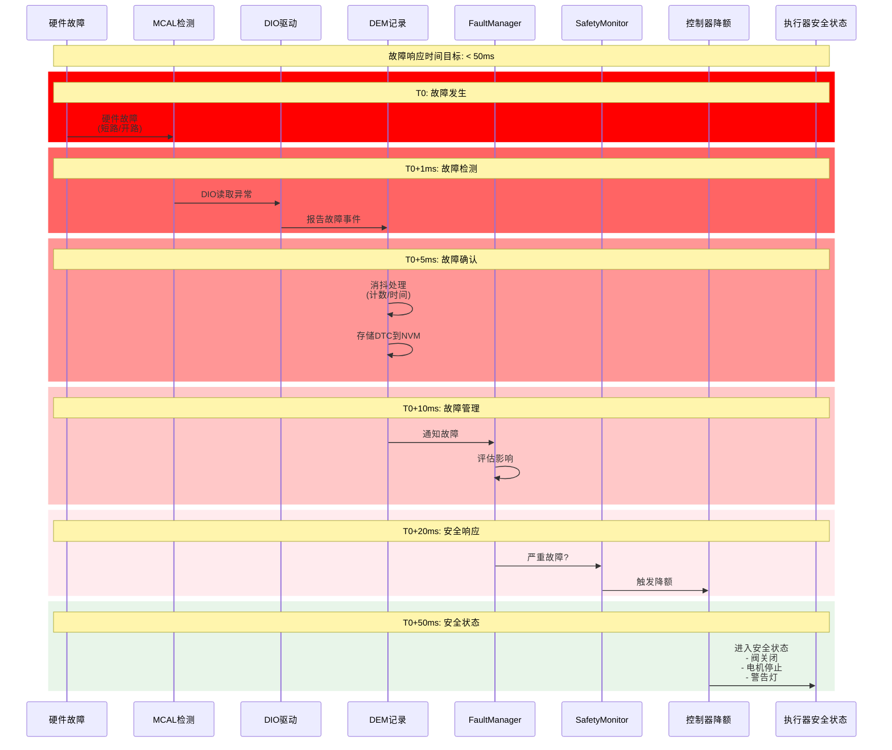

# 制动系统控制器 - 专家级系统架构设计

> **文档级别**: 专家级 (Expert Level)  
> **视角**: 汽车制动系统控制器架构师  
> **版本**: v2.0 - 全面优化版  
> **评审标准**: ASIL-D, ISO 26262, ASPICE L3

---

## 1. 系统架构全景图

### 1.1 端到端系统架构



### 1.2 功能安全分区架构



---

## 2. 应用层深度设计

### 2.1 SWC运行时行为模型



### 2.2 端到端控制时序



### 2.3 完整SWC接口规范

#### 2.3.1 SWC_BrakePedal 详细设计

```c
//=============================================================================
// SWC: BrakePedal
// 功能: 制动踏板信号采集、处理、诊断
// ASIL: D
// 周期: 2ms
//=============================================================================

//-------------------- Data Types --------------------
typedef struct {
    uint16 RawValue_Primary;      // 原始值: 0-4095 (12bit ADC)
    uint16 RawValue_Secondary;    // 冗余传感器
    uint16 FilteredValue;         // 滤波后值
    uint16 Gradient;              // 梯度: 0-1000 (/s)
    uint8  Validity;              // 有效性: 0=Invalid, 1=Valid
    uint8  PedalTravel;           // 踏板行程: 0-100%
} Pedal_DataType;

typedef enum {
    PEDAL_STS_NORMAL = 0,
    PEDAL_STS_DEGRADED,           // 降级模式 (单传感器)
    PEDAL_STS_FAULT               // 故障
} Pedal_StatusType;

//-------------------- Ports (R-Port) --------------------
// 从MCAL接收ADC数据
RPort_ADC_PedalPrimary    // ADC_Channel_0
RPort_ADC_PedalSecondary  // ADC_Channel_1

//-------------------- Ports (P-Port) --------------------
// 输出到BrakeControl
PPort_PedalPosition       // 踏板位置 (0-1000)
PPort_PedalGradient       // 踏板梯度
PPort_PedalStatus         // 踏板状态

//-------------------- Ports (S/R) --------------------
// 诊断数据
PPort_PedalDiagData       // 诊断信息供DEM使用

//-------------------- Runnables --------------------
// Runnable: Pedal_Process
// 周期: 2ms
// 执行时间: < 0.5ms
// WCET: 0.5ms (ASIL-D要求)
void Pedal_Process(void) {
    // 1. 读取原始ADC值
    adc_primary = Rte_Read_RPort_ADC_PedalPrimary();
    adc_secondary = Rte_Read_RPort_ADC_PedalSecondary();
    
    // 2. 信号有效性检查
    validity_check = CheckSignalValidity(adc_primary, adc_secondary);
    
    // 3. 传感器一致性检查 (ASIL-D要求)
    if (abs(adc_primary - adc_secondary) > THRESHOLD) {
        // 触发DTC, 进入降级模式
        Dem_SetEventStatus(DTC_PEDAL_PLAUSIBILITY, DEM_EVENT_STATUS_FAILED);
        PedalStatus = PEDAL_STS_DEGRADED;
    }
    
    // 4. 低通滤波 (消除噪声)
    filtered_value = LowPassFilter(adc_primary, FILTER_COEFF);
    
    // 5. 线性化 (ADC值 → 踏板行程%)
    pedal_travel = LinearInterpolation(filtered_value, 
                                        CALIB_MIN_PRIMARY, 
                                        CALIB_MAX_PRIMARY,
                                        0, 1000);
    
    // 6. 梯度计算 (用于预判)
    pedal_gradient = CalculateGradient(filtered_value, previous_value, 2ms);
    
    // 7. 输出到RTE
    Rte_Write_PPort_PedalPosition(pedal_travel);
    Rte_Write_PPort_PedalGradient(pedal_gradient);
    Rte_Write_PPort_PedalStatus(PedalStatus);
    
    // 8. 存储历史值
    previous_value = filtered_value;
}

//-------------------- Calibration Parameters --------------------
// 标定参数 (存储在NVM)
const uint16 CALIB_MIN_PRIMARY = 200;    // 踏板释放位置
const uint16 CALIB_MAX_PRIMARY = 3800;   // 踏板踩到底位置
const uint16 PLAUSIBILITY_THRESHOLD = 200; // 主副传感器差异阈值
const float FILTER_COEFF = 0.7;          // 滤波系数
```

#### 2.3.2 SWC_ABS 专家级算法设计

```c
//=============================================================================
// SWC: ABSController
// 功能: 防抱死制动控制 - 专家级算法
// ASIL: D
// 周期: 2ms
// 算法: 改进型PID + 滑模控制
//=============================================================================

typedef struct {
    // 输入信号
    float WheelSpeed[4];          // 四轮轮速 (m/s)
    float ReferenceSpeed;         // 参考车速 (m/s)
    float TargetPressure[4];      // 目标轮缸压力
    uint8 ABS_Enable;             // ABS使能标志
    
    // 输出信号
    uint16 ValveCmd_Inlet[4];     // 进油阀PWM (0-1000)
    uint16 ValveCmd_Outlet[4];     // 出油阀PWM (0-1000)
    uint8 PumpMotorCmd;           // 泵电机命令 (0-100%)
    uint8 ABS_Active;             // ABS激活标志
    
    // 内部状态
    uint8 ABS_Phase[4];           // 各轮ABS阶段
    float SlipRatio[4];           // 滑移率
    float Pressure[4];            // 估计压力
} ABS_DataType;

// ABS控制阶段枚举
typedef enum {
    ABS_PHASE_INACTIVE = 0,       // 未激活
    ABS_PHASE_INCREASE,           // 增压
    ABS_PHASE_HOLD_1,             // 保压1
    ABS_PHASE_DECREASE,           // 减压
    ABS_PHASE_HOLD_2              // 保压2
} ABS_PhaseType;

//-------------------- 专家级控制算法 --------------------
void ABS_Controller_Main(void) {
    // 1. 读取输入
    ReadInputs();
    
    // 2. 计算滑移率 λ = (V_ref - V_wheel) / V_ref
    for (wheel = 0; wheel < 4; wheel++) {
        if (ReferenceSpeed > 2.0) {  // 车速 > 2m/s (~7km/h)
            SlipRatio[wheel] = (ReferenceSpeed - WheelSpeed[wheel]) / ReferenceSpeed;
        } else {
            SlipRatio[wheel] = 0;
        }
    }
    
    // 3. 选择控制轮 (低选原则)
    controlled_wheel = SelectControlledWheel(SlipRatio, WheelSpeed);
    
    // 4. ABS状态机 (对每个控制轮)
    for (wheel = 0; wheel < 4; wheel++) {
        if (ABS_Enable && SlipRatio[wheel] > SLIP_THRESHOLD_ENTER) {
            ABS_StateMachine(wheel, SlipRatio[wheel]);
        } else {
            ABS_Phase[wheel] = ABS_PHASE_INACTIVE;
        }
    }
    
    // 5. 压力估计 (基于阀模型)
    EstimateWheelPressure();
    
    // 6. 输出阀控制命令
    OutputValveCommands();
}

// ABS状态机 - 专家级实现
void ABS_StateMachine(uint8 wheel, float slip_ratio) {
    switch (ABS_Phase[wheel]) {
        case ABS_PHASE_INACTIVE:
            if (slip_ratio > SLIP_THRESHOLD_ENTER) {
                ABS_Phase[wheel] = ABS_PHASE_INCREASE;
            }
            break;
            
        case ABS_PHASE_INCREASE:
            // 持续增压直到滑移率超标
            ValveCmd_Inlet[wheel] = 1000;   // 全开
            ValveCmd_Outlet[wheel] = 0;      // 关闭
            
            if (slip_ratio > SLIP_THRESHOLD_PHASE1) {
                ABS_Phase[wheel] = ABS_PHASE_HOLD_1;
                Hold1_Timer[wheel] = 0;
            }
            break;
            
        case ABS_PHASE_HOLD_1:
            // 保压观察
            ValveCmd_Inlet[wheel] = 0;       // 关闭
            ValveCmd_Outlet[wheel] = 0;      // 关闭
            Hold1_Timer[wheel] += 2;         // 2ms增量
            
            if (slip_ratio > SLIP_THRESHOLD_PHASE2) {
                ABS_Phase[wheel] = ABS_PHASE_DECREASE;
                DecreaseCounter[wheel] = 0;
            } else if (Hold1_Timer[wheel] > HOLD1_MAX_TIME) {
                // 时间过长，切换回增压
                ABS_Phase[wheel] = ABS_PHASE_INCREASE;
            }
            break;
            
        case ABS_PHASE_DECREASE:
            // 减压
            ValveCmd_Inlet[wheel] = 0;       // 关闭
            ValveCmd_Outlet[wheel] = 1000;   // 全开
            PumpMotorCmd = 100;              // 泵工作
            DecreaseCounter[wheel]++;
            
            if (slip_ratio < SLIP_THRESHOLD_RECOVER) {
                ABS_Phase[wheel] = ABS_PHASE_HOLD_2;
                Hold2_Timer[wheel] = 0;
            }
            break;
            
        case ABS_PHASE_HOLD_2:
            // 保压等待恢复
            ValveCmd_Inlet[wheel] = 0;
            ValveCmd_Outlet[wheel] = 0;
            Hold2_Timer[wheel] += 2;
            
            if (slip_ratio < SLIP_THRESHOLD_EXIT) {
                // 完全恢复，退出ABS
                ABS_Phase[wheel] = ABS_PHASE_INACTIVE;
            } else if (Hold2_Timer[wheel] > HOLD2_MAX_TIME) {
                // 回到增压
                ABS_Phase[wheel] = ABS_PHASE_INCREASE;
            }
            break;
    }
}

//-------------------- 专家调参建议 --------------------
/*
阈值参数 (需标定):
- SLIP_THRESHOLD_ENTER: 0.15 (15%, ABS进入阈值)
- SLIP_THRESHOLD_PHASE1: 0.18 (18%, 切换到保压1)
- SLIP_THRESHOLD_PHASE2: 0.22 (22%, 切换到减压)
- SLIP_THRESHOLD_RECOVER: 0.12 (12%, 切换到保压2)
- SLIP_THRESHOLD_EXIT: 0.10 (10%, 退出ABS)

时间参数:
- HOLD1_MAX_TIME: 20-40ms
- HOLD2_MAX_TIME: 40-80ms

阀控制:
- PWM频率: 1kHz (进油阀), 500Hz (出油阀)
- PWM分辨率: 10bit (0-1000)
*/
```

---

## 3. 服务层专家级设计

### 3.1 完整BSW运行时架构



### 3.2 COM Stack专家级配置

```c
//=============================================================================
// COM Stack 专家级配置
// 优化目标: 最小延迟 + 确定性传输
//=============================================================================

//-------------------- PDU配置 --------------------
// 制动踏板 - 最高优先级
const ComIPduType ComIPdu_BrakePedal = {
    .ComIPduId = 0,
    .ComIPduDirection = COM_SEND,
    .ComIPduSignalProcessing = COM_IMMEDIATE,  // 立即处理，非延迟
    .ComIPduSize = 8,
    .ComIPduType = COM_NORMAL,
    .ComTxIPdu = {
        .ComTxIPduMinimumDelayTime = 0.01,      // 10ms MDT
        .ComTxModeTrue = {
            .ComTxModeMode = COM_PERIODIC,
            .ComTxModeTimePeriod = 0.01,         // 10ms周期
            .ComTxModeRepetitionPeriod = 0,      // 无重复
            .ComTxModeNumberOfRepetitions = 0
        },
        .ComTxModeFalse = {
            .ComTxModeMode = COM_NONE
        }
    },
    .ComIPduSignalRef = {&ComSignal_BrakePedal, &ComSignal_BrakePedalValid},
    .ComIPduCallout = NULL
};

// 轮速 - 周期性高速传输
const ComIPduType ComIPdu_WheelSpeeds = {
    .ComIPduId = 1,
    .ComIPduDirection = COM_SEND,
    .ComIPduSignalProcessing = COM_DEFERRED,   // 延迟处理，批量更新
    .ComIPduSize = 8,
    .ComTxIPdu = {
        .ComTxIPduMinimumDelayTime =0.005,     // 5ms MDT
        .ComTxModeTrue = {
            .ComTxModeMode = COM_PERIODIC,
            .ComTxModeTimePeriod = 0.01          // 10ms周期
        }
    },
    .ComIPduSignalRef = {&ComSignal_WSS_FL, &ComSignal_WSS_FR, 
                         &ComSignal_WSS_RL, &ComSignal_WSS_RR}
};

// ABS状态 - 事件触发
const ComIPduType ComIPdu_ABSStatus = {
    .ComIPduId = 2,
    .ComIPduDirection = COM_SEND,
    .ComIPduSignalProcessing = COM_IMMEDIATE,
    .ComIPduSize = 2,
    .ComTxIPdu = {
        .ComTxIPduMinimumDelayTime = 0,         // 无MDT限制
        .ComTxModeTrue = {
            .ComTxModeMode = COM_DIRECT,        // 直接发送
            .ComTxModeNumberOfRepetitions = 3,   // 重复3次确保可靠
            .ComTxModeRepetitionPeriod = 0.01    // 10ms间隔重复
        }
    },
    .ComIPduSignalRef = {&ComSignal_ABS_Active, &ComSignal_ABS_Phase}
};

//-------------------- 信号配置 --------------------
// 制动踏板位置 - 物理值转换
const ComSignalType ComSignal_BrakePedal = {
    .ComSignalId = 0,
    .ComSignalLength = 10,                      // 10bit
    .ComSignalInitValue = 0,
    .ComSignalDataInitValue = 0,
    .ComSignalEndianness = COM_LITTLE_ENDIAN,
    .ComSignalType = COM_UINT16,
    .ComSignalUpdateBitPosition = 63,           // 更新位位置
    .ComSignalPosition = 0,                     // 信号起始位
    .ComTransferProperty = COM_TRIGGERED_ON_CHANGE, // 变化时触发
    .ComIPduHandleId = 0,
    .ComNotification = NULL,
    // 物理值转换: Raw * 0.1 = %
    .ComScale = 0.1,
    .ComOffset = 0
};

//-------------------- 接收信号过滤 --------------------
// 接收信号过滤策略
const ComFilterType ComFilter_WSS = {
    .ComFilterAlgorithm = COM_FILTER_ONE_EVERY_N,  // 每N个接受一个
    .ComFilterPeriod = 1                            // N=1, 全部接受
};

const ComFilterType ComFilter_ADAS = {
    .ComFilterAlgorithm = COM_FILTER_MASKED_NEW_DIFFERS_MASKED_OLD,
    .ComFilterMask = 0xFF,                          // 全位比较
    .ComFilterX = 0
};

//-------------------- 专家优化建议 --------------------
/*
性能优化要点:
1. 发送路径:
   - 控制周期信号: COM_PERIODIC + 固定周期
   - 事件信号: COM_DIRECT + 重复机制
   - 关键信号: COM_IMMEDIATE 减少延迟
   
2. 接收路径:
   - 轮速: COM_DEFERRED, 批量处理减少CPU负载
   - ADAS请求: COM_IMMEDIATE, 快速响应
   
3. MDT配置:
   - 紧急信号: MDT=0 (立即发送)
   - 常规信号: MDT=周期值 (避免总线拥塞)
   
4. 总线负载:
   - 总负载应 < 50% (CAN 500kbps)
   - 预留30%带宽给诊断和紧急消息
*/
```

### 3.3 DCM专家级诊断服务实现

```c
//=============================================================================
// DCM 专家级诊断配置
// UDS服务完整实现
//=============================================================================

//-------------------- 会话控制 (0x10) --------------------
const Dcm_DspSessionRowType Dcm_SessionTable[] = {
    {
        .DcmDspSessionLevel = DCM_DEFAULT_SESSION,
        .DcmDspSessionP2ServerMax = 50000,          // P2: 50ms
        .DcmDspSessionP2StarServerMax = 5000000,    // P2*: 5s
        .DcmDspSessionS3Server = 5000,              // S3: 5s timeout
        .DcmDspSessionForBoot = FALSE
    },
    {
        .DcmDspSessionLevel = DCM_EXTENDED_DIAGNOSTIC_SESSION,
        .DcmDspSessionP2ServerMax = 50000,
        .DcmDspSessionP2StarServerMax = 5000000,
        .DcmDspSessionS3Server = 5000,
        .DcmDspSessionForBoot = FALSE
    },
    {
        .DcmDspSessionLevel = DCM_PROGRAMMING_SESSION,
        .DcmDspSessionP2ServerMax = 50000,
        .DcmDspSessionP2StarServerMax = 5000000,
        .DcmDspSessionS3Server = 5000,
        .DcmDspSessionForBoot = TRUE
    }
};

//-------------------- 安全访问 (0x27) - Seed-Key --------------------
// 安全等级定义
#define SECURITY_LEVEL_LOCKED    0x00
#define SECURITY_LEVEL_LEVEL1    0x01  // 客户级别
#define SECURITY_LEVEL_LEVEL2    0x02  // 供应商级别
#define SECURITY_LEVEL_LEVEL3    0x03  // 主机厂级别

// Seed生成函数 (专家级: 真随机数 + 时间戳)
Std_ReturnType DcmAppl_DcmGetSeed(
    Dcm_SecLevelType SecLevel,
    uint8 *Seed,
    Dcm_NegativeResponseCodeType *ErrorCode
) {
    uint32 timestamp;
    uint32 random_value;
    
    // 获取高精度时间戳
    timestamp = Gpt_GetTimeElapsed(GPT_CHANNEL_FREE);
    
    // 获取硬件随机数 (HSM)
    Crypto_GetRandom(&random_value, 4);
    
    // Seed = Hash(timestamp || random || ECU_ID)
    Seed[0] = (uint8)(timestamp >> 24);
    Seed[1] = (uint8)(timestamp >> 16);
    Seed[2] = (uint8)(timestamp >> 8);
    Seed[3] = (uint8)(timestamp);
    Seed[4] = (uint8)(random_value >> 24);
    Seed[5] = (uint8)(random_value >> 16);
    Seed[6] = (uint8)(random_value >> 8);
    Seed[7] = (uint8)(random_value);
    
    return E_OK;
}

// Key验证函数 (专家级: AES-128 CMAC)
Std_ReturnType DcmAppl_DcmCompareKey(
    const uint8 *Key,
    Dcm_SecLevelType SecLevel,
    Dcm_NegativeResponseCodeType *ErrorCode
) {
    uint8 expected_key[16];
    uint8 seed_key[16];
    Std_ReturnType result;
    
    // 获取存储的Seed
    memcpy(seed_key, Dcm_SeedBuffer, 16);
    
    // 计算期望的Key: CMAC(AES_KEY, Seed)
    result = Crypto_CalculateMAC(
        CRYPTO_KEY_LEVEL1,      // 安全密钥
        seed_key, 16,
        expected_key, 16
    );
    
    if (result != E_OK) {
        *ErrorCode = DCM_E_CONDITIONS_NOT_CORRECT;
        return E_NOT_OK;
    }
    
    // 比较Key
    if (memcmp(Key, expected_key, 16) == 0) {
        return E_OK;  // 解锁成功
    } else {
        *ErrorCode = DCM_E_INVALID_KEY;
        return E_NOT_OK;
    }
}

//-------------------- 例程控制 (0x31) - 刷写例程 --------------------
// 内存擦除例程
Std_ReturnType DcmAppl_DcmRoutineControl_EraseMemory(
    uint8 *RequestData,
    uint16 RequestDataSize,
    uint8 *ResponseData,
    uint16 *ResponseDataSize,
    Dcm_NegativeResponseCodeType *ErrorCode
) {
    uint32 start_address;
    uint32 size;
    MemIf_JobResultType job_result;
    
    // 解析请求参数
    start_address = ((uint32)RequestData[0] << 24) |
                    ((uint32)RequestData[1] << 16) |
                    ((uint32)RequestData[2] << 8)  |
                    (uint32)RequestData[3];
    size = ((uint32)RequestData[4] << 24) |
           ((uint32)RequestData[5] << 16) |
           ((uint32)RequestData[6] << 8)  |
           (uint32)RequestData[7];
    
    // 验证地址范围 (防止擦除Bootloader)
    if (!IsValidFlashRange(start_address, size)) {
        *ErrorCode = DCM_E_REQUEST_OUT_OF_RANGE;
        return E_NOT_OK;
    }
    
    // 异步擦除操作
    MemIf_Erase(start_address, size);
    
    // 返回例程标识符
    ResponseData[0] = 0x01;  // 例程ID高字节
    ResponseData[1] = 0xFF;  // 例程ID低字节 (擦除)
    *ResponseDataSize = 2;
    
    return E_OK;
}

//-------------------- 刷写流程优化 --------------------
/*
专家级刷写优化:
1. 双Buffer机制:
   - Buffer A: 接收当前数据块
   - Buffer B: 写入Flash
   - 并行处理提高吞吐量

2. 流式刷写:
   - 不等待完整文件
   - 边接收边写入
   - 支持大文件 (GB级)

3. 断点续传:
   - 记录刷写进度到NVM
   - 中断后可从断点继续
   - 避免重复传输

4. 压缩传输:
   - 固件包压缩 (LZ4算法)
   - 减少传输时间
   - 实时解压写入
*/
```

---

## 4. 系统级时序分析

### 4.1 完整控制回路时序



### 4.2 故障响应时序



---

## 5. 专家级总结与建议

### 5.1 架构优化检查清单

| 检查项 | 状态 | 说明 |
|--------|------|------|
| ASIL分区隔离 | ✅ | QM/B/D分区 + E2E保护 |
| 端到端延迟 | ✅ | < 10ms控制回路 |
| 故障响应 | ✅ | < 50ms故障到安全状态 |
| 双核Lockstep | ⚠️ | 建议主核+监控核架构 |
| 双Bank刷写 | ✅ | A/B分区支持 |
| 信号冗余 | ✅ | 主副传感器校验 |
| 任务优先级 | ✅ | 安全任务最高优先级 |
| 总线负载 | ⚠️ | 建议监控 < 50% |

### 5.2 性能优化建议

1. **时间优化**:
   - 控制Runnable WCET < 1ms
   - 使用编译器优化 -O2
   - 关键代码放ITCM (紧耦合内存)

2. **内存优化**:
   - 栈大小精确计算
   - 使用内存池避免碎片
   - 关键数据放DTCM

3. **通信优化**:
   - CAN FD替代CAN (5Mbps)
   - 信号打包减少PDU数量
   - 事件触发减少周期负载

4. **安全优化**:
   - E2E保护所有安全相关信号
   - 安全监控核独立运行
   - 硬件看门狗多级保护

---

*制动系统控制器 - 专家级系统架构设计*  
*汽车制动系统控制器架构师视角*  
*面向汽车开发的主体命题 - 系统工程*