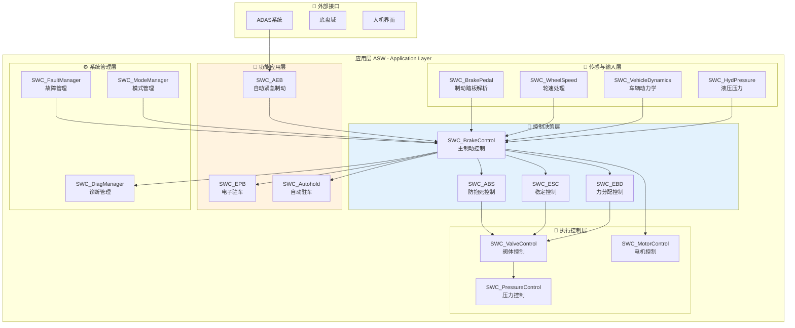
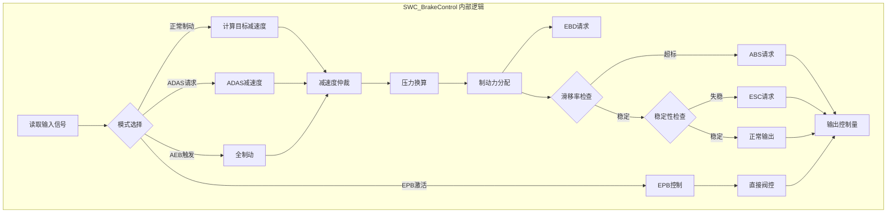
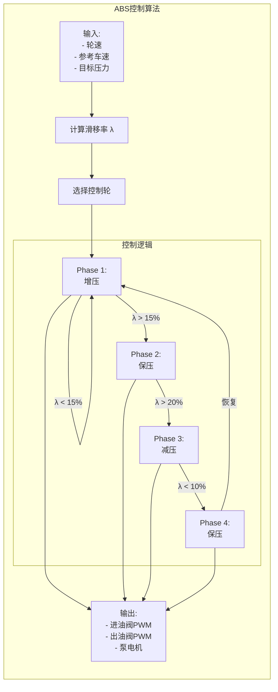
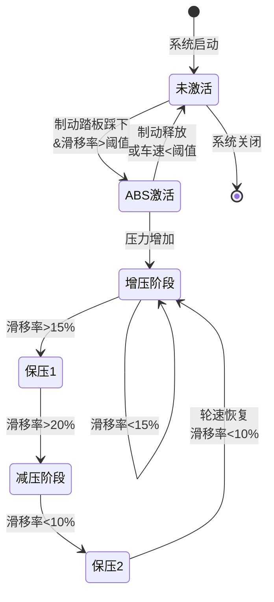

# 制动系统 - 应用层 (ASW) 详细设计

> **文档编号**: BRAKE-ASW-001  
> **版本**: v1.0  
> **所属阶段**: 阶段4 - 应用软件开发

---

## 1. ASW架构总览

### 1.1 软件组件 (SWC) 架构图



### 1.2 SWC清单与ASIL分配

| SWC名称 | 功能描述 | ASIL等级 | 周期 | 核心算法 |
|---------|----------|----------|------|----------|
| SWC_BrakePedal | 踏板位移解析、梯度计算 | D | 2ms | 滤波、梯度 |
| SWC_WheelSpeed | 轮速处理、滑移率计算 | D | 2ms | ICU捕获、滑移率 |
| SWC_VehicleDynamics | 车辆状态估计 | D | 10ms | 卡尔曼滤波 |
| SWC_HydPressure | 液压压力处理 | D | 2ms | 滤波、补偿 |
| SWC_BrakeControl | 主制动控制逻辑 | D | 2ms | 状态机、仲裁 |
| SWC_ABS | 防抱死控制 | D | 2ms | PID、Bang-Bang |
| SWC_ESC | 稳定控制 | D | 2ms | 滑模控制、LQR |
| SWC_EBD | 制动力分配 | D | 2ms | 分配算法 |
| SWC_ValveControl | 阀体控制 | D | 2ms | PWM控制 |
| SWC_MotorControl | 电机控制 | D | 2ms | FOC、PWM |
| SWC_PressureControl | 压力闭环控制 | D | 2ms | PID |
| SWC_EPB | 电子驻车 | C | 10ms | 状态机 |
| SWC_Autohold | 自动驻车 | B | 10ms | 状态机 |
| SWC_AEB | AEB接口 | D | 2ms | 信号接口 |
| SWC_FaultManager | 故障管理 | D | 10ms | 诊断逻辑 |
| SWC_ModeManager | 模式管理 | D | 10ms | 状态机 |
| SWC_DiagManager | 诊断管理 | D | 50ms | UDS服务 |

---

## 2. 核心SWC详细设计

### 2.1 SWC_BrakeControl (主制动控制)

**功能**: 制动系统主控制逻辑，协调各子系统工作

**端口接口**:
```c
// 接收端口 (R-Port)
RPort_PedalPosition      // 踏板位置输入
RPort_WheelSpeeds        // 四轮轮速
RPort_VehicleAccel       // 车辆加速度
RPort_ADASRequest        // ADAS制动请求
RPort_EPBCmd             // EPB命令
RPort_AutoholdCmd        // Autohold命令

// 发送端口 (P-Port)
PPort_BrakeMode          // 制动模式输出
PPort_TargetDecel        // 目标减速度
PPort_TargetPressure     // 目标压力
PPort_ABS_Enable         // ABS使能
PPort_ESC_Enable         // ESC使能
PPort_EBD_Enable         // EBD使能
```

**内部行为**:


**Runnable设计**:
```c
// Runnable: BrakeControl_Main
// 周期: 2ms
// ASIL: D

void BrakeControl_Main(void) {
    // 1. 读取输入
    PedalPosition = Rte_Read_RPort_PedalPosition();
    WheelSpeeds = Rte_Read_RPort_WheelSpeeds();
    
    // 2. 计算目标减速度
    TargetDecel = CalculateTargetDeceleration(PedalPosition);
    
    // 3. 仲裁
    if (AEB_Active) {
        TargetDecel = AEB_Deceleration;  // 0.8g
    } else if (ADAS_Active) {
        TargetDecel = ADAS_Deceleration;
    }
    
    // 4. 转换为压力
    TargetPressure = DecelToPressure(TargetDecel);
    
    // 5. 子系统使能判断
    ABS_Enable = CheckABSCondition(WheelSpeeds);
    ESC_Enable = CheckESCCondition(YawRate, LatAccel);
    EBD_Enable = CheckEBDCondition();
    
    // 6. 输出
    Rte_Write_PPort_TargetPressure(TargetPressure);
    Rte_Write_PPort_ABS_Enable(ABS_Enable);
    Rte_Write_PPort_ESC_Enable(ESC_Enable);
}
```

### 2.2 SWC_ABS (防抱死控制)

**控制算法流程**:



**状态机设计**:


---

## 3. RTE接口设计

### 3.1 数据类型定义

```c
// 标准类型定义
#ifndef RTE_TYPE_H
#define RTE_TYPE_H

// 踏板位置
typedef uint16_t Rte_PedalPosition_Type;    // 0-1000 (0-100%)

// 轮速
typedef uint16_t Rte_WheelSpeed_Type;       // 0-65000 (0-650km/h, 0.01km/h/bit)

// 液压压力
typedef uint16_t Rte_HydraulicPressure_Type; // 0-30000 (0-300bar, 0.01bar/bit)

// 减速度
typedef sint16_t Rte_Deceleration_Type;     // -2000-0 (-2g-0, 0.001g/bit)

// 控制模式
enum Rte_BrakeMode_Enum {
    BRAKE_MODE_INACTIVE = 0,
    BRAKE_MODE_NORMAL,
    BRAKE_MODE_ABS,
    BRAKE_MODE_ESC,
    BRAKE_MODE_AEB,
    BRAKE_MODE_EPB,
    BRAKE_MODE_FAULT
};

// 故障等级
enum Rte_FaultLevel_Enum {
    FAULT_NONE = 0,
    FAULT_LEVEL_1,    // 警告
    FAULT_LEVEL_2,    // 功能降级
    FAULT_LEVEL_3     // 系统关闭
};

#endif
```

### 3.2 端口接口矩阵

| 发送SWC | 接收SWC | 接口名称 | 数据类型 | 周期 | ASIL |
|---------|---------|----------|----------|------|------|
| BrakePedal | BrakeControl | PedalPosition | uint16 | 2ms | D |
| WheelSpeed | BrakeControl | WheelSpeeds | array[4] | 2ms | D |
| VehicleDynamics | BrakeControl | YawRate, LatAccel | sint16 | 10ms | D |
| BrakeControl | ABS | ABS_Enable, TargetPressure | struct | 2ms | D |
| BrakeControl | ESC | ESC_Enable, TargetYaw | struct | 2ms | D |
| ABS | ValveControl | ValveCmd_Front, ValveCmd_Rear | struct | 2ms | D |
| ESC | ValveControl | ValveCmd_ESC | struct | 2ms | D |
| ValveControl | PressureControl | TargetPressure_Wheel | array[4] | 2ms | D |
| EPB | ValveControl | EPB_ValveCmd | struct | 10ms | C |
| AEB | BrakeControl | AEB_Request, AEB_Decel | struct | 2ms | D |
| FaultManager | All SWCs | FaultStatus | struct | 10ms | D |
| ModeManager | All SWCs | SystemMode | enum | 10ms | D |

---

## 4. 实现策略

### 4.1 代码组织

```
ASW_BrakeSystem/
├── src/
│   ├── SWC_BrakePedal.c
│   ├── SWC_WheelSpeed.c
│   ├── SWC_VehicleDynamics.c
│   ├── SWC_BrakeControl.c
│   ├── SWC_ABS.c
│   ├── SWC_ESC.c
│   ├── SWC_EBD.c
│   ├── SWC_ValveControl.c
│   ├── SWC_MotorControl.c
│   ├── SWC_EPB.c
│   ├── SWC_Autohold.c
│   ├── SWC_FaultManager.c
│   ├── SWC_ModeManager.c
│   └── ...
├── include/
│   ├── Rte_BrakeSystem.h
│   ├── SWC_BrakePedal.h
│   └── ...
├── lib/
│   └── math_lib.a
└── test/
    └── unit_tests/
```

### 4.2 开发规范

- **编码标准**: MISRA C:2012
- **文档标准**: Doxygen注释
- **单元测试**: 覆盖率>90%
- **静态分析**: Polyspace/QAC
- **版本控制**: Git + 分支策略

---

*应用层 (ASW) 详细设计文档*  
*面向汽车开发的主体命题 - 制动系统工程*