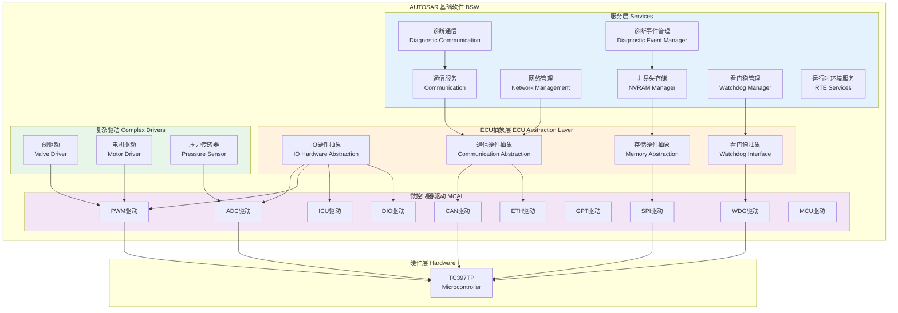
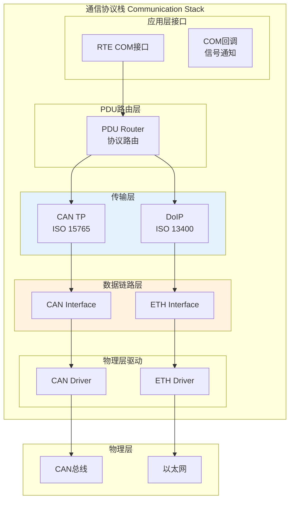
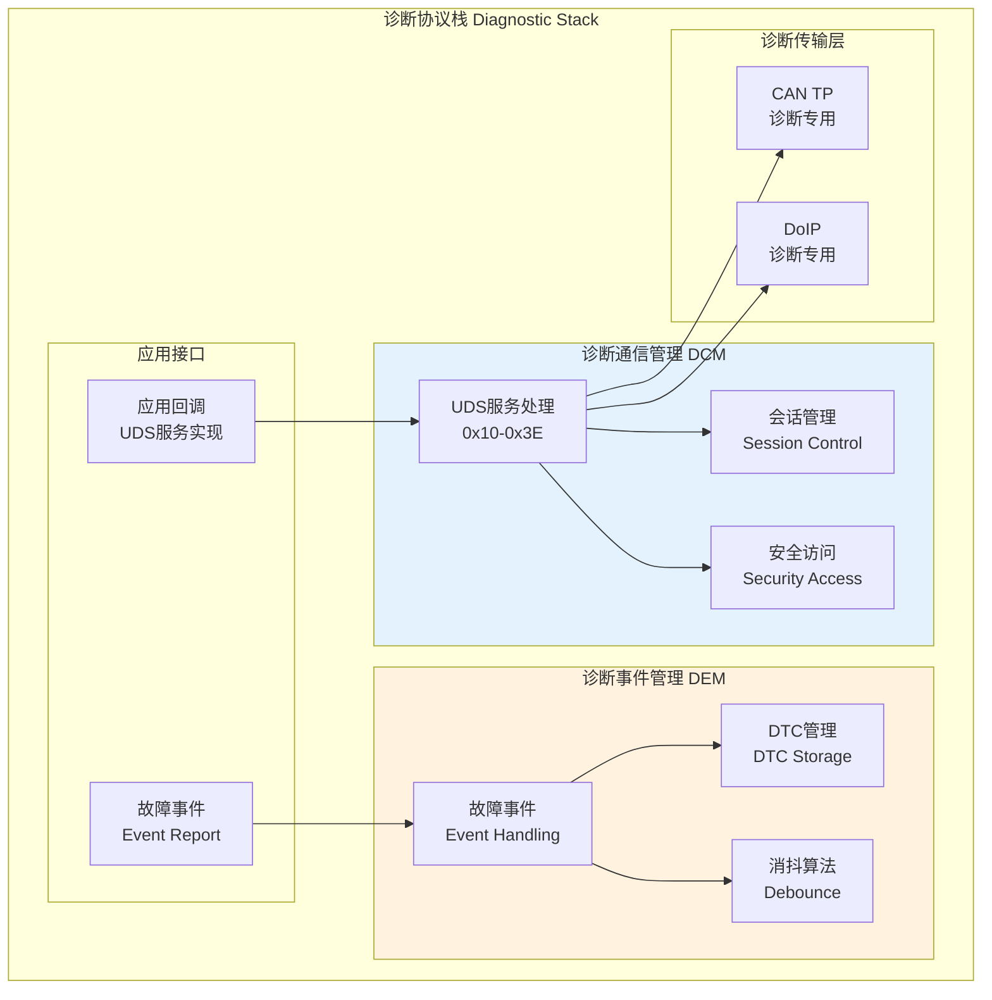
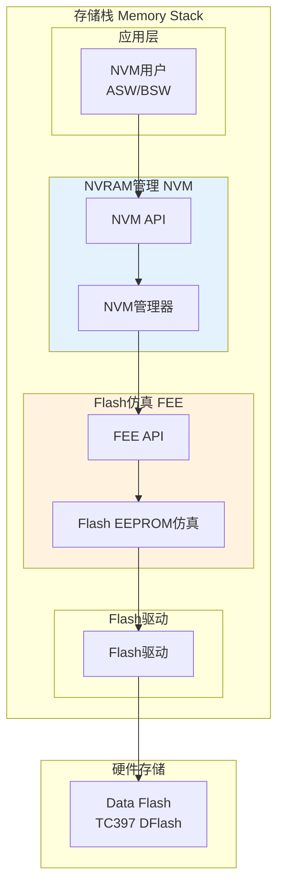
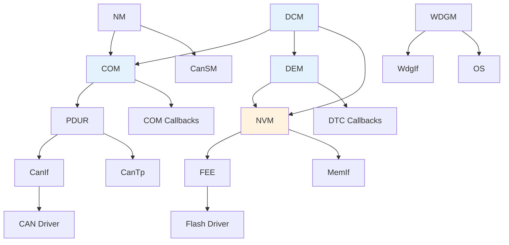

# 制动系统 - 服务层 (BSW) 详细设计

> **文档编号**: BRAKE-BSW-001  
> **版本**: v1.0  
> **所属阶段**: 阶段3 - 基础软件开发

---

## 1. BSW架构总览

### 1.1 分层架构图



### 1.2 BSW模块清单

| 层级 | 模块名称 | 功能描述 | ASIL等级 | 配置复杂度 |
|------|----------|----------|----------|-----------|
| **服务层** | COM | 信号路由、通信管理 | D | 高 |
| | DCM | UDS诊断服务 | D | 高 |
| | DEM | 故障事件管理 | D | 中 |
| | NM | 网络管理 (OSEK/AUTOSAR) | B | 中 |
| | NVM | NVRAM管理、数据存储 | D | 高 |
| | WDGM | 看门狗管理、安全监控 | D | 高 |
| **ECU抽象层** | IOHwAb | IO硬件抽象 | D | 中 |
| | CanIf | CAN接口 | D | 中 |
| | EthIf | 以太网接口 | B | 中 |
| | Fee | Flash EEPROM仿真 | D | 中 |
| | WdgIf | 看门狗接口 | D | 低 |
| **MCAL** | ADC | 模数转换驱动 | D | 中 |
| | PWM | 脉宽调制驱动 | D | 中 |
| | ICU | 输入捕获驱动 | D | 中 |
| | CAN | CAN控制器驱动 | D | 高 |
| | ETH | 以太网驱动 | B | 高 |
| | DIO | 数字IO驱动 | D | 低 |
| | GPT | 通用定时器 | D | 中 |
| | SPI | SPI总线驱动 | D | 中 |
| | WDG | 看门狗驱动 | D | 低 |
| | MCU | MCU驱动 | D | 中 |
| **CDD** | ValveDrv | 阀体驱动 | D | 高 |
| | MotorDrv | 电机FOC驱动 | D | 高 |
| | PressSens | 压力传感器驱动 | D | 中 |

---

## 2. 通信服务 (COM) 设计

### 2.1 通信架构



### 2.2 信号定义

| 信号名称 | 信号ID | 长度 | 周期 | 发送节点 | 接收节点 | 总线 |
|---------|--------|------|------|----------|----------|------|
| Brake_PedalPosition | 0x101 | 16bit | 10ms | BCU | VCU,ABS | CAN1 |
| WheelSpeed_FL | 0x102 | 16bit | 10ms | BCU | ABS,ESC | CAN1 |
| WheelSpeed_FR | 0x103 | 16bit | 10ms | BCU | ABS,ESC | CAN1 |
| WheelSpeed_RL | 0x104 | 16bit | 10ms | BCU | ABS,ESC | CAN1 |
| WheelSpeed_RR | 0x105 | 16bit | 10ms | BCU | ABS,ESC | CAN1 |
| ABS_Status | 0x201 | 8bit | 20ms | ABS | VCU,ESC | CAN1 |
| ESC_Status | 0x202 | 8bit | 20ms | ESC | VCU | CAN1 |
| Brake_Pressure | 0x301 | 16bit | 10ms | BCU | VCU | CAN1 |
| AEB_Request | 0x401 | 8bit | 事件 | ADAS | BCU | ETH |
| EPB_Cmd | 0x501 | 8bit | 50ms | VCU | BCU | CAN2 |
| Fault_Status | 0x701 | 32bit | 100ms | BCU | VCU | CAN2 |

### 2.3 COM配置参数

```c
// COM General Configuration
const Com_GeneralConfigType Com_GeneralConfig = {
    .ComConfigurationId = 0x0001,
    .ComIndex = 0,
    .ComEnableMDTForCyclicTransmission = TRUE,
    .ComEnableSignalGroupArrayApi = TRUE,
    .ComRetryFailedTransmitRequests = FALSE,
    .ComVersionInfoApi = FALSE,
    .ComSupportedIPduGroups = 16
};

// IPDU Configuration
const Com_IPduConfigType Com_IPduConfig[] = {
    {
        .ComIPduId = 0,                                    // Brake_PedalPosition
        .ComIPduDirection = COM_SEND,
        .ComIPduSignalProcessing = COM_DEFERRED,
        .ComIPduSize = 8,
        .ComIPduCallout = NULL,
        .ComIPduSignalRef = &Com_Signal_BrakePedal,
        .ComTxIPdu = {
            .ComTxIPduMinimumDelayFactor = 2,              // 20ms MDT
            .ComTxIPduUnusedAreasDefault = 0xFF,
            .ComTxModeTrue = {
                .ComTxModeMode = COM_PERIODIC,
                .ComTxModeTimePeriodFactor = 10             // 10ms周期
            }
        }
    },
    // ... 其他IPDU配置
};
```

---

## 3. 诊断服务 (DCM/DEM) 设计

### 3.1 诊断架构



### 3.2 UDS服务实现

| SID | 服务名称 | 功能 | ASIL | 实现说明 |
|-----|----------|------|------|----------|
| 0x10 | DiagnosticSessionControl | 会话控制 | D | 默认/扩展/编程会话 |
| 0x11 | ECUReset | ECU复位 | D | 硬复位/软复位 |
| 0x14 | ClearDiagnosticInformation | 清除DTC | D | 清除故障码 |
| 0x19 | ReadDTCInformation | 读取DTC | D | 读故障码信息 |
| 0x22 | ReadDataByIdentifier | 读数据 | D | 读DID数据 |
| 0x2E | WriteDataByIdentifier | 写数据 | D | 写DID数据 |
| 0x27 | SecurityAccess | 安全访问 | D | 解锁安全等级 |
| 0x31 | RoutineControl | 例程控制 | D | 擦除内存/自检 |
| 0x34 | RequestDownload | 请求下载 | D | 刷写请求 |
| 0x36 | TransferData | 传输数据 | D | 数据传输 |
| 0x37 | RequestTransferExit | 退出传输 | D | 传输完成 |

### 3.3 DTC定义

| DTC编号 | 故障描述 | 故障类型 | ASIL | 消抖策略 |
|---------|----------|----------|------|----------|
| C00001 | 踏板传感器电路故障 | 硬件故障 | D | 时间消抖 100ms |
| C00002 | 轮速传感器信号异常 | 信号故障 | D | 计数消抖 10次 |
| C00003 | 液压压力传感器故障 | 硬件故障 | D | 时间消抖 200ms |
| C00004 | 阀体驱动电路故障 | 执行器故障 | D | 时间消抖 50ms |
| C00005 | 电机驱动故障 | 执行器故障 | D | 时间消抖 100ms |
| C00006 | CAN通信超时 | 通信故障 | B | 时间消抖 1s |
| C00007 | 主控芯片温度超限 | 环境故障 | B | 时间消抖 5s |
| C00008 | 供电电压异常 | 电源故障 | D | 时间消抖 500ms |
| C00009 | ABS功能异常 | 功能故障 | D | 计数消抖 3次 |
| C0000A | ESC功能异常 | 功能故障 | D | 计数消抖 3次 |

---

## 4. 存储服务 (NVM) 设计

### 4.1 存储架构



### 4.2 NV Block配置

| NV Block名称 | Block ID | 大小 | 写周期 | 数据类型 | 存储策略 |
|--------------|----------|------|--------|----------|----------|
| NV_BrakePedalCalib | 0x01 | 32B | 事件触发 | 标定数据 | 立即写入 |
| NV_ABSConfig | 0x02 | 64B | 事件触发 | 配置参数 | 立即写入 |
| NV_ESCConfig | 0x03 | 64B | 事件触发 | 配置参数 | 立即写入 |
| NV_LastFault | 0x10 | 16B | 立即 | 故障信息 | 立即写入 |
| NV_FaultHistory | 0x11 | 256B | 循环 | 故障历史 | 循环缓冲 |
| NV_Odometer | 0x20 | 8B | 定期 | 里程数 | 定期写入 |
| NV_BleedingCounter | 0x30 | 4B | 事件 | 排气次数 | 立即写入 |
| NV_EPBPosition | 0x40 | 8B | 定期 | EPB位置 | 定期写入 |

---

## 5. MCAL配置要点

### 5.1 ADC配置

```c
// ADC Channel Configuration for Brake System
const Adc_ChannelConfigType AdcChannelConfig[] = {
    {
        .AdcChannelId = 0,                    // Brake Pedal Primary
        .AdcChannelAdcGroup = ADC_GROUP_0,
        .AdcChannelInputNumber = 0,
        .AdcChannelResolution = ADC_RESOLUTION_12BIT,
        .AdcChannelSamplingTime = ADC_SAMPLE_TIME_100NS,
        .AdcChannelRange = ADC_RANGE_0V_5V
    },
    {
        .AdcChannelId = 1,                    // Brake Pedal Secondary
        .AdcChannelAdcGroup = ADC_GROUP_0,
        .AdcChannelInputNumber = 1,
        .AdcChannelResolution = ADC_RESOLUTION_12BIT,
        .AdcChannelSamplingTime = ADC_SAMPLE_TIME_100NS,
        .AdcChannelRange = ADC_RANGE_0V_5V
    },
    {
        .AdcChannelId = 2,                    // Master Cylinder Pressure
        .AdcChannelAdcGroup = ADC_GROUP_0,
        .AdcChannelInputNumber = 2,
        .AdcChannelResolution = ADC_RESOLUTION_12BIT,
        .AdcChannelSamplingTime = ADC_SAMPLE_TIME_500NS,
        .AdcChannelRange = ADC_RANGE_0V_5V
    },
    {
        .AdcChannelId = 3,                    // Wheel Pressure Front
        .AdcChannelAdcGroup = ADC_GROUP_1,
        .AdcChannelInputNumber = 4,
        .AdcChannelResolution = ADC_RESOLUTION_12BIT,
        .AdcChannelSamplingTime = ADC_SAMPLE_TIME_500NS,
        .AdcChannelRange = ADC_RANGE_0V_5V
    },
    // ... 其他通道
};

// ADC Group Configuration
const Adc_GroupConfigType AdcGroupConfig[] = {
    {
        .AdcGroupId = ADC_GROUP_0,
        .AdcGroupConversionMode = ADC_CONV_MODE_ONESHOT,
        .AdcGroupTriggerSource = ADC_TRIG_SRC_SW,
        .AdcGroupPriority = 3,
        .AdcGroupChannels = {0, 1, 2},        // 踏板+主缸压力
        .AdcGroupNotification = AdcGroup0_Notification
    },
    {
        .AdcGroupId = ADC_GROUP_1,
        .AdcGroupConversionMode = ADC_CONV_MODE_CONTINUOUS,
        .AdcGroupTriggerSource = ADC_TRIG_SRC_HW,
        .AdcGroupPriority = 2,
        .AdcGroupChannels = {3, 4, 5, 6},     // 四轮压力
        .AdcGroupNotification = AdcGroup1_Notification
    }
};
```

### 5.2 PWM配置

```c
// PWM Configuration for Valve and Motor Control
const Pwm_ChannelConfigType PwmChannelConfig[] = {
    {
        .PwmChannelId = 0,                    // Inlet Valve FL
        .PwmHwChannel = PWM_EMIOS0_CH0,
        .PwmPeriodDefault = 1000,             // 1kHz
        .PwmDutyCycleDefault = 0,
        .PwmPolarity = PWM_HIGH,
        .PwmIdleState = PWM_LOW
    },
    {
        .PwmChannelId = 1,                    // Outlet Valve FL
        .PwmHwChannel = PWM_EMIOS0_CH1,
        .PwmPeriodDefault = 1000,
        .PwmDutyCycleDefault = 0,
        .PwmPolarity = PWM_HIGH,
        .PwmIdleState = PWM_LOW
    },
    {
        .PwmChannelId = 8,                    // Motor Pump
        .PwmHwChannel = PWM_GTM_TOM0_CH0,
        .PwmPeriodDefault = 200,              // 5kHz for motor
        .PwmDutyCycleDefault = 0,
        .PwmPolarity = PWM_HIGH,
        .PwmIdleState = PWM_LOW
    }
    // ... 其他阀体通道
};
```

### 5.3 ICU配置

```c
// ICU Configuration for Wheel Speed Sensors
const Icu_ChannelConfigType IcuChannelConfig[] = {
    {
        .IcuChannelId = 0,                    // Wheel Speed FL
        .IcuHwChannel = ICU_EMIOS0_CH2,
        .IcuMeasurementMode = ICU_MODE_SIGNAL_MEASUREMENT,
        .IcuSignalMeasurementProperty = ICU_PERIOD_TIME,
        .IcuDefaultStartEdge = ICU_RISING_EDGE,
        .IcuNotification = Icu_WheelSpeed_FL_Notification
    },
    {
        .IcuChannelId = 1,                    // Wheel Speed FR
        .IcuHwChannel = ICU_EMIOS0_CH3,
        .IcuMeasurementMode = ICU_MODE_SIGNAL_MEASUREMENT,
        .IcuSignalMeasurementProperty = ICU_PERIOD_TIME,
        .IcuDefaultStartEdge = ICU_RISING_EDGE,
        .IcuNotification = Icu_WheelSpeed_FR_Notification
    },
    {
        .IcuChannelId = 2,                    // Wheel Speed RL
        .IcuHwChannel = ICU_EMIOS0_CH4,
        .IcuMeasurementMode = ICU_MODE_SIGNAL_MEASUREMENT,
        .IcuSignalMeasurementProperty = ICU_PERIOD_TIME,
        .IcuDefaultStartEdge = ICU_RISING_EDGE,
        .IcuNotification = Icu_WheelSpeed_RL_Notification
    },
    {
        .IcuChannelId = 3,                    // Wheel Speed RR
        .IcuHwChannel = ICU_EMIOS0_CH5,
        .IcuMeasurementMode = ICU_MODE_SIGNAL_MEASUREMENT,
        .IcuSignalMeasurementProperty = ICU_PERIOD_TIME,
        .IcuDefaultStartEdge = ICU_RISING_EDGE,
        .IcuNotification = Icu_WheelSpeed_RR_Notification
    }
};
```

---

## 6. 复杂驱动 (CDD) 设计

### 6.1 阀体驱动 (Valve Driver)

```c
// Valve Driver API
Std_ReturnType ValveDrv_Init(const ValveDrv_ConfigType* ConfigPtr);
Std_ReturnType ValveDrv_DeInit(void);
Std_ReturnType ValveDrv_SetDutyCycle(Valve_IdType ValveId, uint16 DutyCycle);
Std_ReturnType ValveDrv_SetSolenoidState(Valve_IdType ValveId, Valve_StateType State);
Std_ReturnType ValveDrv_GetDiagnostic(Valve_IdType ValveId, Valve_DiagType* DiagInfo);

// Valve States
typedef enum {
    VALVE_STATE_INACTIVE = 0,     // 0% duty
    VALVE_STATE_ACTIVE,           // 100% duty
    VALVE_STATE_PWM_CONTROL       // Variable duty
} Valve_StateType;

// Valve IDs
typedef enum {
    VALVE_ID_INLET_FL = 0,        // 进油阀 前左
    VALVE_ID_OUTLET_FL,           // 出油阀 前左
    VALVE_ID_INLET_FR,            // 进油阀 前右
    VALVE_ID_OUTLET_FR,           // 出油阀 前右
    VALVE_ID_INLET_RL,            // 进油阀 后左
    VALVE_ID_OUTLET_RL,           // 出油阀 后左
    VALVE_ID_INLET_RR,            // 进油阀 后右
    VALVE_ID_OUTLET_RR,           // 出油阀 后右
    VALVE_ID_SWITCHING,           // 主切换阀
    VALVE_ID_ISOLATION            // 隔离阀
} Valve_IdType;
```

### 6.2 电机驱动 (Motor Driver)

```c
// Motor Driver API - FOC Control
Std_ReturnType MotorDrv_Init(const MotorDrv_ConfigType* ConfigPtr);
Std_ReturnType MotorDrv_Start(Motor_IdType MotorId);
Std_ReturnType MotorDrv_Stop(Motor_IdType MotorId);
Std_ReturnType MotorDrv_SetSpeed(Motor_IdType MotorId, sint16 SpeedRpm);
Std_ReturnType MotorDrv_SetTorque(Motor_IdType MotorId, sint16 TorquePercent);

// Motor Control Structure
typedef struct {
    sint16 IqRef;                 // Q轴电流参考
    sint16 IdRef;                 // D轴电流参考
    uint16 SpeedRef;              // 转速参考
    uint16 Angle;                 // 转子角度
    Motor_ControlModeType Mode;   // 控制模式
} Motor_ControlType;
```

---

## 7. BSW集成与验证

### 7.1 BSW模块依赖关系



### 7.2 BSW测试策略

| 测试层级 | 测试内容 | 测试方法 | 覆盖率要求 |
|----------|----------|----------|-----------|
| 单元测试 | 单个BSW模块功能 | TESSY/CTC | 语句覆盖>90% |
| 集成测试 | BSW模块间接口 | HIL测试台 | 功能覆盖>95% |
| 系统测试 | 完整BSW栈 | 实车/台架 | 需求覆盖100% |
| 回归测试 | 变更验证 | 自动化脚本 | 全量测试 |

---

*服务层 (BSW) 详细设计文档*  
*面向汽车开发的主体命题 - 制动系统工程*