# 制动系统控制器（BCU）开发设计方案

> **文档版本**: v1.0  
> **编制日期**: 2026-03-08  
> **项目类型**: 汽车电子制动控制单元  
> **安全等级**: ASIL-D  
> **技术栈**: AUTOSAR + MCAL + ISO 26262

---

## 1. 项目概述

### 1.1 项目目标

开发一款符合 ASIL-D 功能安全等级的电子制动控制单元（Brake Control Unit, BCU），实现以下核心功能：
- **防抱死制动系统 (ABS)**
- **电子制动力分配 (EBD)**
- **电子稳定控制 (ESC)**
- **电子驻车制动 (EPB)**
- **自动驻车 (Autohold)**

### 1.2 系统指标

| 指标 | 目标值 | 说明 |
|------|--------|------|
| 响应时间 | < 200ms | 踏板输入到轮缸压力建立 |
| 控制周期 | 2ms | 主控制循环 |
| 压力精度 | ±0.1bar | 轮缸压力控制精度 |
| 功能安全 | ASIL-D | ISO 26262 最高等级 |
| 工作电压 | 9-16V | 12V车载电源 |
| 工作温度 | -40°C ~ 85°C | 环境温度 |

---

## 2. 系统架构设计

### 2.1 整体架构图

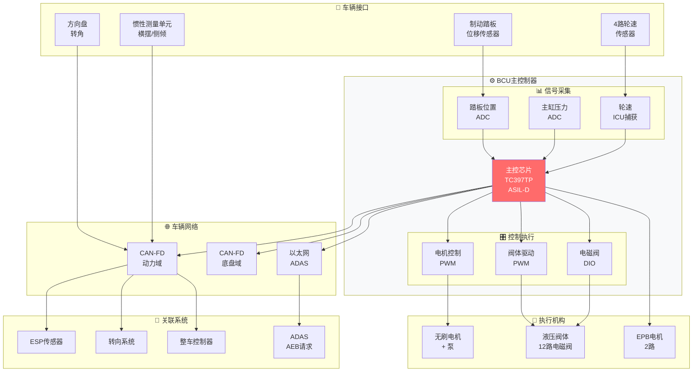

### 2.2 硬件架构框图

```
┌─────────────────────────────────────────────────────────────────┐
│                      BCU 硬件架构                                │
├─────────────────────────────────────────────────────────────────┤
│                                                                 │
│  ┌──────────────┐    ┌──────────────────────────────────────┐  │
│  │   电源管理    │    │         TC397TP (ASIL-D)              │  │
│  │   9-16V输入   │───>│  ┌─────────┐  ┌─────────┐  ┌──────┐  │  │
│  │   多级保护    │    │  │  Core0  │  │  Core1  │  │  PPU │  │  │
│  └──────────────┘    │  │  主控制  │  │  安全监控│  │  外设│  │  │
│                      │  │         │  │         │  │      │  │  │
│  ┌──────────────┐    │  │ 2MB Flash│  │ 安全核  │  │ 640KB│  │  │
│  │   传感器接口  │    │  │ 512KB RAM│  │ 校验    │  │ SRAM │  │  │
│  │  ├─ 踏板位置  │───>│  └─────────┘  └─────────┘  └──────┘  │  │
│  │  ├─ 主缸压力  │    │                                      │  │
│  │  ├─ 轮速×4   │    │  外设:                               │  │
│  │  └─ 温度×2   │    │  • CAN-FD ×4                         │  │
│  └──────────────┘    │  • 100M以太网                          │  │
│                      │  • ADC 12bit ×16                       │  │
│  ┌──────────────┐    │  • PWM ×24                            │  │
│  │   执行器驱动  │    │  • ICU ×8                             │  │
│  │  ├─ 电机驱动  │<──│  • SPI/QSCI ×4                        │  │
│  │  ├─ 阀驱动×12│<──│  • DIO ×100+                          │  │
│  │  └─ EPB驱动×2│<──│                                      │  │
│  └──────────────┘    └──────────────────────────────────────┘  │
│                                                                 │
│  ┌──────────────┐    ┌──────────────┐    ┌──────────────┐     │
│  │   通信接口    │    │   调试接口    │    │   诊断接口    │     │
│  │  CAN-FD ×2   │    │  JTAG/DAP     │    │  UDS on CAN   │     │
│  │  以太网 100M │    │  Trace        │    │  DoIP         │     │
│  └──────────────┘    └──────────────┘    └──────────────┘     │
│                                                                 │
└─────────────────────────────────────────────────────────────────┘
```

### 2.3 软件架构 (AUTOSAR)

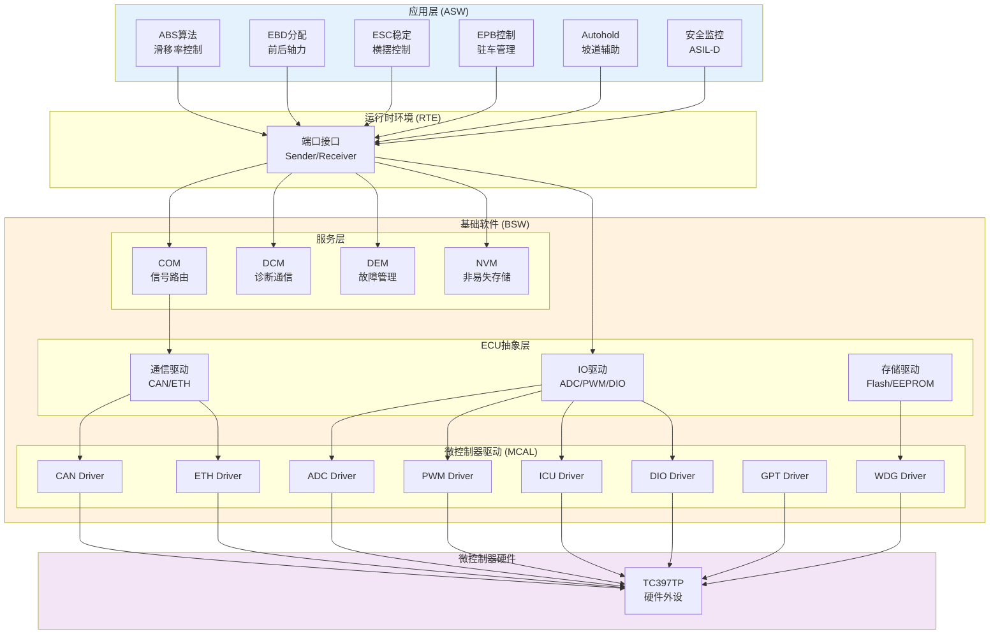

---

## 3. 控制逻辑设计

### 3.1 主控制流程图

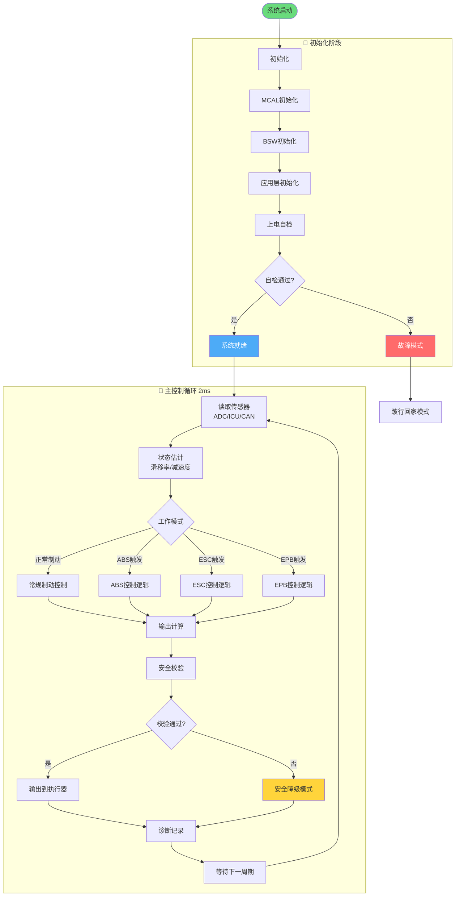

### 3.2 ABS控制算法流程

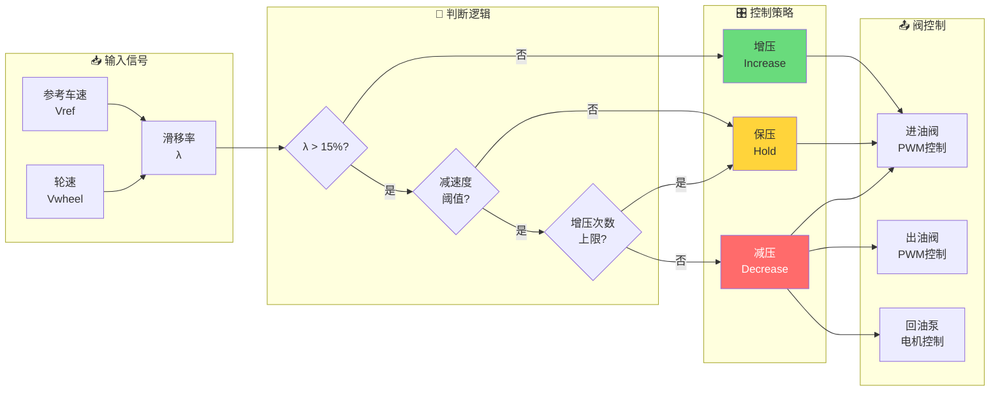

### 3.3 控制状态机

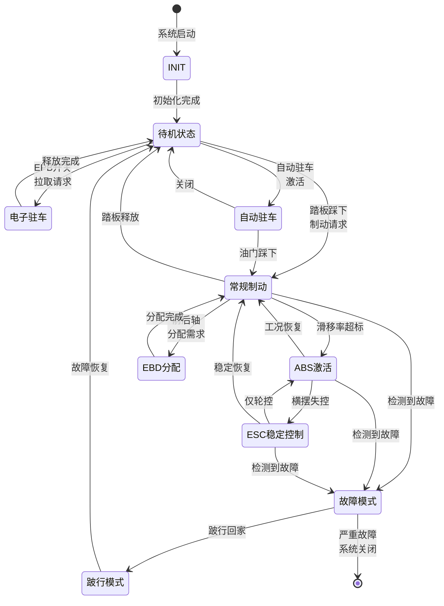

---

## 4. 系统交互设计

### 4.1 制动请求处理时序

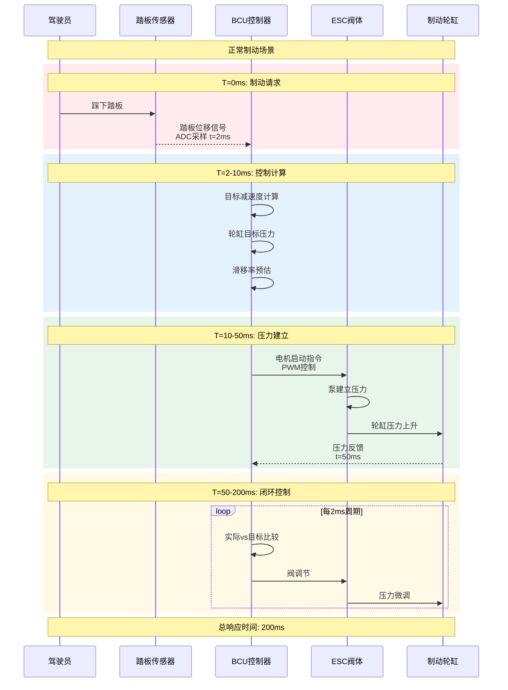

### 4.2 ABS触发交互时序

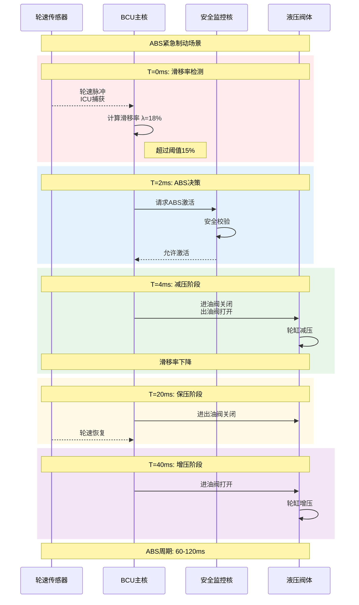

### 4.3 ADAS AEB请求交互

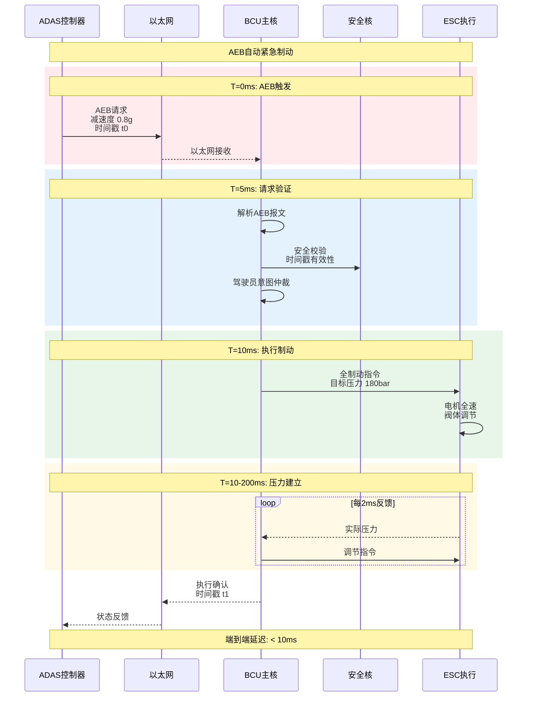

---

## 5. 功能安全设计

### 5.1 安全监控架构

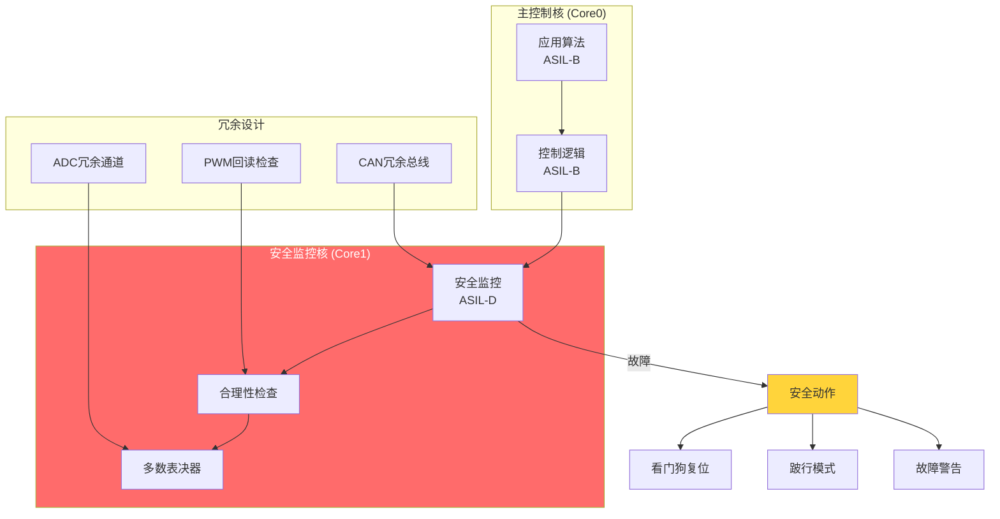

### 5.2 E2E保护流程

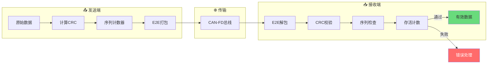

---

## 6. 项目开发计划

### 6.1 开发甘特图

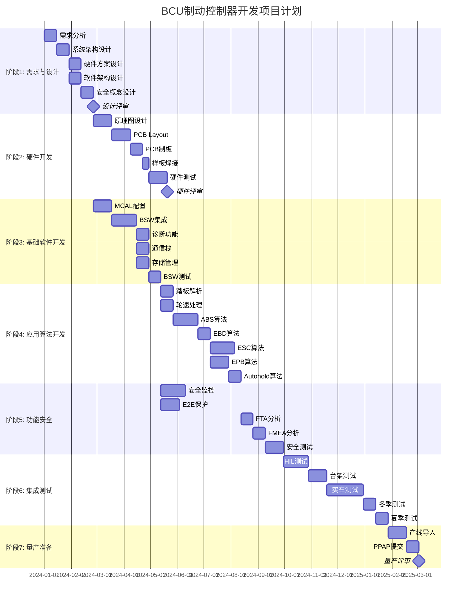

### 6.2 开发阶段详情

| 阶段 | 周期 | 关键交付物 | 里程碑 |
|------|------|------------|--------|
| **需求与设计** | 10周 | 需求规格书、系统架构设计、安全概念 | 设计冻结 |
| **硬件开发** | 12周 | 原理图、PCB、BOM、测试报告 | 硬件冻结 |
| **基础软件** | 12周 | MCAL配置、BSW集成、通信栈 | BSW就绪 |
| **应用算法** | 14周 | ABS/EBD/ESC/EPB算法、仿真报告 | 算法冻结 |
| **功能安全** | 12周 | FTA/FMEA报告、安全测试用例 | 安全认可 |
| **集成测试** | 16周 | HIL报告、台架报告、实车报告 | 测试通过 |
| **量产准备** | 6周 | 产线测试方案、PPAP文档 | 量产就绪 |

**总计**: 约 **18个月** 开发周期

### 6.3 资源分配

```
团队配置 (20人):
├── 系统工程师    ×2
├── 硬件工程师    ×3
├── 底层软件工程师 ×3
├── 应用算法工程师 ×4
├── 功能安全工程师 ×2
├── 测试工程师    ×4
└── 项目经理     ×1

工具链:
├── IDE: EB tresos / DaVinci
├── HIL: dSPACE / Vector
├── 仿真: CarMaker / MATLAB
├── 诊断: CANoe / CANape
└── 版本: Git / Jenkins
```

---

## 7. 风险评估与缓解

| 风险 | 概率 | 影响 | 缓解措施 |
|------|------|------|----------|
| ASIL-D认证不通过 | 中 | 高 | 早期介入TÜV评审，严格遵循ISO 26262 |
| 液压阀体噪声 | 中 | 中 | PWM频率优化，阻尼设计 |
| 电磁干扰 | 中 | 高 | EMC预测试，屏蔽设计 |
| 响应时间不达标 | 低 | 高 | 算法优化，硬件加速 |
| 供应商芯片短缺 | 高 | 中 | 双源策略，备选方案 |

---

## 8. 参考文档

- ISO 26262: 道路车辆功能安全
- ISO 6469: 电动汽车安全要求
- ECE R13-H: 制动系统法规
- AUTOSAR: 经典平台规范
- Infineon TC3xx 用户手册

---

*BCU制动控制器开发设计方案*  
*关键词: BCU, ABS, ESC, EPB, AUTOSAR, ASIL-D, 制动系统*