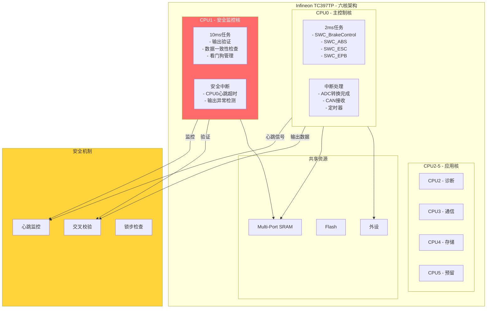

# 双核安全监控架构设计 - TC397TP

> **文档编号**: SAFETY-DUAL-CORE-001  
003e **适用芯片**: Infineon TC397TP (TriCore)  
003e **ASIL等级**: D  
003e **安全机制**: 双核互检 (Dual-Core Cross-Monitoring)

---

## 1. 双核安全架构概述

### 1.1 TC397TP核配置



### 1.2 核间职责分配

| 核 | 角色 | 主要职责 | 安全等级 |
|----|------|----------|----------|
| **CPU0** | 主控制核 | 制动控制算法、信号处理、通信 | ASIL-D |
| **CPU1** | 安全监控核 | 输出验证、心跳监控、故障响应 | ASIL-D |
| CPU2 | 诊断核 | DCM诊断服务、故障码管理 | ASIL-B |
| CPU3 | 通信核 | COM Stack、CAN/Ethernet | QM |
| CPU4 | 存储核 | NVM管理、数据记录 | ASIL-B |
| CPU5 | 预留 | 未来扩展 | QM |

---

## 2. 核间通信 (IPC)

### 2.1 IPC架构

```c
//=============================================================================
// 核间通信配置
//=============================================================================

// IPC通道定义
typedef enum {
    IPC_CH_HEARTBEAT_0TO1 = 0,     // CPU0 -> CPU1 心跳
    IPC_CH_HEARTBEAT_1TO0,          // CPU1 -> CPU0 心跳
    IPC_CH_OUTPUT_DATA,             // CPU0 -> CPU1 输出数据
    IPC_CH_VALIDATION_RESULT,       // CPU1 -> CPU0 验证结果
    IPC_CH_FAULT_NOTIFICATION,      // CPU1 -> CPU0 故障通知
    IPC_CH_COMMAND,                 // CPU0 -> CPU1 命令
    IPC_CH_DIAG_DATA                // 诊断数据
} IPC_ChannelType;

// IPC消息结构
typedef struct {
    uint32 SequenceNumber;          // 序列号 (防重放)
    uint32 Timestamp;               // 时间戳
    uint16 MessageType;             // 消息类型
    uint16 DataLength;              // 数据长度
    uint8  Data[IPC_MAX_DATA_LEN];  // 数据
    uint32 CRC32;                   // CRC校验
} IPC_MessageType;

// IPC通道配置
const IPC_ChannelConfigType IPC_ChannelConfigs[] = {
    [IPC_CH_HEARTBEAT_0TO1] = {
        .ChannelName = "CPU0_Heartbeat",
        .SourceCore = 0,
        .TargetCore = 1,
        .BufferSize = 64,
        .TimeoutMs = 10,
        .CRC_Enabled = TRUE,
        .SequenceCheck = TRUE
    },
    [IPC_CH_HEARTBEAT_1TO0] = {
        .ChannelName = "CPU1_Heartbeat",
        .SourceCore = 1,
        .TargetCore = 0,
        .BufferSize = 64,
        .TimeoutMs = 10,
        .CRC_Enabled = TRUE,
        .SequenceCheck = TRUE
    },
    [IPC_CH_OUTPUT_DATA] = {
        .ChannelName = "Output_Data",
        .SourceCore = 0,
        .TargetCore = 1,
        .BufferSize = 256,
        .TimeoutMs = 5,
        .CRC_Enabled = TRUE,
        .SequenceCheck = TRUE
    },
    [IPC_CH_VALIDATION_RESULT] = {
        .ChannelName = "Validation_Result",
        .SourceCore = 1,
        .TargetCore = 0,
        .BufferSize = 128,
        .TimeoutMs = 5,
        .CRC_Enabled = TRUE,
        .SequenceCheck = TRUE
    }
};
```

### 2.2 IPC消息类型

```c
//=============================================================================
// IPC消息类型定义
//=============================================================================

// CPU0 -> CPU1 心跳消息
typedef struct {
    uint32 TaskCycleCount;          // 任务周期计数
    uint32 WatchdogCounter;         // 看门狗计数
    uint16 CurrentState;            // 当前状态机状态
    uint16 ActiveSWC_Bitmap;        // 活跃SWC位图
    uint8  SafetySignature;         // 安全签名
    uint8  Reserved[3];
} CPU0_HeartbeatType;

// CPU1 -> CPU0 心跳消息
typedef struct {
    uint32 MonitorCycleCount;       // 监控周期计数
    uint32 LastOutputTimestamp;     // 最后输出时间戳
    uint16 ValidationStatus;        // 验证状态
    uint16 FaultBitmap;             // 故障位图
    uint8  SafetyResponse;          // 安全响应
    uint8  Reserved[3];
} CPU1_HeartbeatType;

// 输出数据结构 (CPU0 -> CPU1)
typedef struct {
    uint32 Timestamp;               // 时间戳
    
    // 阀控制输出
    uint16 ValveCmd_Inlet[4];       // 进油阀命令
    uint16 ValveCmd_Outlet[4];      // 出油阀命令
    
    // 电机控制输出
    uint16 PumpMotorCmd;            // 泵电机命令
    uint16 EPB_MotorCmd[2];         // EPB电机命令
    
    // 压力目标
    uint16 TargetPressure[4];       // 目标轮缸压力
    
    // 状态信息
    uint8  ABS_State[4];            // ABS状态
    uint8  ESC_State;               // ESC状态
    uint8  SystemState;             // 系统状态
    
    // 诊断信息
    uint16 ActiveDTC_Count;         // 活跃DTC数量
    uint32 Snapshot[8];             // 故障快照
} OutputDataType;

// 验证结果结构 (CPU1 -> CPU0)
typedef struct {
    uint32 ValidationTimestamp;     // 验证时间戳
    boolean OutputValid;            // 输出是否有效
    boolean WithinLimits;           // 是否在限值内
    boolean RateLimitOk;            // 变化率是否正常
    boolean CrossCheckOk;           // 交叉检查通过
    uint16 ValidationFlags;         // 验证标志
    uint16 FaultCode;               // 故障码 (如验证失败)
    uint8  RecommendedAction;       // 建议动作
} ValidationResultType;
```

---

## 3. CPU0 - 主控制核设计

### 3.1 CPU0主任务

```c
//=============================================================================
// CPU0主任务 - 2ms周期
//=============================================================================

// 全局变量
static uint32 CPU0_CycleCount = 0;
static uint32 LastCPU1_HeartbeatTime = 0;
static boolean CPU1_Alive = FALSE;

void CPU0_MainTask_2ms(void)
{
    // 1. 记录周期计数
    CPU0_CycleCount++;
    
    // 2. 检查CPU1心跳 (监控安全核健康)
    if (!Check_CPU1_Heartbeat()) {
        // CPU1无响应，进入安全状态
        EnterSafeState(REASON_CPU1_NO_RESPONSE);
        return;
    }
    
    // 3. 读取输入
    ReadAllInputs();
    
    // 4. 执行控制算法
    ExecuteBrakeControl();
    ExecuteABS();
    ExecuteESC();
    ExecuteEPB();
    
    // 5. 准备输出数据
    OutputDataType output_data;
    PrepareOutputData(&output_data);
    
    // 6. 发送输出到CPU1验证
    IPC_SendOutputData(&output_data);
    
    // 7. 等待CPU1验证结果 (阻塞等待，超时10ms)
    ValidationResultType validation;
    if (IPC_ReceiveValidationResult(&validation, 10)) {
        if (!validation.OutputValid) {
            // CPU1验证失败
            HandleValidationFailure(&validation);
            return;
        }
    } else {
        // 等待超时
        EnterSafeState(REASON_VALIDATION_TIMEOUT);
        return;
    }
    
    // 8. 写入实际输出 (经CPU1验证后)
    WriteOutputs(&output_data);
    
    // 9. 发送心跳给CPU1
    SendHeartbeatToCPU1();
    
    // 10. 喂看门狗
    WdgM_CheckpointReached(WDG_CP_CPU0_MAIN);
}

// 检查CPU1心跳
boolean Check_CPU1_Heartbeat(void)
{
    uint32 current_time = GetSystemTime();
    
    // 检查上次收到CPU1心跳的时间
    if ((current_time - LastCPU1_HeartbeatTime) > CPU1_HEARTBEAT_TIMEOUT) {
        CPU1_Alive = FALSE;
        return FALSE;
    }
    
    CPU1_Alive = TRUE;
    return TRUE;
}

// 发送心跳到CPU1
void SendHeartbeatToCPU1(void)
{
    CPU0_HeartbeatType heartbeat;
    
    heartbeat.TaskCycleCount = CPU0_CycleCount;
    heartbeat.WatchdogCounter = WdgM_GetCounter();
    heartbeat.CurrentState = GetSystemState();
    heartbeat.ActiveSWC_Bitmap = GetActiveSWCBitmap();
    heartbeat.SafetySignature = CalculateSafetySignature();
    
    IPC_SendMessage(IPC_CH_HEARTBEAT_0TO1, &heartbeat, sizeof(heartbeat));
}
```

---

## 4. CPU1 - 安全监控核设计

### 4.1 CPU1主任务

```c
//=============================================================================
// CPU1主任务 - 10ms周期 (监控任务)
//=============================================================================

// 全局变量
static uint32 CPU1_CycleCount = 0;
static uint32 LastCPU0_HeartbeatTime = 0;
static boolean CPU0_Alive = FALSE;

void CPU1_MainTask_10ms(void)
{
    // 1. 记录周期计数
    CPU1_CycleCount++;
    
    // 2. 检查CPU0心跳
    if (!Check_CPU0_Heartbeat()) {
        // CPU0无响应，触发安全响应
        TriggerSafetyResponse(REASON_CPU0_NO_RESPONSE);
        return;
    }
    
    // 3. 接收CPU0输出数据
    OutputDataType output_data;
    if (!IPC_ReceiveOutputData(&output_data, 5)) {
        TriggerSafetyResponse(REASON_OUTPUT_DATA_MISSING);
        return;
    }
    
    // 4. 验证输出数据
    ValidationResultType validation;
    ValidateOutputData(&output_data, &validation);
    
    // 5. 发送验证结果给CPU0
    IPC_SendValidationResult(&validation);
    
    // 6. 如果验证失败，触发独立安全响应
    if (!validation.OutputValid) {
        TriggerIndependentSafetyAction(&validation);
    }
    
    // 7. 执行额外安全监控
    MonitorSystemHealth();
    
    // 8. 发送心跳给CPU0
    SendHeartbeatToCPU0();
    
    // 9. 喂看门狗
    WdgM_CheckpointReached(WDG_CP_CPU1_MAIN);
}

// 输出数据验证
void ValidateOutputData(const OutputDataType* output, 
                        ValidationResultType* result)
{
    result->ValidationTimestamp = GetSystemTime();
    result->OutputValid = TRUE;
    result->ValidationFlags = 0;
    
    // 1. 范围检查
    for (int i = 0; i < 4; i++) {
        if (output->ValveCmd_Inlet[i] > MAX_VALVE_PWM ||
            output->ValveCmd_Outlet[i] > MAX_VALVE_PWM) {
            result->OutputValid = FALSE;
            result->ValidationFlags |= FLAG_VALVE_OUT_OF_RANGE;
            result->FaultCode = DTC_VALVE_CMD_INVALID;
        }
    }
    
    // 2. 变化率检查
    static OutputDataType last_output;
    for (int i = 0; i < 4; i++) {
        uint16 delta = abs(output->ValveCmd_Inlet[i] - last_output.ValveCmd_Inlet[i]);
        if (delta > MAX_VALVE_DELTA_PER_CYCLE) {
            result->OutputValid = FALSE;
            result->ValidationFlags |= FLAG_VALVE_RATE_EXCEEDED;
        }
    }
    
    // 3. 合理性检查 (基于车辆状态)
    if (!IsOutputReasonable(output)) {
        result->OutputValid = FALSE;
        result->ValidationFlags |= FLAG_OUTPUT_UNREASONABLE;
        result->FaultCode = DTC_OUTPUT_UNREASONABLE;
    }
    
    // 4. 交叉检查 (独立计算验证)
    if (!CrossCheckOutput(output)) {
        result->OutputValid = FALSE;
        result->ValidationFlags |= FLAG_CROSS_CHECK_FAILED;
        result->FaultCode = DTC_CROSS_CHECK_FAILED;
    }
    
    // 保存当前输出用于下次变化率检查
    memcpy(&last_output, output, sizeof(OutputDataType));
    
    // 确定建议动作
    if (result->OutputValid) {
        result->RecommendedAction = ACTION_CONTINUE;
    } else {
        result->RecommendedAction = ACTION_ENTER_SAFE_STATE;
    }
}

// 独立安全响应 (不依赖CPU0)
void TriggerIndependentSafetyAction(const ValidationResultType* validation)
{
    // 1. 记录故障
    Dem_SetEventStatus(DTC_INDEPENDENT_SAFETY_TRIGGERED, DEM_EVENT_STATUS_FAILED);
    
    // 2. 直接控制安全引脚 (绕过CPU0)
    // 激活硬件安全电路
    SetSafetyPin(SAFETY_PIN_ACTIVE);
    
    // 3. 通知电源管理
    Rte_Write_PPort_EmergencyShutdownRequest(TRUE);
    
    // 4. 激活故障指示灯 (直接驱动)
    SetFaultLampDirectly(LAMP_FAULT_ACTIVE);
}
```

### 4.2 CPU1独立计算验证

```c
//=============================================================================
// CPU1独立计算 - 交叉验证
//=============================================================================

// CPU1独立读取传感器 (不依赖CPU0)
void CPU1_ReadSensorsIndependently(void)
{
    // 直接读取关键传感器 (冗余通道)
    IndependentData.PedalPosition = ReadPedalSensor_Ch2();
    IndependentData.MasterPressure = ReadMasterPressure_Ch2();
    IndependentData.WheelSpeeds[0] = ReadWheelSpeed_Ch2(FL);
    IndependentData.WheelSpeeds[1] = ReadWheelSpeed_Ch2(FR);
    IndependentData.WheelSpeeds[2] = ReadWheelSpeed_Ch2(RL);
    IndependentData.WheelSpeeds[3] = ReadWheelSpeed_Ch2(RR);
}

// 独立制动需求计算
float CPU1_CalculateBrakeDemand_Independent(void)
{
    // 简化但独立的计算逻辑
    float pedal_ratio = IndependentData.PedalPosition / MAX_PEDAL_VALUE;
    float base_decel = pedal_ratio * MAX_DECELERATION;
    
    // 独立限幅检查
    if (base_decel < 0) base_decel = 0;
    if (base_decel > MAX_DECELERATION) base_decel = MAX_DECELERATION;
    
    return base_decel;
}

// 交叉检查CPU0的输出
boolean CrossCheckOutput(const OutputDataType* cpu0_output)
{
    // 1. CPU1独立读取传感器
    CPU1_ReadSensorsIndependently();
    
    // 2. CPU1独立计算期望输出
    float expected_decel = CPU1_CalculateBrakeDemand_Independent();
    
    // 3. 从CPU0输出反推其计算的减速度
    float cpu0_decel = EstimateDecelFromOutput(cpu0_output);
    
    // 4. 比较 (允许一定误差)
    float diff = fabs(expected_decel - cpu0_decel);
    if (diff > CROSS_CHECK_TOLERANCE) {
        return FALSE;
    }
    
    // 5. 检查压力命令与期望减速度的一致性
    float expected_pressure = DecelToPressure(expected_decel);
    float avg_pressure_cmd = (
        cpu0_output->TargetPressure[0] +
        cpu0_output->TargetPressure[1] +
        cpu0_output->TargetPressure[2] +
        cpu0_output->TargetPressure[3]
    ) / 4.0;
    
    float pressure_diff = fabs(expected_pressure - avg_pressure_cmd);
    if (pressure_diff > PRESSURE_TOLERANCE) {
        return FALSE;
    }
    
    return TRUE;
}
```

---

## 5. 核间故障检测

### 5.1 故障检测机制

```c
//=============================================================================
// 核间故障检测
//=============================================================================

typedef enum {
    FAULT_NONE = 0,
    FAULT_CPU0_NO_HEARTBEAT,        // CPU0心跳丢失
    FAULT_CPU1_NO_HEARTBEAT,        // CPU1心跳丢失
    FAULT_OUTPUT_VALIDATION_FAIL,   // 输出验证失败
    FAULT_CROSS_CHECK_FAIL,         // 交叉检查失败
    FAULT_IPC_CRC_ERROR,            // IPC CRC错误
    FAULT_SEQUENCE_ERROR,           // 序列号错误
    FAULT_TIME_SYNC_ERROR,          // 时间同步错误
    FAULT_WATCHDOG_VIOLATION,       // 看门狗违规
    FAULT_DATA_CORRUPTION           // 数据损坏
} InterCoreFaultType;

// 故障检测配置
const InterCoreFaultConfigType FaultConfigs[] = {
    {
        .FaultType = FAULT_CPU0_NO_HEARTBEAT,
        .DetectionThreshold = 3,        // 连续3次检测
        .DebounceTime = 50,             // 50ms消抖
        .ResponseTime = 10,             // 10ms内响应
        .SafetyAction = ACTION_ENTER_SAFE_STATE
    },
    {
        .FaultType = FAULT_OUTPUT_VALIDATION_FAIL,
        .DetectionThreshold = 5,        // 连续5次
        .DebounceTime = 20,
        .ResponseTime = 5,
        .SafetyAction = ACTION_ENTER_SAFE_STATE
    },
    {
        .FaultType = FAULT_CROSS_CHECK_FAIL,
        .DetectionThreshold = 1,        // 1次即触发
        .DebounceTime = 0,
        .ResponseTime = 5,
        .SafetyAction = ACTION_ENTER_SAFE_STATE
    }
};

// CPU1监控CPU0输出异常
void CPU1_Monitor_CPU0_Output(void)
{
    static uint32 validation_fail_count = 0;
    
    if (!LastValidationResult.OutputValid) {
        validation_fail_count++;
        
        if (validation_fail_count >= VALIDATION_FAIL_THRESHOLD) {
            // 触发安全响应
            TriggerSafetyResponse(REASON_OUTPUT_VALIDATION_FAIL);
        }
    } else {
        validation_fail_count = 0;
    }
}
```

---

## 6. 安全响应机制

### 6.1 分层安全响应

```c
//=============================================================================
// 分层安全响应
//=============================================================================

typedef enum {
    RESPONSE_NONE = 0,
    RESPONSE_WARNING,               // 仅警告
    RESPONSE_DEGRADED,              // 降级运行
    RESPONSE_SAFE_STATE,            // 进入安全状态
    RESPONSE_EMERGENCY_STOP         // 紧急停止
} SafetyResponseLevelType;

// 根据故障类型选择响应级别
SafetyResponseLevelType DetermineResponseLevel(InterCoreFaultType fault)
{
    switch (fault) {
        case FAULT_CPU0_NO_HEARTBEAT:
            return RESPONSE_SAFE_STATE;
            
        case FAULT_OUTPUT_VALIDATION_FAIL:
            return RESPONSE_DEGRADED;  // 先降级，持续失败再安全状态
            
        case FAULT_CROSS_CHECK_FAIL:
            return RESPONSE_SAFE_STATE;
            
        case FAULT_IPC_CRC_ERROR:
            return RESPONSE_WARNING;   // 通信错误先警告
            
        default:
            return RESPONSE_SAFE_STATE;
    }
}

// 执行安全响应
void ExecuteSafetyResponse(SafetyResponseLevelType level)
{
    switch (level) {
        case RESPONSE_WARNING:
            // 仅激活警告灯
            SetWarningLamp(LAMP_WARNING_ON);
            break;
            
        case RESPONSE_DEGRADED:
            // 发送降级请求给CPU0
            IPC_SendCommand(CMD_ENTER_DEGRADED_MODE);
            SetWarningLamp(LAMP_DEGRADED_ON);
            break;
            
        case RESPONSE_SAFE_STATE:
            // CPU1独立进入安全状态
            EnterSafeState_Independent();
            // 同时通知CPU0
            IPC_SendCommand(CMD_ENTER_SAFE_STATE);
            break;
            
        case RESPONSE_EMERGENCY_STOP:
            // 触发紧急制动
            TriggerEmergencyBraking_Independent();
            break;
    }
}
```

---

## 7. 诊断与测试

### 7.1 核间通信测试

```c
//=============================================================================
// 核间通信健康测试
//=============================================================================

// 启动时IPC测试
boolean IPC_HealthCheck(void)
{
    // 1. 发送测试消息
    uint32 test_pattern = 0xA5A5A5A5;
    IPC_SendMessage(IPC_CH_TEST, &test_pattern, sizeof(test_pattern));
    
    // 2. 等待响应
    uint32 response;
    if (!IPC_ReceiveMessage(IPC_CH_TEST, &response, sizeof(response), 100)) {
        return FALSE;
    }
    
    // 3. 验证响应
    if (response != ~test_pattern) {
        return FALSE;
    }
    
    // 4. CRC测试
    uint8 test_data[256];
    for (int i = 0; i < 256; i++) test_data[i] = i;
    
    uint32 crc = CalculateCRC32(test_data, 256);
    IPC_SendMessage(IPC_CH_TEST_CRC, &crc, sizeof(crc));
    
    uint32 remote_crc;
    if (!IPC_ReceiveMessage(IPC_CH_TEST_CRC, &remote_crc, sizeof(remote_crc), 100)) {
        return FALSE;
    }
    
    return (crc == remote_crc);
}
```

### 7.2 故障注入测试

```c
//=============================================================================
// 故障注入测试 (仅调试模式)
//=============================================================================

#ifdef FAULT_INJECTION_ENABLED

void Inject_Fault_CPU0_NoResponse(void)
{
    // 模拟CPU0无响应
    // 在CPU1中暂停处理CPU0心跳
    CPU0_Response_Suppressed = TRUE;
}

void Inject_Fault_InvalidOutput(void)
{
    // 模拟CPU0输出异常
    // 修改输出数据使其超出合理范围
    TestOutput.ValveCmd_Inlet[0] = 5000;  // 超出最大值
    IPC_SendOutputData(&TestOutput);
}

void Inject_Fault_CrossCheckFail(void)
{
    // 模拟交叉检查失败
    // CPU1和CPU0读取不同传感器通道
    ForceDifferentSensorReadings();
}

#endif
```

---

*双核安全监控架构设计 - TC397TP*  
*ASIL-D功能安全的双核互检机制*