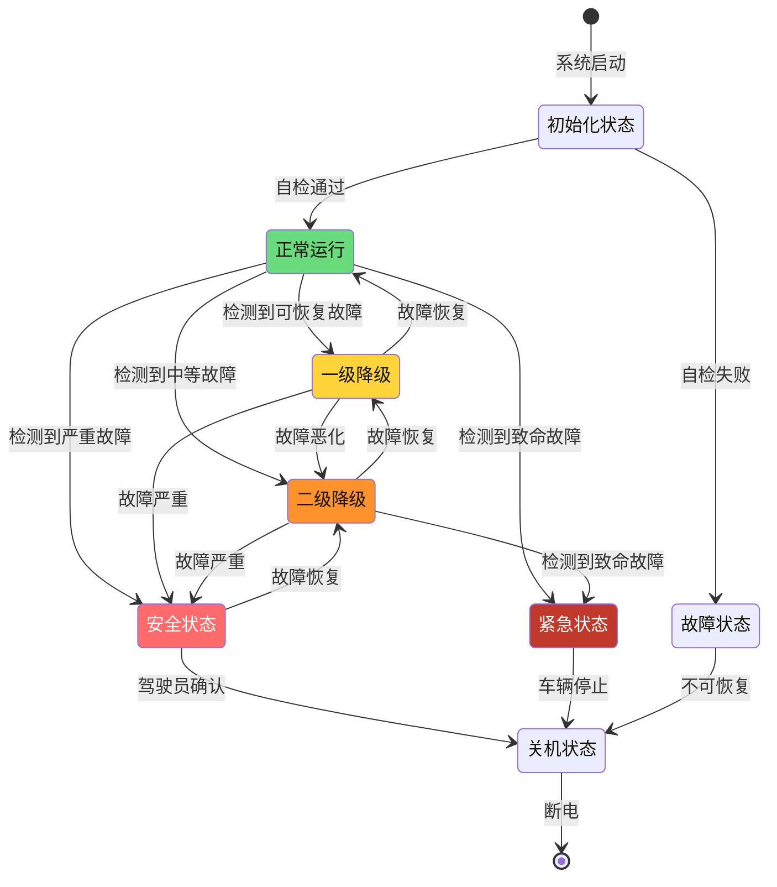

# 故障安全状态机设计 - 制动系统安全核心

> **文档编号**: SAFETY-FSM-001  
> **ASIL等级**: D  
> **安全目标**: SG001 - 防止非预期制动丧失  
> **安全目标**: SG002 - 防止非预期制动施加

---

## 1. 安全状态机架构

### 1.1 状态分层架构



### 1.2 状态定义

```c
//=============================================================================
// 安全状态定义
//=============================================================================

typedef enum {
    // 系统级状态
    STATE_INIT = 0,                // 初始化/自检
    STATE_NORMAL,                  // 正常运行
    STATE_DEGRADED_1,              // 一级降级 (部分功能受限)
    STATE_DEGRADED_2,              // 二级降级 (基础功能)
    STATE_SAFE,                    // 安全状态 (仅液压制动)
    STATE_EMERGENCY,               // 紧急状态 (紧急制动)
    STATE_FAULT,                   // 故障状态 (不可恢复)
    STATE_SHUTDOWN                 // 关机状态
} SystemSafetyStateType;

// 状态属性结构
typedef struct {
    SystemSafetyStateType State;
    const char* StateName;
    uint8 ASIL_Level;              // 该状态的安全等级
    boolean ABS_Allowed;           // 是否允许ABS
    boolean ESC_Allowed;           // 是否允许ESC
    boolean EPB_Allowed;           // 是否允许EPB
    boolean Autohold_Allowed;      // 是否允许Autohold
    boolean AEB_Allowed;           // 是否允许AEB
    boolean Diag_Allowed;          // 是否允许诊断通信
    boolean LimpHome_Allowed;      // 是否允许跛行回家
    uint16 MaxSpeed;               // 最大允许车速 (km/h)
    uint8 MaxDecel;                // 最大减速度 (m/s²)
} StateAttributeType;

// 状态属性表
const StateAttributeType StateAttributes[] = {
    [STATE_INIT] = {
        .StateName = "INIT",
        .ASIL_Level = QM,
        .ABS_Allowed = FALSE,
        .ESC_Allowed = FALSE,
        .EPB_Allowed = FALSE,
        .Autohold_Allowed = FALSE,
        .AEB_Allowed = FALSE,
        .Diag_Allowed = TRUE,
        .LimpHome_Allowed = FALSE,
        .MaxSpeed = 0,
        .MaxDecel = 0
    },
    [STATE_NORMAL] = {
        .StateName = "NORMAL",
        .ASIL_Level = ASIL_D,
        .ABS_Allowed = TRUE,
        .ESC_Allowed = TRUE,
        .EPB_Allowed = TRUE,
        .Autohold_Allowed = TRUE,
        .AEB_Allowed = TRUE,
        .Diag_Allowed = TRUE,
        .LimpHome_Allowed = FALSE,
        .MaxSpeed = 255,              // 无限制
        .MaxDecel = 10                // 最大10m/s²
    },
    [STATE_DEGRADED_1] = {
        .StateName = "DEGRADED_1",
        .ASIL_Level = ASIL_B,
        .ABS_Allowed = FALSE,         // ABS禁用
        .ESC_Allowed = TRUE,          // ESC保留
        .EPB_Allowed = TRUE,
        .Autohold_Allowed = FALSE,
        .AEB_Allowed = TRUE,
        .Diag_Allowed = TRUE,
        .LimpHome_Allowed = FALSE,
        .MaxSpeed = 200,
        .MaxDecel = 8
    },
    [STATE_DEGRADED_2] = {
        .StateName = "DEGRADED_2",
        .ASIL_Level = ASIL_A,
        .ABS_Allowed = FALSE,
        .ESC_Allowed = FALSE,
        .EPB_Allowed = TRUE,
        .Autohold_Allowed = FALSE,
        .AEB_Allowed = FALSE,
        .Diag_Allowed = TRUE,
        .LimpHome_Allowed = TRUE,     // 允许跛行回家
        .MaxSpeed = 100,
        .MaxDecel = 6
    },
    [STATE_SAFE] = {
        .StateName = "SAFE",
        .ASIL_Level = ASIL_D,
        .ABS_Allowed = FALSE,
        .ESC_Allowed = FALSE,
        .EPB_Allowed = FALSE,
        .Autohold_Allowed = FALSE,
        .AEB_Allowed = FALSE,
        .Diag_Allowed = TRUE,
        .LimpHome_Allowed = FALSE,
        .MaxSpeed = 50,               // 仅允许低速驶离
        .MaxDecel = 4                 // 仅基础制动
    },
    [STATE_EMERGENCY] = {
        .StateName = "EMERGENCY",
        .ASIL_Level = ASIL_D,
        .ABS_Allowed = FALSE,
        .ESC_Allowed = FALSE,
        .EPB_Allowed = FALSE,
        .Autohold_Allowed = FALSE,
        .AEB_Allowed = FALSE,
        .Diag_Allowed = FALSE,
        .LimpHome_Allowed = FALSE,
        .MaxSpeed = 0,                // 必须停车
        .MaxDecel = 10                // 紧急制动
    },
    [STATE_FAULT] = {
        .StateName = "FAULT",
        .ASIL_Level = QM,
        .ABS_Allowed = FALSE,
        .ESC_Allowed = FALSE,
        .EPB_Allowed = FALSE,
        .Autohold_Allowed = FALSE,
        .AEB_Allowed = FALSE,
        .Diag_Allowed = TRUE,
        .LimpHome_Allowed = FALSE,
        .MaxSpeed = 0,
        .MaxDecel = 0
    },
    [STATE_SHUTDOWN] = {
        .StateName = "SHUTDOWN",
        .ASIL_Level = QM,
        .ABS_Allowed = FALSE,
        .ESC_Allowed = FALSE,
        .EPB_Allowed = FALSE,
        .Autohold_Allowed = FALSE,
        .AEB_Allowed = FALSE,
        .Diag_Allowed = FALSE,
        .LimpHome_Allowed = FALSE,
        .MaxSpeed = 0,
        .MaxDecel = 0
    }
};
```

---

## 2. 状态转换逻辑

### 2.1 状态转换矩阵

```c
//=============================================================================
// 状态转换矩阵 - 定义允许的状态转换路径
//=============================================================================

typedef struct {
    SystemSafetyStateType FromState;
    SystemSafetyStateType ToState;
    boolean Allowed;               // 是否允许转换
    uint8 ConditionCount;          // 触发条件数量
    SafetyConditionType Conditions[8];  // 触发条件
    uint16 DebounceTime;           // 消抖时间 (ms)
    void (*TransitionAction)(void); // 转换动作
} StateTransitionType;

// 状态转换矩阵 (部分关键转换)
const StateTransitionType StateTransitionMatrix[] = {
    // 正常 → 一级降级
    {
        .FromState = STATE_NORMAL,
        .ToState = STATE_DEGRADED_1,
        .Allowed = TRUE,
        .ConditionCount = 5,
        .Conditions = {
            {COND_ABS_FAULT, SEVERITY_MINOR},
            {COND_WSS_DEGRADED, SEVERITY_MINOR},
            {COND_PEDAL_REDUNDANCY_LOSS, SEVERITY_MINOR},
            {COND_COM_FAULT, SEVERITY_MINOR},
            {COND_SENSOR_DEGRADED, SEVERITY_MINOR}
        },
        .DebounceTime = 100,
        .TransitionAction = Action_EnterDegraded1
    },
    
    // 正常 → 二级降级
    {
        .FromState = STATE_NORMAL,
        .ToState = STATE_DEGRADED_2,
        .Allowed = TRUE,
        .ConditionCount = 4,
        .Conditions = {
            {COND_ABS_FAILED, SEVERITY_MAJOR},
            {COND_ESC_FAULT, SEVERITY_MAJOR},
            {COND_2WHEEL_PRESSURE_FAILED, SEVERITY_MAJOR},
            {COND_PEDAL_FAULT, SEVERITY_MAJOR}
        },
        .DebounceTime = 50,
        .TransitionAction = Action_EnterDegraded2
    },
    
    // 正常 → 安全状态
    {
        .FromState = STATE_NORMAL,
        .ToState = STATE_SAFE,
        .Allowed = TRUE,
        .ConditionCount = 5,
        .Conditions = {
            {COND_WATCHDOG_FAULT, SEVERITY_CRITICAL},
            {COND_CPU_FAULT, SEVERITY_CRITICAL},
            {COND_POWER_FAULT, SEVERITY_CRITICAL},
            {COND_3WHEEL_PRESSURE_FAILED, SEVERITY_CRITICAL},
            {COND_PEDAL_BOTH_FAILED, SEVERITY_CRITICAL}
        },
        .DebounceTime = 0,  // 立即响应
        .TransitionAction = Action_EnterSafeState
    },
    
    // 正常 → 紧急状态
    {
        .FromState = STATE_NORMAL,
        .ToState = STATE_EMERGENCY,
        .Allowed = TRUE,
        .ConditionCount = 3,
        .Conditions = {
            {COND_LOSS_OF_BRAKING, SEVERITY_FATAL},
            {COND_UNINTENDED_BRAKING, SEVERITY_FATAL},
            {COND_STEERING_FAULT, SEVERITY_FATAL}
        },
        .DebounceTime = 0,
        .TransitionAction = Action_EnterEmergency
    },
    
    // 一级降级 → 正常
    {
        .FromState = STATE_DEGRADED_1,
        .ToState = STATE_NORMAL,
        .Allowed = TRUE,
        .ConditionCount = 1,
        .Conditions = {
            {COND_ALL_FAULTS_RECOVERED, SEVERITY_NONE}
        },
        .DebounceTime = 1000,  // 持续1秒无故障才恢复
        .TransitionAction = Action_RecoverToNormal
    },
    
    // 一级降级 → 二级降级
    {
        .FromState = STATE_DEGRADED_1,
        .ToState = STATE_DEGRADED_2,
        .Allowed = TRUE,
        .ConditionCount = 3,
        .Conditions = {
            {COND_DEGRADED_1_TIMEOUT, SEVERITY_MAJOR},
            {COND_NEW_MAJOR_FAULT, SEVERITY_MAJOR},
            {COND_MULTIPLE_MINOR_FAULTS, SEVERITY_MAJOR}
        },
        .DebounceTime = 100,
        .TransitionAction = Action_DegradeToLevel2
    }
};
```

### 2.2 状态机主控程序

```c
//=============================================================================
// 安全状态机主控 - 周期执行 (2ms)
//=============================================================================

// 全局状态变量
static SystemSafetyStateType CurrentState = STATE_INIT;
static SystemSafetyStateType TargetState = STATE_INIT;
static uint32 StateEntryTime = 0;
static uint32 DebounceCounter = 0;

void SafetyStateMachine_Main(void)
{
    SafetyConditionType active_conditions[16];
    uint8 active_count = 0;
    
    // 1. 检查当前状态的所有可能转换
    for (int i = 0; i < TRANSITION_COUNT; i++) {
        if (StateTransitionMatrix[i].FromState == CurrentState) {
            
            // 检查转换条件
            boolean conditions_met = CheckTransitionConditions(
                &StateTransitionMatrix[i],
                active_conditions,
                &active_count
            );
            
            if (conditions_met) {
                // 条件满足，开始消抖
                if (DebounceCounter < StateTransitionMatrix[i].DebounceTime / 2) {
                    DebounceCounter++;
                } else {
                    // 消抖完成，执行状态转换
                    TargetState = StateTransitionMatrix[i].ToState;
                    ExecuteStateTransition(CurrentState, TargetState);
                    CurrentState = TargetState;
                    StateEntryTime = GetSystemTime();
                    DebounceCounter = 0;
                    return;  // 一次只处理一个转换
                }
            } else {
                // 条件不满足，消抖计数器递减
                if (DebounceCounter > 0) DebounceCounter--;
            }
        }
    }
    
    // 2. 执行当前状态的动作
    ExecuteStateAction(CurrentState);
    
    // 3. 更新状态机诊断数据
    UpdateStateMachineDiagnostics();
}

// 检查转换条件
boolean CheckTransitionConditions(const StateTransitionType* transition,
                                  SafetyConditionType* active_conditions,
                                  uint8* active_count)
{
    *active_count = 0;
    
    for (int i = 0; i < transition->ConditionCount; i++) {
        if (IsConditionActive(transition->Conditions[i])) {
            active_conditions[(*active_count)++] = transition->Conditions[i];
        }
    }
    
    // 对于OR条件，至少一个满足即可
    // 对于AND条件，所有条件都需满足
    return (*active_count > 0);
}

// 执行状态转换
void ExecuteStateTransition(SystemSafetyStateType from, SystemSafetyStateType to)
{
    // 1. 记录状态转换事件
    LogStateTransition(from, to);
    
    // 2. 存储旧状态上下文
    SaveStateContext(from);
    
    // 3. 执行退出旧状态动作
    ExecuteExitAction(from);
    
    // 4. 执行状态转换特定动作
    for (int i = 0; i < TRANSITION_COUNT; i++) {
        if (StateTransitionMatrix[i].FromState == from &&
            StateTransitionMatrix[i].ToState == to) {
            if (StateTransitionMatrix[i].TransitionAction != NULL) {
                StateTransitionMatrix[i].TransitionAction();
            }
            break;
        }
    }
    
    // 5. 执行进入新状态动作
    ExecuteEntryAction(to);
    
    // 6. 通知相关模块
    NotifyStateChange(from, to);
}
```

---

## 3. 状态动作实现

### 3.1 进入安全状态动作

```c
//=============================================================================
// 进入安全状态 - 关键安全动作
//=============================================================================

void Action_EnterSafeState(void)
{
    // 1. 立即记录故障 (最高优先级)
    Dem_SetEventStatus(DTC_STATE_SAFE_ENTRY, DEM_EVENT_STATUS_FAILED);
    
    // 2. 通知安全监控核 (双核系统)
    IPC_NotifySafetyCore(SAFE_STATE_ENTERED);
    
    // 3. 关闭高级功能
    DisableABS();
    DisableESC();
    DisableEPB();
    DisableAutohold();
    DisableAEB();
    
    // 4. 维持基础制动能力
    // 仅保留踏板-主缸-轮缸的直接通路
    EnableBaseBraking();
    
    // 5. 限制车速 (通过CAN发送限速请求)
    Rte_Write_PPort_SpeedLimitRequest(50);  // 50km/h
    
    // 6. 激活警告
    Rte_Write_PPort_BrakeWarningLamp(BRAKE_WARNING_SAFE_STATE);
    Rte_Write_PPort_HMIWarning("制动系统安全模式，请尽快检修");
    
    // 7. 记录故障快照
    RecordFaultSnapshot();
    
    // 8. 启动故障恢复计时器
    StartFaultRecoveryTimer();
}

// 进入紧急状态动作
void Action_EnterEmergency(void)
{
    // 1. 立即记录致命故障
    Dem_SetEventStatus(DTC_STATE_EMERGENCY, DEM_EVENT_STATUS_FAILED);
    
    // 2. 触发紧急制动
    ExecuteEmergencyBraking();
    
    // 3. 激活危险报警灯
    Rte_Write_PPort_HazardLamp(TRUE);
    
    // 4. 打开车门解锁
    Rte_Write_PPort_DoorUnlock(TRUE);
    
    // 5. 发送紧急呼叫 (如配备)
    Rte_Write_PPort_EmergencyCall(TRUE);
    
    // 6. 等待车辆停止
    while (VehicleSpeed > 5.0) {
        // 持续紧急制动
        Delay(10);
    }
    
    // 7. 进入关机状态
    RequestStateTransition(STATE_SHUTDOWN);
}
```

### 3.2 降级状态动作

```c
//=============================================================================
// 进入一级降级
//=============================================================================

void Action_EnterDegraded1(void)
{
    // 禁用ABS (保留ESC)
    DisableABS();
    
    // 禁用Autohold
    DisableAutohold();
    
    // 限制部分ADAS功能
    Rte_Write_PPort_ADAS_Limitation(ADAS_LIMIT_ABS_OFF);
    
    // 记录事件
    Dem_SetEventStatus(DTC_STATE_DEGRADED_1, DEM_EVENT_STATUS_FAILED);
    
    // 仪表警告
    Rte_Write_PPort_BrakeWarningLamp(BRAKE_WARNING_DEGRADED);
    
    // 启动故障恢复监控
    StartFaultRecoveryMonitor();
}

//=============================================================================
// 进入二级降级 (跛行回家)
//=============================================================================

void Action_EnterDegraded2(void)
{
    // 禁用ABS和ESC
    DisableABS();
    DisableESC();
    DisableAutohold();
    DisableAEB();
    
    // 启用跛行回家模式
    EnableLimpHomeMode();
    
    // 限速
    Rte_Write_PPort_SpeedLimitRequest(100);  // 100km/h
    
    // 记录事件
    Dem_SetEventStatus(DTC_STATE_DEGRADED_2, DEM_EVENT_STATUS_FAILED);
    
    // 仪表警告
    Rte_Write_PPort_BrakeWarningLamp(BRAKE_WARNING_LIMP_HOME);
    Rte_Write_PPort_HMIWarning("制动系统性能受限，请谨慎驾驶");
}
```

---

## 4. 故障恢复机制

### 4.1 故障恢复逻辑

```c
//=============================================================================
// 故障恢复监控
//=============================================================================

void FaultRecoveryMonitor(void)
{
    // 只在降级状态检查恢复
    if (CurrentState != STATE_DEGRADED_1 && 
        CurrentState != STATE_DEGRADED_2) {
        return;
    }
    
    // 检查所有触发降级的故障是否已恢复
    boolean all_faults_recovered = TRUE;
    
    for (int i = 0; i < ActiveFaultCount; i++) {
        if (!IsFaultRecovered(ActiveFaults[i])) {
            all_faults_recovered = FALSE;
            break;
        }
    }
    
    if (all_faults_recovered) {
        // 启动恢复计时器
        if (RecoveryTimer < RECOVERY_CONFIRM_TIME) {
            RecoveryTimer += 2;  // 2ms周期
        } else {
            // 确认恢复，尝试升级状态
            if (CurrentState == STATE_DEGRADED_1) {
                RequestStateTransition(STATE_NORMAL);
            } else if (CurrentState == STATE_DEGRADED_2) {
                RequestStateTransition(STATE_DEGRADED_1);
            }
        }
    } else {
        // 故障未完全恢复，重置计时器
        RecoveryTimer = 0;
    }
}

// 恢复确认动作
void Action_RecoverToNormal(void)
{
    // 1. 清除故障码
    for (int i = 0; i < ActiveFaultCount; i++) {
        Dem_SetEventStatus(ActiveFaults[i], DEM_EVENT_STATUS_PASSED);
    }
    
    // 2. 重新启用功能
    EnableABS();
    EnableESC();
    EnableAutohold();
    EnableAEB();
    
    // 3. 清除警告
    Rte_Write_PPort_BrakeWarningLamp(BRAKE_WARNING_OFF);
    
    // 4. 记录恢复事件
    Dem_SetEventStatus(DTC_STATE_RECOVERED, DEM_EVENT_STATUS_PASSED);
    
    // 5. 执行自检
    if (RunSelfTest() == SELFTEST_PASSED) {
        // 恢复正常运行
    } else {
        // 自检失败，回到降级
        RequestStateTransition(STATE_DEGRADED_1);
    }
}
```

---

## 5. 诊断与监控

### 5.1 状态机监控

```c
//=============================================================================
// 状态机健康监控
//=============================================================================

// 监控状态机异常
void MonitorStateMachineHealth(void)
{
    // 1. 检查状态停留时间
    uint32 state_duration = GetSystemTime() - StateEntryTime;
    
    if (state_duration > MAX_STATE_DURATION[CurrentState]) {
        // 状态停留时间过长，可能卡死
        Dem_SetEventStatus(DTC_STATE_MACHINE_STUCK, DEM_EVENT_STATUS_FAILED);
        TriggerWatchdogReset();
    }
    
    // 2. 检查状态转换频率
    static uint32 transition_count = 0;
    static uint32 last_check_time = 0;
    
    if (GetSystemTime() - last_check_time > 1000) {  // 每秒检查
        if (transition_count > MAX_TRANSITIONS_PER_SEC) {
            Dem_SetEventStatus(DTC_STATE_MACHINE_UNSTABLE, DEM_EVENT_STATUS_FAILED);
        }
        transition_count = 0;
        last_check_time = GetSystemTime();
    }
    
    // 3. 检查无效状态转换请求
    if (IsInvalidTransitionRequested()) {
        Dem_SetEventStatus(DTC_INVALID_STATE_REQUEST, DEM_EVENT_STATUS_FAILED);
    }
}
```

---

*故障安全状态机设计 - 制动系统安全核心*  
*ASIL-D功能安全的必要组件*