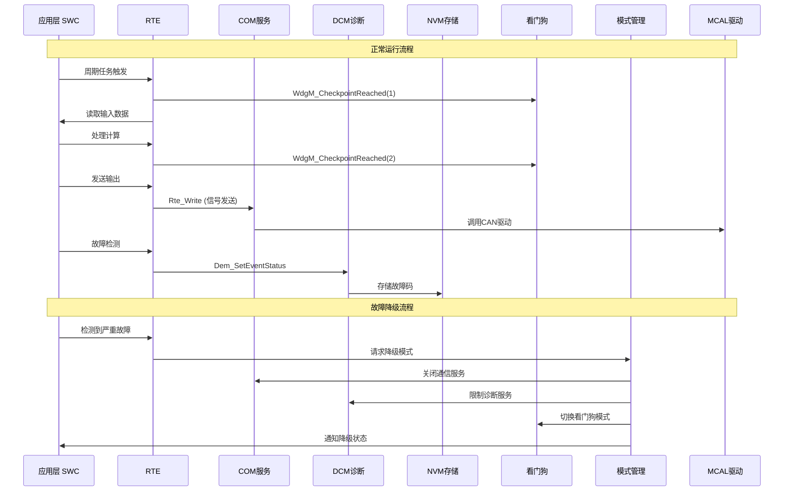

# 服务层 (BSW) 完整架构 - 控制器视角

> **文档编号**: BRAKE-BSW-FULL-001  
> **版本**: v2.0 - 完整版  
> **视角**: 制动控制器专家视角

---

## 1. 服务层全景图

### 1.1 完整BSW服务架构

```mermaid
graph TB
    subgraph BSW_Services["基础软件服务层 BSW Services"]
        
        subgraph 通信与网络["🌐 通信与网络服务"]
            COM["通信服务 COM"]
            PDUR["PDU路由 PDUR"]
            CANIF["CAN接口 CANIF"]
            NM["网络管理 NM"]
            COMSM["通信管理 COMSM"]
        end
        
        subgraph 诊断与刷写["🔧 诊断与刷写服务"]
            DCM["诊断通信 DCM"]
            DEM["诊断事件 DEM"]
            FIM["功能禁止 FIM"]
            BOOT["启动管理 Boot Manager"]
        end
        
        subgraph 监控与安全["🛡️ 监控与安全服务"]
            WDGM["看门狗管理 WDGM"]
            WDIF["看门狗接口 WDIF"]
            SAFE_MON["安全监控 Safety Monitor"]
            E2E_PROT["E2E保护 E2E"]
        end
        
        subgraph 存储与保护["💾 存储与保护服务"]
            NVM["NVRAM管理 NVM"]
            FEE["Flash仿真 FEE"]
            MEMIF["存储接口 MEMIF"]
            EA["EEPROM抽象 EA"]
        end
        
        subgraph 模式与状态["⚙️ 模式与状态管理"]
            BSWMM["BSW模式管理 BSWMM"]
            ECUM["ECU状态管理 ECUM"]
            BSWM["BSW调度器 BSWM"]
        end
        
        subgraph 加密与认证["🔐 加密与认证服务"]
            CSM["加密服务管理 CSM"]
            CRYIF["加密接口 CRYIF"]
            CRYPTO["加密驱动 CRYPTO"]
        end
        
        subgraph 时间与同步["⏱️ 时间与同步服务"]
            STBM["同步时基 StbM"]
            TM["时间服务 TM"]
            OS["操作系统 OS"]
        end
    end

    subgraph MCAL["微控制器驱动 MCAL"]
        CAN_DRV["CAN驱动"]
        WDG_DRV["看门狗驱动"]
        FLASH_DRV["Flash驱动"]
        CRYPTO_DRV["加密驱动"]
    end

    // 通信链路
    COM --> PDUR --> CANIF --> CAN_DRV
    NM --> CANIF
    COMSM --> NM
    
    // 诊断链路
    DCM --> DEM
    DEM --> FIM
    DEM --> NVM
    FIM --> COM
    
    // 监控链路
    WDGM --> WDIF --> WDG_DRV
    SAFE_MON --> WDGM
    E2E_PROT --> COM
    
    // 存储链路
    NVM --> MEMIF --> FEE --> FLASH_DRV
    NVM --> EA
    
    // 模式管理链路
    ECUM --> BSWMM
    BSWMM --> BSWM
    BSWM --> NM
    BSWM --> COM
    BSWM --> DCM
    
    // 加密链路
    CSM --> CRYIF --> CRYPTO --> CRYPTO_DRV
    
    // 时间同步链路
    STBM --> TM --> OS

    style 监控与安全 fill:#ff6b6b,color:#fff
    style 模式与状态 fill:#ffd43b
    style 加密与认证 fill:#e3f2fd
```

---

## 2. 信号监控与看门狗服务

### 2.1 看门狗管理 (WDGM)

**功能**: 监控任务执行时间、检测程序跑飞、触发安全响应

```c
//=============================================================================
// WDGM配置 - 任务监控与超时检测
//=============================================================================

#include "WdgM.h"

//-------------------- WDGM General Configuration --------------------
const WdgM_GeneralConfigurationType WdgM_GeneralConfiguration = {
    .WdgMDevErrorDetect = STD_ON,
    .WdgMVersionInfoApi = STD_OFF,
    .WdgMMultiCoreSupport = STD_ON,           // 支持多核
    .WdgMMultiSetSupervision = STD_OFF
};

//-------------------- WDGM Supervised Entity (SE) --------------------
// 受监控实体定义 - 对应关键任务

// SE 1: 制动主控制任务 (ASIL-D)
const WdgM_SupervisedEntityConfigType WdgM_SE_BrakeControl = {
    .WdgMSEId = 1,
    .WdgMSEName = "BrakeControl_Main",
    .WdgMSEState = WDGM_SE_STATE_OK,
    .WdgMSEFailureTolerance = 1               // 允许1次失败
};

// SE 2: ABS控制任务 (ASIL-D)
const WdgM_SupervisedEntityConfigType WdgM_SE_ABS = {
    .WdgMSEId = 2,
    .WdgMSEName = "ABS_Controller",
    .WdgMSEState = WDGM_SE_STATE_OK,
    .WdgMSEFailureTolerance = 1
};

// SE 3: ESC控制任务 (ASIL-D)
const WdgM_SupervisedEntityConfigType WdgM_SE_ESC = {
    .WdgMSEId = 3,
    .WdgMSEName = "ESC_Controller",
    .WdgMSEState = WDGM_SE_STATE_OK,
    .WdgMSEFailureTolerance = 1
};

// SE 4: 安全监控任务 (ASIL-D)
const WdgM_SupervisedEntityConfigType WdgM_SE_Safety = {
    .WdgMSEId = 4,
    .WdgMSEName = "Safety_Monitor",
    .WdgMSEState = WDGM_SE_STATE_OK,
    .WdgMSEFailureTolerance = 0               // 0容忍
};

//-------------------- WDGM Checkpoint Configuration --------------------
// 检查点定义 - 任务执行路径检查

const WdgM_CheckpointConfigurationType WdgM_CP_BrakeControl[] = {
    {
        .WdgMCheckpointId = 1,
        .WdgMCheckpointName = "CP_BrakeControl_Start",
        .WdgMSEId = 1
    },
    {
        .WdgMCheckpointId = 2,
        .WdgMCheckpointName = "CP_BrakeControl_InputRead",
        .WdgMSEId = 1
    },
    {
        .WdgMCheckpointId = 3,
        .WdgMCheckpointName = "CP_BrakeControl_Process",
        .WdgMSEId = 1
    },
    {
        .WdgMCheckpointId = 4,
        .WdgMCheckpointName = "CP_BrakeControl_OutputWrite",
        .WdgMSEId = 1
    }
};

//-------------------- WDGM Supervision Cycle --------------------
// 监督周期配置 - Alive/Deadline/Logical

const WdgM_SupervisedEntityCycleType WdgM_Cycle_BrakeControl = {
    .WdgMSEId = 1,
    .WdgMSupervisionCycle = {
        // Alive监督 - 检查任务是否执行
        .WdgMAliveSupervision = {
            .WdgMExpectedAliveIndications = 500,      // 500次/秒
            .WdgMMinMargin = 450,
            .WdgMMaxMargin = 550,
            .WdgMSupervisionReferenceCycle = 0
        },
        // Deadline监督 - 检查执行时间
        .WdgMDeadlineSupervision = {
            .WdgMDeadlineMin = 100,                   // 最小100us
            .WdgMDeadlineMax = 500                    // 最大500us (ASIL-D要求)
        },
        // Logical监督 - 检查执行路径
        .WdgMLogicalSupervision = {
            .WdgMGraph = &WdgM_Graph_BrakeControl,
            .WdgMCheckpoints = WdgM_CP_BrakeControl,
            .WdgMCheckpointCount = 4
        }
    }
};

//-------------------- WDGM Mode Configuration --------------------
// 不同模式下的看门狗配置

const WdgM_ModeConfigurationType WdgM_ModeConfigs[] = {
    {
        .WdgMModeId = WDGM_MODE_NORMAL,           // 正常运行模式
        .WdgMModeName = "Normal_Mode",
        .WdgMTriggerCondition = WDGM_TRIGGER_CONDITION_COMBINED,
        .WdgMSupervisedEntities = {
            &WdgM_SE_BrakeControl,
            &WdgM_SE_ABS,
            &WdgM_SE_ESC,
            &WdgM_SE_Safety
        },
        .WdgMSECount = 4,
        .WdgMExpiredSupervisionCycleTol = 3       // 3次周期容错
    },
    {
        .WdgMModeId = WDGM_MODE_DEGRADED,         // 降级模式
        .WdgMModeName = "Degraded_Mode",
        .WdgMTriggerCondition = WDGM_TRIGGER_CONDITION_INDIVIDUAL,
        .WdgMSupervisedEntities = {
            &WdgM_SE_Safety                       // 只监控安全任务
        },
        .WdgMSECount = 1,
        .WdgMExpiredSupervisionCycleTol = 1
    }
};

//-------------------- WDGM API Usage Example --------------------
// 在任务中使用看门狗

void BrakeControl_Main(void)
{
    // 检查点1: 任务开始
    WdgM_CheckpointReached(1);
    
    // 读取输入
    ReadInputs();
    WdgM_CheckpointReached(2);  // 检查点2
    
    // 控制处理
    ProcessControl();
    WdgM_CheckpointReached(3);  // 检查点3
    
    // 输出写入
    WriteOutputs();
    WdgM_CheckpointReached(4);  // 检查点4
}
```

### 2.2 信号监控与校验

```c
//=============================================================================
// 信号监控 - 输入信号有效性检查
//=============================================================================

// 信号监控配置
typedef struct {
    uint16 SignalId;
    uint16 MinValue;
    uint16 MaxValue;
    uint16 DeltaMax;          // 最大变化率
    uint8  TimeoutMs;         // 超时时间
    void (*InvalidCallback)(void);
} SignalMonitor_ConfigType;

// 制动系统关键信号监控
const SignalMonitor_ConfigType SignalMonitor_Config[] = {
    // 踏板位置监控
    {
        .SignalId = SIG_PEDAL_POSITION,
        .MinValue = 0,
        .MaxValue = 1000,
        .DeltaMax = 200,          // 最大200%/s变化率
        .TimeoutMs = 20,          // 20ms超时
        .InvalidCallback = PedalSignal_InvalidCallback
    },
    // 轮速监控
    {
        .SignalId = SIG_WHEEL_SPEED_FL,
        .MinValue = 0,
        .MaxValue = 65000,        // 650km/h
        .DeltaMax = 5000,         // 最大50g变化
        .TimeoutMs = 10,
        .InvalidCallback = WheelSpeed_InvalidCallback
    },
    // 横摆角速度监控
    {
        .SignalId = SIG_YAW_RATE,
        .MinValue = -32768,       // -100°/s
        .MaxValue = 32767,        // +100°/s
        .DeltaMax = 5000,         // 最大变化率
        .TimeoutMs = 20,
        .InvalidCallback = YawRate_InvalidCallback
    }
};

// 信号监控执行
void SignalMonitor_Main(void)
{
    uint8 i;
    for (i = 0; i < SIGNAL_MONITOR_COUNT; i++) {
        uint16 current_value = GetSignalValue(SignalMonitor_Config[i].SignalId);
        uint16 previous_value = GetPreviousValue(SignalMonitor_Config[i].SignalId);
        
        // 范围检查
        if (current_value < SignalMonitor_Config[i].MinValue ||
            current_value > SignalMonitor_Config[i].MaxValue) {
            // 信号超范围
            SignalMonitor_Config[i].InvalidCallback();
            Dem_SetEventStatus(DTC_SIGNAL_RANGE_ERROR, DEM_EVENT_STATUS_FAILED);
            continue;
        }
        
        // 变化率检查
        uint16 delta = abs(current_value - previous_value);
        if (delta > SignalMonitor_Config[i].DeltaMax) {
            // 变化率异常
            SignalMonitor_Config[i].InvalidCallback();
            Dem_SetEventStatus(DTC_SIGNAL_GRADIENT_ERROR, DEM_EVENT_STATUS_FAILED);
            continue;
        }
        
        // 超时检查
        if (SignalTimeout(SignalMonitor_Config[i].SignalId, 
                          SignalMonitor_Config[i].TimeoutMs)) {
            SignalMonitor_Config[i].InvalidCallback();
            Dem_SetEventStatus(DTC_SIGNAL_TIMEOUT, DEM_EVENT_STATUS_FAILED);
        }
    }
}

// 信号无效回调函数
void PedalSignal_InvalidCallback(void)
{
    // 踏板信号无效
    // 1. 切换到冗余传感器
    UseRedundantPedalSensor();
    
    // 2. 通知安全监控
    SafetyReport_SignalFailure(SIG_PEDAL_POSITION);
    
    // 3. 触发降级模式
    EnterDegradedMode(DEGRADE_PEDAL_FAULT);
}
```

---

## 3. 服务降级与模式管理

### 3.1 BSW模式管理 (BSWM)

**功能**: 根据系统状态自动切换BSW服务配置，实现服务降级

```c
//=============================================================================
// BSWM配置 - 服务降级管理
//=============================================================================

#include "BswM.h"

//-------------------- BSWM Mode Declaration --------------------
// 模式声明 - 系统运行模式

typedef enum {
    BSW_MODE_NORMAL = 0,           // 正常运行模式
    BSW_MODE_DEGRADED_COM,         // 通信降级模式
    BSW_MODE_DEGRADED_SENSORS,     // 传感器降级模式
    BSW_MODE_DEGRADED_ACTUATORS,   // 执行器降级模式
    BSW_MODE_SAFE_STATE,           // 安全状态
    BSW_MODE_SHUTDOWN              // 关机模式
} BswM_SystemModeType;

//-------------------- BSWM Action Lists --------------------
// 模式切换动作列表

// 进入降级通信模式
const BswM_ActionListType BswM_AL_EnterDegradedCom = {
    .BswMActionListName = "EnterDegradedCom",
    .BswMActionItems = {
        {
            .BswMActionType = BSWM_ACTION_NM_DISABLE,           // 禁用网络管理
            .BswMActionRef = &BswM_Action_NmDisable
        },
        {
            .BswMActionType = BSWM_ACTION_COM_DEINIT,           // 通信部分关闭
            .BswMActionRef = &BswM_Action_ComDeinit
        },
        {
            .BswMActionType = BSWM_ACTION_DCM_DISABLE,          // 禁用诊断通信
            .BswMActionRef = &BswM_Action_DcmDisable
        },
        {
            .BswMActionType = BSWM_ACTION_USER,                 // 用户自定义
            .BswMActionRef = &BswM_Action_SetDegradedMode
        }
    },
    .BswMActionItemCount = 4
};

// 进入安全状态
const BswM_ActionListType BswM_AL_EnterSafeState = {
    .BswMActionListName = "EnterSafeState",
    .BswMActionItems = {
        {
            .BswMActionType = BSWM_ACTION_COM_DEINIT,           // 关闭通信
            .BswMActionRef = &BswM_Action_ComDeinit
        },
        {
            .BswMActionType = BSWM_ACTION_NM_DISABLE,
            .BswMActionRef = &BswM_Action_NmDisable
        },
        {
            .BswMActionType = BSWM_ACTION_USER,
            .BswMActionRef = &BswM_Action_DisableAllActuators   // 关闭所有执行器
        },
        {
            .BswMActionType = BSWM_ACTION_USER,
            .BswMActionRef = &BswM_Action_SetSafeState
        }
    },
    .BswMActionItemCount = 4
};

//-------------------- BSWM Rules --------------------
// 模式切换规则

// 规则1: 通信故障 → 降级通信模式
const BswM_RuleType BswM_Rule_ComFault = {
    .BswMRuleName = "ComFault_Degraded",
    .BswMCondition = {
        .BswMConditionType = BSWM_CONDITION_EVENT,
        .BswMConditionRef = &BswM_Event_ComBusOff      // CAN BusOff事件
    },
    .BswMTrueActionList = &BswM_AL_EnterDegradedCom,
    .BswMFalseActionList = NULL
};

// 规则2: 严重故障 → 安全状态
const BswM_RuleType BswM_Rule_CriticalFault = {
    .BswMRuleName = "CriticalFault_SafeState",
    .BswMCondition = {
        .BswMConditionType = BSWM_CONDITION_REQUEST,
        .BswMConditionRef = &BswM_Request_SafeState     // 安全状态请求
    },
    .BswMTrueActionList = &BswM_AL_EnterSafeState,
    .BswMFalseActionList = NULL
};

// 规则3: 传感器故障 → 传感器降级
const BswM_RuleType BswM_Rule_SensorFault = {
    .BswMRuleName = "SensorFault_Degraded",
    .BswMCondition = {
        .BswMConditionType = BSWM_CONDITION_REQUEST,
        .BswMConditionRef = &BswM_Request_SensorDegraded
    },
    .BswMTrueActionList = &BswM_AL_EnterDegradedSensors,
    .BswMFalseActionList = NULL
};

//-------------------- 降级模式处理函数 --------------------

// 进入通信降级模式
void BswM_Action_SetDegradedMode(void)
{
    // 1. 记录降级事件
    Dem_SetEventStatus(DTC_SYSTEM_DEGRADED, DEM_EVENT_STATUS_FAILED);
    
    // 2. 通知应用层
    Rte_Write_PPort_SystemMode(SYS_MODE_DEGRADED);
    
    // 3. 限制功能
    DisableADASFunctions();        // 禁用ADAS功能
    DisableABS();                  // 禁用ABS
    DisableESC();                  // 禁用ESC
    // 保留基础制动功能
    
    // 4. 设置看门狗模式
    WdgM_SetMode(WDGM_MODE_DEGRADED);
    
    // 5. 通知仪表
    Rte_Write_PPort_WarningLamp(LAMP_DEGRADED_MODE);
}

// 进入安全状态
void BswM_Action_SetSafeState(void)
{
    // 1. 紧急停止所有执行器
    EmergencyStop_AllActuators();
    
    // 2. 关闭高压/大电流输出
    DisableHighPowerOutputs();
    
    // 3. 记录故障
    Dem_SetEventStatus(DTC_SYSTEM_SAFE_STATE, DEM_EVENT_STATUS_FAILED);
    
    // 4. 请求复位或等待维修
    SetSystemState(SYS_STATE_SAFE);
}
```

### 3.2 ECU状态管理 (ECUM)

```c
//=============================================================================
// ECU状态管理 - 启动/运行/关闭流程
//=============================================================================

#include "EcuM.h"

//-------------------- ECU状态机 --------------------

// 启动状态
void EcuM_Startup(void)
{
    // 阶段1: 预初始化 (Pre-OS)
    EcuM_AL_DriverInitZero();           // 零阶段驱动初始化
    
    // 检查复位原因
    EcuM_ResetType reset_reason = Mcu_GetResetReason();
    if (reset_reason == MCU_RESET_WATCHDOG) {
        // 看门狗复位
        Dem_SetEventStatus(DTC_WATCHDOG_RESET, DEM_EVENT_STATUS_FAILED);
    }
    
    // 阶段2: OS启动
    StartOS(OSDEFAULTAPPMODE);
    
    // 阶段3: 后OS初始化
    EcuM_AL_DriverInitOne();            // 一阶段驱动初始化
    
    // 阶段4: 运行模式选择
    if (CheckDegradationRequest()) {
        EcuM_RequestRUN(ECUM_MODE_DEGRADED);
    } else {
        EcuM_RequestRUN(ECUM_MODE_NORMAL);
    }
}

// 运行状态处理
void EcuM_RunHandler(void)
{
    switch (EcuM_CurrentMode) {
        case ECUM_MODE_NORMAL:
            // 正常运行
            if (FaultDetected()) {
                EcuM_RequestRUN(ECUM_MODE_DEGRADED);
            }
            break;
            
        case ECUM_MODE_DEGRADED:
            // 降级运行
            if (FaultRecovered()) {
                EcuM_RequestRUN(ECUM_MODE_NORMAL);
            } else if (CriticalFault()) {
                EcuM_RequestRUN(ECUM_MODE_SAFE);
            }
            break;
            
        case ECUM_MODE_SAFE:
            // 安全状态
            EnterSafeState();
            break;
    }
}
```

---

## 4. 存储与数据保护服务

### 4.1 NVM完整配置

```c
//=============================================================================
// NVM存储管理 - 数据持久化与保护
//=============================================================================

#include "NvM.h"

//-------------------- NVM Block配置 --------------------

// 故障数据块 - 立即写入
const NvM_BlockDescriptorType NvM_Block_FaultData = {
    .NvMBlockIdentifier = NVM_BLOCK_FAULT_DATA,
    .NvMBlockBaseNumber = 1,
    .NvMBlockLength = 32,                     // 32字节
    .NvMImmediateData = TRUE,                 // 立即写入
    .NvMBlockCrcType = NVM_CRC16,            // CRC16校验
    .NvMBlockJobPriority = 0,                // 最高优先级
    .NvMNvramBlockNum = 2,                   // 2个备份
    .NvMWriteBlockOnce = FALSE,
    .NvMSelectBlockForReadall = TRUE,
    .NvMSelectBlockForWriteall = TRUE
};

// 标定数据块 - 写入保护
const NvM_BlockDescriptorType NvM_Block_Calibration = {
    .NvMBlockIdentifier = NVM_BLOCK_CALIBRATION,
    .NvMBlockBaseNumber = 2,
    .NvMBlockLength = 256,                    // 256字节
    .NvMImmediateData = FALSE,                // 非立即写入
    .NvMBlockCrcType = NVM_CRC32,            // CRC32校验
    .NvMBlockJobPriority = 1,
    .NvMNvramBlockNum = 2,
    .NvMWriteBlockOnce = TRUE,                // 只写一次保护
    .NvMBlockWriteProt = TRUE                 // 写保护
};

// 运行数据块 - 循环缓冲
const NvM_BlockDescriptorType NvM_Block_OperationLog = {
    .NvMBlockIdentifier = NVM_BLOCK_OP_LOG,
    .NvMBlockBaseNumber = 3,
    .NvMBlockLength = 1024,                   // 1KB循环缓冲
    .NvMImmediateData = FALSE,
    .NvMBlockCrcType = NVM_CRC32,
    .NvMBlockJobPriority = 2,
    .NvMNvramBlockNum = 1,
    .NvMBlockManagementType = NVM_BLOCK_REDUNDANT  // 冗余管理
};

//-------------------- NVM数据保护机制 --------------------

// 写入前验证
Std_ReturnType NvM_WriteBlockWithVerify(NvM_BlockIdType BlockId, 
                                        const void *NvM_SrcPtr)
{
    Std_ReturnType result;
    uint8 verify_buffer[NVM_BLOCK_MAX_SIZE];
    
    // 1. 写入数据
    result = NvM_WriteBlock(BlockId, NvM_SrcPtr);
    if (result != E_OK) {
        return E_NOT_OK;
    }
    
    // 2. 等待写入完成
    while (NvM_GetErrorStatus(BlockId) == NVM_REQ_PENDING) {
        ; // 等待
    }
    
    // 3. 回读验证
    result = NvM_ReadBlock(BlockId, verify_buffer);
    if (result != E_OK) {
        return E_NOT_OK;
    }
    
    // 4. 数据比较
    if (memcmp(NvM_SrcPtr, verify_buffer, GetBlockSize(BlockId)) != 0) {
        // 写入失败，尝试冗余块
        return WriteRedundantBlock(BlockId, NvM_SrcPtr);
    }
    
    return E_OK;
}

// 冗余块写入
Std_ReturnType WriteRedundantBlock(NvM_BlockIdType BlockId, 
                                   const void *DataPtr)
{
    // 尝试写入备用块
    NvM_BlockIdType redundant_block = GetRedundantBlockId(BlockId);
    return NvM_WriteBlock(redundant_block, DataPtr);
}
```

---

## 5. 服务层完整视图

### 5.1 服务调用关系图



### 5.2 服务降级矩阵

| 故障类型 | 降级策略 | 保留服务 | 关闭服务 | 安全响应 |
|----------|----------|----------|----------|----------|
| 通信故障 | 通信降级 | 基础制动 | ADAS/诊断 | 仅本地控制 |
| 传感器故障 | 传感器降级 | 冗余传感器 | 故障传感器 | 功能限制 |
| 执行器故障 | 执行器降级 | 可用执行器 | 故障执行器 | 功率限制 |
| 严重故障 | 安全状态 | 无 | 全部 | 进入SafeState |

---

*服务层 (BSW) 完整架构 - 控制器视角*  
*包含信号监控、服务降级、模式管理、看门狗、存储保护*