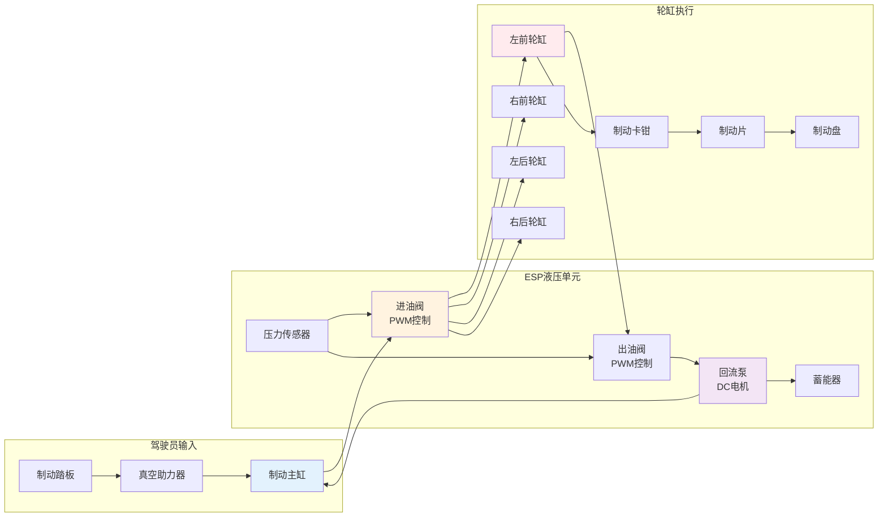
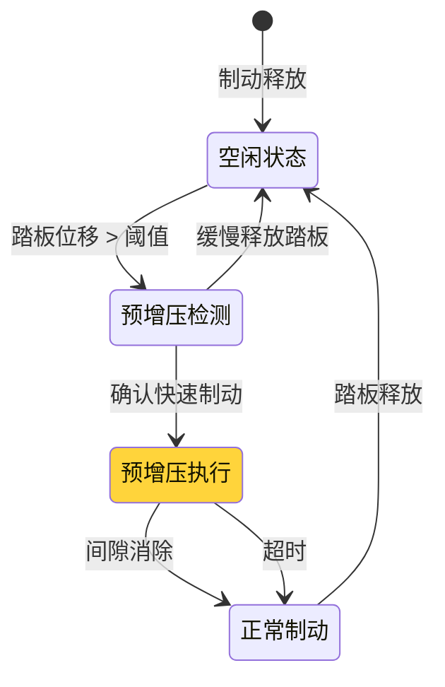

# 液压系统物理模型与预增压控制

> **文档编号**: HYDRAULIC-MODEL-001  
> **物理模型**: 制动液压系统动态模型  
003e **控制增强**: 预增压阶段设计

---

## 1. 制动液压系统架构

### 1.1 液压系统组成



### 1.2 液压参数定义

| 参数 | 符号 | 单位 | 典型值 | 说明 |
|------|------|------|--------|------|
| 主缸截面积 | A_m | mm² | 200 | 主缸活塞面积 |
| 轮缸截面积 | A_w | mm² | 4000 | 单轮缸面积 |
| 管路容积 | V_line | ml | 15 | 单轮管路容积 |
| 制动液弹性模量 | E_fluid | MPa | 1700 | 液体压缩性 |
| 橡胶管弹性 | E_hose | MPa | 500 | 软管膨胀 |
| 阀流量系数 | C_d | - | 0.7 | 阀口流量系数 |
| 阀口最大开度 | A_max | mm² | 8 | 全开截面积 |
| 蓄能器容积 | V_acc | ml | 20 | 蓄能器总容积 |
| 泵流量 | Q_pump | ml/s | 80 | 最大回流能力 |

---

## 2. 液压系统物理模型

### 2.1 主缸-轮缸传递函数

```c
//=============================================================================
// 液压系统动态模型
//=============================================================================

// 液压容腔柔度 (Compliance)
// C_h = dV/dP = V / E_eff
// E_eff = 液体弹性模量 + 管路柔度 + 气泡影响

float CalculateHydraulicCompliance(float volume, float modulus)
{
    // 考虑液体压缩性和管路膨胀
    float E_eff = 1.0 / (1.0/modulus + COMPLIANCE_HOSE);
    return volume / E_eff;
}

// 主缸压力动态
// dP_master/dt = (Q_in - Q_out) / C_master
void MasterCylinderDynamics(float pedal_force, float flow_out, 
                            float* pressure, float dt)
{
    // 助力器增益 (假设真空助力)
    float boosted_force = pedal_force * BOOSTER_RATIO;
    
    // 主缸活塞力平衡
    // F_piston = P_master * A_master - F_spring
    float piston_force = boosted_force - MASTER_SPRING_PRELOAD;
    
    // 流量计算
    float flow_in = (piston_force / MASTER_AREA) * PISTON_VELOCITY;
    
    // 压力变化率
    float C_master = CalculateHydraulicCompliance(MASTER_VOLUME, E_FLUID);
    float dp_dt = (flow_in - flow_out) / C_master;
    
    *pressure += dp_dt * dt;
    
    // 限幅 (防止负压)
    if (*pressure < 0) *pressure = 0;
    if (*pressure > MAX_PRESSURE) *pressure = MAX_PRESSURE;
}

// 轮缸压力动态
// dP_wheel/dt = (Q_valve_in - Q_valve_out - Q_leak) / C_wheel
void WheelCylinderDynamics(float pressure_inlet, float pressure_outlet,
                           uint16 pwm_inlet, uint16 pwm_outlet,
                           float* pressure, float dt)
{
    // 进油阀流量 (PWM控制)
    float Q_in = CalculateValveFlow(pressure_inlet, *pressure, 
                                     pwm_inlet, VALVE_INLET);
    
    // 出油阀流量
    float Q_out = CalculateValveFlow(*pressure, pressure_outlet,
                                      pwm_outlet, VALVE_OUTLET);
    
    // 泄漏流量
    float Q_leak = LEAK_COEFFICIENT * (*pressure);
    
    // 轮缸容腔柔度 (含软管膨胀)
    float C_wheel = CalculateHydraulicCompliance(WHEEL_VOLUME, E_HOSE);
    
    // 压力变化率
    float dp_dt = (Q_in - Q_out - Q_leak) / C_wheel;
    
    *pressure += dp_dt * dt;
}

// 阀体流量计算 (孔口方程)
// Q = C_d * A * sqrt(2 * ΔP / ρ)
float CalculateValveFlow(float P_up, float P_down, 
                         uint16 pwm, ValveType type)
{
    float delta_P = P_up - P_down;
    
    // 单向阀特性
    if (delta_P < 0 && type == VALVE_INLET) {
        return 0;  // 进油阀单向
    }
    
    // PWM占空比映射到开度
    float opening = (float)pwm / 1000.0;  // 0-1
    
    // 非线性特性 (小开度时流量增益低)
    float effective_area = VALVE_MAX_AREA * pow(opening, VALVE_NONLINEARITY);
    
    // 流量计算
    float rho = BRAKE_FLUID_DENSITY;
    float Q = VALVE_CD * effective_area * sqrt(2.0 * fabs(delta_P) / rho);
    
    // 方向
    return (delta_P > 0) ? Q : -Q;
}
```

### 2.2 管路延迟补偿

```c
//=============================================================================
// 管路传输延迟模型
//=============================================================================

// 压力波传播速度
// c = sqrt(E_eff / ρ)
float CalculateWaveSpeed(float modulus, float density)
{
    return sqrt(modulus * 1e6 / density);  // m/s
}

// 管路延迟时间
// τ = L / c
float CalculateLineDelay(float length, float wave_speed)
{
    return length / wave_speed;
}

// 延迟补偿器 (Smith Predictor改进)
typedef struct {
    float DelayTime;              // 估计延迟时间
    float Buffer[DELAY_BUFFER_SIZE];
    uint16 BufferIndex;
} DelayCompensatorType;

void InitDelayCompensator(DelayCompensatorType* comp, float delay)
{
    comp->DelayTime = delay;
    comp->BufferIndex = 0;
    memset(comp->Buffer, 0, sizeof(comp->Buffer));
}

// 获取延迟后的压力 (用于前馈控制)
float GetDelayedPressure(DelayCompensatorType* comp, float current_pressure)
{
    // 存入当前值
    comp->Buffer[comp->BufferIndex] = current_pressure;
    
    // 计算延迟后的索引
    uint16 delay_samples = (uint16)(comp->DelayTime / CONTROL_PERIOD);
    uint16 delayed_index = (comp->BufferIndex + DELAY_BUFFER_SIZE - delay_samples) 
                           % DELAY_BUFFER_SIZE;
    
    // 更新索引
    comp->BufferIndex = (comp->BufferIndex + 1) % DELAY_BUFFER_SIZE;
    
    return comp->Buffer[delayed_index];
}
```

---

## 3. 预增压阶段设计

### 3.1 预增压需求分析

**问题**: 制动片与制动盘之间存在间隙 (典型值 0.3-0.5mm)

**影响**: 
- 初次制动时响应延迟 ~80-120ms
- 踏板感觉"空行程"
- ABS介入时压力建立慢

**解决方案**: 预增压 (Pre-charge) 阶段快速消除间隙



### 3.2 预增压控制算法

```c
//=============================================================================
// 预增压控制 (Pre-charge Control)
//=============================================================================

#define PRECHARGE_THRESHOLD_DISP    2.0     // 预增压触发阈值: 2%踏板位移
#define PRECHARGE_THRESHOLD_VEL     30.0    // 预增压触发阈值: 30%/s踏速
#define PRECHARGE_TARGET_PRESSURE   5.0     // 预增压目标: 5bar
#define PRECHARGE_MAX_TIME          100     // 最大预增压时间: 100ms
#define PRECHARGE_RAMP_RATE         100.0   // 压力爬升率: 100bar/s

typedef enum {
    PRECHARGE_IDLE = 0,
    PRECHARGE_DETECTED,
    PRECHARGE_ACTIVE,
    PRECHARGE_COMPLETE
} PrechargePhaseType;

typedef struct {
    PrechargePhaseType Phase;
    uint32 StartTime;
    float TargetPressure;
    float CurrentPressure;
    uint16 ValvePWM;
} PrechargeControllerType;

static PrechargeControllerType PrechargeCtrl = {0};

// 预增压主函数
void PrechargeController_Main(float pedal_disp, float pedal_vel, 
                               float wheel_pressures[4])
{
    switch (PrechargeCtrl.Phase) {
        
        case PRECHARGE_IDLE:
            // 检测预增压条件
            if (pedal_disp > PRECHARGE_THRESHOLD_DISP ||
                pedal_vel > PRECHARGE_THRESHOLD_VEL) {
                
                // 快速制动意图检测
                PrechargeCtrl.Phase = PRECHARGE_DETECTED;
                PrechargeCtrl.StartTime = GetSystemTime();
                
                // 预测目标压力 (基于踏板速度)
                float predicted_pressure = PredictBrakePressure(pedal_vel);
                PrechargeCtrl.TargetPressure = fmin(predicted_pressure * 0.3, 
                                                     PRECHARGE_TARGET_PRESSURE);
            }
            break;
            
        case PRECHARGE_DETECTED:
            // 确认预增压
            if (GetSystemTime() - PrechargeCtrl.StartTime < 10) {
                // 10ms内确认
                if (pedal_vel > PRECHARGE_THRESHOLD_VEL * 0.5) {
                    // 确认快速制动，进入预增压
                    PrechargeCtrl.Phase = PRECHARGE_ACTIVE;
                    PrechargeCtrl.StartTime = GetSystemTime();
                } else {
                    // 取消预增压
                    PrechargeCtrl.Phase = PRECHARGE_IDLE;
                }
            }
            break;
            
        case PRECHARGE_ACTIVE:
            // 执行预增压
            {
                uint32 elapsed = GetSystemTime() - PrechargeCtrl.StartTime;
                
                // 计算目标压力 (斜坡)
                float ramp_pressure = (elapsed / 1000.0) * PRECHARGE_RAMP_RATE;
                float target = fmin(ramp_pressure, PrechargeCtrl.TargetPressure);
                
                // 检查完成条件
                float min_wheel_pressure = MinOfArray(wheel_pressures, 4);
                
                if (min_wheel_pressure >= target ||
                    elapsed >= PRECHARGE_MAX_TIME) {
                    // 预增压完成
                    PrechargeCtrl.Phase = PRECHARGE_COMPLETE;
                } else {
                    // 继续预增压
                    PrechargeCtrl.ValvePWM = CalculatePrechargePWM(
                        target, wheel_pressures
                    );
                }
            }
            break;
            
        case PRECHARGE_COMPLETE:
            // 保持预压力，等待正常制动接管
            if (pedal_disp < PRECHARGE_THRESHOLD_DISP * 0.5) {
                // 踏板释放，回到空闲
                PrechargeCtrl.Phase = PRECHARGE_IDLE;
            }
            break;
    }
}

// 计算预增压阀PWM
uint16 CalculatePrechargePWM(float target_pressure, float wheel_pressures[4])
{
    // 使用PID快速建压
    static float integral = 0;
    float avg_pressure = AverageOfArray(wheel_pressures, 4);
    float error = target_pressure - avg_pressure;
    
    // P项
    float P = PRECHARGE_KP * error;
    
    // I项 (限制积分)
    integral += error * 0.002;  // 2ms周期
    if (integral > PRECHARGE_I_MAX) integral = PRECHARGE_I_MAX;
    if (integral < 0) integral = 0;
    float I = PRECHARGE_KI * integral;
    
    // D项 (抑制超调)
    static float last_error = 0;
    float D = PRECHARGE_KD * (error - last_error) / 0.002;
    last_error = error;
    
    float pwm = P + I + D;
    
    // 限幅
    if (pwm > 800) pwm = 800;    // 预增压阶段不全开
    if (pwm < 0) pwm = 0;
    
    return (uint16)pwm;
}

// 预测制动压力 (基于驾驶员意图)
float PredictBrakePressure(float pedal_velocity)
{
    // 踏速越快，预测的压力需求越大
    float predicted = PEDAL_VEL_GAIN * pedal_velocity;
    
    // 限幅
    if (predicted > MAX_BRAKE_PRESSURE) predicted = MAX_BRAKE_PRESSURE;
    
    return predicted;
}
```

### 3.3 预增压与ABS协调

```c
//=============================================================================
// 预增压与ABS协调
//=============================================================================

void CoordinatePrechargeWithABS(float pedal_disp, float pedal_vel,
                                 float slip_ratios[4],
                                 ABS_StateType abs_states[4])
{
    // 如果ABS已激活，停止预增压
    for (int i = 0; i < 4; i++) {
        if (abs_states[i] != ABS_INACTIVE) {
            PrechargeCtrl.Phase = PRECHARGE_COMPLETE;
            return;
        }
    }
    
    // 如果检测到滑移，提前结束预增压
    for (int i = 0; i < 4; i++) {
        if (slip_ratios[i] > PRECHARGE_SLIP_THRESHOLD) {
            // 提前进入ABS
            PrechargeCtrl.Phase = PRECHARGE_COMPLETE;
            TriggerABS_Early(i);
            return;
        }
    }
    
    // 正常执行预增压
    PrechargeController_Main(pedal_disp, pedal_vel, GetWheelPressures());
}

// 提前触发ABS (从预增压阶段)
void TriggerABS_Early(uint8 wheel)
{
    // 设置ABS状态为预增压完成
    ABS_Phase[wheel] = ABS_PHASE_INCREASE;
    
    // 使用预压力作为ABS起始压力
    ABS_StartPressure[wheel] = WheelPressure[wheel];
    
    // 记录事件
    Dem_SetEventStatus(DTC_ABS_EARLY_TRIGGER, DEM_EVENT_STATUS_PASSED);
}
```

---

## 4. 泵电机控制增强

### 4.1 蓄能器压力管理

```c
//=============================================================================
// 蓄能器压力动态模型
//=============================================================================

// 蓄能器压力-容积关系 (气体定律)
// P * V^n = 常数 (n=1.4 绝热)
float CalculateAccumulatorPressure(float current_pressure, 
                                    float volume_change)
{
    const float n = 1.4;  // 绝热指数
    
    float V_current = ACCUMULATOR_VOLUME * pow(ACCUM_PRECHARGE / current_pressure, 1.0/n);
    float V_new = V_current - volume_change;
    
    float P_new = ACCUM_PRECHARGE * pow(ACCUMULATOR_VOLUME / V_new, n);
    
    return P_new;
}

// 泵电机控制 (考虑蓄能器状态)
void PumpMotorController(float wheel_pressures[4], 
                         float accumulator_pressure)
{
    // 计算需求流量
    float required_flow = 0;
    for (int i = 0; i < 4; i++) {
        if (ABS_Active[i] && ABS_Phase[i] == ABS_PHASE_DECREASE) {
            required_flow += ABS_DECEL_FLOW_RATE;
        }
    }
    
    // 泵速决策
    if (required_flow > 0) {
        // 需要回流
        if (accumulator_pressure < MIN_ACCUM_PRESSURE) {
            // 蓄能器压力低，全速泵
            PumpMotor_Speed = 100;
        } else if (accumulator_pressure < MAX_ACCUM_PRESSURE) {
            // 维持压力
            PumpMotor_Speed = 50;
        } else {
            // 压力足够，停止泵
            PumpMotor_Speed = 0;
        }
    } else {
        // 无回流需求
        PumpMotor_Speed = 0;
    }
    
    // 设置PWM
    Pwm_SetDutyCycle(PWM_CH_PUMP_MOTOR, PumpMotor_Speed * 10);
}
```

---

## 5. 温度补偿

### 5.1 制动液温度影响

```c
//=============================================================================
// 温度补偿模块
//=============================================================================

// 制动液粘度-温度关系
float BrakeFluidViscosity(float temperature)
{
    // 典型制动液 DOT4
    // 温度越高，粘度越低
    if (temperature < -40) temperature = -40;
    if (temperature > 150) temperature = 150;
    
    // 经验公式
    float viscosity = 1000 * exp(-0.02 * (temperature - 20));
    return viscosity;
}

// 温度补偿的阀流量
float CalculateTemperatureCompensatedFlow(float P_up, float P_down,
                                           uint16 pwm, float temperature)
{
    // 基础流量
    float base_flow = CalculateValveFlow(P_up, P_down, pwm, VALVE_INLET);
    
    // 粘度修正
    float viscosity_ratio = BrakeFluidViscosity(temperature) / 
                            BrakeFluidViscosity(20.0);  // 参考20°C
    
    // 粘度越高，流量越低
    float compensated_flow = base_flow / sqrt(viscosity_ratio);
    
    return compensated_flow;
}

// 全局温度补偿
void HydraulicTemperatureCompensation(float temperature)
{
    // 调整阀控制参数
    if (temperature < 0) {
        // 低温: 增加PWM增益补偿粘度增加
        ValvePWM_Gain = 1.0 + 0.01 * (0 - temperature);
    } else if (temperature > 80) {
        // 高温: 降低PWM增益防止超调
        ValvePWM_Gain = 1.0 - 0.005 * (temperature - 80);
    } else {
        ValvePWM_Gain = 1.0;
    }
    
    // 调整压力传感器读数
    for (int i = 0; i < 4; i++) {
        WheelPressure[i] = CompensatePressureSensor(
            RawWheelPressure[i], temperature
        );
    }
}
```

---

*液压系统物理模型与预增压控制*  
*制动系统控制精度提升关键设计*