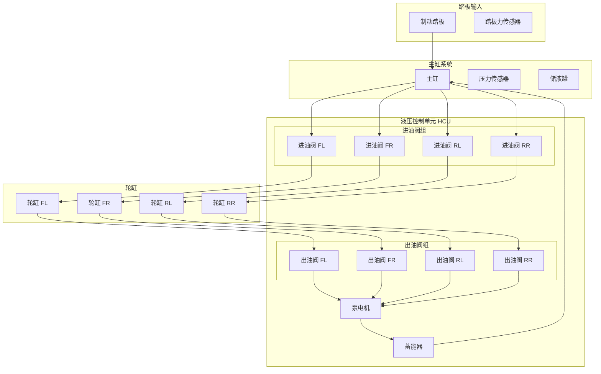

# 制动液压系统物理模型

> **文档编号**: HYDRAULIC-MODEL-001  
> **物理域**: 液压制动系统  
> **建模方法**: 集中参数模型 + 管路动态  
> **仿真工具**: MATLAB/Simulink + Amesim

---

## 1. 液压系统架构

### 1.1 系统组成



### 1.2 关键参数

| 参数 | 符号 | 数值 | 单位 |
|------|------|------|------|
| 主缸直径 | D_master | 23.8 | mm |
| 轮缸直径 | D_wheel | 48.0 | mm |
| 管路长度 | L_pipe | 1.5-2.5 | m |
| 管路直径 | D_pipe | 3.0 | mm |
| 制动液体积模量 | K_fluid | 1.7 | GPa |
| 制动液密度 | ρ_fluid | 1050 | kg/m³ |
| 制动液粘度 | μ | 2.5e-3 | Pa·s |
| 阀流量系数 | C_d | 0.65 | - |
| 蓄能器容积 | V_acc | 15 | cm³ |

---

## 2. 主缸模型

### 2.1 主缸压力动态

```c
//=============================================================================
// 主缸压力计算模型
//=============================================================================

typedef struct {
    float PedalForce;              // 踏板力 (N)
    float PedalDisplacement;       // 踏板位移 (mm)
    float MasterPressure;          // 主缸压力 (bar)
    float MasterFlow;              // 主缸流量 (L/min)
    float ChamberVolume;           // 腔室容积 (cm³)
} MasterCylinderType;

// 踏板力与踏板位移关系 (考虑真空助力)
float CalculatePedalForce(float pedal_displacement)
{
    // 踏板弹簧特性
    // F_pedal = k_spring * x + F_friction + F_hysteresis
    
    const float k_spring = 25.0;       // 弹簧刚度 (N/mm)
    const float F_preload = 20.0;      // 预紧力 (N)
    const float F_friction = 5.0;      // 摩擦力 (N)
    
    float force = k_spring * pedal_displacement + F_preload;
    
    // 添加摩擦和迟滞
    if (pedal_displacement > LastPedalDisplacement) {
        // 踩下
        force += F_friction;
    } else {
        // 释放
        force -= F_friction;
    }
    
    return force;
}

// 真空助力模型
float CalculateBoostedForce(float pedal_force)
{
    // 真空助力比: 约 4:1 (空载), 2.5:1 (满载)
    // 助力特性曲线
    
    const float boost_ratio_max = 4.0;
    const float boost_ratio_min = 2.5;
    const float jump_in = 50.0;        // 跳跃点 (N)
    
    float boost_ratio;
    
    if (pedal_force < jump_in) {
        // 跳跃点以下
        boost_ratio = 1.0 + (boost_ratio_max - 1.0) * (pedal_force / jump_in);
    } else {
        // 跳跃点以上
        float vacuum_level = GetVacuumLevel();  // 真空度 0-1
        boost_ratio = boost_ratio_min + (boost_ratio_max - boost_ratio_min) * vacuum_level;
    }
    
    return pedal_force * boost_ratio;
}

// 主缸压力计算
float CalculateMasterPressure(float boosted_force, float chamber_volume)
{
    // P = F / A
    const float A_master = PI * (23.8e-3 / 2) * (23.8e-3 / 2);  // m²
    
    float pressure_pa = boosted_force / A_master;  // Pa
    float pressure_bar = pressure_pa / 1e5;        // bar
    
    // 考虑制动液压缩性
    // ΔP = -K * ΔV / V
    float volume_change = V_master_initial - chamber_volume;
    float compression_pressure = K_fluid * volume_change / V_master_initial / 1e5;
    
    return pressure_bar + compression_pressure;
}

// 主缸流量计算 (流向轮缸)
float CalculateMasterFlow(float pressure_master, float pressure_wheels[], 
                          float valve_openings[])
{
    float total_flow = 0.0;
    
    for (int i = 0; i < 4; i++) {
        if (valve_openings[i] > 0) {
            // 通过进油阀的流量
            float delta_p = pressure_master - pressure_wheels[i];  // bar
            float valve_area = ValveOpeningToArea(valve_openings[i]);
            
            // 伯努利方程: Q = C_d * A * sqrt(2 * ΔP / ρ)
            float flow = C_d * valve_area * sqrt(2 * delta_p * 1e5 / rho_fluid);
            total_flow += flow;
        }
    }
    
    return total_flow * 60000;  // 转换为 L/min
}
```

---

## 3. 阀体模型

### 3.1 电磁阀流量特性

```c
//=============================================================================
// 电磁阀流量模型
//=============================================================================

// 阀口面积与PWM占空比关系
float ValveOpeningToArea(uint16 pwm_duty)
{
    // PWM 0-1000 对应 0-100%
    // 阀口面积: 圆形或异形阀口
    
    const float A_max = 2.0e-6;       // 最大阀口面积 m²
    const float dead_zone = 50;       // 死区
    
    if (pwm_duty < dead_zone) {
        return 0.0;  // 死区关闭
    }
    
    // 非线性特性 (需通过标定获得)
    float opening = (pwm_duty - dead_zone) / (1000.0 - dead_zone);
    float area = A_max * opening * opening;  // 二次特性
    
    return area;
}

// 通过阀的流量计算
float CalculateValveFlow(float pressure_in, float pressure_out, 
                         float valve_area, boolean is_inlet)
{
    float delta_p = pressure_in - pressure_out;  // bar
    
    if (delta_p <= 0) {
        return 0.0;  // 无流动或反向流动
    }
    
    // 层流/湍流判断
    float Re = CalculateReynoldsNumber(valve_area, delta_p);
    float C_d_effective;
    
    if (Re < 2300) {
        // 层流
        C_d_effective = C_d * 0.8;
    } else {
        // 湍流
        C_d_effective = C_d;
    }
    
    // 流量计算
    float flow = C_d_effective * valve_area * sqrt(2 * delta_p * 1e5 / rho_fluid);
    
    return flow;  // m³/s
}

// 阀响应延迟模型
float CalculateValveResponse(uint16 pwm_command, float current_position)
{
    // 一阶惯性环节 + 死区时间
    // τ * d(pos)/dt + pos = cmd
    
    const float tau = 5e-3;           // 时间常数 5ms
    const float dead_time = 2e-3;     // 死区时间 2ms
    
    float cmd_position = pwm_command / 1000.0;  // 归一化
    
    // 离散化: pos(k+1) = pos(k) + dt/tau * (cmd - pos(k))
    float dt = 0.001;  // 1ms步进
    float new_position = current_position + (dt / tau) * (cmd_position - current_position);
    
    return new_position;
}
```

### 3.2 阀体温度效应

```c
//=============================================================================
// 阀体温度补偿模型
//=============================================================================

// 线圈电阻随温度变化
float CalculateCoilResistance(float base_resistance, float temperature)
{
    // 铜线圈: R(T) = R0 * (1 + α * (T - T0))
    // α = 0.00393 /°C for copper
    
    const float alpha = 0.00393;
    const float T0 = 25.0;  // 参考温度
    
    return base_resistance * (1.0 + alpha * (temperature - T0));
}

// 阀响应随温度变化
float CalculateTemperatureEffect(float base_flow, float temperature)
{
    // 高温: 制动液粘度降低，流量增加
    // 低温: 制动液粘度增加，流量降低
    
    // 制动液粘度-温度特性 (近似)
    // μ(T) = μ0 * exp(-β * (T - T0))
    const float beta = 0.03;
    const float T0 = 25.0;
    
    float viscosity_ratio = exp(-beta * (temperature - T0));
    
    // 流量与粘度关系: Q ∝ 1/sqrt(μ)
    float flow_multiplier = 1.0 / sqrt(viscosity_ratio);
    
    return base_flow * flow_multiplier;
}
```

---

## 4. 轮缸模型

### 4.1 轮缸压力动态

```c
//=============================================================================
// 轮缸压力动态模型
//=============================================================================

typedef struct {
    float Pressure;                // 轮缸压力 (bar)
    float Volume;                  // 容积 (cm³)
    float Flow_In;                 // 流入流量 (L/min)
    float Flow_Out;                // 流出流量 (L/min)
    float Temperature;             // 温度 (°C)
} WheelCylinderType;

// 轮缸压力动态方程
// dP/dt = (K/V) * (Q_in - Q_out - Q_brake_shoe)
float CalculateWheelPressureDerivative(WheelCylinderType* wc)
{
    // 有效体积模量 (考虑管路弹性)
    float K_effective = CalculateEffectiveBulkModulus(wc->Pressure);
    
    // 容积变化 (制动蹄片膨胀)
    float dV_shoe = CalculateBrakeShoeExpansion(wc->Pressure, wc->Temperature);
    
    // 净流量 (转换为 m³/s)
    float Q_net = (wc->Flow_In - wc->Flow_Out) / 60000.0 - dV_shoe / 1e6;
    
    // 压力变化率
    float dP_dt = (K_effective / (wc->Volume / 1e6)) * Q_net / 1e5;  // bar/s
    
    return dP_dt;
}

// 有效体积模量 (考虑气蚀和弹性)
float CalculateEffectiveBulkModulus(float pressure)
{
    const float K_pure = 1.7e9;       // 纯制动液体积模量 (Pa)
    const float pressure_ref = 10.0;   // 参考压力 (bar)
    
    // 低压时气蚀效应
    if (pressure < 5.0) {
        // 气蚀导致有效模量降低
        float cavitation_factor = pressure / 5.0;
        return K_pure * cavitation_factor * cavitation_factor;
    }
    
    return K_pure;
}

// 制动蹄片膨胀 (压力导致的弹性变形)
float CalculateBrakeShoeExpansion(float pressure, float temperature)
{
    // 简化模型: 线性弹性 + 温度影响
    const float stiffness = 5000.0;    // 刚度 (N/mm)
    const float area = 50.0;           // 接触面积 (cm²)
    
    float force = pressure * 1e5 * area / 1e4;  // N
    float displacement = force / stiffness;      // mm
    
    // 温度影响: 高温膨胀
    const float thermal_exp = 1e-5;    // 热膨胀系数
    float thermal_displacement = thermal_exp * (temperature - 25.0) * 10.0;
    
    return (displacement + thermal_displacement) * 1e-6;  // 转换为 m³
}
```

### 4.2 制动扭矩计算

```c
//=============================================================================
// 制动扭矩模型
//=============================================================================

// 压力到制动力矩转换
float CalculateBrakeTorque(float wheel_pressure, float wheel_speed)
{
    // T_brake = μ_brake * F_normal * r_effective
    
    // 法向力 (由液压产生)
    const float A_caliper = 15.0e-4;   // 卡钳活塞面积 (m²)
    float F_normal = wheel_pressure * 1e5 * A_caliper * 2;  // 双活塞
    
    // 摩擦系数 (速度相关)
    float mu_brake = CalculateFrictionCoefficient(wheel_speed);
    
    // 有效半径
    const float r_effective = 0.15;    // m
    
    float torque = mu_brake * F_normal * r_effective;
    
    return torque;  // Nm
}

// 摩擦系数-速度特性
float CalculateFrictionCoefficient(float wheel_speed)
{
    // 制动片摩擦系数随速度降低 (fade效应)
    const float mu_static = 0.38;
    const float fade_factor = 0.0001;
    
    float speed_kmh = wheel_speed * 3.6;
    float mu = mu_static * (1.0 - fade_factor * speed_kmh);
    
    // 限制范围
    if (mu < 0.25) mu = 0.25;
    
    return mu;
}
```

---

## 5. 管路动态模型

### 5.1 管路延迟与波动

```c
//=============================================================================
// 管路动态模型
//=============================================================================

// 压力波传播延迟
float CalculatePipeDelay(float pipe_length)
{
    // 压力波速: c = sqrt(K/ρ)
    // K: 有效体积模量
    // ρ: 制动液密度
    
    float c_wave = sqrt(K_effective / rho_fluid);
    float delay = pipe_length / c_wave;
    
    return delay;  // s
}

// 管路压力损失 (沿程损失)
float CalculatePipePressureLoss(float flow_rate, float pipe_length, 
                                 float pipe_diameter)
{
    // Darcy-Weisbach方程: ΔP = f * (L/D) * (ρ*v²)/2
    
    float velocity = flow_rate / (PI * pipe_diameter * pipe_diameter / 4);
    float Re = rho_fluid * velocity * pipe_diameter / mu_fluid;
    
    // 摩擦系数 (Blasius公式 for turbulent)
    float f = 0.316 / pow(Re, 0.25);
    
    float pressure_loss = f * (pipe_length / pipe_diameter) * 
                          (rho_fluid * velocity * velocity / 2) / 1e5;  // bar
    
    return pressure_loss;
}

// 管路容腔效应
float CalculatePipeCompliance(float pipe_length, float pipe_diameter)
{
    // 管路弹性变形导致的等效容积
    const float E_pipe = 2.1e11;     // 钢管弹性模量 (Pa)
    const float wall_thickness = 1e-3;  // 壁厚 (m)
    
    float volume = PI * pipe_diameter * pipe_diameter * pipe_length / 4;
    
    // 径向变形: ΔV/V = ΔP * D / (2 * E * t)
    float compliance = volume * pipe_diameter / (2 * E_pipe * wall_thickness);
    
    return compliance;  // m³/Pa
}
```

---

## 6. 泵与蓄能器模型

### 6.1 泵电机模型

```c
//=============================================================================
// 泵电机模型
//=============================================================================

typedef struct {
    float MotorSpeed;              // 电机转速 (rpm)
    float MotorCurrent;            // 电流 (A)
    float PumpFlow;                // 泵流量 (L/min)
    float PumpPressure;            // 泵出口压力 (bar)
    float Efficiency;              // 效率
} PumpMotorType;

// 泵流量-转速特性
float CalculatePumpFlow(float motor_speed, float pressure_out)
{
    // 容积式泵: Q = V_disp * n * η_vol
    const float V_displacement = 0.2;   // 排量 (cm³/rev)
    const float eta_vol_max = 0.9;      // 最大容积效率
    
    // 容积效率随压力降低
    float pressure_factor = 1.0 - (pressure_out / 200.0) * 0.1;
    if (pressure_factor < 0.7) pressure_factor = 0.7;
    
    float eta_vol = eta_vol_max * pressure_factor;
    
    float flow = V_displacement * motor_speed * eta_vol / 1000.0;  // L/min
    
    return flow;
}

// 泵电机电流计算
float CalculatePumpCurrent(float motor_speed, float pressure_out)
{
    // 电流 = 空载电流 + 负载电流
    const float I_no_load = 2.0;       // 空载电流 (A)
    const float mechanical_power = pressure_out * 1e5 * CalculatePumpFlow(motor_speed, pressure_out) / (60000.0 * 0.7);
    
    float I_load = mechanical_power / 12.0;  // 假设12V供电
    
    return I_no_load + I_load;
}
```

### 6.2 蓄能器模型

```c
//=============================================================================
// 蓄能器模型
//=============================================================================

// 蓄能器压力-容积关系 (理想气体)
float CalculateAccumulatorPressure(float fluid_volume, float precharge_pressure)
{
    // P * V^n = 常数 (n = 1.4 for adiabatic)
    const float n = 1.4;
    const float V_total = 15e-6;       // 总容积 15cm³
    
    float gas_volume = V_total - fluid_volume;
    
    // 假设预充气压力 5bar
    float P_gas = precharge_pressure * pow(V_total / gas_volume, n);
    
    return P_gas;  // bar
}

// 蓄能器充放电动态
float CalculateAccumulatorDynamics(float flow_in, float flow_out, 
                                    float current_pressure)
{
    // dV/dt = Q_in - Q_out
    // dP/dt = (dP/dV) * (dV/dt)
    
    float net_flow = (flow_in - flow_out) / 60000.0;  // m³/s
    
    // 压力-容积梯度 (局部线性化)
    float dP_dV = -1.4 * current_pressure / (15e-6 * (1 - pow(5.0/current_pressure, 1/1.4)));
    
    float dP_dt = dP_dV * net_flow / 1e5;  // bar/s
    
    return dP_dt;
}
```

---

## 7. 完整液压系统仿真

### 7.1 Simulink模型结构

```c
//=============================================================================
// 完整系统状态空间模型
//=============================================================================

// 状态变量
float X[STATE_COUNT] = {
    P_master,          // 主缸压力
    P_FL, P_FR,        // 前轮压力
    P_RL, P_RR,        // 后轮压力
    V_acc,             // 蓄能器容积
    omega_pump         // 泵转速
};

// 输入变量
float U[INPUT_COUNT] = {
    F_pedal,           // 踏板力
    PWM_IV[4],         // 进油阀PWM
    PWM_OV[4],         // 出油阀PWM
    PWM_pump           // 泵电机PWM
};

// 输出变量
float Y[OUTPUT_COUNT] = {
    T_brake[4],        // 四轮制动力矩
    P_wheel[4],        // 四轮压力
    Q_master,          // 主缸流量
    I_pump             // 泵电流
};

// 状态方程: dX/dt = f(X, U)
void HydraulicSystemDynamics(float* X, float* U, float* dX)
{
    // 主缸动态
    dX[0] = CalculateMasterPressureDerivative(X, U);
    
    // 轮缸动态
    for (int i = 0; i < 4; i++) {
        dX[1+i] = CalculateWheelPressureDerivative(X, U, i);
    }
    
    // 蓄能器动态
    dX[5] = CalculateAccumulatorDynamics(X, U);
    
    // 泵电机动态
    dX[6] = CalculatePumpMotorDynamics(X, U);
}
```

---

*制动液压系统物理模型*  
*为控制算法提供精确的物理基础*