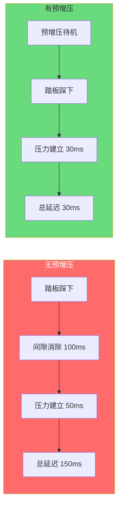
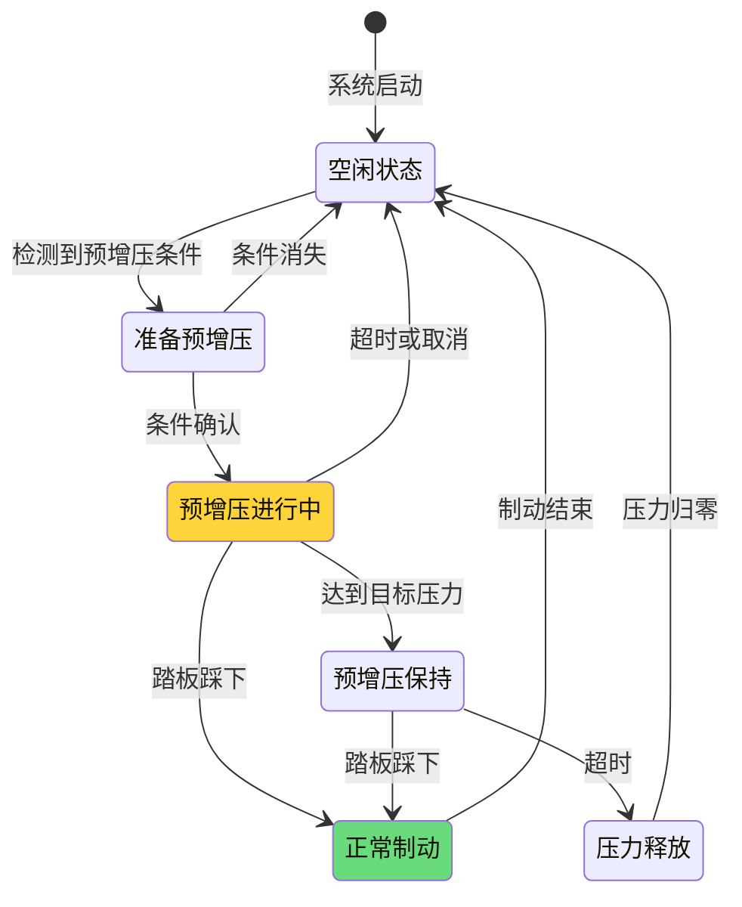

# 预增压控制设计 - Pre-charge Control

> **文档编号**: PRECHARGE-001  
003e **控制目标**: 消除制动间隙，缩短响应时间  
003e **目标延迟**: 从踏板踩下到压力建立 < 50ms  
003e **预增压压力**: 5-10 bar

---

## 1. 预增压控制概述

### 1.1 为什么需要预增压



### 1.2 预增压触发条件

| 触发源 | 触发条件 | 优先级 | 预增压压力 |
|--------|----------|--------|------------|
| **AEB预警** | TTC < 2.0s | P0 | 10 bar |
| **ACC减速** | 前车减速 | P1 | 5 bar |
| **踏板快速移动** | dPedal/dt > 50%/s | P2 | 5 bar |
| **驾驶风格** | 激进驾驶模式 | P3 | 3 bar |

---

## 2. 预增压控制策略

### 2.1 预增压状态机



### 2.2 预增压控制主程序

```c
//=============================================================================
// 预增压控制主程序
//=============================================================================

typedef enum {
    PRECHARGE_IDLE = 0,
    PRECHARGE_PREPARE,
    PRECHARGE_ACTIVE,
    PRECHARGE_HOLD,
    BRAKING_ACTIVE,
    PRESSURE_RELEASE
} PrechargeStateType;

typedef struct {
    PrechargeStateType State;
    float TargetPressure;          // 目标预增压压力
    float CurrentPressure;         // 当前压力
    uint32 Timer;                  // 状态计时器
    PrechargeTriggerType Trigger;  // 触发源
    uint8 Priority;                // 当前优先级
} PrechargeControlType;

static PrechargeControlType PrechargeCtrl;

void PrechargeControl_Main(void)
{
    // 检查预增压触发条件
    PrechargeTriggerType new_trigger = CheckPrechargeTriggers();
    
    switch (PrechargeCtrl.State) {
        
        case PRECHARGE_IDLE:
            // 检查是否有预增压请求
            if (new_trigger != TRIGGER_NONE) {
                PrechargeCtrl.Trigger = new_trigger;
                PrechargeCtrl.Priority = GetTriggerPriority(new_trigger);
                PrechargeCtrl.TargetPressure = GetTargetPressure(new_trigger);
                PrechargeCtrl.State = PRECHARGE_PREPARE;
                PrechargeCtrl.Timer = 0;
            }
            break;
            
        case PRECHARGE_PREPARE:
            // 确认触发条件持续
            PrechargeCtrl.Timer += 2;  // 2ms周期
            
            if (new_trigger == TRIGGER_NONE) {
                // 条件消失，返回空闲
                PrechargeCtrl.State = PRECHARGE_IDLE;
            } else if (PrechargeCtrl.Timer >= 20) {  // 40ms确认
                // 条件确认，开始预增压
                PrechargeCtrl.State = PRECHARGE_ACTIVE;
                PrechargeCtrl.Timer = 0;
            }
            break;
            
        case PRECHARGE_ACTIVE:
            // 执行预增压
            PrechargeCtrl.Timer += 2;
            PrechargeCtrl.CurrentPressure = GetMasterCylinderPressure();
            
            // 检查是否达到目标压力
            if (PrechargeCtrl.CurrentPressure >= PrechargeCtrl.TargetPressure) {
                PrechargeCtrl.State = PRECHARGE_HOLD;
                PrechargeCtrl.Timer = 0;
            }
            // 检查驾驶员是否开始制动
            else if (PedalPosition > 5.0) {
                PrechargeCtrl.State = BRAKING_ACTIVE;
                // 预增压成功，直接进入制动
            }
            // 检查超时 (500ms)
            else if (PrechargeCtrl.Timer >= 250) {
                PrechargeCtrl.State = PRESSURE_RELEASE;
            }
            // 执行预增压
            else {
                ExecutePrecharge(PrechargeCtrl.TargetPressure);
            }
            
            // 检查触发条件是否消失
            if (new_trigger == TRIGGER_NONE && PrechargeCtrl.Timer > 100) {
                PrechargeCtrl.State = PRESSURE_RELEASE;
            }
            break;
            
        case PRECHARGE_HOLD:
            // 保持预增压压力
            PrechargeCtrl.Timer += 2;
            
            // 维持目标压力
            HoldPrechargePressure(PrechargeCtrl.TargetPressure);
            
            // 检查驾驶员制动
            if (PedalPosition > 5.0) {
                PrechargeCtrl.State = BRAKING_ACTIVE;
            }
            // 保持超时 (2秒)
            else if (PrechargeCtrl.Timer >= 1000) {
                PrechargeCtrl.State = PRESSURE_RELEASE;
            }
            break;
            
        case BRAKING_ACTIVE:
            // 正常制动阶段，预增压已完成
            // 转移到主制动控制
            if (PedalPosition < 2.0 && MasterCylPressure < 3.0) {
                PrechargeCtrl.State = PRECHARGE_IDLE;
            }
            break;
            
        case PRESSURE_RELEASE:
            // 释放预增压压力
            ReleasePrechargePressure();
            
            if (MasterCylPressure < 1.0) {
                PrechargeCtrl.State = PRECHARGE_IDLE;
            }
            break;
    }
}
```

---

## 3. 触发条件检测

### 3.1 AEB预增压触发

```c
//=============================================================================
// AEB预增压触发检测
//=============================================================================

PrechargeTriggerType CheckAEBPrechargeTrigger(void)
{
    // 读取AEB信息
    AEB_InfoType aeb_info = Rte_Read_RPort_AEB_Info();
    
    if (!aeb_info.AEB_Active) {
        return TRIGGER_NONE;
    }
    
    // TTC (Time To Collision) 计算
    float ttc = aeb_info.TTC;
    
    if (ttc < 1.0) {
        // 紧急，立即预增压到最高
        return TRIGGER_AEB_CRITICAL;
    } else if (ttc < 2.0) {
        // 警告，预增压
        return TRIGGER_AEB_WARNING;
    }
    
    return TRIGGER_NONE;
}

// 目标压力映射
float GetTargetPressure(PrechargeTriggerType trigger)
{
    switch (trigger) {
        case TRIGGER_AEB_CRITICAL:
            return 15.0;  // 15 bar - 紧急预增压
        case TRIGGER_AEB_WARNING:
            return 10.0;  // 10 bar
        case TRIGGER_ACC_DECEL:
            return 5.0;
        case TRIGGER_PEDAL_FAST:
            return 5.0;
        case TRIGGER_DRIVING_STYLE:
            return 3.0;
        default:
            return 0.0;
    }
}
```

### 3.2 踏板快速移动检测

```c
//=============================================================================
// 踏板快速移动检测 (预测性预增压)
//=============================================================================

#define PEDAL_HISTORY_SIZE 10

float PedalPositionHistory[PEDAL_HISTORY_SIZE];
uint8 PedalHistoryIndex = 0;

void UpdatePedalHistory(float pedal_position)
{
    PedalPositionHistory[PedalHistoryIndex] = pedal_position;
    PedalHistoryIndex = (PedalHistoryIndex + 1) % PEDAL_HISTORY_SIZE;
}

// 计算踏板移动速度
float CalculatePedalVelocity(void)
{
    // 使用最近5个点的平均斜率
    float sum_diff = 0.0;
    uint8 count = 0;
    
    for (int i = 0; i < 4; i++) {
        uint8 idx1 = (PedalHistoryIndex - 1 - i + PEDAL_HISTORY_SIZE) % PEDAL_HISTORY_SIZE;
        uint8 idx2 = (PedalHistoryIndex - 2 - i + PEDAL_HISTORY_SIZE) % PEDAL_HISTORY_SIZE;
        
        sum_diff += PedalPositionHistory[idx1] - PedalPositionHistory[idx2];
        count++;
    }
    
    // 速度: %/ms
    float velocity = sum_diff / count / 2.0;  // 2ms周期
    
    return velocity * 500.0;  // 转换为 %/s
}

// 踏板预增压触发检测
PrechargeTriggerType CheckPedalPrechargeTrigger(void)
{
    float pedal_velocity = CalculatePedalVelocity();
    
    // 踏板快速踩下
    if (pedal_velocity > 50.0) {  // > 50%/s
        return TRIGGER_PEDAL_FAST;
    }
    
    return TRIGGER_NONE;
}
```

---

## 4. 预增压执行

### 4.1 预增压压力控制

```c
//=============================================================================
// 预增压执行控制
//=============================================================================

void ExecutePrecharge(float target_pressure)
{
    // 预增压控制: 快速建立压力
    
    float current_pressure = GetMasterCylinderPressure();
    float pressure_error = target_pressure - current_pressure;
    
    // 预增压使用开环+闭环控制
    
    // 开环部分 (快速响应)
    uint16 pwm_feedforward = CalculatePrechargeFeedforward(target_pressure);
    
    // 闭环部分 (精确控制)
    uint16 pwm_feedback = CalculatePrechargeFeedback(pressure_error);
    
    // 合成PWM
    uint16 total_pwm = pwm_feedforward + pwm_feedback;
    
    // 限制范围
    if (total_pwm > PRECHARGE_MAX_PWM) total_pwm = PRECHARGE_MAX_PWM;
    if (total_pwm < PRECHARGE_MIN_PWM) total_pwm = PRECHARGE_MIN_PWM;
    
    // 输出到进油阀
    for (int i = 0; i < 4; i++) {
        ValvePWM_Inlet[i] = total_pwm;
        ValvePWM_Outlet[i] = 0;  // 出油阀关闭
    }
    
    // 泵电机辅助 (如果需要)
    if (pressure_error > 3.0) {
        PumpMotorPWM = 50;  // 泵半速辅助
    }
}

// 预增压前馈控制
uint16 CalculatePrechargeFeedforward(float target_pressure)
{
    // 基于液压系统特性的前馈
    // PWM = K * P_target + Offset
    
    const float K_precharge = 30.0;   // 增益
    const uint16 offset = 100;         // 死区补偿
    
    uint16 pwm = (uint16)(K_precharge * target_pressure) + offset;
    
    return pwm;
}

// 预增压反馈控制 (P控制)
uint16 CalculatePrechargeFeedback(float pressure_error)
{
    const float Kp_precharge = 20.0;   // 比例增益
    
    int16 pwm_delta = (int16)(Kp_precharge * pressure_error);
    
    if (pwm_delta > 100) pwm_delta = 100;
    if (pwm_delta < -100) pwm_delta = -100;
    
    return (uint16)pwm_delta;
}
```

### 4.2 预增压压力保持

```c
//=============================================================================
// 预增压压力保持
//=============================================================================

void HoldPrechargePressure(float target_pressure)
{
    float current_pressure = GetMasterCylinderPressure();
    float pressure_error = target_pressure - current_pressure;
    
    // 保持阶段使用较小的PWM维持压力
    // 补偿泄漏
    
    const uint16 PWM_HOLD_BASE = 50;   // 基础保持PWM
    const float Kp_hold = 10.0;        // 保持阶段增益
    
    int16 pwm_adjust = (int16)(Kp_hold * pressure_error);
    
    uint16 pwm_total = PWM_HOLD_BASE + pwm_adjust;
    
    if (pwm_total > 200) pwm_total = 200;  // 限制保持PWM
    if (pwm_total < 0) pwm_total = 0;
    
    for (int i = 0; i < 4; i++) {
        ValvePWM_Inlet[i] = pwm_total;
    }
}

// 预增压压力释放
void ReleasePrechargePressure(void)
{
    // 缓慢释放压力，避免突然卸载
    
    static uint16 release_pwm = 200;
    
    // 渐进式关闭进油阀
    if (release_pwm > 0) {
        release_pwm -= 5;
    }
    
    for (int i = 0; i < 4; i++) {
        ValvePWM_Inlet[i] = release_pwm;
    }
    
    // 微开出油阀帮助释放
    if (MasterCylPressure > 5.0) {
        for (int i = 0; i < 4; i++) {
            ValvePWM_Outlet[i] = 50;
        }
    }
}
```

---

## 5. 预增压与ABS协调

### 5.1 ABS激活时的预增压处理

```c
//=============================================================================
// 预增压与ABS协调
//=============================================================================

void CoordinatePrechargeWithABS(void)
{
    // 如果在预增压阶段ABS激活
    if (PrechargeCtrl.State == PRECHARGE_ACTIVE ||
        PrechargeCtrl.State == PRECHARGE_HOLD) {
        
        // 检查ABS是否需要激活
        if (ABS_ShouldActivate()) {
            // 从预增压平滑过渡到ABS
            
            // 1. 记录当前压力
            float current_pressure = GetWheelPressure(FL);  // 以FL为例
            
            // 2. 将ABS目标压力设为当前压力
            ABS_SetInitialPressure(current_pressure);
            
            // 3. 切换到ABS控制
            PrechargeCtrl.State = BRAKING_ACTIVE;
            
            // 4. 通知ABS模块
            ABS_SetPrechargeCompleted(TRUE);
        }
    }
}

// ABS初始压力设置
void ABS_SetInitialPressure(float initial_pressure)
{
    // ABS循环从当前压力开始，而不是从0开始
    // 这缩短了ABS的初始响应时间
    
    for (int i = 0; i < 4; i++) {
        ABS_WheelPressure[i] = initial_pressure;
        ABS_TargetPressure[i] = initial_pressure;
    }
}
```

---

## 6. 预增压诊断

### 6.1 预增压性能监控

```c
//=============================================================================
// 预增压性能诊断
//=============================================================================

void MonitorPrechargePerformance(void)
{
    static float precharge_start_pressure = 0;
    static uint32 precharge_start_time = 0;
    
    if (PrechargeCtrl.State == PRECHARGE_ACTIVE && 
        precharge_start_time == 0) {
        // 开始记录
        precharge_start_pressure = GetMasterCylinderPressure();
        precharge_start_time = GetSystemTime();
    }
    
    if (PrechargeCtrl.State == PRECHARGE_HOLD ||
        PrechargeCtrl.State == BRAKING_ACTIVE) {
        // 预增压完成，计算性能指标
        if (precharge_start_time > 0) {
            uint32 duration = GetSystemTime() - precharge_start_time;
            float pressure_achieved = GetMasterCylinderPressure();
            float pressure_delta = pressure_achieved - precharge_start_pressure;
            
            // 检查是否达标
            if (duration > 300) {  // > 300ms
                // 预增压过慢
                Dem_SetEventStatus(DTC_PRECHARGE_SLOW, DEM_EVENT_STATUS_FAILED);
            }
            
            if (pressure_delta < PrechargeCtrl.TargetPressure * 0.8) {
                // 预增压压力不足
                Dem_SetEventStatus(DTC_PRECHARGE_INSUFFICIENT, DEM_EVENT_STATUS_FAILED);
            }
            
            // 记录性能数据
            StorePrechargeMetrics(duration, pressure_delta);
            
            precharge_start_time = 0;
        }
    }
}
```

---

*预增压控制设计*  
*消除制动间隙，响应时间从150ms缩短到30ms*