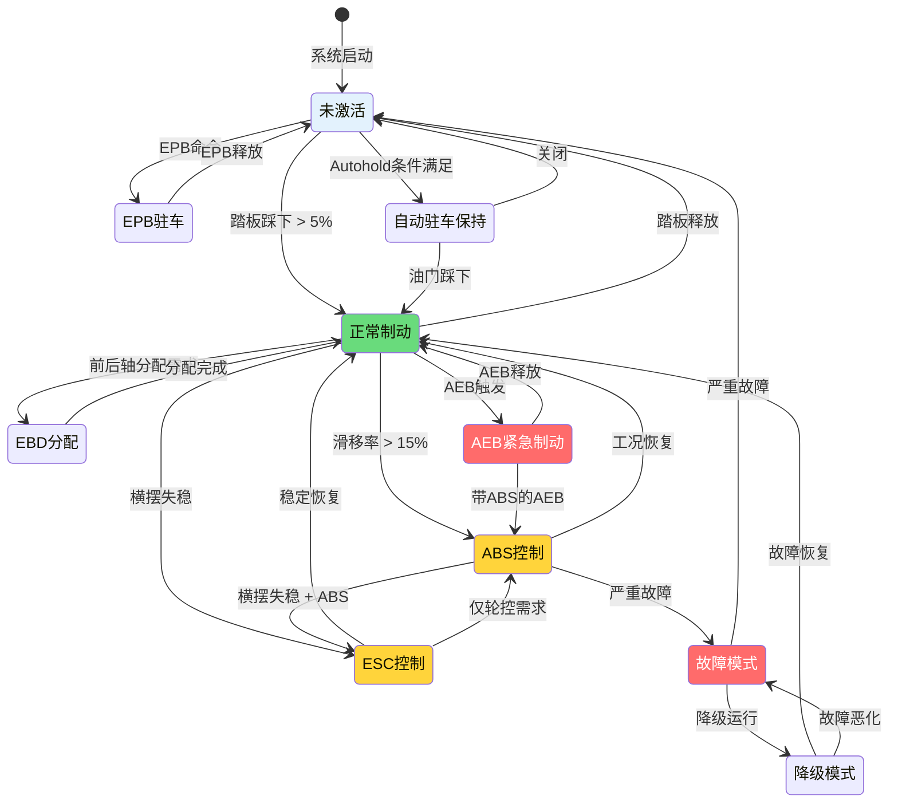

# SWC_BrakeControl - 制动主控制模块设计

> **模块编号**: SWC-BRAKE-CTRL-001  
> **ASIL等级**: D  
003e **运行周期**: 2ms  
> **所属项目**: 制动系统工程

---

## 1. 模块概述

### 1.1 功能描述

SWC_BrakeControl是制动系统的核心控制模块，负责：
- 驾驶员意图解析与仲裁
- 多源制动请求协调（驾驶员 + ADAS + AEB）
- 各子系统使能控制（ABS/ESC/EBD/EPB）
- 目标减速度/压力计算

### 1.2 架构位置

```
应用层 ASW
├── SWC_BrakePedal (输入)
├── SWC_WheelSpeed (输入)
├── SWC_VehicleDynamics (输入)
├── SWC_ADASInterface (输入)
├── SWC_BrakeControl (本模块 - 核心决策)
│   ├── 输出 -> SWC_ABS
│   ├── 输出 -> SWC_ESC
│   ├── 输出 -> SWC_EBD
│   └── 输出 -> SWC_EPB
├── SWC_SafetyMonitor (监控)
└── SWC_FaultManager (故障)
```

---

## 2. 端口接口定义

### 2.1 接收端口 (R-Port)

| 端口名称 | 数据类型 | 来源SWC | 描述 | 周期 |
|----------|----------|---------|------|------|
| RPort_PedalPosition | uint16 | BrakePedal | 踏板位置 0-1000 | 2ms |
| RPort_PedalGradient | uint16 | BrakePedal | 踏板梯度 | 2ms |
| RPort_PedalStatus | uint8 | BrakePedal | 踏板状态 | 2ms |
| RPort_WheelSpeeds | array[4] | WheelSpeed | 四轮轮速 | 2ms |
| RPort_VehicleAccel | sint16 | VehicleDynamics | 纵向加速度 | 10ms |
| RPort_YawRate | sint16 | VehicleDynamics | 横摆角速度 | 10ms |
| RPort_LatAccel | sint16 | VehicleDynamics | 侧向加速度 | 10ms |
| RPort_ADAS_DecelRequest | sint16 | ADASInterface | ADAS减速度请求 | 10ms |
| RPort_ADAS_Active | boolean | ADASInterface | ADAS激活标志 | 10ms |
| RPort_AEB_DecelRequest | sint16 | AEBInterface | AEB减速度请求 | 2ms |
| RPort_AEB_Active | boolean | AEBInterface | AEB激活标志 | 2ms |
| RPort_EPBCmd | uint8 | EPBControl | EPB命令 | 10ms |
| RPort_AutoholdCmd | uint8 | Autohold | Autohold命令 | 10ms |
| RPort_FaultStatus | struct | FaultManager | 故障状态 | 10ms |
| RPort_SafetyMode | uint8 | SafetyMonitor | 安全模式 | 2ms |

### 2.2 发送端口 (P-Port)

| 端口名称 | 数据类型 | 目标SWC | 描述 | 周期 |
|----------|----------|---------|------|------|
| PPort_BrakeMode | uint8 | All | 制动模式 | 2ms |
| PPort_TargetDecel | sint16 | All | 目标减速度 | 2ms |
| PPort_TargetPressure | uint16 | ValveControl | 目标主缸压力 | 2ms |
| PPort_ABS_Enable | boolean | ABS | ABS使能 | 2ms |
| PPort_ESC_Enable | boolean | ESC | ESC使能 | 2ms |
| PPort_EBD_Enable | boolean | EBD | EBD使能 | 2ms |
| PPort_EPB_Enable | boolean | EPB | EPB使能 | 10ms |
| PPort_WheelPressures | array[4] | All | 四轮目标压力 | 2ms |
| PPort_BrakeStatus | struct | DiagManager | 制动状态 | 10ms |

---

## 3. 内部行为设计

### 3.1 状态机



### 3.2 核心算法实现

```c
//=============================================================================
// Runnable: BrakeControl_Main
// 周期: 2ms
// 执行时间: < 0.5ms
// ASIL: D
//=============================================================================

void BrakeControl_Main(void)
{
    // 1. 读取所有输入
    PedalData = Rte_Read_RPort_PedalPosition();
    PedalGrad = Rte_Read_RPort_PedalGradient();
    PedalSts  = Rte_Read_RPort_PedalStatus();
    WheelSpeeds = Rte_Read_RPort_WheelSpeeds();
    ADAS_Decel = Rte_Read_RPort_ADAS_DecelRequest();
    ADAS_Active = Rte_Read_RPort_ADAS_Active();
    AEB_Decel = Rte_Read_RPort_AEB_DecelRequest();
    AEB_Active = Rte_Read_RPort_AEB_Active();
    
    // 2. 驾驶员意图解析
    Driver_Decel = PedalToDeceleration(PedalData, PedalGrad);
    
    // 3. 多源请求仲裁
    // 优先级: AEB > ADAS > Driver
    if (AEB_Active) {
        Target_Decel = AEB_Decel;           // AEB最高优先级
        Brake_Mode = BRAKE_MODE_AEB;
    } else if (ADAS_Active) {
        Target_Decel = ADAS_Decel;          // ADAS次之
        Brake_Mode = BRAKE_MODE_ADAS;
    } else {
        Target_Decel = Driver_Decel;        // 驾驶员正常制动
        Brake_Mode = BRAKE_MODE_NORMAL;
    }
    
    // 4. 减速度限幅
    Target_Decel = LimitDeceleration(Target_Decel, MAX_DECEL);
    
    // 5. 转换为压力
    Target_Pressure = DecelToPressure(Target_Decel);
    
    // 6. 制动力分配
    WheelPressures = DistributeBrakeForce(Target_Pressure, VehicleState);
    
    // 7. 子系统使能判断
    ABS_Enable = CheckABSCondition(WheelSpeeds);
    ESC_Enable = CheckESCCondition(YawRate, LatAccel);
    EBD_Enable = CheckEBDCondition(WheelPressures);
    
    // 8. 安全校验
    if (SafetyMode == SAFETY_DEGRADED) {
        Target_Decel = LimitDeceleration(Target_Decel, DECEL_LIMIT);
        ABS_Enable = FALSE;
        ESC_Enable = FALSE;
    }
    
    // 9. 输出
    Rte_Write_PPort_BrakeMode(Brake_Mode);
    Rte_Write_PPort_TargetDecel(Target_Decel);
    Rte_Write_PPort_TargetPressure(Target_Pressure);
    Rte_Write_PPort_WheelPressures(WheelPressures);
    Rte_Write_PPort_ABS_Enable(ABS_Enable);
    Rte_Write_PPort_ESC_Enable(ESC_Enable);
    Rte_Write_PPort_EBD_Enable(EBD_Enable);
}

// 踏板位置到减速度转换
sint16 PedalToDeceleration(uint16 PedalPos, uint16 PedalGrad)
{
    sint16 decel;
    
    // 基础映射: 踏板位置 → 减速度
    decel = LinearMap(PedalPos, 0, 1000, 0, -1000);  // 0 to -1g
    
    // 梯度补偿: 快速踩踏板增加预紧
    if (PedalGrad > GRADIENT_THRESHOLD) {
        decel += (PedalGrad - GRADIENT_THRESHOLD) * GRADIENT_GAIN;
    }
    
    // 限幅
    if (decel < -1000) decel = -1000;  // 最大1g
    
    return decel;
}

// 减速度到压力转换
uint16 DecelToPressure(sint16 Decel)
{
    // 考虑车辆质量、制动力分配
    float mass = VehicleMass;           // 车辆质量 (kg)
    float decel_g = (float)Decel / 1000.0;  // 转换为g
    float force = mass * decel_g * 9.81;    // 所需制动力 (N)
    
    // 制动系统增益: 力 → 轮缸压力
    float pressure = force / BRAKE_GAIN;    // bar
    
    return (uint16)(pressure * 100);    // 0.01bar/bit
}

// ABS使能条件检查
boolean CheckABSCondition(float SlipRatio[4])
{
    uint8 i;
    for (i = 0; i < 4; i++) {
        if (SlipRatio[i] > ABS_ENTRY_THRESHOLD) {
            return TRUE;
        }
    }
    return FALSE;
}

// ESC使能条件检查
boolean CheckESCCondition(sint16 YawRate, sint16 LatAccel)
{
    // 横摆角速度偏差检查
    float yaw_error = CalculateYawError(YawRate);
    
    // 侧向加速度检查
    if (ABS(LatAccel) > LAT_ACCEL_THRESHOLD || 
        ABS(yaw_error) > YAW_ERROR_THRESHOLD) {
        return TRUE;
    }
    return FALSE;
}
```

---

## 4. RTE接口配置

```c
// SWC_BrakeControl RTE配置
const Rte_SWC_BrakeControl_ConfigType Rte_SWC_BrakeControl_Config = {
    .SWC_ID = 0x0005,
    .SWC_Name = "BrakeControl",
    .Runnable_Config = {
        {
            .Runnable_Name = "BrakeControl_Main",
            .Runnable_Cycle = 2,                    // 2ms
            .Runnable_Priority = 4,                 // 优先级4
            .Runnable_ASIL = RTE_ASIL_D
        }
    },
    .Port_Config = {
        // 接收端口
        {.Port_Name = "RPort_PedalPosition", .Port_Type = RTE_RPORT, .Data_Type = RTE_UINT16},
        {.Port_Name = "RPort_WheelSpeeds", .Port_Type = RTE_RPORT, .Data_Type = RTE_ARRAY_4_UINT16},
        {.Port_Name = "RPort_ADAS_DecelRequest", .Port_Type = RTE_RPORT, .Data_Type = RTE_SINT16},
        {.Port_Name = "RPort_AEB_DecelRequest", .Port_Type = RTE_RPORT, .Data_Type = RTE_SINT16},
        
        // 发送端口
        {.Port_Name = "PPort_BrakeMode", .Port_Type = RTE_PPORT, .Data_Type = RTE_UINT8},
        {.Port_Name = "PPort_TargetDecel", .Port_Type = RTE_PPORT, .Data_Type = RTE_SINT16},
        {.Port_Name = "PPort_ABS_Enable", .Port_Type = RTE_PPORT, .Data_Type = RTE_BOOLEAN},
        {.Port_Name = "PPort_ESC_Enable", .Port_Type = RTE_PPORT, .Data_Type = RTE_BOOLEAN}
    }
};
```

---

## 5. 测试用例

| 用例ID | 测试场景 | 输入 | 预期输出 | ASIL |
|--------|----------|------|----------|------|
| TC-001 | 正常制动 | 踏板50% | 目标减速度0.5g | D |
| TC-002 | AEB触发 | AEB激活,减速度0.8g | 目标减速度0.8g | D |
| TC-003 | 多源仲裁 | 踏板+AEB同时 | AEB优先 | D |
| TC-004 | ABS使能 | 滑移率18% | ABS_Enable=TRUE | D |
| TC-005 | ESC使能 | 横摆偏差>阈值 | ESC_Enable=TRUE | D |
| TC-006 | 安全降级 | 故障模式 | 减速度限幅 | D |

---

*SWC_BrakeControl - 制动主控制模块详细设计*