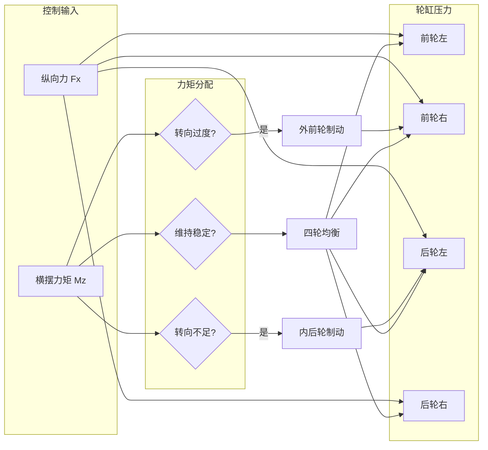
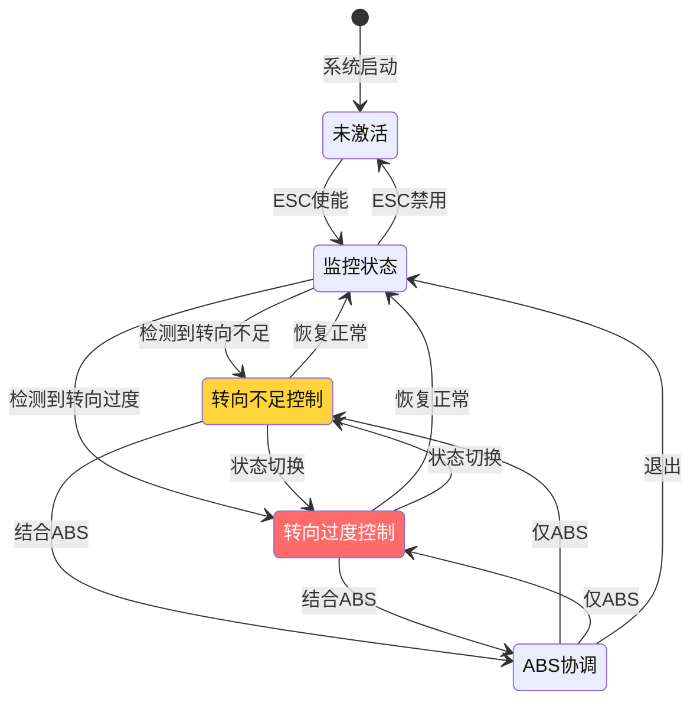

# SWC_ESC - 电子稳定控制模块设计

> **模块编号**: SWC-ESC-001  
> **ASIL等级**: D  
> **运行周期**: 2ms  
003e **核心算法**: 滑模控制 + 横摆力矩分配

---

## 1. 模块概述

### 1.1 功能描述

ESC（Electronic Stability Control）电子稳定控制系统：
- **横摆稳定性控制**: 防止车辆转向不足/过度
- **侧向稳定性控制**: 防止侧滑和甩尾
- **制动力分配**: 单侧制动产生横摆力矩
- **与ABS协调**: 集成控制策略

### 1.2 控制目标

| 参数 | 目标值 | 说明 |
|------|--------|------|
| 横摆角速度偏差 | < 5°/s | 实际vs理想横摆角速度 |
| 质心侧偏角 | < 3° | 侧滑控制 |
| 响应时间 | < 50ms | 检测到失稳到开始控制 |
| 控制精度 | ±2°/s | 横摆角速度控制精度 |

---

## 2. 端口接口定义

### 2.1 接收端口

| 端口名称 | 数据类型 | 来源 | 描述 |
|----------|----------|------|------|
| RPort_YawRate | sint16 | VehicleDynamics | 实际横摆角速度 |
| RPort_YawRateRef | sint16 | VehicleObserver | 理想横摆角速度 |
| RPort_LatAccel | sint16 | VehicleDynamics | 侧向加速度 |
| RPort_LongAccel | sint16 | VehicleDynamics | 纵向加速度 |
| RPort_SteeringAngle | sint16 | SteeringSensor | 方向盘转角 |
| RPort_VehicleSpeed | uint16 | VehicleObserver | 车速 |
| RPort_ESC_Enable | boolean | BrakeControl | ESC使能 |
| RPort_WheelSpeeds | array[4] | WheelSpeed | 四轮轮速 |

### 2.2 发送端口

| 端口名称 | 数据类型 | 目标 | 描述 |
|----------|----------|------|------|
| PPort_ESC_TorqueReq | array[4] | ValveControl | 各轮制动力矩请求 |
| PPort_ESC_Active | boolean | DiagManager | ESC激活标志 |
| PPort_VehicleStable | boolean | HMI | 车辆稳定状态 |

---

## 3. 核心算法设计

### 3.1 车辆参考模型

```c
// 二自由度车辆模型（自行车模型）
// 输入: 方向盘转角 δ, 车速 Vx
// 输出: 理想横摆角速度 γ_ref

float CalculateReferenceYawRate(float SteeringAngle, float VehicleSpeed)
{
    float delta_rad;
    float gamma_ref;
    float steering_ratio = 15.0;  // 转向比
    float wheelbase = 2.7;        // 轴距 (m)
    
    // 转换为前轮转角
    delta_rad = SteeringAngle / steering_ratio * PI / 180.0;
    
    // 稳态横摆角速度增益
    // γ_ref = (Vx / L) * δ / (1 + K * Vx²)
    // K: 不足转向梯度
    
    float K_us = 0.001;  // 不足转向梯度 (s²/m²)
    float denominator = 1.0 + K_us * VehicleSpeed * VehicleSpeed;
    
    gamma_ref = (VehicleSpeed / wheelbase) * delta_rad / denominator;
    
    // 转换为 °/s
    return gamma_ref * 180.0 / PI;
}
```

### 3.2 滑模控制算法

```c
//=============================================================================
// 滑模控制器 - 横摆稳定性控制
//=============================================================================

void SMC_Controller(float YawRate_Actual, float YawRate_Ref, 
                    float *Torque_Delta)
{
    float e_yaw;           // 横摆角速度误差
    float de_yaw;          // 误差变化率
    float s;               // 滑模面
    float u_eq;            // 等效控制
    float u_sw;            // 切换控制
    float u_total;         // 总控制量
    
    static float e_yaw_prev = 0;
    
    // 1. 计算误差
    e_yaw = YawRate_Ref - YawRate_Actual;
    
    // 2. 计算误差变化率 (微分)
    de_yaw = (e_yaw - e_yaw_prev) / 0.002;  // 2ms周期
    e_yaw_prev = e_yaw;
    
    // 3. 定义滑模面: s = e_yaw + λ * ∫e_yaw
    // λ: 滑模面参数
    float lambda = 5.0;
    static float integral_e = 0;
    integral_e += e_yaw * 0.002;
    s = e_yaw + lambda * integral_e;
    
    // 4. 等效控制
    // u_eq = (dγ_ref/dt + λ*e) / (控制增益)
    float d_gamma_ref = 0;  // 理想横摆角速度变化率
    float control_gain = 500.0;  // 控制增益 (需标定)
    u_eq = (d_gamma_ref + lambda * e_yaw) / control_gain;
    
    // 5. 切换控制 (符号函数)
    // u_sw = K * sign(s)
    float K = 1000.0;  // 切换增益
    if (s > 0.1) {
        u_sw = K;
    } else if (s < -0.1) {
        u_sw = -K;
    } else {
        u_sw = K * s / 0.1;  // 边界层线性化
    }
    
    // 6. 总控制量
    u_total = u_eq + u_sw;
    
    // 7. 转换为横摆力矩
    // M_z = I_z * u_total
    float I_z = 2500.0;  // 绕Z轴转动惯量 (kg·m²)
    *Torque_Delta = I_z * u_total;
    
    // 限幅
    if (*Torque_Delta > 2000.0) *Torque_Delta = 2000.0;
    if (*Torque_Delta < -2000.0) *Torque_Delta = -2000.0;
}
```

### 3.3 制动力矩分配



```c
//=============================================================================
// 制动力矩分配算法
//=============================================================================

void DistributeBrakeTorque(float Mz_required, float Fx_total, 
                           float WheelTorque[4])
{
    // 车辆参数
    float track_width = 1.6;   // 轮距 (m)
    float wheelbase = 2.7;     // 轴距 (m)
    float rear_axle_ratio = 0.6;  // 后轴制动力比例
    
    // 判断转向状态
    if (Mz_required > 50.0) {
        // 转向不足 (Understeer) - 需要产生额外横摆
        // 策略: 制动内后轮
        WheelTorque[RL] = Mz_required / (track_width / 2.0);  // 后轮产生横摆力矩
        WheelTorque[RR] = 0;
        WheelTorque[FL] = Fx_total * (1.0 - rear_axle_ratio) / 2.0;
        WheelTorque[FR] = Fx_total * (1.0 - rear_axle_ratio) / 2.0;
        
    } else if (Mz_required < -50.0) {
        // 转向过度 (Oversteer) - 需要减小横摆
        // 策略: 制动外前轮
        WheelTorque[FR] = -Mz_required / (track_width / 2.0);  // 前轮产生反向横摆力矩
        WheelTorque[FL] = 0;
        WheelTorque[RL] = Fx_total * rear_axle_ratio / 2.0;
        WheelTorque[RR] = Fx_total * rear_axle_ratio / 2.0;
        
    } else {
        // 基本稳定 - 均衡分配
        WheelTorque[FL] = Fx_total * 0.25;
        WheelTorque[FR] = Fx_total * 0.25;
        WheelTorque[RL] = Fx_total * 0.25;
        WheelTorque[RR] = Fx_total * 0.25;
    }
    
    // 限幅检查
    for (int i = 0; i < 4; i++) {
        if (WheelTorque[i] < 0) WheelTorque[i] = 0;
        if (WheelTorque[i] > MAX_BRAKE_TORQUE) WheelTorque[i] = MAX_BRAKE_TORQUE;
    }
}
```

### 3.4 ESC控制状态机



---

## 4. 与ABS协调控制

```c
//=============================================================================
// ESC与ABS协调控制
//=============================================================================

void ESC_ABS_Coordination(float WheelSpeeds[4], float SlipRatios[4])
{
    boolean abs_active[4];
    boolean esc_active;
    float esc_torque[4];
    float final_torque[4];
    
    // 读取ABS状态
    abs_active = Rte_Read_RPort_ABS_Active();
    
    // 计算ESC力矩需求
    ESC_Controller(abs_active, esc_torque, &esc_active);
    
    // 协调策略
    for (int wheel = 0; wheel < 4; wheel++) {
        if (abs_active[wheel]) {
            // ABS优先 - ESC服从ABS
            // 保持ABS的压力调节
            final_torque[wheel] = ABS_Torque[wheel];
        } else if (esc_active) {
            // 仅ESC激活
            final_torque[wheel] = esc_torque[wheel];
        } else {
            // 正常制动
            final_torque[wheel] = BaseBrake_Torque[wheel];
        }
    }
    
    // 输出
    Rte_Write_PPort_ESC_TorqueReq(final_torque);
}
```

---

## 5. 诊断与标定

### 5.1 关键标定参数

| 参数名称 | 默认值 | 范围 | 说明 |
|----------|--------|------|------|
| SMC_Lambda | 5.0 | 2-10 | 滑模面参数 |
| SMC_K | 1000 | 500-2000 | 切换增益 |
| YawRate_Threshold | 10°/s | 5-20 | 横摆偏差阈值 |
| Beta_Threshold | 3° | 2-5 | 质心侧偏角阈值 |
| RearAxle_Ratio | 0.6 | 0.5-0.7 | 后轴制动力比例 |

### 5.2 故障诊断

| DTC编号 | 故障描述 | 触发条件 |
|---------|----------|----------|
| C00401 | 横摆传感器故障 | 信号超范围 |
| C00402 | 侧向加速度异常 | 信号不一致 |
| C00403 | ESC执行器故障 | 阀响应异常 |
| C00404 | 车辆模型异常 | 计算不合理 |

---

*SWC_ESC - 电子稳定控制模块设计*