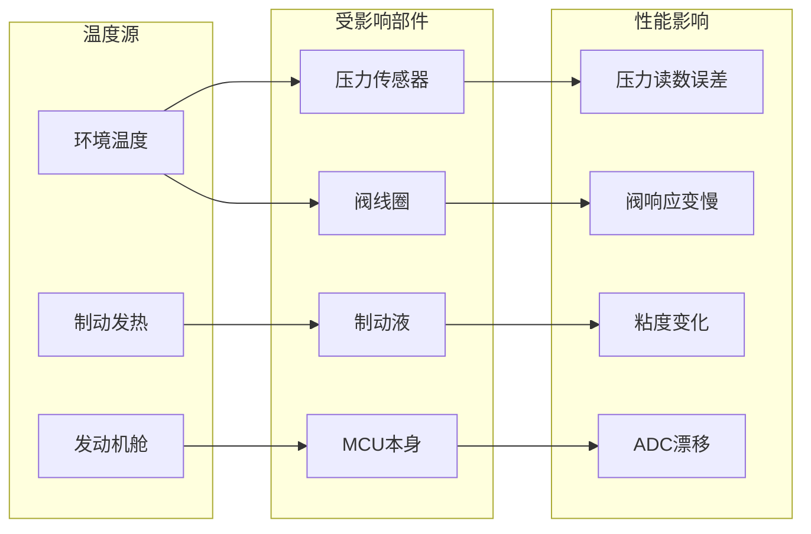

# 温度漂移补偿与跛行回家模式设计

> **文档编号**: TEMP-COMP-LIMP-HOME-001  
003e **设计目标**: 全温度范围性能保持 + 故障降级用户体验

---

## 1. 温度漂移补偿设计

### 1.1 温度影响分析



### 1.2 温度补偿架构

```c
//=============================================================================
// 温度补偿管理器
//=============================================================================

#define TEMP_SENSOR_COUNT 5
#define TEMP_UPDATE_PERIOD  100   // 100ms更新周期

typedef enum {
    TEMP_ZONE_AMBIENT = 0,         // 环境温度
    TEMP_ZONE_BRAKE_FLUID,         // 制动液温度
    TEMP_ZONE_VALVE_BLOCK,         // 阀体温度
    TEMP_ZONE_ECU,                 // ECU内部温度
    TEMP_ZONE_MOTOR                // 泵电机温度
} TemperatureZoneType;

typedef struct {
    sint16 CurrentTemperature;     // 当前温度 (0.1°C)
    sint16 MinTemperature;         // 历史最低
    sint16 MaxTemperature;         // 历史最高
    float FilteredTemp;            // 滤波后温度
    float TempGradient;            // 温度变化率
    boolean SensorFault;           // 传感器故障
} TemperatureChannelType;

static TemperatureChannelType TempChannels[TEMP_SENSOR_COUNT];

// 温度采集与滤波
void TemperatureManager_Main(void)
{
    static uint32 last_update = 0;
    
    if (GetSystemTime() - last_update < TEMP_UPDATE_PERIOD) {
        return;
    }
    last_update = GetSystemTime();
    
    for (int zone = 0; zone < TEMP_SENSOR_COUNT; zone++) {
        // 读取原始温度
        sint16 raw_temp = ReadTemperatureSensor(zone);
        
        // 范围检查
        if (raw_temp < -400 || raw_temp > 1500) {
            TempChannels[zone].SensorFault = TRUE;
            Dem_SetEventStatus(DTC_TEMP_SENSOR_FAULT + zone, 
                               DEM_EVENT_STATUS_FAILED);
            continue;
        }
        
        TempChannels[zone].SensorFault = FALSE;
        
        // 一阶低通滤波
        float alpha = 0.1;  // 滤波系数
        float prev_temp = TempChannels[zone].FilteredTemp;
        TempChannels[zone].FilteredTemp = 
            alpha * raw_temp + (1 - alpha) * prev_temp;
        
        // 更新温度变化率
        TempChannels[zone].TempGradient = 
            (TempChannels[zone].FilteredTemp - prev_temp) / 0.1;  // °C/s
        
        // 更新极值
        if (raw_temp < TempChannels[zone].MinTemperature) {
            TempChannels[zone].MinTemperature = raw_temp;
        }
        if (raw_temp > TempChannels[zone].MaxTemperature) {
            TempChannels[zone].MaxTemperature = raw_temp;
        }
        
        TempChannels[zone].CurrentTemperature = (sint16)TempChannels[zone].FilteredTemp;
    }
    
    // 执行各模块温度补偿
    ApplyPressureSensorTempComp();
    ApplyValveTempComp();
    ApplyADCTempComp();
}
```

### 1.3 压力传感器温度补偿

```c
//=============================================================================
// 压力传感器温度补偿 (ASIL-D关键)
//=============================================================================

// 压力传感器温度漂移模型
// 典型值: ±0.5% FS/°C
// 二阶补偿模型: P_comp = P_raw * (1 + a*(T-T0) + b*(T-T0)² + c*(T-T0)³)

typedef struct {
    float T0;                      // 参考温度 (25°C)
    float CoeffA;                  // 一阶系数 (ppm/°C)
    float CoeffB;                  // 二阶系数 (ppm/°C²)
    float CoeffC;                  // 三阶系数 (ppm/°C³)
    float OffsetDrift;             // 零点漂移 (Pa/°C)
} PressureSensorTempModelType;

// 各传感器温度模型 (需标定)
const PressureSensorTempModelType PressureSensorModels[] = {
    [PRESSURE_MASTER_CYL] = {
        .T0 = 25.0,
        .CoeffA = -50e-6,          // -50 ppm/°C
        .CoeffB = 0.5e-9,          // +0.5 ppm/°C²
        .CoeffC = -0.001e-12,
        .OffsetDrift = -10.0       // -10 Pa/°C
    },
    [PRESSURE_WHEEL_FL] = {
        .T0 = 25.0,
        .CoeffA = -80e-6,
        .CoeffB = 1.0e-9,
        .CoeffC = -0.002e-12,
        .OffsetDrift = -15.0
    },
    // ... 其他轮缸传感器
};

// 压力传感器温度补偿
float CompensatePressureSensor(uint8 sensor_id, float raw_pressure, 
                                float temperature)
{
    const PressureSensorTempModelType* model = &PressureSensorModels[sensor_id];
    
    // 温度差
    float delta_T = temperature - model->T0;
    
    // 增益漂移补偿
    float gain_factor = 1.0 + 
                        model->CoeffA * delta_T +
                        model->CoeffB * delta_T * delta_T +
                        model->CoeffC * delta_T * delta_T * delta_T;
    
    // 零点漂移补偿
    float offset_comp = model->OffsetDrift * delta_T;
    
    // 应用补偿
    float compensated = (raw_pressure - offset_comp) / gain_factor;
    
    // 限幅
    if (compensated < 0) compensated = 0;
    if (compensated > MAX_PRESSURE) compensated = MAX_PRESSURE;
    
    return compensated;
}

// 压力传感器健康监控
void MonitorPressureSensorHealth(uint8 sensor_id)
{
    // 检查温度补偿后是否合理
    float compensated = CompensatePressureSensor(
        sensor_id,
        RawPressure[sensor_id],
        TempChannels[TEMP_ZONE_BRAKE_FLUID].CurrentTemperature / 10.0
    );
    
    // 与参考值比较 (主缸压力作为参考)
    float expected = EstimatePressureFromPedal(PedalPosition);
    float error = fabs(compensated - expected);
    
    if (error > PRESSURE_SENSOR_ERROR_THRESHOLD) {
        // 传感器异常
        Dem_SetEventStatus(DTC_PRESSURE_SENSOR_DRIFT + sensor_id,
                           DEM_EVENT_STATUS_FAILED);
    }
}
```

### 1.4 阀线圈温度补偿

```c
//=============================================================================
// 阀线圈温度补偿
//=============================================================================

// 铜线电阻温度系数: α = 0.00393 /°C
// R(T) = R0 * (1 + α * (T - T0))
// 为保持相同电流，需调整电压 = 调整PWM占空比

#define COPPER_TEMP_COEFF   0.00393
#define VALVE_COIL_R0       2.5     // 25°C时电阻 2.5Ω
#define VALVE_CURRENT_NOM   1.5     // 额定电流 1.5A
#define VALVE_SUPPLY_VOLT   12.0    // 供电电压 12V

typedef struct {
    float R_25C;                   // 25°C电阻
    float CurrentTarget;           // 目标电流
    float TempCoefficient;         // 温度系数
} ValveCoilParametersType;

// 计算阀线圈电流
float CalculateValveCurrent(uint16 pwm, float supply_voltage, float coil_resistance)
{
    float duty = pwm / 1000.0;  // 0-1
    float v_avg = supply_voltage * duty;
    float current = v_avg / coil_resistance;
    return current;
}

// 计算需要的PWM以获得目标电流
uint16 CalculateCompensatedPWM(float target_current, float temperature,
                                float supply_voltage)
{
    // 计算当前温度下的线圈电阻
    float R_current = VALVE_COIL_R0 * 
                      (1 + COPPER_TEMP_COEFF * (temperature - 25.0));
    
    // 计算需要的平均电压
    float V_needed = target_current * R_current;
    
    // 计算PWM占空比
    float duty = V_needed / supply_voltage;
    
    // 考虑阀的非线性 (小电流时力不足)
    if (duty < 0.1) duty = 0.1;  // 最小10% PWM
    
    uint16 pwm = (uint16)(duty * 1000);
    if (pwm > 1000) pwm = 1000;
    
    return pwm;
}

// 阀响应时间温度补偿
float CompensateValveResponseTime(float base_response_time, float temperature)
{
    // 低温时响应变慢 (液体粘度增加)
    // 高温时响应变快
    
    float temp_factor;
    if (temperature < 0) {
        temp_factor = 1.0 + 0.02 * (0 - temperature);  // -40°C时响应慢80%
    } else if (temperature > 80) {
        temp_factor = 1.0 - 0.005 * (temperature - 80);  // 高温略快
    } else {
        temp_factor = 1.0;
    }
    
    return base_response_time * temp_factor;
}

// 全局阀控制温度补偿
void ValveControl_TemperatureCompensation(void)
{
    float valve_temp = TempChannels[TEMP_ZONE_VALVE_BLOCK].CurrentTemperature / 10.0;
    float supply_volt = ReadSupplyVoltage();
    
    for (int i = 0; i < 4; i++) {
        // 进油阀
        uint16 pwm_inlet_comp = CalculateCompensatedPWM(
            VALVE_CURRENT_NOM,
            valve_temp,
            supply_volt
        );
        ValvePWM_CompensationGain[i] = pwm_inlet_comp / 500.0;  // 相对于50%PWM
        
        // 出油阀
        // ... 类似计算
    }
}
```

### 1.5 ADC温度漂移补偿

```c
//=============================================================================
// ADC温度漂移补偿
//=============================================================================

// TC397 ADC温度漂移: ±2 LSB/°C (典型)
// 使用内部温度传感器补偿

#define ADC_DRIFT_PPM_PER_C     10      // 10 ppm/°C
#define ADC_VREF                5.0     // 参考电压 5V
#define ADC_RESOLUTION          4096    // 12-bit

typedef struct {
    float Vref_25C;                // 25°C参考电压
    float DriftCoefficient;        // 漂移系数
    sint16 CalTemperature;         // 校准温度
    uint16 CalValue;               // 校准值
} ADCTempCompensationType;

// ADC温度补偿
uint16 CompensateADCReading(uint16 raw_adc, float temperature)
{
    // 计算漂移
    float temp_delta = temperature - 25.0;
    float drift_factor = 1.0 + (ADC_DRIFT_PPM_PER_C * 1e-6) * temp_delta;
    
    // 应用补偿
    float compensated = raw_adc / drift_factor;
    
    return (uint16)compensated;
}

// ADC自校准 (使用内部参考)
void ADC_SelfCalibration(void)
{
    // 读取内部温度传感器
    sint16 mcu_temp = ReadMCUTemperatureSensor();
    
    // 读取内部参考电压
    uint16 vref_internal = ReadInternalVref();
    
    // 计算实际参考电压
    float vref_actual = (3.3 * 4095.0) / vref_internal;  // 假设3.3V内部参考
    
    // 计算补偿系数
    ADCVrefCompensation = ADC_VREF / vref_actual;
    
    // 存储校准数据
    ADCCalibrationData.Temperature = mcu_temp;
    ADCCalibrationData.VrefFactor = ADCVrefCompensation;
}
```

---

## 2. 跛行回家模式设计

### 2.1 跛行回家分级

```c
//=============================================================================
// 跛行回家分级管理
//=============================================================================

typedef enum {
    LIMP_HOME_NONE = 0,            // 无跛行
    LIMP_HOME_LEVEL_1,             // 一级跛行 (50%能力)
    LIMP_HOME_LEVEL_2,             // 二级跛行 (30%能力)
    LIMP_HOME_LEVEL_3,             // 三级跛行 (仅停车)
    LIMP_HOME_EMERGENCY            // 紧急状态
} LimpHomeLevelType;

typedef struct {
    LimpHomeLevelType Level;
    const char* Description;
    uint8 MaxDeceleration;         // 最大减速度 (m/s²)
    uint16 MaxSpeed;               // 最高车速 (km/h)
    boolean ABS_Enabled;           // ABS使能
    boolean ESC_Enabled;           // ESC使能
    boolean EPB_Enabled;           // EPB使能
    boolean Autohold_Enabled;      // Autohold使能
    boolean Diag_Enabled;          // 诊断通信
    uint16 WarningPattern;         // 警告灯模式
} LimpHomeConfigType;

const LimpHomeConfigType LimpHomeConfigs[] = {
    [LIMP_HOME_NONE] = {
        .Description = "Normal Operation",
        .MaxDeceleration = 10,
        .MaxSpeed = 255,
        .ABS_Enabled = TRUE,
        .ESC_Enabled = TRUE,
        .EPB_Enabled = TRUE,
        .Autohold_Enabled = TRUE,
        .Diag_Enabled = TRUE,
        .WarningPattern = WARNING_OFF
    },
    [LIMP_HOME_LEVEL_1] = {
        .Description = "Reduced Braking - Level 1",
        .MaxDeceleration = 7,
        .MaxSpeed = 150,
        .ABS_Enabled = FALSE,      // ABS禁用
        .ESC_Enabled = TRUE,       // ESC保留
        .EPB_Enabled = TRUE,
        .Autohold_Enabled = FALSE,
        .Diag_Enabled = TRUE,
        .WarningPattern = WARNING_YELLOW_STEADY
    },
    [LIMP_HOME_LEVEL_2] = {
        .Description = "Reduced Braking - Level 2",
        .MaxDeceleration = 5,
        .MaxSpeed = 100,
        .ABS_Enabled = FALSE,
        .ESC_Enabled = FALSE,
        .EPB_Enabled = TRUE,       // EPB保留用于紧急停车
        .Autohold_Enabled = FALSE,
        .Diag_Enabled = TRUE,
        .WarningPattern = WARNING_YELLOW_BLINK
    },
    [LIMP_HOME_LEVEL_3] = {
        .Description = "Minimal Braking - Stop Required",
        .MaxDeceleration = 3,
        .MaxSpeed = 50,
        .ABS_Enabled = FALSE,
        .ESC_Enabled = FALSE,
        .EPB_Enabled = FALSE,
        .Autohold_Enabled = FALSE,
        .Diag_Enabled = TRUE,
        .WarningPattern = WARNING_RED_STEADY
    },
    [LIMP_HOME_EMERGENCY] = {
        .Description = "Emergency - Immediate Stop",
        .MaxDeceleration = 10,
        .MaxSpeed = 0,
        .ABS_Enabled = FALSE,
        .ESC_Enabled = FALSE,
        .EPB_Enabled = TRUE,       // EPB紧急制动
        .Autohold_Enabled = FALSE,
        .Diag_Enabled = FALSE,
        .WarningPattern = WARNING_RED_BLINK
    }
};
```

### 2.2 跛行回家触发逻辑

```c
//=============================================================================
// 跛行回家触发决策
//=============================================================================

LimpHomeLevelType DetermineLimpHomeLevel(FaultBitmapType active_faults)
{
    // 致命故障 → 紧急状态
    if (active_faults & FATAL_FAULTS) {
        return LIMP_HOME_EMERGENCY;
    }
    
    // 多系统故障 → 三级跛行
    if (CountActiveFaults(active_faults) >= 3) {
        return LIMP_HOME_LEVEL_3;
    }
    
    // 踏板故障 + 压力故障 → 三级
    if ((active_faults & FAULT_PEDAL_PRIMARY) &&
        (active_faults & FAULT_PRESSURE_SENSORS)) {
        return LIMP_HOME_LEVEL_3;
    }
    
    // 两路以上压力故障 → 二级
    if (CountFaultsInCategory(active_faults, CAT_PRESSURE) >= 2) {
        return LIMP_HOME_LEVEL_2;
    }
    
    // ABS故障 + ESC故障 → 二级
    if ((active_faults & FAULT_ABS_FAILED) &&
        (active_faults & FAULT_ESC_FAILED)) {
        return LIMP_HOME_LEVEL_2;
    }
    
    // 单一主要功能故障 → 一级
    if (active_faults & (FAULT_ABS_FAILED | FAULT_ESC_FAULT | 
                          FAULT_AEB_FAULT | FAULT_EPB_FAULT)) {
        return LIMP_HOME_LEVEL_1;
    }
    
    // 传感器降级 → 一级
    if (active_faults & FAULT_SENSOR_DEGRADED) {
        return LIMP_HOME_LEVEL_1;
    }
    
    return LIMP_HOME_NONE;
}

// 进入跛行回家模式
void EnterLimpHomeMode(LimpHomeLevelType level)
{
    const LimpHomeConfigType* config = &LimpHomeConfigs[level];
    
    // 1. 记录事件
    Dem_SetEventStatus(DTC_LIMP_HOME_ENTERED + level, DEM_EVENT_STATUS_FAILED);
    
    // 2. 限制功能
    if (!config->ABS_Enabled) DisableABS();
    if (!config->ESC_Enabled) DisableESC();
    if (!config->EPB_Enabled) DisableEPB();
    if (!config->Autohold_Enabled) DisableAutohold();
    
    // 3. 限制车速
    Rte_Write_PPort_VehicleSpeedLimit(config->MaxSpeed);
    
    // 4. 调整制动力映射
    SetBrakeForceLimit(config->MaxDeceleration);
    
    // 5. 激活警告
    ActivateWarningLamp(config->WarningPattern);
    
    // 6. HMI提示
    DisplayLimpHomeMessage(level);
    
    // 7. 通知其他域
    Rte_Write_PPort_LimpHomeActive(TRUE);
    Rte_Write_PPort_LimpHomeLevel(level);
    
    // 8. 存储故障快照
    StoreLimpHomeSnapshot(level, active_faults);
}
```

### 2.3 跛行回家制动控制

```c
//=============================================================================
// 跛行回家制动控制
//=============================================================================

void LimpHomeBrakeControl(float pedal_input, LimpHomeLevelType level)
{
    const LimpHomeConfigType* config = &LimpHomeConfigs[level];
    
    // 计算限幅后的减速度需求
    float raw_decel = PedalToDeceleration(pedal_input);
    float limited_decel = fmin(raw_decel, config->MaxDeceleration);
    
    switch (level) {
        case LIMP_HOME_LEVEL_1:
            // 一级跛行: 基础制动 + 踏板直接映射
            // 禁用ABS/ESC的复杂控制
            BasicBrakeControl(limited_decel);
            break;
            
        case LIMP_HOME_LEVEL_2:
            // 二级跛行: 简化制动 + 故障轮隔离
            {
                boolean wheel_available[4];
                GetAvailableWheels(wheel_available);
                
                // 仅使用健康轮
                SimplifiedBrakeControl(limited_decel, wheel_available);
            }
            break;
            
        case LIMP_HOME_LEVEL_3:
            // 三级跛行: 最小制动能力
            // 仅主缸直接压力 (无助力)
            MinimalBrakeControl(limited_decel);
            
            // 提示驾驶员尽快停车
            if (VehicleSpeed > 10) {
                DisplayWarning("请尽快安全停车");
            }
            break;
            
        case LIMP_HOME_EMERGENCY:
            // 紧急状态: 立即停车
            EmergencyStopProcedure();
            break;
            
        default:
            break;
    }
}

// 基础制动控制 (无ABS/ESC)
void BasicBrakeControl(float decel_demand)
{
    // 简化的踏板-压力映射
    float pressure = DecelToPressure(decel_demand);
    
    // 均分四轮
    for (int i = 0; i < 4; i++) {
        TargetPressure[i] = pressure * GetWeightDistribution(i);
    }
    
    // 简单PID控制 (无滑移控制)
    for (int i = 0; i < 4; i++) {
        PressureControlPID(i, TargetPressure[i]);
    }
}

// 紧急停车程序
void EmergencyStopProcedure(void)
{
    // 1. 激活危险报警灯
    Rte_Write_PPort_HazardLamp(TRUE);
    
    // 2. 最大减速度
    SetAllWheelsTargetPressure(MAX_PRESSURE);
    
    // 3. 渐进式停车 (避免抱死)
    while (VehicleSpeed > 5) {
        // 监控滑移
        for (int i = 0; i < 4; i++) {
            if (SlipRatio[i] > 30) {
                // 轻微减压防止抱死 (简化ABS)
                TargetPressure[i] *= 0.9;
            }
        }
        Delay(10);
    }
    
    // 4. 激活EPB保持
    ActivateEPB_Hold();
    
    // 5. 进入安全状态
    EnterSafeState(REASON_EMERGENCY_STOP);
}
```

### 2.4 跛行回家退出

```c
//=============================================================================
// 跛行回家退出
//=============================================================================

void LimpHomeExitMonitor(void)
{
    if (CurrentLimpHomeLevel == LIMP_HOME_NONE) {
        return;
    }
    
    // 检查所有故障是否恢复
    boolean all_faults_cleared = TRUE;
    
    for (int i = 0; i < 32; i++) {
        if (ActiveFaults & (1 << i)) {
            if (!IsFaultRecovered(i)) {
                all_faults_cleared = FALSE;
                break;
            }
        }
    }
    
    if (all_faults_cleared) {
        // 启动恢复计时
        if (RecoveryTimer < LIMP_HOME_EXIT_CONFIRM_TIME) {
            RecoveryTimer += 10;  // 10ms周期
        } else {
            // 确认恢复，退出跛行
            ExitLimpHomeMode();
        }
    } else {
        RecoveryTimer = 0;
    }
}

void ExitLimpHomeMode(void)
{
    // 1. 清除故障码
    Dem_SetEventStatus(DTC_LIMP_HOME_ENTERED + CurrentLimpHomeLevel, 
                       DEM_EVENT_STATUS_PASSED);
    
    // 2. 恢复功能
    EnableABS();
    EnableESC();
    EnableEPB();
    EnableAutohold();
    
    // 3. 清除车速限制
    Rte_Write_PPort_VehicleSpeedLimit(255);
    
    // 4. 恢复制动力映射
    SetBrakeForceLimit(10);  // 正常10m/s²
    
    // 5. 关闭警告
    DeactivateWarningLamp();
    
    // 6. HMI提示
    DisplayMessage("制动系统恢复正常");
    
    // 7. 通知其他域
    Rte_Write_PPort_LimpHomeActive(FALSE);
    
    // 8. 执行自检
    if (RunSelfTest() == SELFTEST_PASSED) {
        CurrentLimpHomeLevel = LIMP_HOME_NONE;
    } else {
        // 自检失败，保持跛行
        DisplayWarning("自检失败，保持受限模式");
    }
}
```

---

*温度漂移补偿与跛行回家模式设计*  
*全温度范围性能 + 故障降级用户体验*