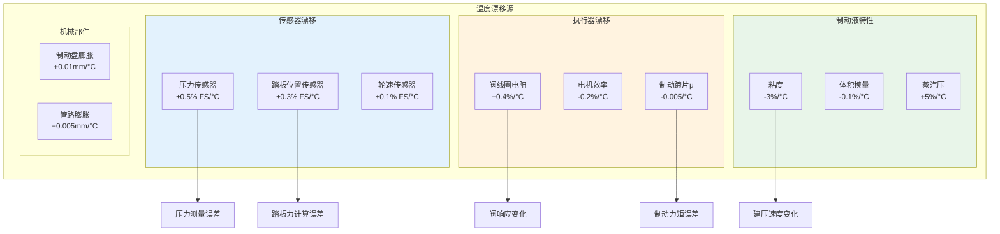

# 温度漂移补偿设计

> **文档编号**: TEMP-COMP-001  
003e **补偿范围**: -40°C ~ +125°C  
003e **补偿对象**: 传感器/阀体/制动液  
003e **精度目标**: ±0.5% FS 全温度范围

---

## 1. 温度影响分析

### 1.1 各组件温度特性



### 1.2 温度敏感区域

| 区域 | 典型温度 | 主要影响 | 补偿优先级 |
|------|----------|----------|------------|
| 发动机舱 | 80-125°C | 阀线圈、传感器 | P0 |
| 轮缸附近 | -40-150°C | 制动蹄片、轮速 | P0 |
| 底盘管路 | -40-80°C | 管路弹性、粘度 | P1 |
| 驾驶舱 | 20-60°C | 踏板传感器 | P2 |

---

## 2. 传感器温度补偿

### 2.1 压力传感器温度补偿

```c
//=============================================================================
// 压力传感器温度补偿模块
//=============================================================================

typedef struct {
    float RawPressure;             // 原始压力值 (ADC)
    float RawTemperature;          // 原始温度值 (ADC)
    float CompensatedPressure;     // 补偿后压力 (bar)
    float SensorTemperature;       // 传感器温度 (°C)
    uint8 CalibrationStatus;       // 校准状态
} PressureSensorCompensationType;

// 温度传感器线性化 (NTC热敏电阻)
float NTC_ResistanceToTemperature(float resistance)
{
    // Steinhart-Hart方程简化版
    // 1/T = A + B*ln(R) + C*(ln(R))³
    
    const float A = 0.001125;      // 系数A
    const float B = 0.000235;      // 系数B
    const float C = 0.000000085;   // 系数C
    const float R25 = 10000.0;     // 25°C电阻 10kΩ
    
    float lnR = log(resistance);
    float inv_T = A + B * lnR + C * lnR * lnR * lnR;
    
    float temperature = 1.0 / inv_T - 273.15;  // 转换为°C
    
    return temperature;
}

// 压力传感器二阶温度补偿
float CompensatePressureSensor(float raw_pressure, float sensor_temp,
                                PressureCalibrationDataType* cal_data)
{
    // 基于标定数据的多项式补偿
    // P_comp = P_raw * (1 + α*(T-T0) + β*(T-T0)² + γ*(T-T0)³)
    
    float delta_T = sensor_temp - cal_data->RefTemperature;
    
    // 使用标定系数 (从NVM读取)
    float alpha = cal_data->TempCoeffLinear;
    float beta = cal_data->TempCoeffQuad;
    float gamma = cal_data->TempCoeffCubic;
    
    float compensation_factor = 1.0 + alpha * delta_T 
                                + beta * delta_T * delta_T
                                + gamma * delta_T * delta_T * delta_T;
    
    // 原始值到物理值转换
    float pressure_physical = (raw_pressure - cal_data->ZeroOffset) 
                              * cal_data->ScaleFactor;
    
    float compensated_pressure = pressure_physical * compensation_factor;
    
    // 限幅
    if (compensated_pressure < 0) compensated_pressure = 0;
    if (compensated_pressure > cal_data->MaxPressure) {
        compensated_pressure = cal_data->MaxPressure;
    }
    
    return compensated_pressure;
}

// 压力传感器零点漂移补偿
float CompensatePressureZeroDrift(float raw_zero_reading, 
                                   float current_temp,
                                   ZeroDriftCalibrationType* drift_data)
{
    // 零点随温度漂移: 高温零点漂移通常更显著
    
    // 基于历史数据的漂移模型
    // 使用最后N个零压点的数据进行回归
    
    float predicted_drift = 0.0;
    
    if (drift_data->SampleCount >= 10) {
        // 线性回归预测
        float sum_T = 0, sum_Z = 0, sum_TZ = 0, sum_T2 = 0;
        
        for (int i = 0; i < drift_data->SampleCount; i++) {
            float T = drift_data->TemperatureSamples[i];
            float Z = drift_data->ZeroSamples[i];
            sum_T += T;
            sum_Z += Z;
            sum_TZ += T * Z;
            sum_T2 += T * T;
        }
        
        float n = drift_data->SampleCount;
        float slope = (n * sum_TZ - sum_T * sum_Z) / (n * sum_T2 - sum_T * sum_T);
        float intercept = (sum_Z - slope * sum_T) / n;
        
        predicted_drift = slope * current_temp + intercept;
    }
    
    return raw_zero_reading - predicted_drift;
}
```

### 2.2 踏板位置传感器温度补偿

```c
//=============================================================================
// 踏板位置传感器温度补偿
//=============================================================================

typedef struct {
    float PositionRaw;             // 原始位置值
    float PositionCompensated;     // 补偿后位置
    float SensorTemperature;       // 传感器温度
    float TravelPercent;           // 行程百分比
} PedalSensorCompensationType;

// 双冗余传感器交叉温度补偿
void CompensateDualPedalSensors(PedalSensorCompensationType* primary,
                                 PedalSensorCompensationType* secondary)
{
    // 两个传感器在不同温度下的特性
    
    // 独立温度补偿
    primary->PositionCompensated = LinearTempCompensation(
        primary->PositionRaw,
        primary->SensorTemperature,
        &PrimarySensorCal
    );
    
    secondary->PositionCompensated = LinearTempCompensation(
        secondary->PositionRaw,
        secondary->SensorTemperature,
        &SecondarySensorCal
    );
    
    // 一致性检查 (补偿后应接近)
    float diff = fabs(primary->PositionCompensated - secondary->PositionCompensated);
    float avg = (primary->PositionCompensated + secondary->PositionCompensated) / 2.0;
    
    if (diff > avg * 0.05) {  // 差异 > 5%
        // 温度补偿后仍不一致，可能存在故障
        Dem_SetEventStatus(DTC_PEDAL_SENSOR_MISMATCH, DEM_EVENT_STATUS_FAILED);
        
        // 使用更可靠的传感器 (根据温度判断)
        if (fabs(primary->SensorTemperature - 25.0) < 
            fabs(secondary->SensorTemperature - 25.0)) {
            // 主传感器温度更接近参考，使用主传感器
            secondary->PositionCompensated = primary->PositionCompensated;
        } else {
            primary->PositionCompensated = secondary->PositionCompensated;
        }
    }
}

// 线性温度补偿
float LinearTempCompensation(float raw_value, float temperature,
                              SensorCalibrationType* cal)
{
    // 一阶线性补偿: V_comp = V_raw * (1 + α*(T-T0))
    float factor = 1.0 + cal->TempCoeff * (temperature - cal->RefTemp);
    return raw_value * factor;
}
```

---

## 3. 执行器温度补偿

### 3.1 阀体线圈温度补偿

```c
//=============================================================================
// 阀体PWM温度补偿
//=============================================================================

typedef struct {
    uint16 PwmCommand;             // 目标PWM
    uint16 PwmCompensated;         // 补偿后PWM
    float CoilTemperature;         // 线圈温度 (°C)
    float CoilResistance;          // 当前电阻
    float SupplyVoltage;           // 供电电压
} ValveTemperatureCompensationType;

// 线圈电阻估计 (基于电流和电压)
float EstimateCoilResistance(float voltage, float current, 
                              float ambient_temp)
{
    // R = V / I
    float R_measured = voltage / current;
    
    // 根据电阻估计温度
    // R(T) = R25 * (1 + α * (T - 25))
    const float alpha = 0.00393;   // 铜温度系数
    const float R25 = 12.0;        // 25°C电阻 (Ω)
    
    float estimated_temp = 25.0 + (R_measured / R25 - 1.0) / alpha;
    
    // 融合环境温度 (传感器热容导致延迟)
    float time_constant = 30.0;    // 热时间常数 (s)
    float blending_factor = 1.0 - exp(-0.001 / time_constant);  // 1ms周期
    
    static float fused_temp = 25.0;
    fused_temp = fused_temp * (1.0 - blending_factor) + estimated_temp * blending_factor;
    
    return fused_temp;
}

// PWM温度补偿 (维持恒定电流)
uint16 CompensateValvePWM(uint16 base_pwm, float coil_temp,
                          ValveCalibrationType* cal)
{
    // 高温时电阻增加，需要增加PWM占空比维持相同电流
    
    const float R25 = cal->ResistanceAt25C;
    const float alpha = 0.00393;
    
    // 当前电阻
    float R_current = R25 * (1.0 + alpha * (coil_temp - 25.0));
    
    // 补偿因子
    float compensation = R_current / R25;
    
    // 电压补偿
    float V_nominal = 12.0;
    float V_actual = GetSupplyVoltage();
    compensation *= V_nominal / V_actual;
    
    // 应用补偿
    uint16 compensated_pwm = (uint16)(base_pwm * compensation);
    
    // 限幅
    if (compensated_pwm > 1000) compensated_pwm = 1000;
    
    return compensated_pwm;
}

// 阀响应温度补偿 (考虑制动液粘度)
float CompensateValveResponse(float base_response_time, float fluid_temp)
{
    // 低温时制动液粘度增加，阀响应变慢
    // 粘度 μ(T) ≈ μ25 * exp(-0.03*(T-25))
    
    const float mu_25 = 2.5e-3;    // 25°C粘度
    float mu_current = mu_25 * exp(-0.03 * (fluid_temp - 25.0));
    
    // 响应时间与粘度成正比
    float response_factor = mu_current / mu_25;
    
    return base_response_time * response_factor;
}
```

### 3.2 电机温度补偿

```c
//=============================================================================
// 泵电机温度补偿
//=============================================================================

typedef struct {
    float MotorSpeed;              // 目标转速
    float MotorCurrent;            // 当前电流
    float MotorTemperature;        // 电机温度
    float Efficiency;              // 当前效率
} MotorTemperatureCompensationType;

// 电机效率温度特性
float CalculateMotorEfficiency(float temperature)
{
    // 电机效率随温度变化
    // 最佳效率温度: 60-80°C
    // 低温: 润滑剂粘度大，摩擦损失大
    // 高温: 绕组电阻增加，铜损增加
    
    const float eta_max = 0.85;
    const float T_optimal = 70.0;
    
    float temp_diff = temperature - T_optimal;
    
    // 二次模型
    float efficiency = eta_max - 0.0001 * temp_diff * temp_diff;
    
    if (efficiency < 0.5) efficiency = 0.5;
    
    return efficiency;
}

// 泵流量温度补偿 (考虑效率)
uint16 CompensatePumpPWM(uint16 base_pwm, float motor_temp)
{
    float efficiency = CalculateMotorEfficiency(motor_temp);
    
    // 为维持相同流量，需要增加PWM
    float compensation = 1.0 / efficiency;
    
    uint16 compensated_pwm = (uint16)(base_pwm * compensation);
    
    if (compensated_pwm > 1000) compensated_pwm = 1000;
    
    return compensated_pwm;
}
```

---

## 4. 制动系统温度补偿主控

### 4.1 温度估计与融合

```c
//=============================================================================
// 系统温度估计
//=============================================================================

typedef struct {
    float AmbientTemp;             // 环境温度
    float HydraulicFluidTemp;      // 制动液温度
    float ValveCoilTemp[8];        // 各阀线圈温度
    float MotorTemp;               // 泵电机温度
    float SensorTemps[10];         // 各传感器温度
} SystemTemperatureType;

// 温度融合估计
void EstimateSystemTemperatures(SystemTemperatureType* temps)
{
    // 1. 环境温度 (来自车辆网络或本地传感器)
    temps->AmbientTemp = Rte_Read_RPort_AmbientTemperature();
    
    // 2. 制动液温度估计 (基于运行历史)
    static float fluid_temp = 25.0;
    
    // 制动液温度受以下因素影响:
    // - 环境温度
    // - 制动强度 (压力 × 频率)
    // - 时间 (热惯性)
    
    float brake_heat = CalculateBrakeHeatGeneration();
    float heat_loss = (fluid_temp - temps->AmbientTemp) * 0.01;  // 散热
    
    fluid_temp += (brake_heat - heat_loss) * 0.001;  // 1ms周期
    
    temps->HydraulicFluidTemp = fluid_temp;
    
    // 3. 阀线圈温度 (基于电流积分)
    for (int i = 0; i < 8; i++) {
        temps->ValveCoilTemp[i] = EstimateCoilTemperature(
            i, temps->AmbientTemp, temps->HydraulicFluidTemp
        );
    }
    
    // 4. 电机温度 (基于电流和运行时间)
    temps->MotorTemp = EstimateMotorTemperature(temps->AmbientTemp);
}

// 线圈温度估计 (热模型)
float EstimateCoilTemperature(uint8 valve_id, float ambient, float fluid)
{
    static float coil_temps[8] = {25.0};
    
    // 热输入 (电流热)
    float current = GetValveCurrent(valve_id);
    float resistance = GetValveResistance(valve_id, coil_temps[valve_id]);
    float heat_input = current * current * resistance * 0.001;  // 1ms
    
    // 热输出 (散热)
    // 向环境散热 + 向制动液散热
    float heat_loss = (coil_temps[valve_id] - ambient) * 0.0005 +
                      (coil_temps[valve_id] - fluid) * 0.001;
    
    coil_temps[valve_id] += (heat_input - heat_loss);
    
    return coil_temps[valve_id];
}
```

### 4.2 主补偿程序

```c
//=============================================================================
// 温度补偿主程序
//=============================================================================

void TemperatureCompensation_Main(void)
{
    SystemTemperatureType temps;
    
    // 1. 估计系统各点温度
    EstimateSystemTemperatures(&temps);
    
    // 2. 传感器温度补偿
    // 踏板传感器
    PedalPosition_Primary = CompensatePedalSensor(
        PedalRaw_Primary, temps.SensorTemps[0]
    );
    PedalPosition_Secondary = CompensatePedalSensor(
        PedalRaw_Secondary, temps.SensorTemps[1]
    );
    
    // 压力传感器
    MasterCylPressure = CompensatePressureSensor(
        MasterPressureRaw, temps.SensorTemps[2], &MasterCal
    );
    
    for (int i = 0; i < 4; i++) {
        WheelPressures[i] = CompensatePressureSensor(
            WheelPressureRaw[i], temps.SensorTemps[3+i], &WheelCal[i]
        );
    }
    
    // 3. 执行器温度补偿
    for (int i = 0; i < 4; i++) {
        ValvePWM_Inlet[i] = CompensateValvePWM(
            ValvePWM_Inlet_Base[i], temps.ValveCoilTemp[i], &InletValveCal[i]
        );
        ValvePWM_Outlet[i] = CompensateValvePWM(
            ValvePWM_Outlet_Base[i], temps.ValveCoilTemp[i+4], &OutletValveCal[i]
        );
    }
    
    // 泵电机
    PumpMotorPWM = CompensatePumpPWM(PumpMotorPWM_Base, temps.MotorTemp);
    
    // 4. 制动扭矩温度补偿
    BrakeTorque_Compensation = CalculateBrakeTorqueTempFactor(temps.HydraulicFluidTemp);
    
    // 5. 存储温度数据用于诊断
    StoreTemperatureData(&temps);
}

// 制动扭矩温度因子
float CalculateBrakeTorqueTempFactor(float fluid_temp)
{
    // 摩擦系数随温度变化
    // 低温: μ较高
    // 高温: μ降低 (fade)
    
    const float mu_ref = 0.38;       // 参考摩擦系数
    
    float mu_current;
    if (fluid_temp < 100.0) {
        // 正常温度范围
        mu_current = mu_ref * (1.0 + 0.001 * (25.0 - fluid_temp));
    } else {
        // 高温fade
        mu_current = mu_ref * (1.0 - 0.003 * (fluid_temp - 100.0));
    }
    
    return mu_current / mu_ref;
}
```

---

## 5. 温度标定与自学习

### 5.1 温度标定流程

```c
//=============================================================================
// 温度标定数据管理
//=============================================================================

typedef struct {
    float TempPoints[5];           // 标定温度点: -40, 0, 25, 85, 125°C
    float PressureOffset[5];       // 各温度点零点偏移
    float PressureGain[5];         // 各温度点增益
    float ValidityFlag;            // 标定有效性
} TempCalibrationDataType;

// 标定数据验证
boolean ValidateTempCalibration(TempCalibrationDataType* cal_data)
{
    // 检查标定数据合理性
    
    // 1. 温度点顺序
    for (int i = 1; i < 5; i++) {
        if (cal_data->TempPoints[i] <= cal_data->TempPoints[i-1]) {
            return FALSE;
        }
    }
    
    // 2. 零点偏移范围
    for (int i = 0; i < 5; i++) {
        if (fabs(cal_data->PressureOffset[i]) > 5.0) {  // 偏移 > 5%
            return FALSE;
        }
    }
    
    // 3. 增益范围
    for (int i = 0; i < 5; i++) {
        if (cal_data->PressureGain[i] < 0.8 || cal_data->PressureGain[i] > 1.2) {
            return FALSE;
        }
    }
    
    return TRUE;
}

// 零压点自学习 (行驶中自动更新)
void ZeroPressureSelfLearning(void)
{
    // 条件: 车辆静止、踏板未踩、持续5秒
    if (VehicleSpeed > 0.1 || PedalPosition > 5.0) {
        return;
    }
    
    static uint32 zero_pressure_timer = 0;
    zero_pressure_timer += 2;  // 2ms周期
    
    if (zero_pressure_timer >= 5000) {  // 5秒
        // 记录零压点
        float current_temp = GetSensorTemperature();
        float zero_reading = GetRawPressureReading();
        
        // 更新漂移数据
        UpdateZeroDriftData(current_temp, zero_reading);
        
        zero_pressure_timer = 0;
    }
}
```

---

*温度漂移补偿设计*  
*确保-40°C到+125°C全温度范围精度*