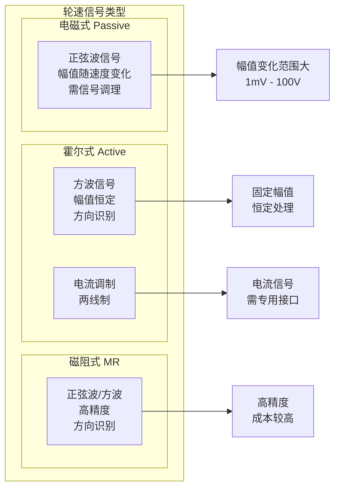
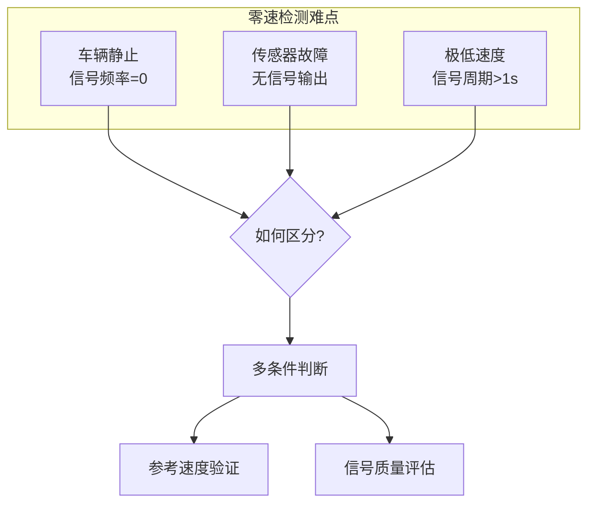

# 轮速传感器信号处理增强

> **文档编号**: WSS-ENHANCED-001  
003e **传感器类型**: 电磁式/霍尔式轮速传感器  
003e **信号频率**: 0.1 Hz - 15 kHz  
003e **处理目标**: 全范围精度 + 抗干扰 + 方向识别

---

## 1. 轮速信号特性分析

### 1.1 信号类型与特征



### 1.2 信号挑战

| 挑战 | 原因 | 影响 | 解决方案 |
|------|------|------|----------|
| **气隙变化** | 轮胎跳动、轴承磨损 | 幅值波动 | 自动增益控制(AGC) |
| **零速检测** | 车辆静止无信号 | 无法区分0速 vs 故障 | 零速算法 |
| **方向识别** | 前进/后退 | 速度方向 | 双霍尔/齿缺检测 |
| **电磁干扰** | 电机/点火系统 | 误触发 | 滤波+阈值自适应 |
| **齿缺信号** | ABS齿圈有齿缺 | 周期异常 | 齿缺检测与补偿 |

---

## 2. 增强型信号处理链

### 2.1 信号处理架构

```c
//=============================================================================
// 轮速信号处理主结构
//=============================================================================

typedef struct {
    // 原始信号
    float RawVoltage;              // 原始电压值
    float CurrentLevel;            // 电流电平 (两线制)
    
    // 信号调理后
    float FilteredVoltage;         // 滤波后电压
    float Envelope;                // 包络检测
    
    // 数字信号
    boolean DigitalSignal;         // 数字化信号
    uint32 EdgeTime;               // 边沿时间戳
    
    // 处理后结果
    float WheelSpeed;              // 轮速 (m/s)
    float WheelAccel;              // 轮加速度 (m/s²)
    boolean Direction;             // 方向 (TRUE=正向)
    SignalQualityType Quality;     // 信号质量
    
    // 状态
    boolean ZeroSpeedDetected;     // 零速标志
    boolean ToothGapDetected;      // 齿缺检测
    boolean FaultDetected;         // 故障标志
} WheelSpeedSignalType;

// 全局轮速数据结构
WheelSpeedSignalType WheelSpeedData[4];  // FL, FR, RL, RR
```

### 2.2 模拟前端处理 (电磁式传感器)

```c
//=============================================================================
// 模拟前端信号调理
//=============================================================================

// 自适应增益控制 (AGC)
float AdaptiveGainControl(float raw_voltage, uint8 wheel)
{
    static float gain[4] = {1.0};
    static float peak_voltage[4] = {0.0};
    
    // 检测峰值
    if (fabs(raw_voltage) > peak_voltage[wheel]) {
        peak_voltage[wheel] = fabs(raw_voltage);
    }
    
    // 峰值衰减 (模拟信号包络)
    peak_voltage[wheel] *= 0.999;
    
    // 目标峰值范围: 2V - 8V
    const float target_peak = 5.0;
    const float min_peak = 0.5;    // 最小可处理峰值
    
    if (peak_voltage[wheel] < min_peak) {
        // 信号太弱，可能零速或故障
        gain[wheel] = 10.0;  // 最大增益
    } else {
        // 调整增益使峰值接近目标
        float gain_error = target_peak / peak_voltage[wheel];
        gain[wheel] = gain[wheel] * 0.9 + gain_error * 0.1;  // 平滑调整
        
        // 限制增益范围
        if (gain[wheel] > 20.0) gain[wheel] = 20.0;
        if (gain[wheel] < 0.5) gain[wheel] = 0.5;
    }
    
    return raw_voltage * gain[wheel];
}

// 带通滤波 (消除噪声)
float BandPassFilter(float input, uint8 wheel)
{
    // 二阶带通滤波器
    // 通带: 轮速对应频率范围
    
    static float x1[4] = {0}, x2[4] = {0};
    static float y1[4] = {0}, y2[4] = {0};
    
    // 滤波器系数 (根据齿数和轮径计算)
    // 48齿, 轮胎周长约2m
    // 1 km/h = 48 * 1000/3600 / 2 = 6.67 Hz
    // 200 km/h = 1333 Hz
    
    const float a0 = 0.1, a1 = 0.0, a2 = -0.1;
    const float b1 = 1.8, b2 = -0.9;
    
    float output = a0 * input + a1 * x1[wheel] + a2 * x2[wheel]
                   - b1 * y1[wheel] - b2 * y2[wheel];
    
    // 更新状态
    x2[wheel] = x1[wheel];
    x1[wheel] = input;
    y2[wheel] = y1[wheel];
    y1[wheel] = output;
    
    return output;
}

// 施密特触发器 (数字化)
boolean SchmittTrigger(float voltage, uint8 wheel)
{
    static boolean last_state[4] = {FALSE};
    
    // 迟滞阈值
    const float threshold_high = 2.0;   // 上升阈值
    const float threshold_low = -2.0;   // 下降阈值
    
    if (voltage > threshold_high) {
        last_state[wheel] = TRUE;
    } else if (voltage < threshold_low) {
        last_state[wheel] = FALSE;
    }
    // 迟滞区保持原状态
    
    return last_state[wheel];
}
```

---

## 3. 零速检测算法

### 3.1 零速检测挑战



### 3.2 零速检测实现

```c
//=============================================================================
// 零速检测算法
//=============================================================================

#define ZERO_SPEED_TIMEOUT  500    // 500ms无信号判定零速
#define MIN_SPEED_THRESHOLD 0.3    // 0.3 m/s (约1 km/h)

typedef enum {
    SPEED_STATE_UNKNOWN = 0,
    SPEED_STATE_ZERO,
    SPEED_STATE_LOW,
    SPEED_STATE_NORMAL
} SpeedStateType;

// 零速检测主函数
SpeedStateType DetectZeroSpeed(uint8 wheel)
{
    static uint32 last_edge_time[4] = {0};
    static uint32 zero_speed_timer[4] = {0};
    
    uint32 current_time = GetMicrosecondTimer();
    
    // 检测边沿
    if (DetectEdge(wheel)) {
        last_edge_time[wheel] = current_time;
        zero_speed_timer[wheel] = 0;
        return SPEED_STATE_NORMAL;
    }
    
    // 计算无信号时间
    uint32 time_since_edge = current_time - last_edge_time[wheel];
    
    // 零速判断
    if (time_since_edge > ZERO_SPEED_TIMEOUT * 1000) {  // 转换为us
        // 长时间无信号
        
        // 验证1: 检查信号质量
        if (WheelSpeedData[wheel].Quality == SIGNAL_GOOD) {
            // 信号质量好但无脉冲 → 零速
            WheelSpeedData[wheel].ZeroSpeedDetected = TRUE;
            WheelSpeedData[wheel].WheelSpeed = 0.0;
            return SPEED_STATE_ZERO;
        } else {
            // 信号质量差 → 可能是故障
            WheelSpeedData[wheel].FaultDetected = TRUE;
            Dem_SetEventStatus(DTC_WSS_SIGNAL_LOSS + wheel, DEM_EVENT_STATUS_FAILED);
            return SPEED_STATE_UNKNOWN;
        }
    }
    
    // 极低速度判断 (周期 > 100ms)
    if (time_since_edge > 100000) {  // 100ms
        // 估计极低速度
        float period = time_since_edge / 1000000.0;  // s
        float freq = 1.0 / period;
        float speed = FrequencyToSpeed(freq, wheel);
        
        WheelSpeedData[wheel].WheelSpeed = speed;
        return SPEED_STATE_LOW;
    }
    
    return SPEED_STATE_NORMAL;
}

// 多轮参考验证
boolean ValidateZeroSpeedCrossReference(uint8 wheel)
{
    // 使用其他轮速验证当前轮是否真正零速
    
    uint8 zero_speed_count = 0;
    uint8 normal_count = 0;
    
    for (int i = 0; i < 4; i++) {
        if (i == wheel) continue;
        
        if (WheelSpeedData[i].ZeroSpeedDetected) {
            zero_speed_count++;
        } else if (WheelSpeedData[i].WheelSpeed > MIN_SPEED_THRESHOLD) {
            normal_count++;
        }
    }
    
    // 如果其他3轮都是零速，当前轮零速可信
    if (zero_speed_count >= 3) {
        return TRUE;
    }
    
    // 如果其他轮正常，当前轮可能故障
    if (normal_count >= 2) {
        // 标记为故障
        WheelSpeedData[wheel].FaultDetected = TRUE;
        return FALSE;
    }
    
    return TRUE;  // 不确定，假设零速
}
```

---

## 4. 方向识别算法

### 4.1 方向识别方法

```c
//=============================================================================
// 方向识别算法
//=============================================================================

// 方法1: 双霍尔传感器 (相位差90°)
boolean DetectDirection_DualHall(uint8 wheel)
{
    // 读取两个霍尔信号
    boolean hall_A = ReadHallSensor_A(wheel);
    boolean hall_B = ReadHallSensor_B(wheel);
    
    static boolean last_A[4] = {FALSE};
    static boolean last_B[4] = {FALSE};
    
    boolean direction;
    
    // 检测A上升沿
    if (hall_A && !last_A[wheel]) {
        // A上升时B的状态决定方向
        direction = hall_B;  // B=1正向, B=0反向 (取决于安装)
    }
    // 检测A下降沿
    else if (!hall_A && last_A[wheel]) {
        direction = !hall_B;
    }
    // 检测B上升沿
    else if (hall_B && !last_B[wheel]) {
        direction = !hall_A;
    }
    // 检测B下降沿
    else if (!hall_B && last_B[wheel]) {
        direction = hall_A;
    }
    
    last_A[wheel] = hall_A;
    last_B[wheel] = hall_B;
    
    return direction;
}

// 方法2: 齿缺检测 (单传感器)
boolean DetectDirection_ToothGap(uint8 wheel)
{
    // ABS齿圈有特定数量的齿缺 (如2个齿缺，相隔一定角度)
    // 通过齿缺间隔判断方向
    
    static uint32 tooth_count[4] = {0};
    static uint32 gap_positions[4][2] = {{0}};
    static boolean direction_confirmed[4] = {FALSE};
    
    // 检测齿缺 (周期突然变长)
    if (DetectToothGap(wheel)) {
        // 记录齿缺位置
        gap_positions[wheel][1] = gap_positions[wheel][0];
        gap_positions[wheel][0] = tooth_count[wheel];
        
        uint32 gap_interval = gap_positions[wheel][0] - gap_positions[wheel][1];
        
        // 根据齿缺间隔判断方向
        // 正向: 齿缺间隔 = 标准齿数 - 齿缺数
        // 反向: 齿缺间隔 = 齿缺数
        
        const uint16 standard_teeth = 48;
        const uint8 gap_teeth = 2;
        
        if (gap_interval == standard_teeth - gap_teeth) {
            WheelSpeedData[wheel].Direction = TRUE;  // 正向
            direction_confirmed[wheel] = TRUE;
        } else if (gap_interval == gap_teeth) {
            WheelSpeedData[wheel].Direction = FALSE; // 反向
            direction_confirmed[wheel] = TRUE;
        }
        
        tooth_count[wheel] = 0;
    }
    
    tooth_count[wheel]++;
    
    return WheelSpeedData[wheel].Direction;
}

// 齿缺检测
boolean DetectToothGap(uint8 wheel)
{
    static float last_period[4] = {0};
    
    float current_period = GetCurrentPeriod(wheel);
    
    // 当前周期远大于正常周期 → 齿缺
    if (current_period > last_period[wheel] * 1.5 && 
        current_period > 1000) {  // 1ms
        last_period[wheel] = current_period;
        return TRUE;
    }
    
    last_period[wheel] = current_period;
    return FALSE;
}
```

---

## 5. 信号质量评估

### 5.1 信号质量指标

```c
//=============================================================================
// 信号质量评估
//=============================================================================

typedef enum {
    SIGNAL_EXCELLENT = 0,          // 优秀
    SIGNAL_GOOD,                   // 良好
    SIGNAL_FAIR,                   // 一般
    SIGNAL_POOR,                   // 较差
    SIGNAL_BAD                     // 差/故障
} SignalQualityType;

// 信号质量评估主函数
SignalQualityType AssessSignalQuality(uint8 wheel)
{
    uint8 quality_score = 100;     // 初始满分
    
    // 1. 幅值检查
    float amplitude = WheelSpeedData[wheel].Envelope;
    if (amplitude < 1.0) {
        quality_score -= 30;       // 幅值过低
    } else if (amplitude < 2.0) {
        quality_score -= 15;
    }
    
    // 2. 周期稳定性检查
    float period_variance = CalculatePeriodVariance(wheel);
    if (period_variance > 0.1) {  // 变化 > 10%
        quality_score -= 20;
    }
    
    // 3. 噪声检查
    float snr = CalculateSNR(wheel);
    if (snr < 10.0) {             // SNR < 10dB
        quality_score -= 25;
    }
    
    // 4. 零速状态持续时间
    if (WheelSpeedData[wheel].ZeroSpeedDetected) {
        static uint32 zero_speed_duration[4] = {0};
        zero_speed_duration[wheel] += 2;  // 2ms
        
        if (zero_speed_duration[wheel] > 10000) {  // > 20s
            quality_score -= 10;   // 长时间零速，可能停车或故障
        }
    }
    
    // 转换为质量等级
    if (quality_score >= 90) return SIGNAL_EXCELLENT;
    if (quality_score >= 75) return SIGNAL_GOOD;
    if (quality_score >= 50) return SIGNAL_FAIR;
    if (quality_score >= 25) return SIGNAL_POOR;
    return SIGNAL_BAD;
}

// 周期方差计算
float CalculatePeriodVariance(uint8 wheel)
{
    #define PERIOD_HISTORY 10
    static float period_history[4][PERIOD_HISTORY];
    static uint8 history_index[4] = {0};
    
    // 记录当前周期
    period_history[wheel][history_index[wheel]] = GetCurrentPeriod(wheel);
    history_index[wheel] = (history_index[wheel] + 1) % PERIOD_HISTORY;
    
    // 计算均值
    float sum = 0;
    for (int i = 0; i < PERIOD_HISTORY; i++) {
        sum += period_history[wheel][i];
    }
    float mean = sum / PERIOD_HISTORY;
    
    // 计算方差
    float variance = 0;
    for (int i = 0; i < PERIOD_HISTORY; i++) {
        variance += pow(period_history[wheel][i] - mean, 2);
    }
    variance /= PERIOD_HISTORY;
    
    // 归一化方差
    return variance / (mean * mean);
}

// 信噪比计算
float CalculateSNR(uint8 wheel)
{
    // 信号功率
    float signal_power = WheelSpeedData[wheel].Envelope * 
                         WheelSpeedData[wheel].Envelope;
    
    // 噪声功率估计 (信号零交叉附近的波动)
    float noise_power = EstimateNoisePower(wheel);
    
    if (noise_power < 1e-10) noise_power = 1e-10;  // 避免除零
    
    float snr = 10.0 * log10(signal_power / noise_power);
    
    return snr;
}
```

---

## 6. 故障检测与诊断

### 6.1 轮速传感器故障检测

```c
//=============================================================================
// 轮速传感器故障检测
//=============================================================================

// 故障类型定义
typedef enum {
    WSS_FAULT_NONE = 0,
    WSS_FAULT_OPEN_CIRCUIT,        // 开路
    WSS_FAULT_SHORT_CIRCUIT,       // 短路
    WSS_FAULT_SIGNAL_LOSS,         // 信号丢失
    WSS_FAULT_SIGNAL_ERRATIC,      // 信号不稳定
    WSS_FAULT_DIRT buildup         // 脏污
} WSS_FaultType;

// 开路检测 (两线制电流传感器)
boolean DetectOpenCircuit(uint8 wheel)
{
    // 正常工作时电流: 7mA / 14mA
    // 开路时电流: ~0mA
    
    float current = GetSensorCurrent(wheel);
    
    if (current < 1.0) {  // < 1mA
        return TRUE;
    }
    return FALSE;
}

// 短路检测
boolean DetectShortCircuit(uint8 wheel)
{
    // 短路时电流异常高
    float current = GetSensorCurrent(wheel);
    
    if (current > 30.0) {  // > 30mA
        return TRUE;
    }
    return FALSE;
}

// 信号不稳定检测
boolean DetectErraticSignal(uint8 wheel)
{
    // 周期变化率异常
    float period_change_rate = CalculatePeriodChangeRate(wheel);
    
    if (period_change_rate > 0.5) {  // 变化 > 50%
        return TRUE;
    }
    
    // 幅值跳变
    float amplitude_jump = DetectAmplitudeJump(wheel);
    if (amplitude_jump > 10.0) {  // 跳变 > 10x
        return TRUE;
    }
    
    return FALSE;
}

// 脏污检测
boolean DetectDirtBuildup(uint8 wheel)
{
    // 脏污导致信号幅值逐渐降低
    static float amplitude_history[4][100];
    
    // 检测幅值下降趋势
    float trend = CalculateAmplitudeTrend(wheel);
    
    if (trend < -0.1) {  // 持续下降
        return TRUE;
    }
    
    return FALSE;
}
```

---

## 7. 轮速融合与参考车速

### 7.1 参考车速计算

```c
//=============================================================================
// 参考车速计算 (Vehicle Reference Speed)
//=============================================================================

float CalculateReferenceSpeed(void)
{
    float wheel_speeds[4];
    boolean valid_wheels[4];
    uint8 valid_count = 0;
    
    // 收集有效轮速
    for (int i = 0; i < 4; i++) {
        if (WheelSpeedData[i].Quality >= SIGNAL_FAIR &&
            !WheelSpeedData[i].FaultDetected) {
            wheel_speeds[i] = WheelSpeedData[i].WheelSpeed;
            valid_wheels[i] = TRUE;
            valid_count++;
        } else {
            valid_wheels[i] = FALSE;
        }
    }
    
    if (valid_count == 0) {
        // 所有轮速无效，使用上次有效值或进入安全状态
        return LastValidReferenceSpeed;
    }
    
    // 选择策略
    float reference_speed;
    
    if (valid_count == 4) {
        // 四轮有效，使用最高轮速 (保守估计)
        reference_speed = FindMax(wheel_speeds, 4);
    } else if (valid_count >= 2) {
        // 至少两轮有效，使用中位数
        reference_speed = CalculateMedian(wheel_speeds, valid_wheels);
    } else {
        // 仅一轮有效，使用该轮速
        for (int i = 0; i < 4; i++) {
            if (valid_wheels[i]) {
                reference_speed = wheel_speeds[i];
                break;
            }
        }
    }
    
    // 合理性检查
    if (reference_speed > 100.0) {  // > 360km/h
        reference_speed = LastValidReferenceSpeed;
        Dem_SetEventStatus(DTC_REF_SPEED_IMPLAUSIBLE, DEM_EVENT_STATUS_FAILED);
    }
    
    LastValidReferenceSpeed = reference_speed;
    return reference_speed;
}
```

---

*轮速传感器信号处理增强*  
*全范围精度、零速检测、方向识别、故障诊断*