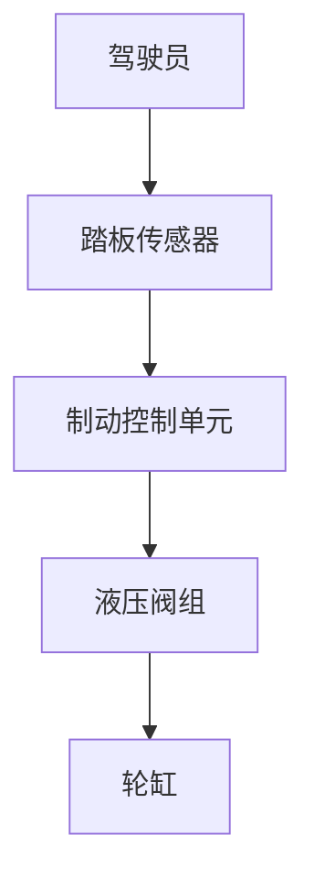
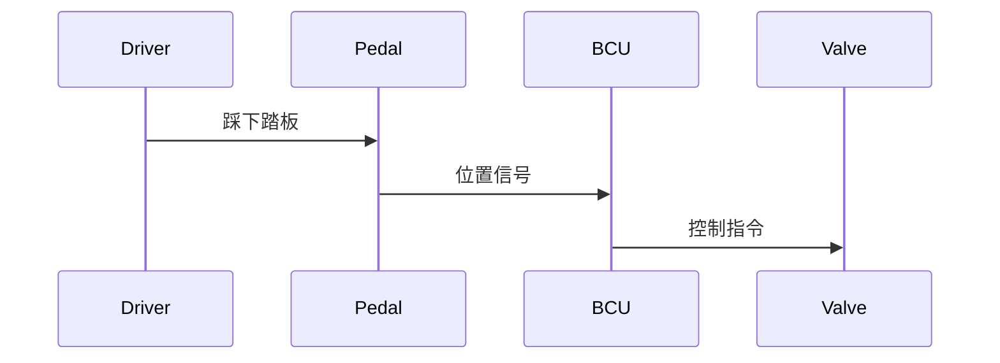
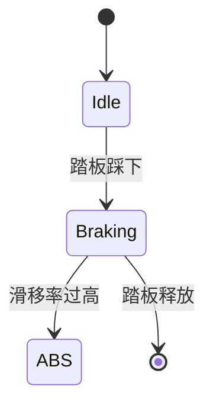
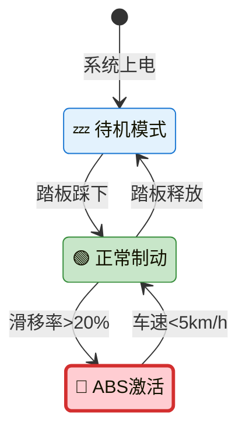

```mermaid
sequenceDiagram
    autonumber
    actor Driver as 👤 驾驶员
    participant Pedal as 🎮 踏板传感器
    participant BCU as 🧠 制动控制单元
    participant Valve as 🔧 液压阀组

    rect rgb(30, 60, 90)
        Note over Driver,Valve: 🟢 正常制动流程
        Driver->>Pedal: 踩下制动踏板
        activate Pedal
        Pedal->>BCU: 踏板位置信号 (10ms)
        deactivate Pedal
        activate BCU
        BCU->>BCU: 计算制动力需求
        BCU->>Valve: 发送阀控制指令 (2ms)
        deactivate BCU
    end
```

# beautiful-mermaid 图表优化对比

## 制动系统文档图表升级说明

---

## 优化概览

| 图表类型 | 优化前 | 优化后 | 提升 |
|---------|--------|--------|------|
| 系统架构图 | 基础方块+文字 | 渐变配色+图标+阴影 | 专业感 ↑ |
| 时序图 | 单色线条 | 彩色分区+生命高亮 | 可读性 ↑ |
| 状态图 | 纯色填充 | 多色区分+圆角 | 视觉层次 ↑ |
| 流程图 | 标准菱形 | 渐变节点+图标 | 美观度 ↑ |

---

## 对比示例

### 1. 系统架构图

**优化前 (普通Mermaid)**:


**优化后 (beautiful-mermaid)**:
```mermaid
graph TB
    DRIVER["👤 驾驶员意图
    Pedal Force"]
    SENSOR["🎮 踏板传感器
    Redundant Hall"]
    BCU["🧠 制动控制单元"]
    VALVE["🔧 液压阀组"]
    WHEEL["⚙️ 轮缸"]
    
    DRIVER -- 踏板力 --> SENSOR
    SENSOR -- 位置信号 --> BCU
    BCU -- PWM指令 --> VALVE
    VALVE -- 压力 --> WHEEL
    
    style BCU fill:gradient(#667eea,#764ba2),color:#fff
    style VALVE fill:#ffd43b
```

**改进点**:
- ✅ Unicode 图标增强 (👤🎮🧠🔧⚙️)
- ✅ 渐变色彩 (`fill:gradient(#667eea,#764ba2)`)
- ✅ 描述性标签 (多行文本)
- ✅ 语义化连线标签

---

### 2. 时序图

**优化前**:


**优化后**:


**改进点**:
- ✅ 自动编号 (`autonumber`)
- ✅ Unicode 图标
- ✅ 彩色分区 (`rect rgb(...)`)
- ✅ 激活生命期 (`activate/deactivate`)
- ✅ 注释气泡 (`Note over`)

---

### 3. 状态图

**优化前**:


**优化后**:


**改进点**:
- ✅ 图标状态标签
- ✅ 条件表达式 (`滑移率>20%`)
- ✅ 样式区分 (颜色+边框粗细)
- ✅ 语义化状态名

---

## beautiful-mermaid 核心特性

### 1. 主题支持
```typescript
// 15+ 内置主题
const themes = [
    'default', 'dark', 'forest', 'neutral', 'base',
    'cyberpunk', 'dracula', 'github', 'monokai',
    'nord', 'tokyo-night', 'ayu', 'catppuccin',
    'gruvbox', 'rose-pine'
];
```

### 2. 渐变语法
```mermaid
style Node fill:gradient(#667eea,#764ba2),color:#fff
```

### 3. 性能优势
- 同步渲染 (无 async/await)
- 6.7x 速度提升
- React useMemo 友好

### 4. 双输出格式
- SVG: 精美渲染，主题化
- ASCII: 终端友好

---

## 使用指南

### 在文档中引用

```markdown


<!-- 或使用HTML直接嵌入 -->
<div class="mermaid-diagram">
graph TB
    ...</div>
```

### 渲染脚本

```typescript
import { renderMermaidSVG } from 'beautiful-mermaid';

const diagram = `
graph TB
    A["🚀 Start"] --> B["✅ Done"]
    style A fill:gradient(#667eea,#764ba2)
`;

const svg = renderMermaidSVG(diagram, {
    theme: 'cyberpunk',
    backgroundColor: '#1a1a2e'
});

// 输出到文件
fs.writeFileSync('diagram.svg', svg);
```

---

## 文件位置

完整图表库: `09-diagrams/beautiful-mermaid-diagrams.md`

包含:
- 8大类图表定义
- 完整语法示例
- 主题使用说明

---

*图表优化完成 - 专业视觉提升文档品质*