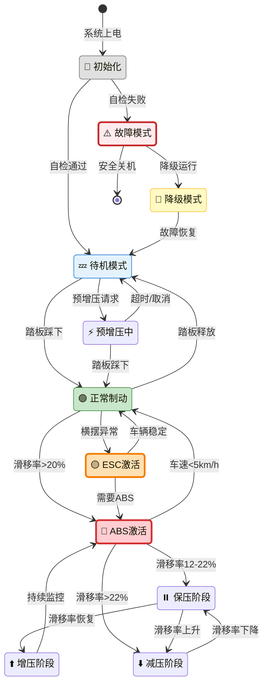
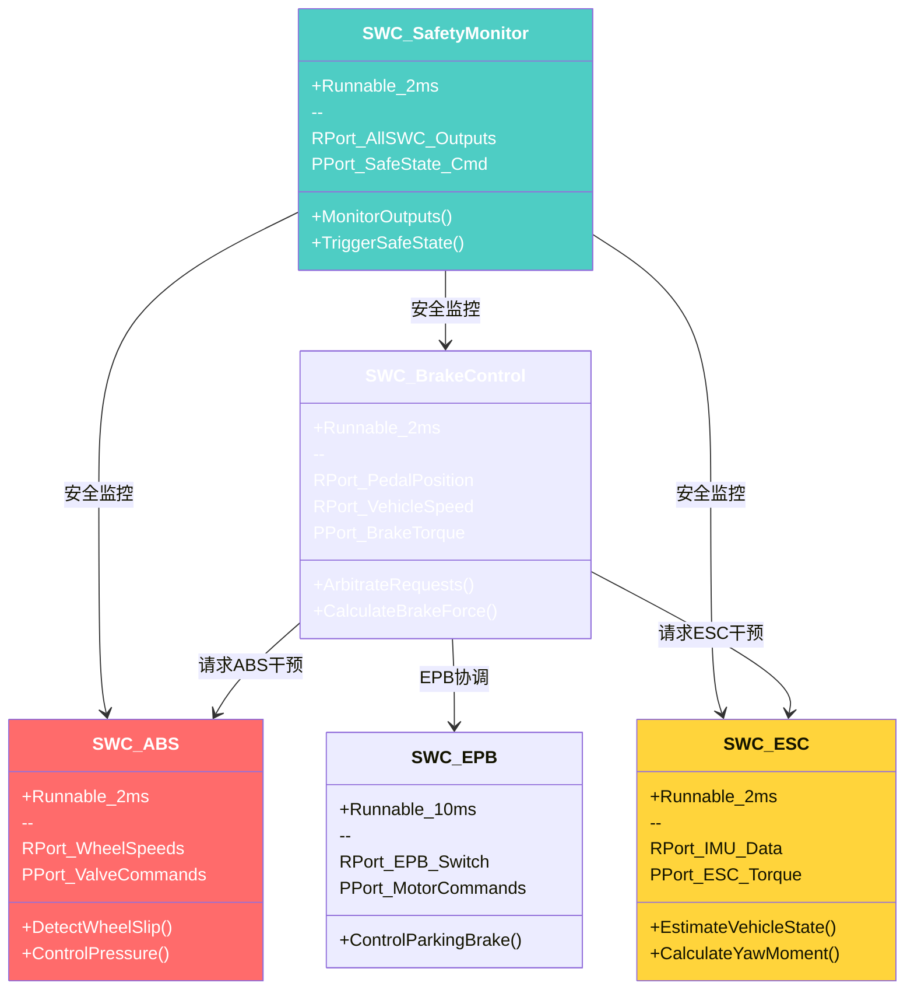
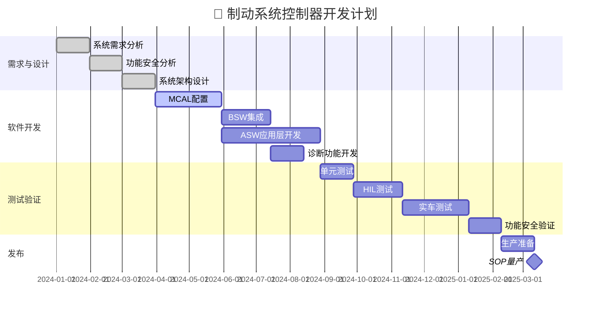
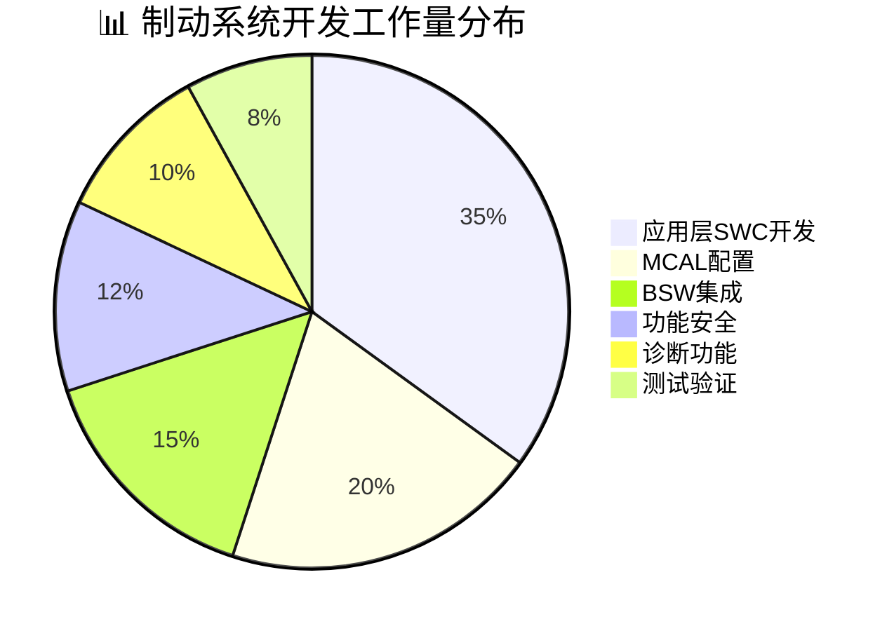

# beautiful-mermaid 制动系统图表库

> **文档用途**: 使用 beautiful-mermaid 增强语法优化制动系统文档中的图表  
> **优化目标**: 专业视觉、清晰层次、美观配色  
> **兼容**: 支持所有 beautiful-mermaid 主题

---

## 1. 系统架构图 - 增强版

### 1.1 端到端系统架构 (渐变配色)

```mermaid
graph TB
    subgraph Physical["🌍 物理世界"]
        DRIVER["👤 驾驶员意图
        Pedal Force"]
        ROAD["🛣️ 路面条件
        μ, Slope"]
        VEHICLE["🚗 车辆动态
        Vx, Ay, Yaw"]
    end

    subgraph Sensing["📡 感知层"]
        SENSOR_PEDAL["🎮 踏板传感器
        Redundant Hall"]
        SENSOR_WSS["⚙️ 轮速传感器
        4×Active WSS"]
        SENSOR_IMU["📊 惯性传感器
        6-DoF IMU"]
        SENSOR_PRESS["🔧 压力传感器
        Master + 4×Wheel"]
        SENSOR_STEER["🔄 转向传感器
        SAS"]
    end

    subgraph Decision["🧠 决策层"]
        ESTIMATION["📈 状态估计
        Vehicle State Observer"]
        ARBITRATION["⚖️ 请求仲裁
        Driver + ADAS + AEB"]
        CONTROLLER["🎯 控制器集群
        ABS + EBD + ESC + EPB"]
        SAFETY_MONITOR["🛡️ 安全监控
        ASIL-D Safety Core"]
    end

    subgraph Actuation["🔧 执行层"]
        HCU["🔌 液压控制单元
        Valve Control"]
        HYDRAULIC["⚡ 液压调制
        Pump + 12×Solenoid"]
        EPB_ACT["🔒 EPB执行
        2×Motor + Gear"]
    end

    subgraph Network["🌐 车辆网络"]
        CAN_CHASSIS["📡 底盘域CAN
        500kbps"]
        CAN_POWER["🔋 动力域CAN
        500kbps"]
        ETH_ADAS["🚀 ADAS以太网
        100Mbps"]
    end

    subgraph External["🔗 外部系统"]
        ADAS_SYS["🤖 ADAS域
        AEB, ACC"]
        VCU["🎛️ 整车控制器
        Torque Coordination"]
        EPS["🔄 转向系统
        Steering Angle"]
        CLUSTER["📺 仪表
        Warning Display"]
    end

    DRIVER -- 踏板力 --> SENSOR_PEDAL
    ROAD -- 附着系数 --> VEHICLE
    VEHICLE -- 轮速 --> SENSOR_WSS
    VEHICLE -- 姿态 --> SENSOR_IMU
    
    SENSOR_PEDAL -- 位置信号 --> ESTIMATION
    SENSOR_WSS -- 速度信号 --> ESTIMATION
    SENSOR_IMU -- 加速度 --> ESTIMATION
    SENSOR_PRESS -- 压力反馈 --> CONTROLLER
    SENSOR_STEER -- 转角 --> CONTROLLER
    
    ESTIMATION -- 车辆状态 --> ARBITRATION
    ADAS_SYS -- 制动请求 --> ETH_ADAS --> ARBITRATION
    
    ARBITRATION -- 目标减速度 --> CONTROLLER
    CONTROLLER -- 监控数据 --> SAFETY_MONITOR
    SAFETY_MONITOR -- 安全干预 --> CONTROLLER
    
    CONTROLLER -- PWM指令 --> HCU
    HCU -- 阀驱动 --> HYDRAULIC
    CONTROLLER -- 电机指令 --> EPB_ACT
    
    CONTROLLER -- 状态广播 --> CAN_CHASSIS --> VCU
    CONTROLLER -- 横摆力矩 --> CAN_CHASSIS --> EPS
    CONTROLLER -- 警告信号 --> CAN_CHASSIS --> CLUSTER
    
    HYDRAULIC -- 制动力 --> VEHICLE
    EPB_ACT -- 驻车力 --> VEHICLE

    style Decision fill:gradient(#667eea,#764ba2),stroke:#fff,stroke-width:2px
    style SAFETY_MONITOR fill:#ffd43b,stroke:#ff922b,stroke-width:2px
    style Sensing fill:#e3f2fd,stroke:#1976d2
    style Actuation fill:#fff3e0,stroke:#f57c00
    style Physical fill:#e8f5e9,stroke:#388e3c
    style Network fill:#f3e5f5,stroke:#7b1fa2
    style External fill:#fce4ec,stroke:#c2185b
```

---

## 2. 功能安全分区图 - 增强版

```mermaid
graph TB
    subgraph ECU["🖥️ ECU功能安全分区"]
        
        subgraph QM["QM分区 - 非安全相关"]
            QM_ICON["📋"]
            QM_TEXT["QM SWCs
            Diagnostics
            Logging
            Calibration"]
        end
        
        subgraph ASIL_B["ASIL-B分区"]
            B_ICON["🔒"]
            B_TEXT["ASIL-B SWCs
            EPB Control
            Autohold
            HMI Interface"]
        end
        
        subgraph ASIL_D["ASIL-D分区 - 最高安全"]
            D_ICON["🛡️"]
            D_TEXT["ASIL-D SWCs
            ABS/ESC Core
            Pressure Control
            Safety Monitor"]
            SAFETY_CORE["🔐 安全监控核
            Lockstep Core"]
        end
        
        subgraph Protection["分区间保护"]
            E2E["E2E保护
            End-to-End"]
            MPU["MPU隔离
            Memory Protection"]
        end
    end

    QM_TEXT ==> E2E ==> B_TEXT
    B_TEXT ==> E2E ==> D_TEXT
    
    D_TEXT ==> SAFETY_CORE
    SAFETY_CORE ==> D_TEXT
    
    E2E -. E2E校验 .-> MPU

    style ASIL_D fill:gradient(#ff6b6b,#c0392b),color:#fff,stroke:#fff,stroke-width:3px
    style SAFETY_CORE fill:#ffd43b,stroke:#ff922b,stroke-width:3px
    style ASIL_B fill:gradient(#ffd43b,#ff922b),stroke:#fff,stroke-width:2px
    style QM fill:gradient(#e0e0e0,#bdbdbd),stroke:#757575,stroke-width:2px
    style Protection fill:gradient(#4ecdc4,#44a3aa),color:#fff,stroke:#fff
```

---

## 3. 时序图 - 制动控制流程

### 3.1 正常制动时序

```mermaid
sequenceDiagram
    autonumber
    actor Driver as 👤 驾驶员
    participant Pedal as 🎮 踏板传感器
    participant BCU as 🧠 制动控制单元
    participant Estimator as 📈 状态估计
    participant Valve as 🔧 液压阀组
    participant Wheel as ⚙️ 轮缸
    participant Vehicle as 🚗 车辆

    rect rgb(30, 60, 90)
        Note over Driver,Vehicle: 🟢 正常制动流程
        Driver->>Pedal: 踩下制动踏板
        activate Pedal
        Pedal->>BCU: 踏板位置信号 (10ms)
        deactivate Pedal
        activate BCU
        BCU->>Estimator: 请求车辆状态
        activate Estimator
        Estimator-->>BCU: 车速/减速度
        deactivate Estimator
        BCU->>BCU: 计算制动力需求
        BCU->>Valve: 发送阀控制指令 (2ms)
        deactivate BCU
        activate Valve
        Valve->>Wheel: 建立轮缸压力 (20ms)
        deactivate Valve
        activate Wheel
        Wheel->>Vehicle: 施加制动力
        Wheel-->>BCU: 压力反馈信号
        deactivate Wheel
    end
```



### 3.2 ABS激活时序

```mermaid
sequenceDiagram
    autonumber
    participant BCU as 🧠 BCU主控
    participant ABS as ⚡ ABS模块
    participant Estimator as 📊 状态估计
    participant Valve_In as 🔼 进油阀
    participant Valve_Out as 🔽 出油阀
    participant Pump as ⛽ 泵电机
    participant Wheel as ⚙️ 轮缸

    rect rgb(90, 30, 30)
        Note over BCU,Wheel: 🔴 ABS防抱死控制
        BCU->>Estimator: 查询轮速/滑移率
        Estimator-->>BCU: λ = 28% > 阈值
        BCU->>ABS: 请求ABS干预
        activate ABS
        
        Note over ABS: ABS循环控制 (60-120ms/周期)
        
        loop 滑移率控制循环
            ABS->>Valve_In: 关闭指令
            ABS->>Valve_Out: 开启指令
            ABS->>Pump: 启动泵电机
            Valve_Out->>Wheel: 轮缸减压
            Wheel-->>ABS: 滑移率反馈
            
            alt 滑移率恢复
                ABS->>Valve_Out: 关闭指令
                ABS->>Valve_In: 开启指令
                Valve_In->>Wheel: 轮缸增压
            else 需要保压
                ABS->>Valve_In: 关闭指令
                ABS->>Valve_Out: 关闭指令
            end
        end
        
        Wheel-->>ABS: 滑移率稳定 λ=15%
        deactivate ABS
    end
```



---

## 4. 状态图 - 制动控制状态机

### 4.1 系统主状态机



---

## 5. 流程图 - 请求仲裁逻辑

```mermaid
flowchart TD
    Start([🚀 开始]) --> Input{📥 输入请求}
    
    Input --> Driver[👤 驾驶员请求]
    Input --> ADAS[🤖 ADAS请求]
    Input --> AEB[⚠️ AEB紧急请求]
    Input --> EPB[🔒 EPB请求]
    
    Driver --> Priority{⚖️ 优先级仲裁}
    ADAS --> Priority
    AEB --> Priority
    EPB --> Priority
    
    Priority -->|AEB激活| Emergency[🚨 紧急制动模式
    最高优先级]
    Priority -->|ADAS激活| Assisted[🛣️ 辅助制动模式]
    Priority -->|仅驾驶员| Normal[👤 正常驾驶模式]
    Priority -->|EPB激活| Parking[🔒 驻车模式]
    
    Emergency --> Calc[📊 计算目标减速度]
    Assisted --> Calc
    Normal --> Calc
    Parking --> CalcParking[📊 计算驻车力]
    
    Calc --> Safety{🛡️ 安全检查}
    CalcParking --> Safety
    
    Safety -->|通过| Execute[✅ 执行控制]
    Safety -->|失败| SafeState[⚠️ 安全状态
    限制输出]
    
    Execute --> Output([📤 输出到执行器])
    SafeState --> Output
    
    style Start fill:gradient(#667eea,#764ba2),color:#fff
    style Emergency fill:#ff6b6b,color:#fff,stroke:#c0392b,stroke-width:3px
    style Output fill:gradient(#4ecdc4,#44a3aa),color:#fff
    style SafeState fill:#ffd43b,stroke:#ff922b,stroke-width:2px
```

---

## 6. 类图 - SWC组件关系



---

## 7. 甘特图 - 项目开发计划



---

## 8. 饼图 - 开发工作量分布



---

## 使用说明

### 在 beautiful-mermaid 中渲染

```typescript
import { renderMermaidSVG } from 'beautiful-mermaid';

// 读取图表定义
const diagram = `...mermaid图表代码...`;

// 渲染SVG
const svg = renderMermaidSVG(diagram, {
    theme: 'cyberpunk',  // 可选主题
    backgroundColor: '#1a1a2e'
});

// 输出到HTML
document.getElementById('diagram').innerHTML = svg;
```

### 主题推荐

| 场景 | 推荐主题 |
|------|----------|
| 技术文档 | `nord`, `github` |
| 演示汇报 | `cyberpunk`, `tokyo-night` |
| 打印输出 | `neutral`, `default` |
| 暗色界面 | `dracula`, `catppuccin` |

---

*beautiful-mermaid 制动系统图表库*  
*专业视觉效果，提升文档品质*