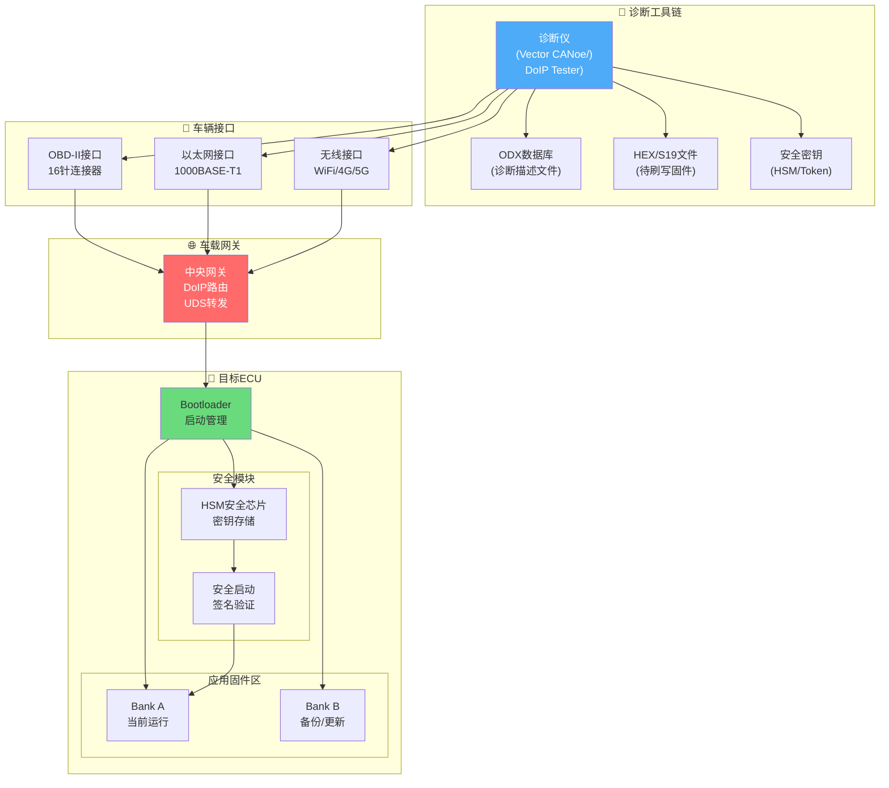
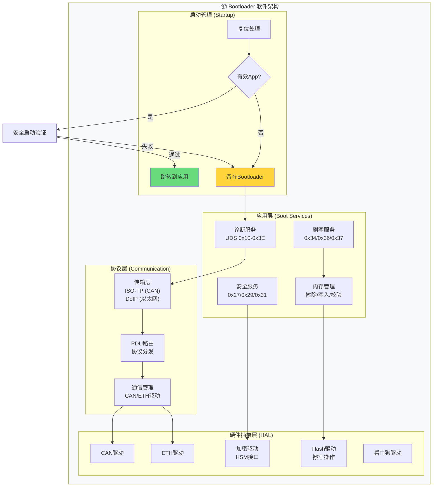
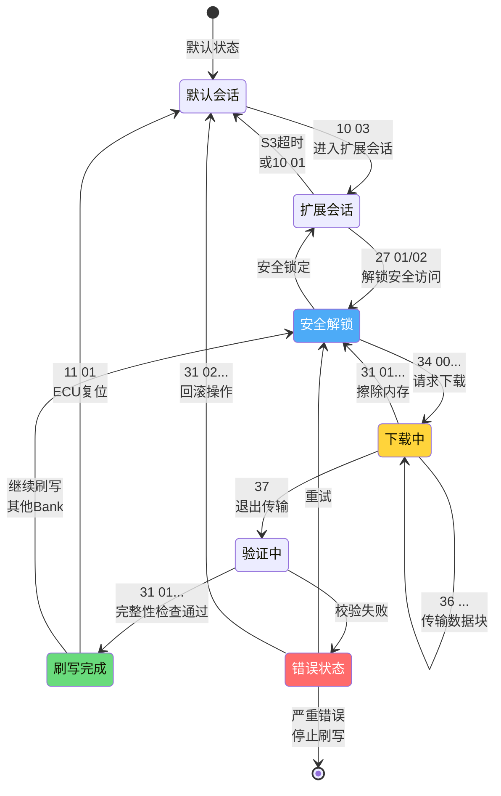
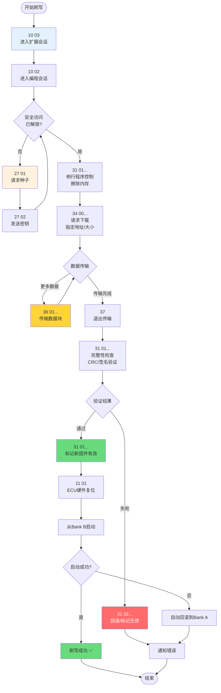
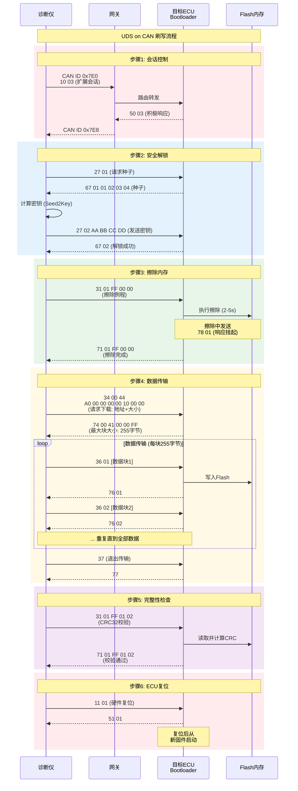
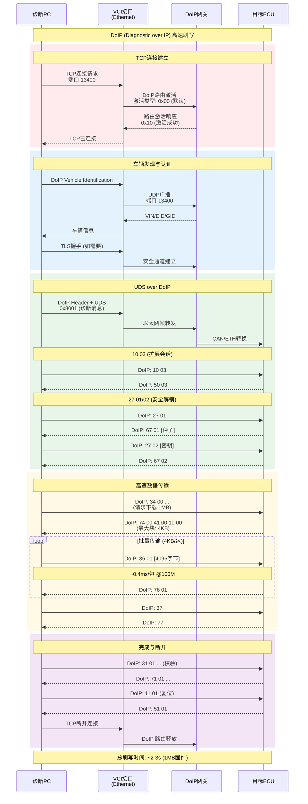
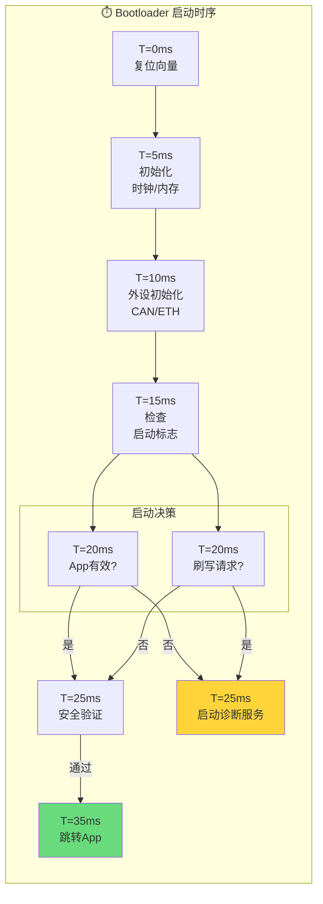
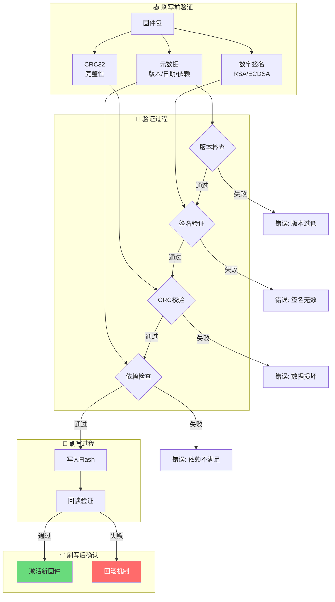
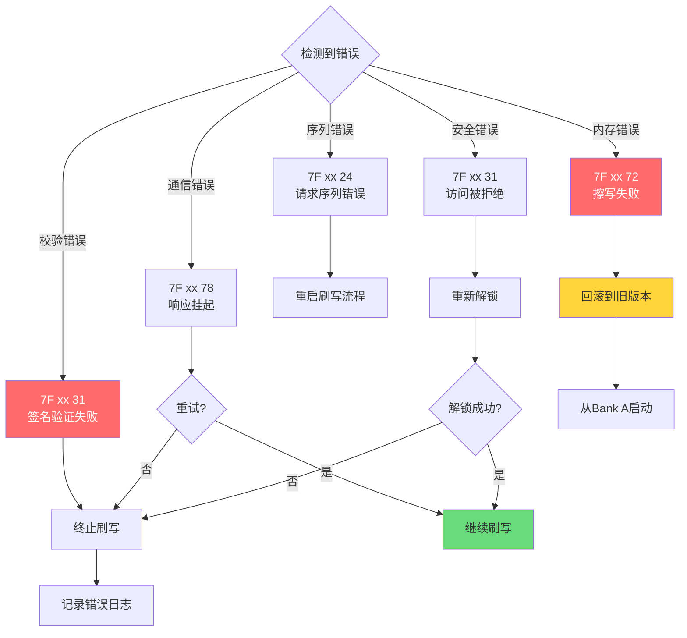

# 车载诊断刷写（Flashing）系统设计方案

> **文档版本**: v1.0  
> **编制日期**: 2026-03-08  
> **方案类型**: 诊断刷写与程序更新  
> **技术领域**: UDS / DoIP / Bootloader / AUTOSAR

---

## 1. 项目概述

### 1.1 设计目标

设计一套完整的车载ECU诊断刷写系统，支持：
- **UDS on CAN**: 传统CAN总线诊断刷写
- **DoIP (Diagnostic over IP)**: 以太网高速诊断刷写
- **Bootloader**: 安全可靠的引导程序
- **安全刷写**: 加密、签名、防回滚机制

### 1.2 性能指标

| 指标 | CAN刷写 | DoIP刷写 | 说明 |
|------|---------|----------|------|
| 传输速率 | 500kbps | 100Mbps | 物理层速率 |
| 实际吞吐 | ~40KB/s | ~5MB/s | 有效数据速率 |
| 1MB固件刷写 | ~25s | ~0.2s | 理论最短时间 |
| 支持文件大小 | 最大32MB | 最大1GB | 单文件限制 |
| 安全等级 | CMAC/HMAC |  TLS + CMAC | 安全认证 |

---

## 2. 系统架构设计

### 2.1 整体系统架构



### 2.2 Bootloader软件架构



### 2.3 双Bank刷写机制

```
┌─────────────────────────────────────────────────────────────────┐
│                    Flash内存布局 (双Bank设计)                      │
├─────────────────────────────────────────────────────────────────┤
│                                                                 │
│  ┌─────────────────────┐    ┌─────────────────────┐            │
│  │      Bank A         │    │      Bank B         │            │
│  │   (当前运行区)       │    │   (备份/更新区)      │            │
│  ├─────────────────────┤    ├─────────────────────┤            │
│  │                     │    │                     │            │
│  │   应用固件 (App)     │    │   应用固件 (App)     │            │
│  │   0xA000_0000       │    │   0xB000_0000       │            │
│  │   大小: 2MB         │    │   大小: 2MB         │            │
│  │   版本: v2.1 (当前)  │    │   版本: v2.2 (新)    │            │
│  │                     │    │                     │            │
│  └─────────────────────┘    └─────────────────────┘            │
│                                                                 │
│  ┌─────────────────────────────────────────────────────────┐   │
│  │              Bootloader区域 (固定)                       │   │
│  │              0x8000_0000 - 0x8002_0000                  │   │
│  │              大小: 128KB                                │   │
│  └─────────────────────────────────────────────────────────┘   │
│                                                                 │
│  ┌─────────────────────────────────────────────────────────┐   │
│  │              配置/标定区域 (Data Flash)                  │   │
│  │              0x800F_0000 - 0x8010_0000                  │   │
│  │              大小: 64KB                                 │   │
│  └─────────────────────────────────────────────────────────┘   │
│                                                                 │
│  刷写流程:                                                       │
│  1. 新固件写入 Bank B                                           │
│  2. 验证 Bank B 完整性和签名                                     │
│  3. 切换启动标志到 Bank B                                        │
│  4. 复位，从 Bank B 启动                                         │
│  5. 验证成功 → Bank A 作为备份                                   │
│     验证失败 → 回滚到 Bank A                                     │
│                                                                 │
└─────────────────────────────────────────────────────────────────┘
```

---

## 3. UDS诊断服务设计

### 3.1 刷写流程状态机



### 3.2 UDS服务流程



---

## 4. 交互时序设计

### 4.1 CAN总线刷写时序



### 4.2 DoIP高速刷写时序



### 4.3 Bootloader启动流程（静态时序）



**详细时序表**:

| 阶段 | 时间 | 操作 | 说明 |
|------|------|------|------|
| 复位向量 | 0-5ms | 从Reset Vector启动 | 硬件复位后自动执行 |
| 基础初始化 | 5-10ms | 时钟、PLL、内存 | 配置系统时钟到最高频率 |
| 外设初始化 | 10-15ms | CAN/ETH/GPIO | 初始化诊断通信接口 |
| 启动检查 | 15-20ms | 读取启动标志 | 从Data Flash读取配置 |
| 安全验证 | 20-35ms | CRC/签名验证 | 验证应用固件完整性 |
| 跳转App | 35ms+ | 跳转到应用入口 | 0xA000_0000或0xB000_0000 |
| 启动诊断 | 20ms+ | 等待诊断连接 | 留在Bootloader模式 |

---

## 5. 安全刷写机制

### 5.1 安全验证流程



### 5.2 加密与签名方案

```
┌─────────────────────────────────────────────────────────────────┐
│                    固件安全保护方案                              │
├─────────────────────────────────────────────────────────────────┤
│                                                                 │
│  1. 固件加密 (Confidentiality)                                  │
│  ┌─────────────────────────────────────────────────────────┐   │
│  │  明文固件                                               │   │
│  │     ↓                                                   │   │
│  │  AES-128-CBC 加密                                       │   │
│  │     ↓                                                   │   │
│  │  密文固件 + IV                                          │   │
│  │     ↓                                                   │   │
│  │  存储/传输                                              │   │
│  │     ↓                                                   │   │
│  │  Bootloader解密 (HSM密钥)                               │   │
│  └─────────────────────────────────────────────────────────┘   │
│                                                                 │
│  2. 固件签名 (Integrity & Authenticity)                        │
│  ┌─────────────────────────────────────────────────────────┐   │
│  │  固件内容                                               │   │
│  │     ↓                                                   │   │
│  │  SHA-256 哈希                                           │   │
│  │     ↓                                                   │   │
│  │  RSA-2048 签名 (私钥签名)                               │   │
│  │     ↓                                                   │   │
│  │  签名值附加到固件尾部                                   │   │
│  │     ↓                                                   │   │
│  │  Bootloader验证 (公钥验证)                              │   │
│  └─────────────────────────────────────────────────────────┘   │
│                                                                 │
│  3. 安全启动链 (Secure Boot Chain)                             │
│  ┌─────────────────────────────────────────────────────────┐   │
│  │  Bootloader (Root of Trust)                             │   │
│  │     ↓ 验证签名                                          │   │
│  │  应用固件 Bank A/B                                      │   │
│  │     ↓ 验证通过                                          │   │
│  │  启动应用                                               │   │
│  │     ↓ 验证失败                                          │   │
│  │  留在Bootloader/回滚                                    │   │
│  └─────────────────────────────────────────────────────────┘   │
│                                                                 │
└─────────────────────────────────────────────────────────────────┘
```

---

## 6. 错误处理与回滚

### 6.1 错误处理流程



---

## 7. 工具链与测试

### 7.1 刷写工具链

```
诊断工具链:
├── 上位机软件
│   ├── Vector CANoe (CAN诊断)
│   ├── Vector CANape (标定/刷写)
│   ├── DoIP Tester (以太网诊断)
│   └── 自研刷写工具 (Python/C#)
│
├── 接口硬件
│   ├── VN1610/VN1630 (CAN接口)
│   ├── VN5650 (以太网接口)
│   ├── VCI (车载通信接口)
│   └── J-Link (调试接口)
│
├── 固件生成
│   ├── 编译器 (Green Hills/HighTec)
│   ├── 签名工具 (openssl)
│   └── 打包工具 (生成.s19/.hex)
│
└── 测试验证
    ├── HIL测试台架
    ├── 实车测试环境
    └── 自动化测试脚本
```

### 7.2 测试用例

| 测试项 | 测试内容 | 通过标准 |
|--------|----------|----------|
| 正常刷写 | 完整UDS流程 | 刷写成功，ECU正常启动 |
| 中断恢复 | 传输中断后重连 | 支持断点续传 |
| 安全验证 | 错误密钥/签名 | 拒绝刷写，记录日志 |
| 回滚测试 | 新固件启动失败 | 自动回滚到旧版本 |
| 并发测试 | 多ECU同时刷写 | 各ECU独立刷写成功 |
| 压力测试 | 连续刷写100次 | 无内存泄漏，功能正常 |

---

## 8. 参考标准

- **ISO 14229**: UDS统一诊断服务
- **ISO 13400**: DoIP诊断通信协议
- **ISO 15765**: CAN诊断传输层 (ISO-TP)
- **AUTOSAR**: Classic Platform DCM/DEM/Flash驱动规范
- **HIS**: 汽车OEM刷写规范

---

*车载诊断刷写系统设计方案*  
*关键词: UDS, DoIP, Bootloader, Flashing, OTA, 安全刷写*