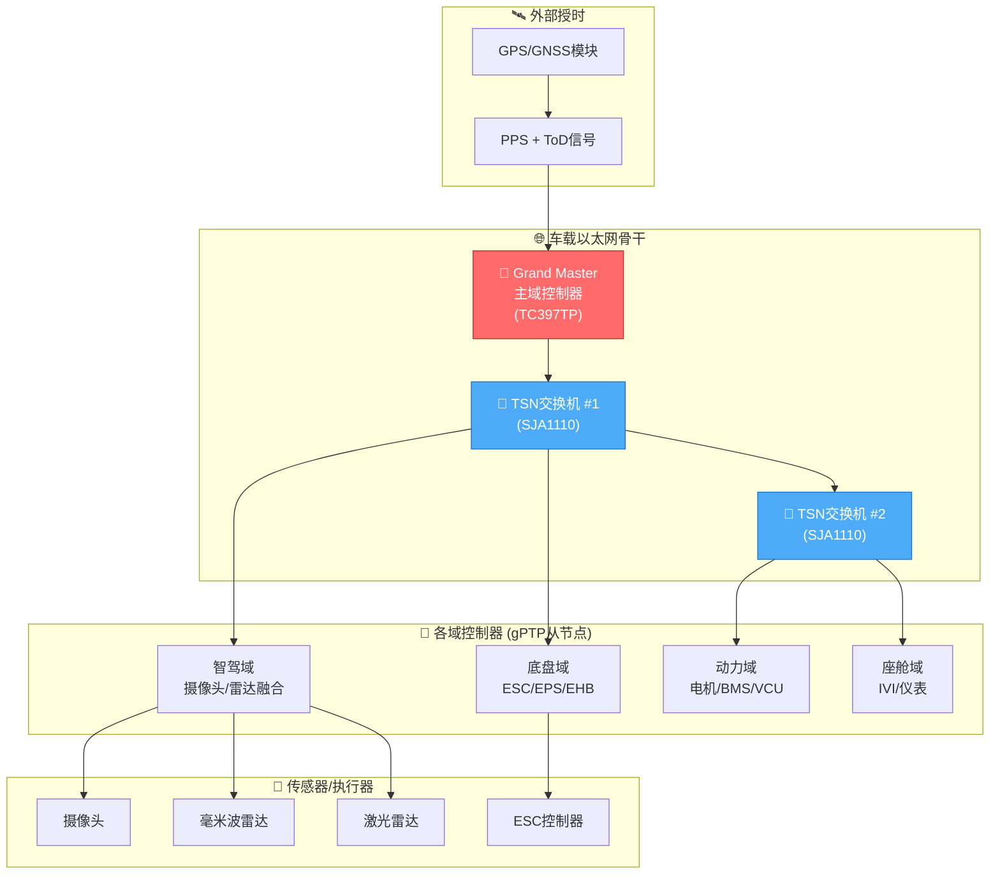
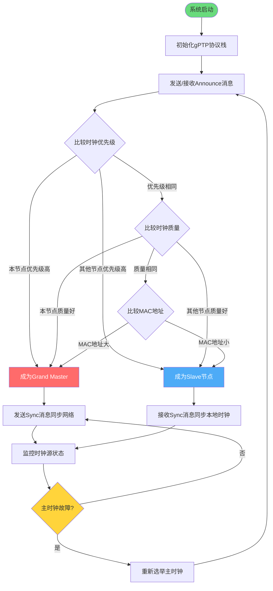
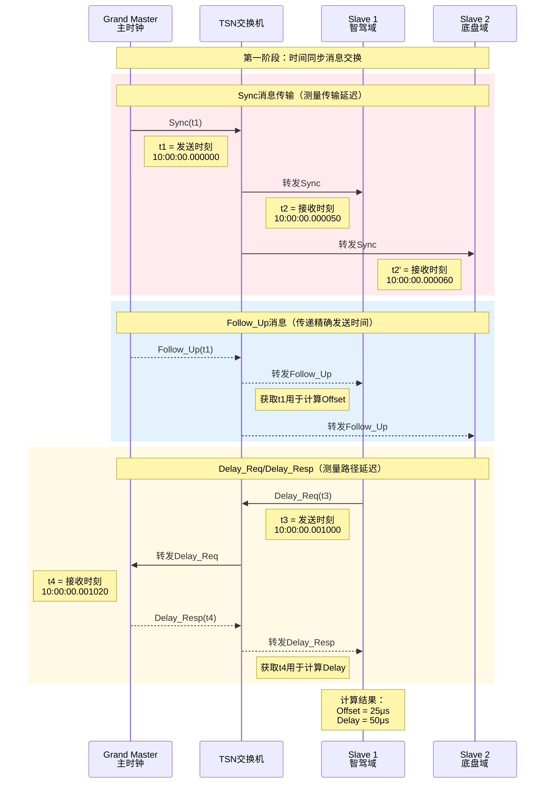
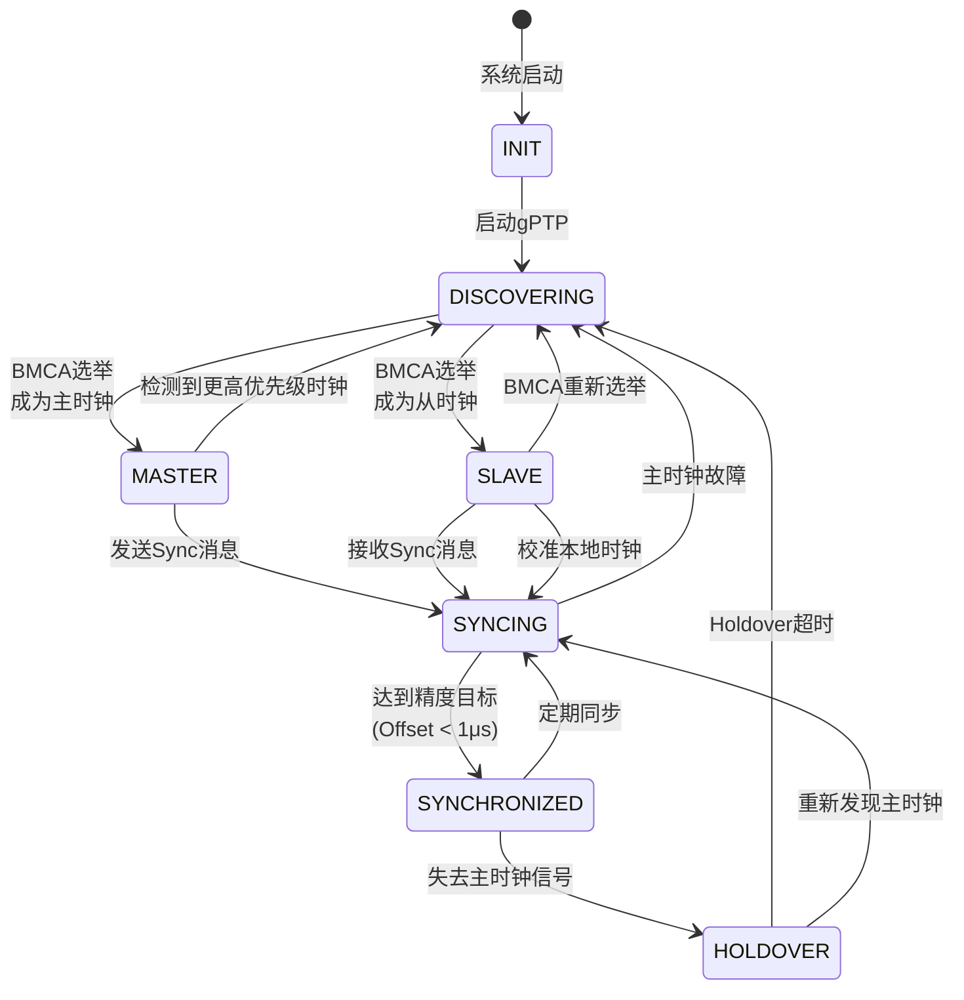
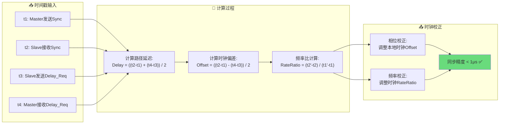
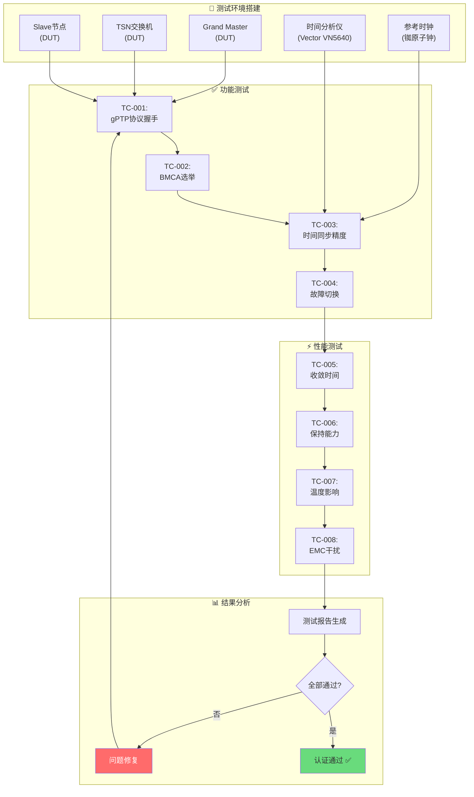
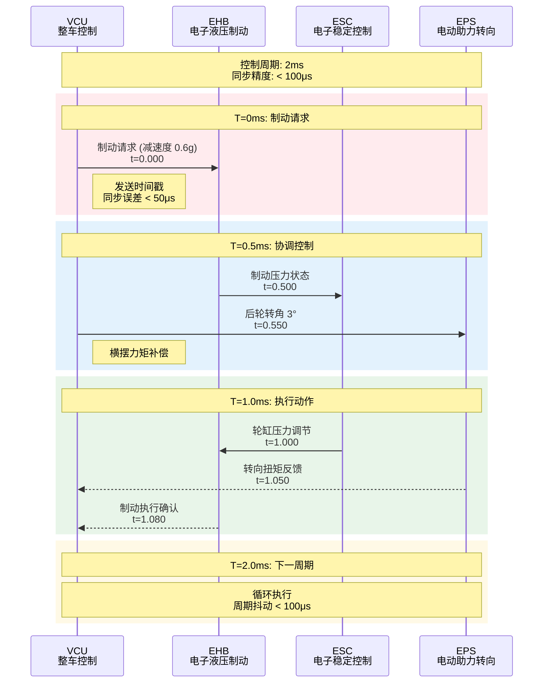
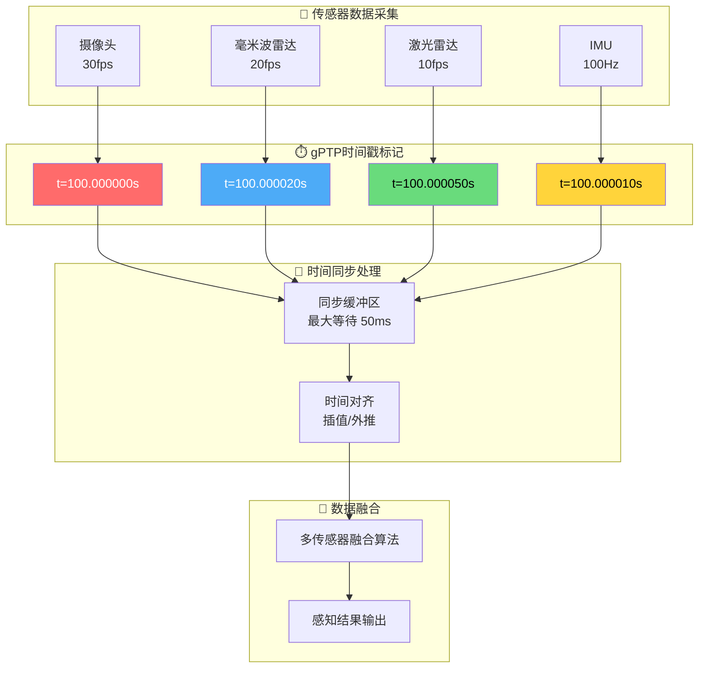
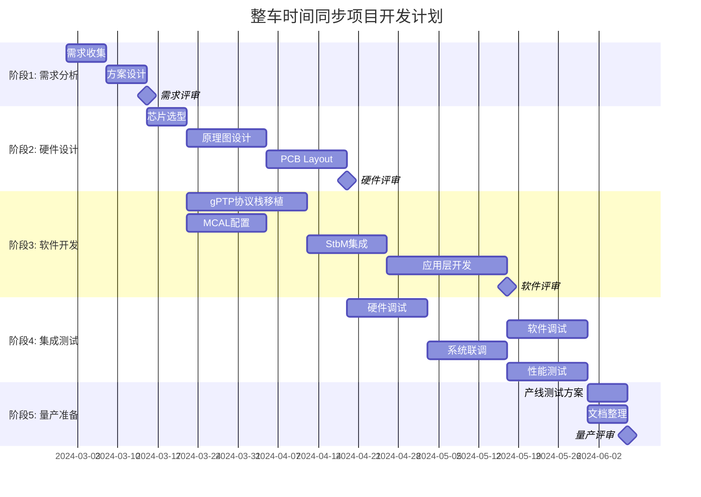

# 整车时间同步方案设计

> **文档版本**: v1.0  
> **编制日期**: 2026-03-08  
> **方案类型**: 车载以太网时间同步  
> **技术领域**: TSN/gPTP/AUTOSAR

---

## 1. 背景与需求

### 1.1 为什么需要时间同步

现代智能汽车需要高精度时间同步的场景：

| 应用场景 | 精度要求 | 说明 |
|----------|----------|------|
| 传感器数据融合 | < 1ms | 摄像头/雷达/激光雷达数据时间戳对齐 |
| 运动控制 | < 100μs | 底盘域多ECU协同控制 |
| 数据记录 | < 10ms | 故障日志全局时间戳 |
| 诊断刷写 | < 100ms | DoIP诊断会话时间 |
| ADAS功能 | < 50μs | AEB/LKA等实时功能 |

### 1.2 传统方案的局限

**CAN 时间同步**:
- 精度：~1ms（已无法满足ADAS需求）
- 带宽：1Mbps（无法支持传感器数据洪流）

**GPS 时间同步**:
- 精度：~10ns（授时精度高）
- 问题：隧道/地下车库无信号
- 问题：无法支持内部网络节点间同步

**NTP 网络时间协议**:
- 精度：~1-10ms
- 问题：精度不足，无硬件时间戳支持

---

## 2. 方案总体设计

### 2.1 技术选型：gPTP (IEEE 802.1AS)

**选择理由**:
- 精度：亚微秒级（< 1μs）
- 标准：IEEE 802.1AS-2020（TSN核心标准）
- 支持：AUTOSAR Time Sync over Ethernet
- 兼容：支持CAN的时间同步桥接

### 2.2 系统架构图



### 2.3 网络拓扑架构

```
┌─────────────────────────────────────────────────────────────────┐
│                      整车时间同步架构                              │
├─────────────────────────────────────────────────────────────────┤
│                                                                 │
│   ┌──────────────┐     Grand Master (gPTP主时钟)                │
│   │   GPS/GNSS   │     - 主域控制器 (如智驾域)                    │
│   │   授时模块    │     - 以太网交换机（带gPTP支持）               │
│   └──────┬───────┘     - 提供整个网络的基准时间                   │
│          │                                                      │
│          │ PPS + ToD                                            │
│          ▼                                                      │
│   ┌────────────────────────────────────────────────────┐        │
│   │              车载以太网骨干网 (1Gbps)                 │        │
│   │         ┌─────────┐    ┌─────────┐                 │        │
│   │         │ TSN交换 │────│ TSN交换 │                 │        │
│   │         │ 机  #1  │    │ 机  #2  │                 │        │
│   │         └────┬────┘    └────┬────┘                 │        │
│   └──────────────┼──────────────┼──────────────────────┘        │
│                  │              │                               │
│    ┌─────────────┼──────────────┼─────────────┐                  │
│    │             │              │             │                  │
│    ▼             ▼              ▼             ▼                  │
│ ┌──────┐    ┌──────┐      ┌──────┐    ┌──────┐                │
│ │智驾域 │    │座舱域 │      │底盘域 │    │动力域 │                │
│ │控制器 │    │控制器 │      │控制器 │    │控制器 │                │
│ │(gPTP)│    │(gPTP)│      │(gPTP)│    │(gPTP)│                │
│ └──┬───┘    └──┬───┘      └──┬───┘    └──┬───┘                │
│    │           │             │           │                      │
│    ▼           ▼             ▼           ▼                      │
│ ┌──────┐   ┌──────┐     ┌──────┐   ┌──────┐                   │
│ │摄像头│   │激光雷│     │EPS/ESC│   │电机/VCU│                  │
│ │雷达  │   │达    │     │制动   │   │BMS   │                   │
│ └──────┘   └──────┘     └──────┘   └──────┘                   │
│                                                                 │
└─────────────────────────────────────────────────────────────────┘
```

---

## 3. 硬件设计方案

### 3.1 主时钟 (Grand Master) 硬件

**推荐方案**:
- **主控**: TC397TP (Aurix)
- **以太网**: 千兆MAC + TJA1103 PHY (1000BASE-T1)
- **授时**: u-blox ZED-F9T (GPS/GNSS + PPS输出)
- **时钟源**: OCXO/TCXO 恒温晶振 (±1ppm)

**时钟树设计**:
```
OCXO (25MHz)
    │
    ├──► TC397 (MCU时钟)
    │
    └──► TJA1103 (PHY时钟)
            │
            └──► 车载以太网
```

### 3.2 TSN 交换机

**关键特性**:
- 支持 IEEE 802.1AS (gPTP)
- 支持 IEEE 802.1Qbv (时间感知整形)
- 端口：6-8 路 1000BASE-T1
- 时间戳精度：< 10ns

**推荐芯片**:
- NXP SJA1110
- Marvell 88Q5152
- Microchip LAN9690

### 3.3 从节点硬件 (Domain Controller)

**各域控制器通用配置**:
- **MCU**: TC377/TC387 (带ETH)
- **MAC**: 内置千兆MAC
- **PHY**: TJA1101/TJA1103 (100/1000BASE-T1)
- **时间戳**: 硬件时间戳 (PTP Hardware Clock)

**硬件时间戳要求**:
| 组件 | 时间戳精度 | 说明 |
|------|-----------|------|
| MAC | < 25ns | 发送/接收时刻捕获 |
| PHY | < 10ns | 更精确，推荐支持 |

---

## 4. 软件设计方案

### 4.1 AUTOSAR 协议栈

**软件架构**:
```
应用层 (ASW)
├── 传感器融合算法
├── ADAS功能逻辑
└── 数据记录模块
        │
运行时环境 (RTE)
        │
服务层 (BSW)
├── StbM (同步时基管理)
│       ├── 提供同步时间戳API
│       └── 管理时间域 (Time Domain)
│
├── TimeSyncOverEth (gPTP协议)
│       ├── gPTP协议栈 (802.1AS)
│       ├── BMCA算法 (最佳主时钟)
│       └── 时间同步状态机
│
├── EthTSyn (时间同步驱动)
│       ├── 硬件时间戳接口
│       └── 时钟校正算法
│
└── Eth Driver
        ├── MAC驱动 (硬件时间戳)
        └── PHY驱动 (Link状态)
```

### 4.2 gPTP 协议实现

#### 4.2.1 BMCA (Best Master Clock Algorithm) 流程



**BMCA选举规则**（优先级从高到低）：
1. **Priority1**: 用户配置优先级（0-255，越小越高）
2. **ClockClass**: 时钟等级（如6=GPS同步，52=保持模式）
3. **ClockAccuracy**: 时钟精度（如0x20=<1μs）
4. **Priority2**: 次级优先级（0-255）
5. **ClockIdentity**: 64位MAC地址（越大优先级越高）

#### 4.2.2 gPTP 时间同步时序图



**计算公式**:
```
Offset = ((t2 - t1) - (t4 - t3)) / 2
Delay  = ((t2 - t1) + (t4 - t3)) / 2

其中:
- t1: Sync消息离开Master的时间
- t2: Sync消息到达Slave的时间
- t3: Delay_Req离开Slave的时间
- t4: Delay_Req到达Master的时间
```

#### 4.2.3 时钟同步状态机



**状态说明**:
- **INIT**: 初始化状态
- **DISCOVERING**: 发现网络中的时钟节点
- **MASTER**: 作为Grand Master运行
- **SLAVE**: 作为Slave节点运行
- **SYNCING**: 正在进行时间同步
- **SYNCHRONIZED**: 已达到同步精度目标
- **HOLDOVER**: 失去主时钟，保持模式运行

#### 4.2.4 时钟校正流程



### 4.3 MCAL 配置要点

**ETH Driver 配置**:
```c
// EthGeneral
typedef struct {
    boolean EthDevErrorDetect = TRUE;
    boolean EthEnableTimeSync = TRUE;        // 启用时间同步
    uint8 EthTimeSyncClockSource = ETH_TSC_INTERNAL;  // 内部PTP时钟
} EthGeneralType;

// EthControllerConfig
typedef struct {
    uint16 EthCtrlIdx = 0;
    boolean EthEnableHwTimestamp = TRUE;     // 硬件时间戳
    uint32 EthTimestampClockFreq = 100000000; // 100MHz
} EthControllerConfigType;
```

**GPT 配置 (提供PTP时钟基准)**:
```c
// 用于生成gPTP所需的本地时钟 (如80MHz)
GptChannelConfigSet_GptChannelConfig_0:
    GptChannelId = 0
    GptHwChannel = FTM0
    GptChannelMode = CONTINUOUS
    GptPrescaler = 0              // 不分频
    GptChannelTickFrequency = 80000000  // 80MHz
```

---

## 5. 时间同步性能指标

### 5.1 设计目标

| 指标 | 目标值 | 说明 |
|------|--------|------|
| 同步精度 | < 1μs | 端到端时间偏差 |
| 收敛时间 | < 2s | 上电到稳定同步 |
| 保持能力 | < 100μs/s | 失去主时钟后的漂移 |
| 消息周期 | 125ms | Sync消息发送周期 |
| 故障切换 | < 100ms | 主时钟故障切换时间 |

### 5.2 精度保障措施

**硬件层面**:
- 使用硬件时间戳 (MAC/PHY层)
- 对称的链路延迟 (等长网线)
- 温度补偿晶振 (TCXO)

**软件层面**:
- 高优先级任务处理gPTP消息
- 中断驱动接收 (非轮询)
- 时钟滤波算法 (Kalman/PID)

---

## 6. 测试验证方案

### 6.1 测试环境

**测试设备**:
- Vector VN5640 (以太网分析仪)
- Keysight N5247B (PNA-X网络分析仪)
- 示波器 (≥1GHz带宽)

**测试拓扑**:
```
┌──────────────┐      ┌──────────────┐      ┌──────────────┐
│   主时钟      │──────│   TSN交换机   │──────│   从时钟      │
│   (DUT)      │      │   (DUT)      │      │   (DUT)      │
└──────┬───────┘      └──────┬───────┘      └──────┬───────┘
       │                     │                     │
       └─────────────────────┼─────────────────────┘
                             │
                    ┌────────▼─────┐
                    │ 时间测试设备  │
                    │ (示波器/PNA) │
                    └──────────────┘
```

### 6.2 测试验证流程



### 6.3 测试用例详情

| 测试项 | 方法 | 通过标准 |
|--------|------|----------|
| 同步精度 | 测量PPS信号偏差 | < 1μs |
| 收敛时间 | 上电后计时 | < 2s |
| 保持能力 | 断开后计时漂移 | < 100μs/s |
| 主时钟切换 | 强制主时钟故障 | < 100ms |
| 温度影响 | -40°C ~ 85°C循环 | 精度满足 |
| EMC干扰 | 传导/辐射抗扰 | 功能正常 |

---

## 7. 典型应用场景

### 7.1 传感器数据融合

**多传感器时间对齐**:
```
时间戳对齐前:
摄像头: t=100.000ms
雷达:   t=100.100ms  ← 100μs偏差
激光雷达: t=99.900ms  ← 100μs偏差

时间戳对齐后 (gPTP同步后):
摄像头: t=100.000ms ± 500ns
雷达:   t=100.000ms ± 500ns
激光雷达: t=100.000ms ± 500ns
```

### 7.2 底盘域协同控制时序

**ESC + EPS + EHB 协同制动**:



### 7.3 传感器数据融合流程

**多传感器时间对齐**:



### 7.3 数据记录与回放

**全局时间戳日志**:
```
[2024-03-08 10:30:00.000000123] [智驾域] AEB触发
[2024-03-08 10:30:00.000000345] [底盘域] ESC启动
[2024-03-08 10:30:00.000000567] [动力域] 扭矩限制
```

---

## 8. 实施建议

### 8.1 开发阶段甘特图



**开发阶段详情**:

| 阶段 | 周期 | 关键交付物 | 依赖 |
|------|------|------------|------|
| 需求分析 | 2周 | 需求规格书、系统架构图 | - |
| 硬件设计 | 4周 | 原理图、PCB、BOM | 需求冻结 |
| 软件开发 | 8周 | gPTP协议栈、MCAL配置、StbM | 芯片选型 |
| 集成测试 | 4周 | 测试报告、性能数据 | 软硬件完成 |
| 量产准备 | 2周 | 产线测试方案、用户手册 | 测试通过 |

### 8.2 风险评估

| 风险 | 影响 | 缓解措施 |
|------|------|----------|
| PHY不支持gPTP | 高 | 选型时确认802.1AS支持 |
| 布线不对称 | 中 | 严格等长布线 |
| 温度漂移 | 中 | 使用TCXO温度补偿 |
| EMI干扰 | 中 | 双绞线屏蔽层接地 |

### 8.3 成本估算

| 组件 | 单价(USD) | 数量 | 小计 |
|------|-----------|------|------|
| TSN交换机芯片 | $15 | 1 | $15 |
| 千兆PHY (TJA1103) | $8 | 6 | $48 |
| GPS模块 | $25 | 1 | $25 |
| OCXO晶振 | $10 | 1 | $10 |
| **总计** | | | **~$98** |

---

## 9. 参考标准

- IEEE 802.1AS-2020: Timing and Synchronization for Time-Sensitive Applications
- IEEE 802.1Qbv-2015: Enhancements for Scheduled Traffic
- AUTOSAR: Specification of Time Synchronization over Ethernet
- AUTOSAR: Specification of Synchronized Time-Base Manager

---

## 10. 附录

### 10.1 术语表

| 术语 | 说明 |
|------|------|
| gPTP | generalized Precision Time Protocol，通用精确时间协议 |
| TSN | Time-Sensitive Networking，时间敏感网络 |
| PTP | Precision Time Protocol，IEEE 1588精确时间协议 |
| BMCA | Best Master Clock Algorithm，最佳主时钟算法 |
| Grand Master | gPTP网络的主时钟节点 |
| TCXO | Temperature Compensated Xtal Oscillator，温度补偿晶振 |

### 10.2 供应商清单

| 组件 | 供应商 | 型号 |
|------|--------|------|
| TSN交换机 | NXP | SJA1110 |
| PHY | NXP | TJA1103 |
| GPS模块 | u-blox | ZED-F9T |
| MCU | Infineon | TC397TP |

---

*整车时间同步方案设计*  
*关键词: gPTP, 802.1AS, TSN, AUTOSAR, 时间同步, 车载以太网*
