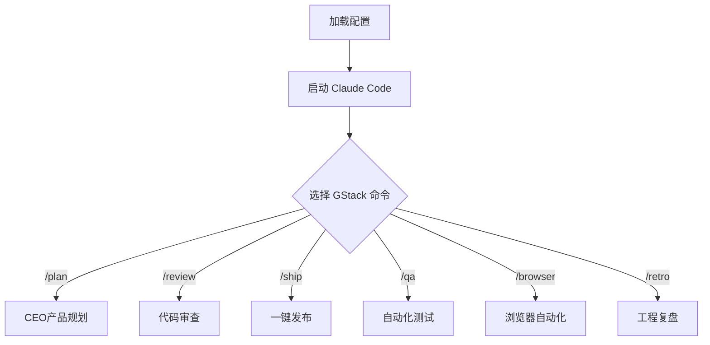

# Claude Code + 智谱 GLM-4.7 + GStack 集成方案

**创建时间**: 2026-03-14  
**状态**: ✅ 已完成

---

## 概述

成功集成：
- **Claude Code** - AI 编程助手
- **智谱 GLM-4.7** - 国产大模型（利用甘特图 Token）
- **GStack** - 专家团队工作流

---

## 配置信息

### 智谱 API（来自甘特图 .env）
```
API Key: ${ZHIPU_API_KEY}  # 从 ~/.claude/env.sh 读取
API Key: xxxx
Base URL: https://open.bigmodel.cn/api/paas/v4
Model: glm-4.7
```

> ⚠️ **安全提醒**: API Key 已移至 `~/.claude/env.sh`，请勿在文档中记录明文密钥。

### 配置文件位置
| 文件 | 路径 |
|------|------|
| Claude Code 配置 | ~/.claude/settings.json |
| 环境变量脚本 | ~/.claude/env.sh |
| Router 配置 | ~/.claude-code-router/config.json |

---

## 快速开始

### 1. 加载配置
```bash
source ~/.claude/env.sh
```

### 2. 启动 Claude Code
```bash
claude
```

### 3. 使用 GStack 命令
```
/plan    - CEO产品规划
/review  - 代码审查
/ship     - 一键发布
/qa      - 自动化测试
/browser - 浏览器自动化
/retro   - 工程复盘
```

---

## 创建新项目

```bash
# 使用脚本创建项目
./create-gstack-project.sh "项目名称"

# 示例
cd /root/.openclaw/workspace/projects/gstack-claude-demo
./scripts/init.sh
claude
```

---

## 脚本文件

| 脚本 | 功能 |
|------|------|
| setup-claude-zhipu.sh | 配置 Claude Code + 智谱 GLM-4.7 |
| create-gstack-project.sh | 创建 GStack 项目 |

---

## 示例项目

**项目路径**: /root/.openclaw/workspace/projects/gstack-claude-demo

项目结构：
```
gstack-claude-demo/
├── README.md          # 项目说明
├── AGENTS.md          # GStack 配置
├── docs/
│   └── planning/
│       └── sprint-1.md
└── scripts/
    └── init.sh
```

---

## 环境变量

创建 `~/.claude/env.sh` 文件：

```bash
export ANTHROPIC_API_KEY="${ZHIPU_API_KEY}"  # 从安全位置读取
export ANTHROPIC_AUTH_TOKEN="${ZHIPU_API_KEY}"
export ANTHROPIC_BASE_URL="https://open.bigmodel.cn/api/anthropic"
export ANTHROPIC_MODEL="glm-4.7"
```

> 🔒 **安全规范**: 
> - API Key 存储在 `~/.claude/env.sh` (权限 600)
> - 切勿提交到 Git 仓库
> - 定期轮换密钥

---

## 使用流程



---

## 参考链接

- [Claude Code 官方文档](https://docs.anthropic.com/en/docs/claude-code/overview)
- [智谱 AI 开放平台](https://www.bigmodel.cn/)
- [GStack GitHub](https://github.com/garrytan/gstack)

---

*配置完成时间: 2026-03-14*
