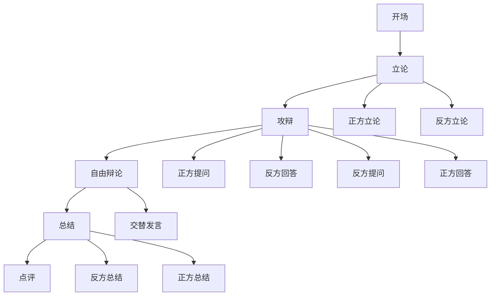

# Debate Arena 开发指南

## 架构设计

```
debate-arena/
├── debate.py              # 核心辩论逻辑
├── debate-config.json     # Agent配置
├── AGENTS.md             # GStack角色定义
├── start-debate.sh       # 启动脚本
└── topics.md            # 辩题库
```

## Agent 架构

### 类图

```
DebateAgent (基类)
├── ProAgent (正方)
├── ConAgent (反方)
└── ModeratorAgent (主持人)

DebateArena (管理类)
├── 管理三个Agent
├── 控制辩论流程
└── 记录辩论历史
```

## 流程图



## 扩展指南

### 添加新角色

1. 继承 `DebateAgent` 类
2. 定义 `system_prompt`
3. 在 `DebateArena` 中注册

### 接入真实API

修改以下方法：
- `_generate_statement()`: 调用智谱API生成立论
- `_generate_attack()`: 调用API生成攻辩
- `_generate_free()`: 调用API生成自由辩论

API调用示例：
```python
import openai

client = openai.OpenAI(
    base_url=os.getenv("ANTHROPIC_BASE_URL"),
    api_key=os.getenv("ANTHROPIC_API_KEY")
)

response = client.chat.completions.create(
    model="glm-4.7",
    messages=[
        {"role": "system", "content": self.system_prompt},
        {"role": "user", "content": prompt}
    ]
)
return response.choices[0].message.content
```

## GStack 集成

### 可用命令

| 命令 | 功能 | 调用时机 |
|------|------|----------|
| `/plan debate/正方` | 规划正方策略 | 辩论前 |
| `/plan debate/反方` | 规划反方策略 | 辩论前 |
| `/review debate/逻辑` | 审查论证逻辑 | 辩论后 |
| `/qa debate/流程` | 测试流程 | 开发阶段 |

### 示例

```bash
# 在Claude Code中
claude

# 然后输入
/plan debate/正方
请为正方设计针对"AI取代人类工作"的辩论策略
```

---

## 版本历史

- v1.0: 基础三Agent辩论系统
- 计划: 接入真实API、Web界面、辩论评分

---

*基于 GStack Multi-Agent 框架*
