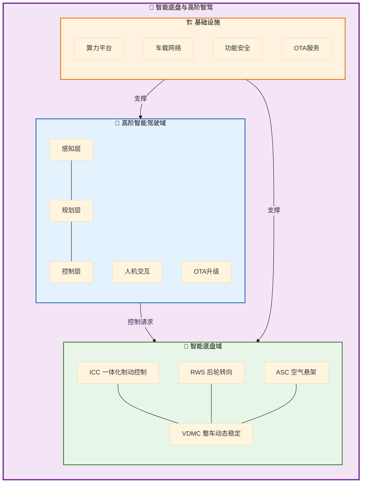
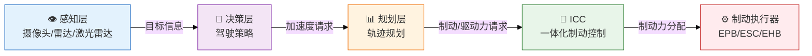
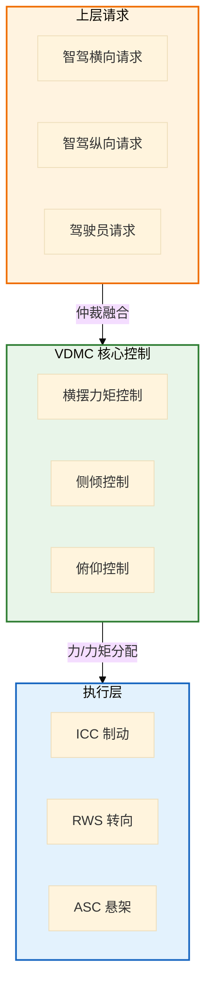
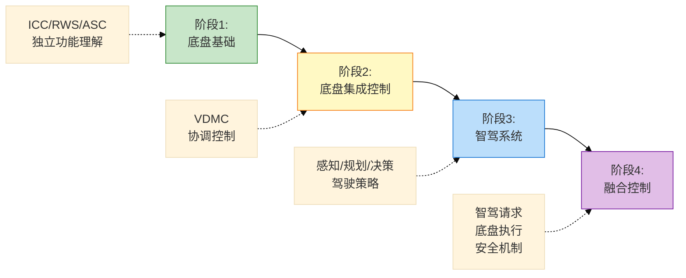

# 智能底盘与高阶智驾知识图谱

> 生成时间：2026-03-13  
> 来源：智能底盘一体化控制及高阶智能驾驶关键技术培训大纲

---

## 一、核心概念清单

### 1.1 缩写词汇表

| 缩写 | 全称 | 中文 | 所属域 |
|------|------|------|--------|
| **ICC** | Integrated Chassis Control | 一体化制动控制 | 智能底盘 |
| **RWS** | Rear Wheel Steering | 后轮转向控制 | 智能底盘 |
| **ASC** | Air Suspension Control | 空气悬架控制 | 智能底盘 |
| **VDMC** | Vehicle Dynamic Motion Control | 整车动态稳定控制 | 智能底盘 |
| **AD** | Autonomous Driving | 自动驾驶 | 智能驾驶 |
| **DCU** | Domain Control Unit | 域控制器 | 架构 |
| **ADCU** | ADAS/AD Domain Control Unit | 自动驾驶域控制器 | 架构 |
| **OTA** | Over-The-Air | 空中升级 | 系统服务 |
| **HMI** | Human Machine Interface | 人机交互 | 系统服务 |
| **ASIL** | Automotive Safety Integrity Level | 汽车安全完整性等级 | 安全 |
| **SOTIF** | Safety of the Intended Functionality | 预期功能安全 | 安全 |
| **SoC** | System on Chip | 系统级芯片 | 硬件 |

### 1.2 核心技术概念

#### 底盘控制技术
- **线控制动 (Brake-by-Wire)**：电信号传递制动意图，含EHB/EMB
- **线控转向 (Steer-by-Wire)**：电信号传递转向意图
- **主动悬架 (Active Suspension)**：可主动调节阻尼/刚度的悬架系统
- **后轮转向 (4WS)**：后轮主动参与转向，提升低速灵活性和高速稳定性
- **扭矩矢量控制 (Torque Vectoring)**：左右轮差动产生横摆力矩

#### 智能驾驶技术
- **BEV (Bird's Eye View)**：鸟瞰视角感知表示
- **OCC (Occupancy Network)**：占据网络，用于3D空间感知
- **端到端 (End-to-End)**：感知到决策的直接映射
- **NOA (Navigate on Autopilot)**：导航辅助驾驶
- **记忆泊车 (Memory Parking)**：学习并复现泊车路径
- **代客泊车 (AVP)**：Autonomous Valet Parking

---

## 二、知识树结构



### 2.1 智能底盘知识树

```
智能底盘域
├── 制动系统 (ICC)
│   ├── 能量回收 (RBS)
│   ├── 防抱死控制 (ABS)
│   ├── 电子稳定性控制 (ESC)
│   ├── 自适应巡航 (ACC) - 执行端
│   ├── 自动紧急制动 (AEB) - 执行端
│   └── 线控制动 (BBW)
│
├── 转向系统 (RWS)
│   ├── 前轮转向 (FWS)
│   ├── 后轮转向 (RWS)
│   │   ├── 同相转向 (高速稳定性)
│   │   └── 反相转向 (低速灵活性)
│   ├── 线控转向 (SbW)
│   └── 四轮转向协调 (4WS)
│
├── 悬架系统 (ASC)
│   ├── 空气弹簧控制
│   ├── 阻尼连续可调 (CDC)
│   ├── 车身高度调节
│   ├── 抗侧倾控制
│   ├── 抗俯仰控制
│   └── 魔毯悬架 (预瞄控制)
│
└── 整车动态控制 (VDMC)
    ├── 横摆控制 (Yaw Control)
    ├── 侧倾控制 (Roll Control)
    ├── 俯仰控制 (Pitch Control)
    ├── 扭矩矢量分配
    └── 多系统协调控制
```

### 2.2 高阶智驾知识树

```
高阶智能驾驶域
├── 算力平台
│   ├── SoC选型 (NVIDIA Orin/地平线J5/华为MDC)
│   ├── 算力需求分析 (TOPS)
│   ├── 功能安全设计 (ASIL-D)
│   └── 散热与功耗设计
│
├── 驾驶策略
│   ├── 多车道行驶策略
│   │   ├── 车道选择决策
│   │   ├── 速度规划
│   │   └── 跟车策略
│   ├── 换道策略
│   │   ├── 换道决策 (安全间隙评估)
│   │   ├── 换道轨迹规划
│   │   └── 换道执行监控
│   └── 车道保持策略
│       ├── 横向控制 (LKA)
│       └── 纵向控制 (ACC)
│
├── 泊车策略
│   ├── 感知融合 (超声+视觉)
│   ├── 车位检测与定位
│   ├── 泊车路径规划
│   │   ├── 垂直泊车
│   │   ├── 平行泊车
│   │   └── 斜列泊车
│   ├── 泊车轨迹跟踪
│   └── 记忆泊车/代客泊车
│
└── 系统支撑
    ├── 状态机设计
    ├── 人机交互 (HMI)
    ├── OTA升级
    └── 功能降级策略
```

---

## 三、模块依赖关系图

### 3.1 纵向控制依赖链



### 3.2 横向控制依赖链


### 3.3 整车动态控制依赖



### 3.4 系统交互矩阵

| 模块 | ICC | RWS | ASC | VDMC | 智驾域 | 动力域 |
|------|-----|-----|-----|------|--------|--------|
| **ICC** | - | ○ | ○ | ● | ● | ● |
| **RWS** | ○ | - | ○ | ● | ● | ○ |
| **ASC** | ○ | ○ | - | ● | ○ | ○ |
| **VDMC** | ● | ● | ● | - | ● | ● |
| **智驾域** | ● | ● | ○ | ● | - | ● |
| **动力域** | ● | ○ | ○ | ● | ● | - |

*● 强依赖  ○ 弱依赖*

---

## 四、技术难点识别

### 4.1 P0 级核心技术难点（必须掌握）

| 序号 | 技术难点 | 所属模块 | 难点描述 |
|------|----------|----------|----------|
| 1 | **多执行器协调控制** | VDMC | 制动/转向/悬架多系统联合控制，避免冲突 |
| 2 | **线控系统冗余设计** | ICC/RWS | 满足ASIL-D的冗余架构（双ECU/双传感器/双执行器）|
| 3 | **后轮转向控制策略** | RWS | 同相/反相切换逻辑、稳定性边界控制 |
| 4 | **横摆稳定性控制** | VDMC | 车辆失稳预警与恢复控制 |
| 5 | **智驾与底盘请求仲裁** | VDMC | 驾驶员与智驾系统请求的智能仲裁 |

### 4.2 P1 级重要技术（重点理解）

| 序号 | 技术点 | 所属模块 | 说明 |
|------|--------|----------|------|
| 1 | 空气弹簧高度控制 | ASC | 多级高度调节、水平保持 |
| 2 | 魔毯悬架预瞄控制 | ASC | 基于路面信息的主动调节 |
| 3 | 换道安全间隙评估 | 智驾 | 多目标轨迹预测与碰撞检测 |
| 4 | 泊车轨迹规划 | 智驾 | 狭窄空间路径规划与优化 |
| 5 | 能量回收策略 | ICC | 最大化回收效率与驾驶舒适性的平衡 |

### 4.3 P2 级扩展技术（了解即可）

| 序号 | 技术点 | 说明 |
|------|--------|------|
| 1 | 油气悬架控制 | 特种车辆应用 |
| 2 | 车载娱乐与智驾交互 | 驾驶员状态监测、接管提示 |
| 3 | OTA升级策略 | 差分升级、A/B分区、回滚机制 |

---

## 五、知识点重要性排序

### 5.1 按模块重要性

```
P0 (核心模块)
├── VDMC - 整车动态稳定控制
├── ICC - 一体化制动控制
└── 智驾域控制器架构

P1 (重要模块)
├── RWS - 后轮转向控制
├── 智驾驾驶策略 (换道/泊车)
└── 功能安全设计 (ASIL)

P2 (扩展模块)
├── ASC - 空气悬架控制
├── 油气悬架
└── OTA/HMI
```

### 5.2 学习路径建议



---

## 六、关键接口速查

### 6.1 智驾域 -> 底盘域接口

| 信号名称 | 数据类型 | 精度 | 刷新率 | 说明 |
|----------|----------|------|--------|------|
| AD_Lat_Req | float | 0.1deg | 100Hz | 目标方向盘转角 |
| AD_Long_Acc_Req | float | 0.01m/s² | 100Hz | 目标加速度 |
| AD_VehicleSpeed_Req | float | 0.1km/h | 50Hz | 目标车速 |
| AD_Mode | uint8 | - | 50Hz | 智驾模式 (0=Off, 1=Standby, 2=Active) |
| AD_Standstill_Req | boolean | - | 50Hz | 驻车请求 |
| AD_Handsoff_Warn | uint8 | - | 10Hz | 脱手警告级别 |

### 6.2 底盘域 -> 智驾域接口

| 信号名称 | 数据类型 | 精度 | 刷新率 | 说明 |
|----------|----------|------|--------|------|
| Chassis_SteerAngle | float | 0.1deg | 100Hz | 实际方向盘转角 |
| Chassis_VehicleSpeed | float | 0.1km/h | 100Hz | 实际车速 |
| Chassis_YawRate | float | 0.01deg/s | 100Hz | 横摆角速度 |
| Chassis_LatAcc | float | 0.01m/s² | 100Hz | 横向加速度 |
| Chassis_LongAcc | float | 0.01m/s² | 100Hz | 纵向加速度 |
| Chassis_Ready | boolean | - | 50Hz | 底盘就绪状态 |
| Chassis_FaultLevel | uint8 | - | 50Hz | 故障等级 |

---

## 七、参考资料

1. **ISO 26262** - 道路车辆功能安全
2. **ISO 21448** - 预期功能安全 (SOTIF)
3. **AUTOSAR** - 汽车软件架构标准
4. **培训大纲原文** - 智能底盘一体化控制及高阶智能驾驶关键技术

---

> 🏷️ **标签**：`智能底盘`, `高阶智驾`, `ICC`, `RWS`, `ASC`, `VDMC`, `知识图谱`
