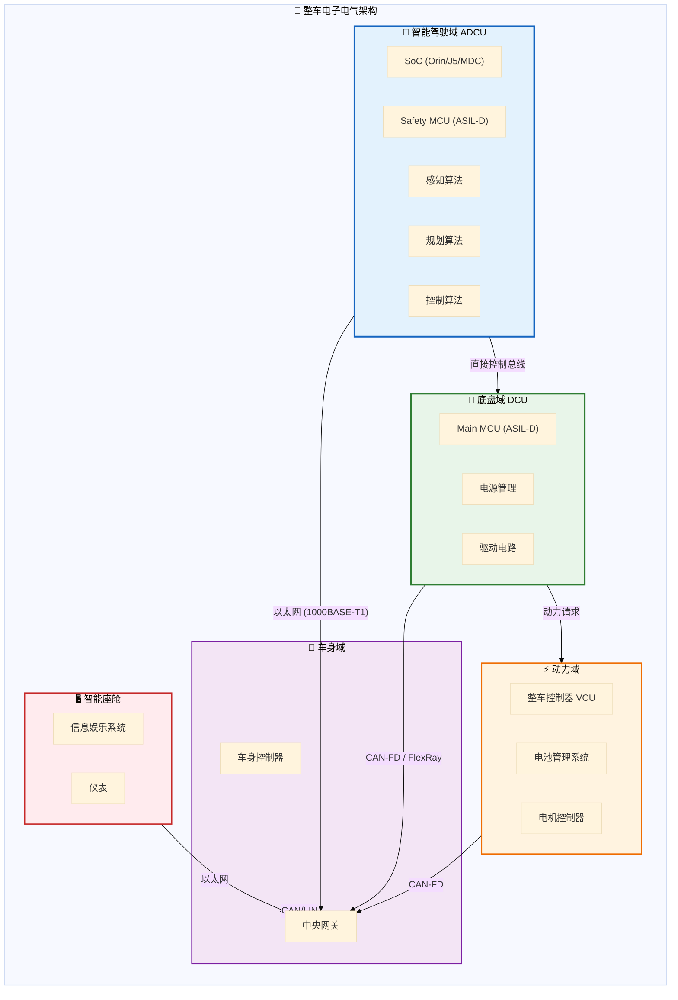
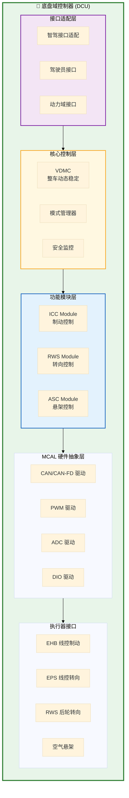
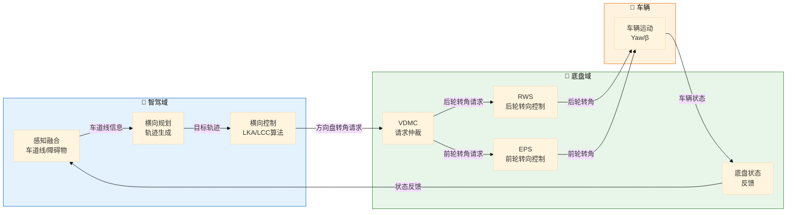
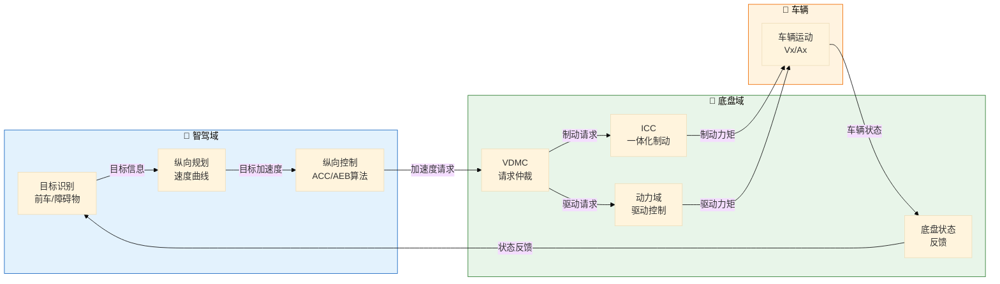
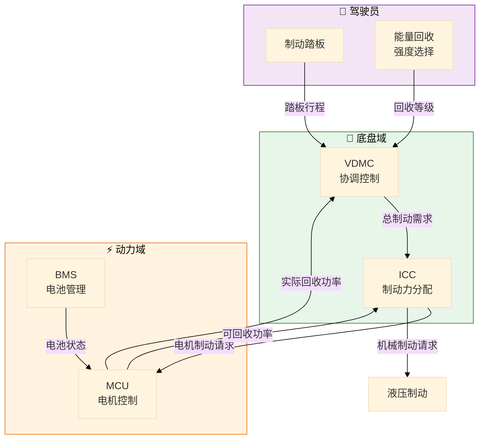
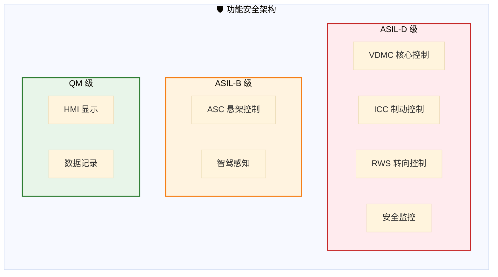
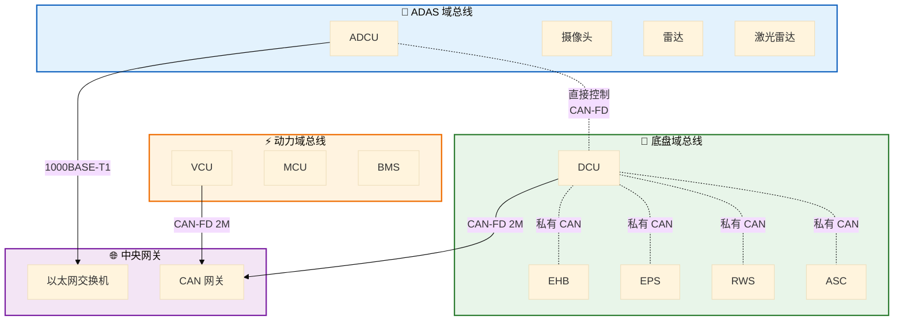
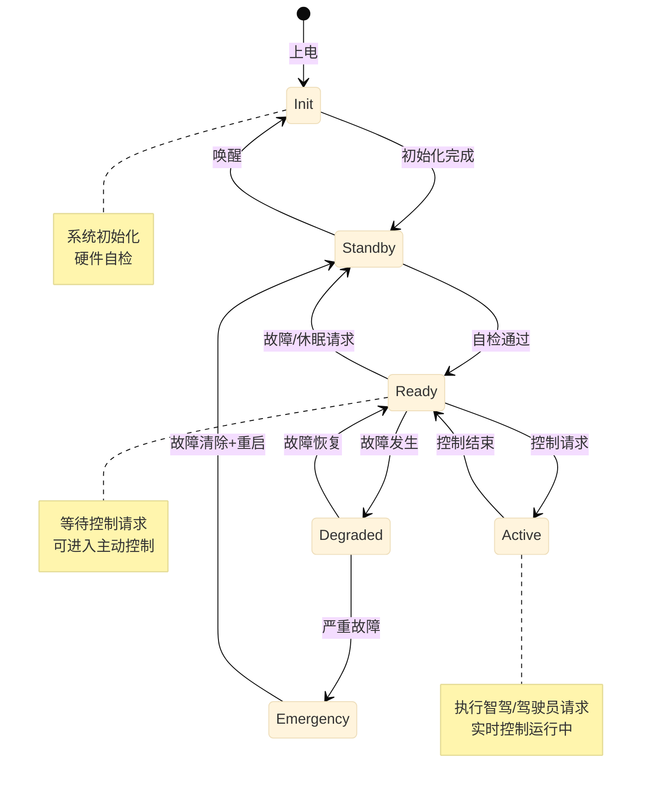

# 智能底盘与高阶智驾系统架构设计

> 文档版本：v1.0  
> 设计阶段：系统架构设计  
> 基于：知识图谱 v1.0

---

## 一、整体架构概览

### 1.1 域集中式架构

### 1.2 底盘域内部架构

---

## 二、模块划分与职责定义

### 2.1 底盘域模块职责表

| 模块 | 英文全称 | ASIL等级 | 核心职责 | 关键功能 |
|------|----------|----------|----------|----------|
| **VDMC** | Vehicle Dynamic Motion Control | D | 整车动态协调控制 | 多系统仲裁、稳定性控制 |
| **ICC** | Integrated Chassis Control | D | 制动系统综合控制 | 能量回收、ESC、AEB执行 |
| **RWS** | Rear Wheel Steering | D | 后轮转向控制 | 转角控制、前后轮协调 |
| **ASC** | Air Suspension Control | B | 空气悬架控制 | 高度调节、阻尼控制 |
| **Mode Manager** | - | D | 系统模式管理 | 状态机、模式切换 |
| **Safety Monitor** | - | D | 安全监控 | 故障诊断、降级策略 |

### 2.2 智能驾驶域模块职责

| 模块 | 功能域 | ASIL等级 | 核心职责 |
|------|--------|----------|----------|
| **感知融合** | 感知 | B | 摄像头/雷达/激光雷达融合 |
| **定位建图** | 感知 | B | 高精定位、SLAM |
| **行为决策** | 决策 | D | 驾驶策略选择（车道/换道/泊车）|
| **运动规划** | 规划 | D | 轨迹规划、速度规划 |
| **车辆控制** | 控制 | D | 横向/纵向控制算法 |
| **预测模块** | 感知 | B | 交通参与者轨迹预测 |

---

## 三、接口定义

### 3.1 智驾域 -> 底盘域（ADCU -> DCU）

#### 横向控制接口

| 信号ID | 信号名称 | 数据类型 | 范围 | 精度 | 周期 | 说明 |
|--------|----------|----------|------|------|------|------|
| 0x100 | AD_LateralControlReq | boolean | 0-1 | - | 100ms | 横向控制使能请求 |
| 0x101 | AD_SteeringAngleReq | float | ±720° | 0.1° | 10ms | 目标方向盘转角 |
| 0x102 | AD_SteeringAngleRateReq | float | ±1000°/s | 1°/s | 10ms | 目标方向盘转角速度 |
| 0x103 | AD_LateralAccReq | float | ±10m/s² | 0.01m/s² | 10ms | 目标横向加速度 |
| 0x104 | AD_YawRateReq | float | ±100°/s | 0.01°/s | 10ms | 目标横摆角速度 |

#### 纵向控制接口

| 信号ID | 信号名称 | 数据类型 | 范围 | 精度 | 周期 | 说明 |
|--------|----------|----------|------|------|------|------|
| 0x200 | AD_LongitudinalControlReq | boolean | 0-1 | - | 100ms | 纵向控制使能请求 |
| 0x201 | AD_AccelerationReq | float | ±10m/s² | 0.01m/s² | 10ms | 目标加速度 |
| 0x202 | AD_VehicleSpeedReq | float | 0-250km/h | 0.1km/h | 20ms | 目标车速 |
| 0x203 | AD_DecelerationReq | float | 0-10m/s² | 0.01m/s² | 10ms | 目标减速度 |
| 0x204 | AD_StandstillReq | boolean | 0-1 | - | 50ms | 驻车请求 |

#### 系统状态接口

| 信号ID | 信号名称 | 数据类型 | 范围 | 周期 | 说明 |
|--------|----------|----------|------|------|------|
| 0x300 | AD_SystemState | uint8 | 0-7 | 50ms | 系统状态机状态 |
| 0x301 | AD_ControlMode | uint8 | 0-3 | 50ms | 控制模式 |
| 0x302 | AD_FaultLevel | uint8 | 0-3 | 100ms | 故障等级 |
| 0x303 | AD_HandsOffWarning | uint8 | 0-3 | 100ms | 脱手警告级别 |

### 3.2 底盘域 -> 智驾域（DCU -> ADCU）

#### 底盘状态反馈

| 信号ID | 信号名称 | 数据类型 | 范围 | 精度 | 周期 | 说明 |
|--------|----------|----------|------|------|------|------|
| 0x400 | Chassis_SteeringAngle | float | ±720° | 0.1° | 10ms | 实际方向盘转角 |
| 0x401 | Chassis_SteeringAngleSpeed | float | ±1000°/s | 1°/s | 10ms | 实际转角速度 |
| 0x402 | Chassis_VehicleSpeed | float | 0-250km/h | 0.1km/h | 10ms | 实际车速 |
| 0x403 | Chassis_LongitudinalAcc | float | ±10m/s² | 0.01m/s² | 10ms | 纵向加速度 |
| 0x404 | Chassis_LateralAcc | float | ±10m/s² | 0.01m/s² | 10ms | 横向加速度 |
| 0x405 | Chassis_YawRate | float | ±100°/s | 0.01°/s | 10ms | 横摆角速度 |
| 0x406 | Chassis_RearWheelAngle | float | ±15° | 0.1° | 20ms | 后轮转角 |

#### 系统就绪状态

| 信号ID | 信号名称 | 数据类型 | 周期 | 说明 |
|--------|----------|----------|------|------|
| 0x500 | Chassis_Ready | boolean | 50ms | 底盘系统就绪 |
| 0x501 | Chassis_LateralReady | boolean | 50ms | 横向控制就绪 |
| 0x502 | Chassis_LongitudinalReady | boolean | 50ms | 纵向控制就绪 |
| 0x503 | Chassis_FaultLevel | uint8 | 100ms | 底盘故障等级 |
| 0x504 | Chassis_ControlActive | boolean | 50ms | 控制激活状态 |

### 3.3 底盘域内部接口

#### VDMC -> 各子系统

| 源模块 | 目标模块 | 信号名称 | 说明 |
|--------|----------|----------|------|
| VDMC | ICC | VDMC_BrakeForceReq | 制动力请求 |
| VDMC | RWS | VDMC_RearAngleReq | 后轮转角请求 |
| VDMC | ASC | VDMC_DampingReq | 阻尼系数请求 |
| VDMC | ASC | VDMC_HeightReq | 车身高度请求 |
| ICC | VDMC | ICC_BrakeForceAvail | 可用制动力 |
| RWS | VDMC | RWS_RearAngleActual | 实际后轮转角 |
| ASC | VDMC | ASC_HeightActual | 实际车身高度 |

---

## 四、数据流图

### 4.1 横向控制数据流

### 4.2 纵向控制数据流

### 4.3 能量回收数据流

---

## 五、安全架构设计

### 5.1 功能安全 ASIL 分配

### 5.2 冗余架构设计

#### 线控制动冗余（ICC）

| 组件 | 主通道 | 冗余通道 | 说明 |
|------|--------|----------|------|
| ECU | Main MCU | Safety MCU | 双核锁步 |
| 传感器 | 主压力传感器 | 冗余压力传感器 | 双路采集 |
| 执行器 | 主电机 | 冗余电机 | 双电机方案 |
| 通信 | CAN-FD A | CAN-FD B | 双路通信 |

#### 线控转向冗余（RWS）

| 组件 | 主通道 | 冗余通道 | 说明 |
|------|--------|----------|------|
| ECU | Main MCU | Safety MCU | 双核锁步 |
| 传感器 | 主转角传感器 | 冗余转角传感器 | 双路采集 |
| 执行器 | 主电机 | 冗余电机 | 双绕组电机 |
| 通信 | CAN-FD A | CAN-FD B | 双路通信 |

### 5.3 故障降级策略

| 故障等级 | 触发条件 | 系统响应 | 驾驶员提示 |
|----------|----------|----------|------------|
| **Level 0** | 无故障 | 正常功能 | - |
| **Level 1** | 轻微故障 | 功能受限，降级运行 | 黄色警告 |
| **Level 2** | 中等故障 | 功能关闭，请求接管 | 红色警告+声音 |
| **Level 3** | 严重故障 | 紧急停车，进入安全状态 | 紧急警告 |

### 5.4 预期功能安全 (SOTIF)

| 危害场景 | 触发条件 | 安全措施 |
|----------|----------|----------|
| 误制动 | 传感器误识别 | 多传感器融合确认 |
| 误转向 | 车道线误识别 | 驾驶员监控+力矩检测 |
| 低速追尾 | AEB误触发 | 低速场景抑制策略 |
| 弯道超速 | 曲率估计误差 | 地图数据校验 |

---

## 六、通信架构

### 6.1 车载网络拓扑

### 6.2 通信矩阵

| 信号流 | 总线类型 | 波特率 | 周期 | 延迟要求 |
|--------|----------|--------|------|----------|
| ADCU -> DCU | CAN-FD | 2Mbps | 10ms | <5ms |
| DCU -> EHB | CAN-FD | 2Mbps | 10ms | <3ms |
| DCU -> EPS | CAN-FD | 2Mbps | 10ms | <3ms |
| DCU -> RWS | CAN-FD | 1Mbps | 20ms | <10ms |
| DCU -> ASC | CAN | 500kbps | 50ms | <20ms |
| ADCU -> 感知 | 以太网 | 1000Mbps | - | <1ms |

---

## 七、状态机设计

### 7.1 底盘域状态机

---

## 八、设计原则与约束

### 8.1 设计原则

1. **安全第一**：所有设计以满足 ASIL-D 安全目标为首要原则
2. **可扩展性**：架构支持从 L2 到 L4 的功能扩展
3. **标准化**：遵循 AUTOSAR 标准和行业最佳实践
4. **冗余设计**：关键功能采用冗余设计确保可靠性
5. **可测试性**：每个模块都具备独立的测试接口

### 8.2 设计约束

| 约束项 | 要求 |
|--------|------|
| 功能安全 | 满足 ISO 26262 ASIL-D |
| 预期功能安全 | 满足 ISO 21448 |
| 网络安全 | 满足 ISO/SAE 21434 |
| 软件架构 | 符合 AUTOSAR Classic Platform |
| 通信协议 | 符合 CAN/CAN-FD 2.0 和 Ethernet TSN |
| 响应延迟 | 端到端控制延迟 < 100ms |
| 控制精度 | 横向误差 < 0.2m，纵向误差 < 0.5m/s |

---

## 九、参考文档

1. **知识图谱** - `knowledge_graph.md`
2. **ISO 26262** - 道路车辆功能安全
3. **ISO 21448** - 预期功能安全
4. **AUTOSAR Classic Platform** - 软件架构标准
5. **培训大纲** - 智能底盘一体化控制及高阶智能驾驶关键技术

---

> 🏷️ **标签**：`系统架构`, `底盘域`, `智驾域`, `接口定义`, `功能安全`, `ASIL-D`
