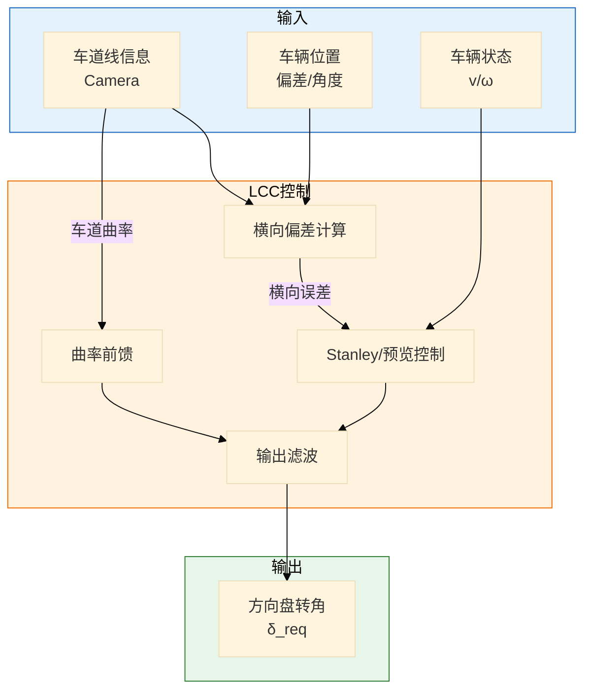
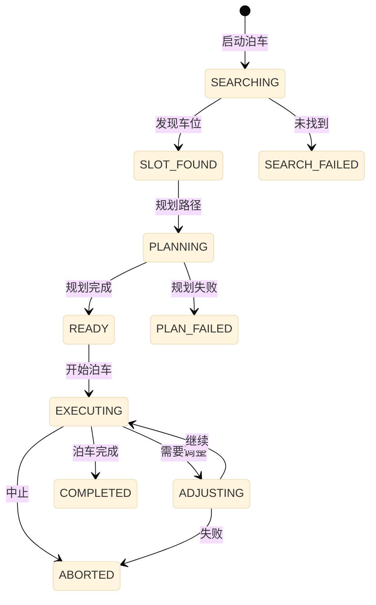
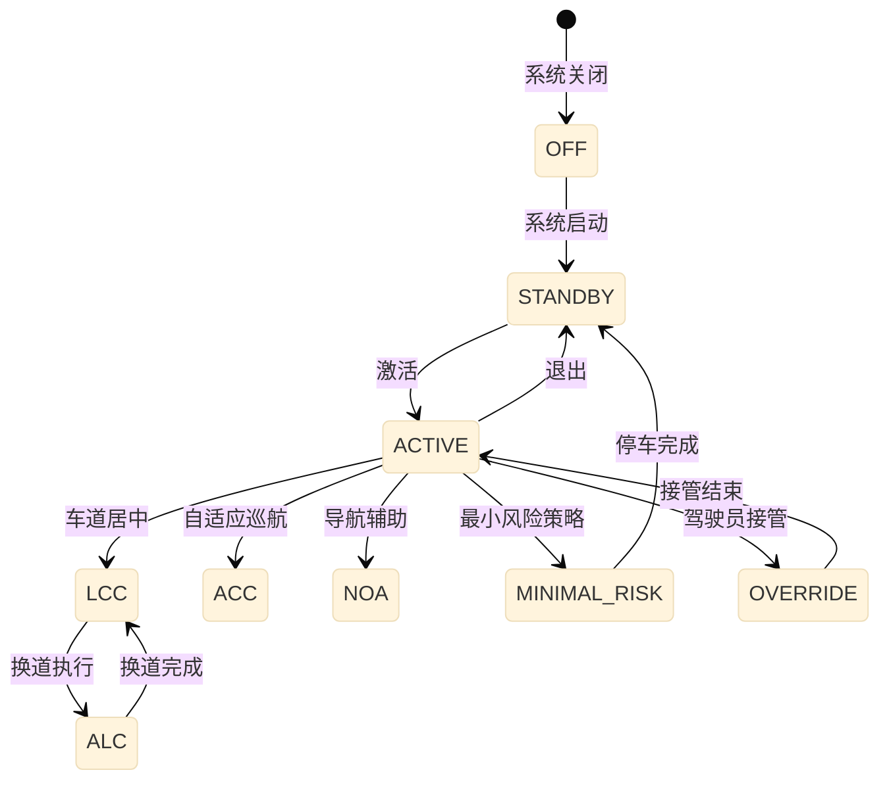

# 高阶智能驾驶控制策略详细设计

> 模块：ADAS/AD 控制策略  
> 版本：v1.0  
> ASIL等级：D  
> 依赖：系统架构设计 v1.0

---

## 一、功能需求规格

### 1.1 功能概述

高阶智能驾驶控制策略模块负责：
- **横向控制**：车道保持、换道控制、轨迹跟踪
- **纵向控制**：自适应巡航、速度规划、车距控制
- **泊车控制**：垂直/平行泊车、记忆泊车、代客泊车
- **决策逻辑**：驾驶模式选择、安全评估、人机交互

### 1.2 功能需求列表

| 需求ID | 需求描述 | 优先级 | ASIL |
|--------|----------|--------|------|
| AD-FR-001 | 实现车道居中控制（LCC） | P0 | D |
| AD-FR-002 | 实现自动换道功能（ALC） | P0 | D |
| AD-FR-003 | 实现自适应巡航（ACC） | P0 | D |
| AD-FR-004 | 实现自动泊车（APA） | P0 | D |
| AD-FR-005 | 实现紧急避障（AEB） | P0 | D |
| AD-FR-006 | 支持脱手检测和提醒 | P0 | D |

---

## 二、横向控制算法

### 2.1 车道居中控制 (LCC)



#### Stanley 控制算法

```c
// Stanley 横向控制算法
float StanleyController(float lateral_error, float heading_error, 
                        float curvature, float vehicle_speed) {
    // Stanley 控制律：δ = ψ + arctan(k * e / v) + k_feedforward * κ
    
    // 1. 航向角误差项
    float heading_term = heading_error;
    
    // 2. 横向偏差项（距离误差控制）
    float cross_track_term = atan(STANLEY_K * lateral_error / 
                                  (vehicle_speed + STANLEY_K_SOFT));
    
    // 3. 曲率前馈项
    float feedforward_term = atan(WHEELBASE * curvature);
    
    // 4. 方向盘转角请求
    float steering_angle = heading_term + cross_track_term + feedforward_term;
    
    // 5. 限幅
    steering_angle = LIMIT(steering_angle, MAX_STEERING_ANGLE, -MAX_STEERING_ANGLE);
    
    return steering_angle;
}

#define STANLEY_K           1.0f    // Stanley增益
#define STANLEY_K_SOFT      0.1f    // 软ening因子
```

### 2.2 换道控制算法

```c
// 换道状态机
typedef enum {
    LANE_CHANGE_IDLE = 0,
    LANE_CHANGE_PREPARE = 1,
    LANE_CHANGE_EXECUTING = 2,
    LANE_CHANGE_COMPLETING = 3,
    LANE_CHANGE_ABORT = 4
} LaneChangeState_t;

// 换道控制
void LaneChangeControl(void) {
    switch (lane_change_state) {
        case LANE_CHANGE_IDLE:
            // 等待换道请求
            if (IsLaneChangeRequested() && IsLaneChangeSafe()) {
                lane_change_state = LANE_CHANGE_PREPARE;
            }
            break;
            
        case LANE_CHANGE_PREPARE:
            // 准备阶段：确认安全间隙
            if (CheckGapAvailability()) {
                GenerateLaneChangeTrajectory();
                lane_change_state = LANE_CHANGE_EXECUTING;
            } else if (Timeout()) {
                lane_change_state = LANE_CHANGE_ABORT;
            }
            break;
            
        case LANE_CHANGE_EXECUTING:
            // 执行阶段：跟踪换道轨迹
            TrackTrajectory();
            if (IsLaneChangeComplete()) {
                lane_change_state = LANE_CHANGE_COMPLETING;
            } else if (IsAbortRequired()) {
                lane_change_state = LANE_CHANGE_ABORT;
            }
            break;
            
        case LANE_CHANGE_COMPLETING:
            // 完成阶段：稳定在新车道
            if (IsVehicleStable()) {
                lane_change_state = LANE_CHANGE_IDLE;
            }
            break;
            
        case LANE_CHANGE_ABORT:
            // 中止：返回原车道
            ReturnToOriginalLane();
            lane_change_state = LANE_CHANGE_IDLE;
            break;
    }
}
```

---

## 三、纵向控制算法

### 3.1 自适应巡航控制 (ACC)

```c
// ACC 纵向控制
void ACC_Control(float target_speed, float distance_to_target) {
    // 1. 计算期望车距
    float desired_distance = ACC_DESIRED_TIME_GAP * vehicle_speed + 
                            ACC_MIN_DISTANCE;
    
    // 2. 计算距离误差
    float distance_error = distance_to_target - desired_distance;
    
    // 3. 相对速度
    float relative_speed = target_speed - vehicle_speed;
    
    // 4. 选择控制模式
    if (distance_error > 0 && relative_speed > 0) {
        // 距离大且前车更快 → 速度控制
        SpeedControl(target_speed);
    } else {
        // 距离控制
        DistanceControl(distance_error, relative_speed);
    }
}

// 距离控制（IDM 模型启发）
float DistanceControl(float distance_error, float relative_speed) {
    // IDM-inspired控制律
    float acceleration = ACC_KP_DISTANCE * distance_error + 
                        ACC_KD_DISTANCE * relative_speed;
    
    // 舒适性和安全性限制
    acceleration = LIMIT(acceleration, MAX_COMFORT_ACCEL, MAX_COMFORT_DECEL);
    
    return acceleration;
}
```

---

## 四、泊车控制算法

### 4.1 泊车路径规划

```c
// 垂直泊车路径规划
void ParallelParkingPlanner(ParkingSlot_t* slot, VehicleState_t* state) {
    // 1. 计算几何参数
    float slot_length = slot->length;
    float slot_width = slot->width;
    float vehicle_length = VEHICLE_LENGTH;
    float vehicle_width = VEHICLE_WIDTH;
    
    // 2. 计算最小转弯半径
    float R_min = WHEELBASE / tan(MAX_STEERING_ANGLE);
    
    // 3. 生成两段圆弧路径（S型泊车）
    // 第一段：向外转向
    Arc_t arc1 = {
        .center = CalculateArcCenter(state, R_min, OUTWARD),
        .radius = R_min,
        .start_angle = state->heading,
        .end_angle = state->heading + TURN_ANGLE_1
    };
    
    // 第二段：向内转向
    Arc_t arc2 = {
        .center = CalculateArcCenter(arc1.end_point, R_min, INWARD),
        .radius = R_min,
        .start_angle = arc1.end_angle,
        .end_angle = TARGET_HEADING
    };
    
    // 4. 路径拼接
    parking_trajectory = ConcatenateArcs(arc1, arc2);
}
```

### 4.2 泊车状态机



---

## 五、决策与状态机

### 5.1 智驾状态机



---

## 六、关键参数定义

```c
// 横向控制参数
#define MAX_STEERING_ANGLE          720.0f  // 最大方向盘转角 °
#define MAX_STEERING_RATE           500.0f  // 最大转角速度 °/s
#define STANLEY_K                   1.0f    // Stanley增益
#define PREVIEW_DISTANCE            10.0f   // 预览距离 m

// 纵向控制参数
#define ACC_DESIRED_TIME_GAP        2.0f    // 期望时距 s
#define ACC_MIN_DISTANCE            5.0f    // 最小车距 m
#define MAX_COMFORT_ACCEL           2.0f    // 最大舒适加速度 m/s²
#define MAX_COMFORT_DECEL           -3.0f   // 最大舒适减速度 m/s²

// 泊车参数
#define PARKING_SPEED_LIMIT         5.0f    // 泊车速度限制 km/h
#define PARKING_STEERING_RATE       360.0f  // 泊车转向速度 °/s
```

---

## 七、测试要点

| 用例ID | 测试场景 | 预期结果 |
|--------|----------|----------|
| AD-TC-001 | 弯道LCC | 保持车道中心 |
| AD-TC-002 | 换道执行 | 安全完成换道 |
| AD-TC-003 | ACC跟随 | 保持安全车距 |
| AD-TC-004 | 垂直泊车 | 成功泊入车位 |
| AD-TC-005 | 紧急避障 | 触发AEB |

---

> 🏷️ **标签**：`ADAS`, `高阶智驾`, `LCC`, `ACC`, `APA`, `详细设计`
