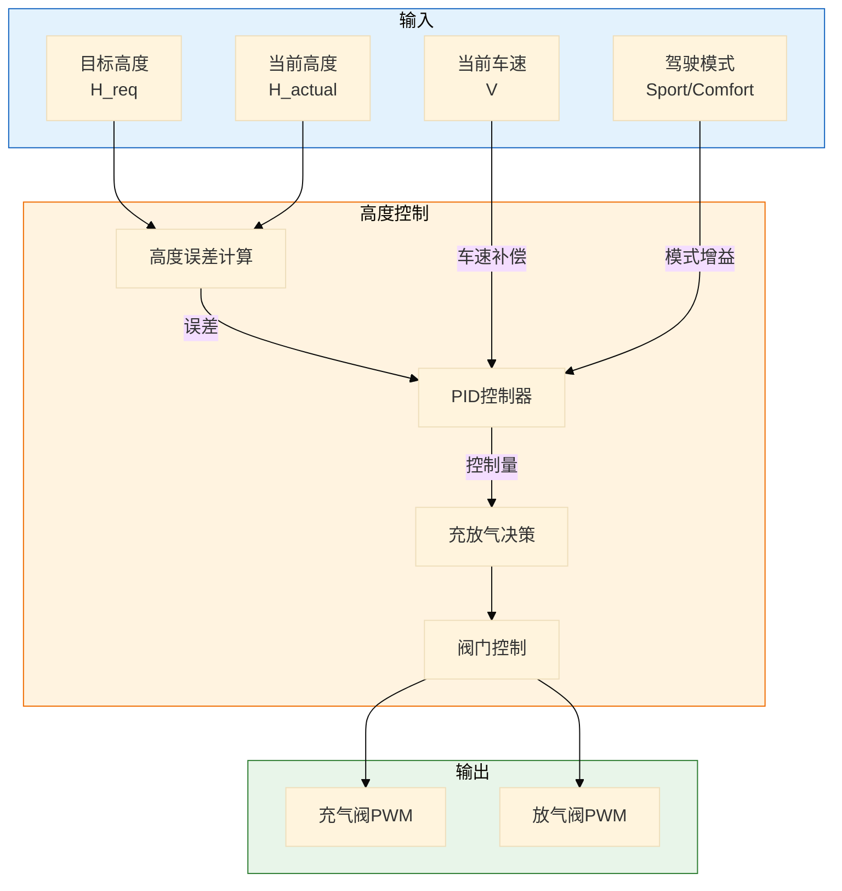
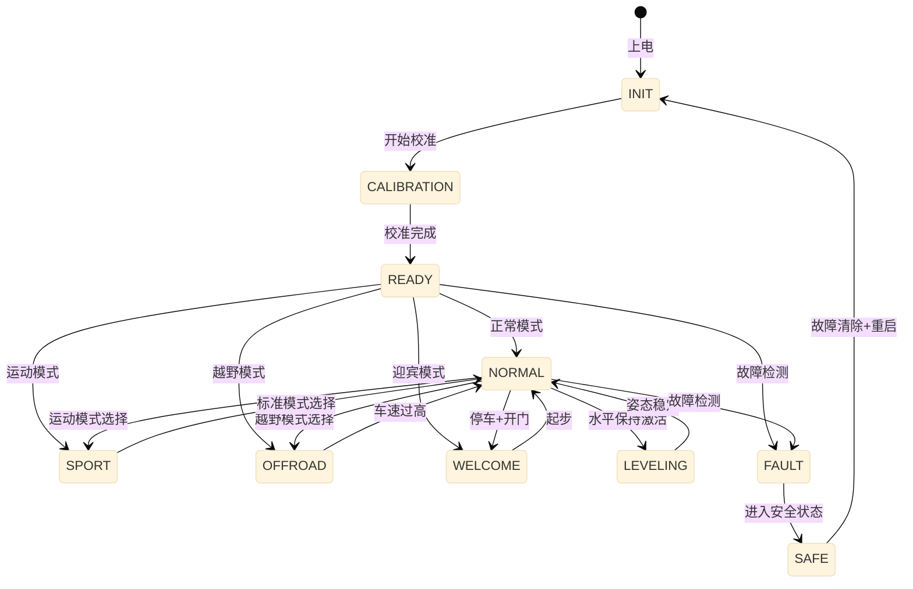

# ASC 空气悬架控制详细设计

> 模块：ASC (Air Suspension Control)  
> 版本：v1.0  
> ASIL等级：B  
> 依赖：系统架构设计 v1.0

---

## 一、功能需求规格

### 1.1 功能概述

ASC（空气悬架控制）通过控制空气弹簧的充放气，实现以下功能：
- **车身高度调节**：根据车速和驾驶模式调整车身高度
- **水平保持控制**：保持车身水平（抗侧倾/抗俯仰）
- **阻尼连续可调**：CDC (Continuous Damping Control) 减震器控制
- **魔毯悬架**：基于路面预瞄的主动调节
- **迎宾模式**：上下车自动降低车身

### 1.2 功能需求列表

| 需求ID | 需求描述 | 优先级 | ASIL |
|--------|----------|--------|------|
| ASC-FR-001 | 支持 ±50mm 车身高度调节范围 | P0 | B |
| ASC-FR-002 | 支持至少 3 级高度模式（低/标准/高）| P0 | B |
| ASC-FR-003 | 自动水平保持（侧倾/俯仰补偿）| P0 | B |
| ASC-FR-004 | CDC 阻尼连续可调（软/中/硬）| P0 | B |
| ASC-FR-005 | 响应智驾的高度/阻尼请求 | P1 | B |
| ASC-FR-006 | 高度调节速度 ≥ 5mm/s | P0 | B |
| ASC-FR-007 | 系统故障时保持当前高度 | P0 | B |

### 1.3 性能指标

| 指标 | 目标值 | 说明 |
|------|--------|------|
| 高度调节范围 | ±50mm | 相对于标准高度 |
| 高度调节精度 | ±5mm | 稳态误差 |
| 高度调节速度 | ≥ 5mm/s | 上升/下降速度 |
| 水平保持精度 | ±1° | 侧倾/俯仰角 |
| CDC 调节档位 | 连续可调 | 或至少 3 档 |
| 响应延迟 | < 100ms | 请求到执行 |

---

## 二、控制算法设计

### 2.1 高度控制算法



#### 高度控制算法实现

```c
// ASC 高度控制算法
void ASC_HeightControl(float target_height, VehicleState_t* state) {
    // 1. 读取四轮高度
    float h_fl = ASC_ReadHeight(FL);
    float h_fr = ASC_ReadHeight(FR);
    float h_rl = ASC_ReadHeight(RL);
    float h_rr = ASC_ReadHeight(RR);
    
    // 2. 计算平均高度
    float h_avg = (h_fl + h_fr + h_rl + h_rr) / 4.0f;
    
    // 3. 高度误差
    float height_error = target_height - h_avg;
    
    // 4. 死区处理（避免高频振荡）
    if (ABS(height_error) < ASC_HEIGHT_DEADBAND) {
        height_error = 0;
    }
    
    // 5. PID 计算
    float P = ASC_HEIGHT_KP * height_error;
    
    ASC_height_integral += height_error * ASC_CYCLE_TIME;
    ASC_height_integral = LIMIT(ASC_height_integral, ASC_INTEGRAL_MAX, -ASC_INTEGRAL_MAX);
    float I = ASC_HEIGHT_KI * ASC_height_integral;
    
    float height_derivative = (h_avg - ASC_last_height) / ASC_CYCLE_TIME;
    float D = ASC_HEIGHT_KD * height_derivative;
    
    // 6. 控制输出（PWM占空比）
    float control_output = P + I + D;
    
    // 7. 充放气决策
    if (control_output > ASC_VALVE_THRESHOLD) {
        // 需要升高 → 充气
        ASC_SetInflatePWM(control_output);
        ASC_SetDeflatePWM(0);
    } else if (control_output < -ASC_VALVE_THRESHOLD) {
        // 需要降低 → 放气
        ASC_SetInflatePWM(0);
        ASC_SetDeflatePWM(-control_output);
    } else {
        // 保持
        ASC_SetInflatePWM(0);
        ASC_SetDeflatePWM(0);
    }
    
    ASC_last_height = h_avg;
}
```

### 2.2 水平保持控制

```c
// ASC 水平保持控制（抗侧倾/抗俯仰）
void ASC_LevelingControl(VehicleState_t* state) {
    // 1. 读取车身姿态
    float roll_angle = state->roll_angle;      // 侧倾角
    float pitch_angle = state->pitch_angle;    // 俯仰角
    
    // 2. 读取四轮高度
    float h[4] = {ASC_ReadHeight(FL), ASC_ReadHeight(FR),
                  ASC_ReadHeight(RL), ASC_ReadHeight(RR)};
    
    // 3. 计算目标高度补偿
    // 侧倾补偿：左侧升高 = 右侧降低
    float roll_compensation = roll_angle * ASC_ROLL_COMPENSATION_GAIN;
    
    // 俯仰补偿：前轴 vs 后轴
    float pitch_compensation = pitch_angle * ASC_PITCH_COMPENSATION_GAIN;
    
    // 4. 各轮目标高度
    float h_fl_target = base_height - roll_compensation - pitch_compensation;
    float h_fr_target = base_height + roll_compensation - pitch_compensation;
    float h_rl_target = base_height - roll_compensation + pitch_compensation;
    float h_rr_target = base_height + roll_compensation + pitch_compensation;
    
    // 5. 各轮独立控制
    ASC_SingleWheelControl(FL, h_fl_target, h[FL]);
    ASC_SingleWheelControl(FR, h_fr_target, h[FR]);
    ASC_SingleWheelControl(RL, h_rl_target, h[RL]);
    ASC_SingleWheelControl(RR, h_rr_target, h[RR]);
}
```

### 2.3 CDC 阻尼控制

```c
// CDC 阻尼控制算法
void ASC_CDCControl(VehicleState_t* state) {
    DampingMode_t mode;
    
    // 1. 确定阻尼模式
    if (state->driver_mode == SPORT_MODE) {
        mode = DAMPING_HARD;
    } else if (state->vehicle_speed > 120) {
        mode = DAMPING_MEDIUM;
    } else if (state->road_quality == ROAD_POOR) {
        mode = DAMPING_SOFT;
    } else {
        mode = DAMPING_ADAPTIVE;
    }
    
    // 2. 计算阻尼系数
    float damping_coeff = CalculateDampingCoefficient(mode, state);
    
    // 3. 转换为PWM输出到CDC阀
    float cdc_pwm = DampingToPWM(damping_coeff);
    
    // 4. 输出到四轮CDC
    ASC_SetCDCPWM(FL, cdc_pwm);
    ASC_SetCDCPWM(FR, cdc_pwm);
    ASC_SetCDCPWM(RL, cdc_pwm);
    ASC_SetCDCPWM(RR, cdc_pwm);
}

// 阻尼模式定义
typedef enum {
    DAMPING_SOFT = 0,       // 舒适模式
    DAMPING_MEDIUM = 1,     // 标准模式
    DAMPING_HARD = 2,       // 运动模式
    DAMPING_ADAPTIVE = 3    // 自适应模式
} DampingMode_t;
```

### 2.4 高度模式切换策略

| 模式 | 高度偏移 | 触发条件 | 自动恢复条件 |
|------|----------|----------|--------------|
| **低位** | -30mm | 车速 > 100km/h 或运动模式 | 车速 < 80km/h |
| **标准** | 0mm | 默认状态 | - |
| **高位** | +30mm | 越野模式或手动选择 | 车速 > 40km/h |
| **迎宾** | -50mm | 停车+开门+驾驶员接近 | 车速 > 0 |
| **装载** | -50mm | 后备箱开启 | 后备箱关闭 |

---

## 三、状态机设计

### 3.1 ASC 主状态机



---

## 四、故障处理策略

### 4.1 故障分类

| 故障ID | 故障描述 | 等级 | 响应策略 |
|--------|----------|------|----------|
| ASC-FLT-001 | 高度传感器故障 | Level 2 | 禁用自动调节，保持当前高度 |
| ASC-FLT-002 | 充气泵故障 | Level 2 | 只能放气，不能充气 |
| ASC-FLT-003 | 阀门故障 | Level 2 | 禁用对应轮控制 |
| ASC-FLT-004 | 气路泄漏 | Level 1 | 频繁补气报警 |
| ASC-FLT-005 | CDC阀故障 | Level 1 | 固定在中等阻尼 |

---

## 五、与外部系统接口

### 5.1 与VDMC交互

| 信号方向 | 信号名称 | 说明 | 周期 |
|----------|----------|------|------|
| VDMC → ASC | VDMC_DampingReq | 阻尼模式请求 | 50ms |
| VDMC → ASC | VDMC_HeightReq | 高度调节请求 | 50ms |
| ASC → VDMC | ASC_ActualHeight | 实际车身高度 | 50ms |
| ASC → VDMC | ASC_ActualDamping | 实际阻尼模式 | 50ms |

### 5.2 与驾驶员交互

| 信号方向 | 信号名称 | 说明 |
|----------|----------|------|
| Driver → ASC | Driver_HeightMode | 驾驶员高度模式选择 |
| Driver → ASC | Driver_DampingMode | 驾驶员阻尼模式选择 |
| ASC → Cluster | ASC_HeightDisplay | 高度显示 |
| ASC → Cluster | ASC_ModeDisplay | 模式显示 |

---

## 六、关键参数定义

```c
// ASC 关键参数
#define ASC_CYCLE_TIME_MS           50      // 控制周期 50ms
#define ASC_HEIGHT_RANGE            50.0f   // 高度调节范围 ±50mm
#define ASC_HEIGHT_PRECISION        5.0f    // 高度控制精度 mm
#define ASC_ADJUST_SPEED            5.0f    // 调节速度 mm/s
#define ASC_HEIGHT_DEADBAND         3.0f    // 高度死区 mm

// PID参数
#define ASC_HEIGHT_KP               2.0f
#define ASC_HEIGHT_KI               0.1f
#define ASC_HEIGHT_KD               0.5f

// 水平保持
#define ASC_ROLL_COMPENSATION_GAIN  10.0f   // 侧倾补偿增益 mm/°
#define ASC_PITCH_COMPENSATION_GAIN 8.0f    // 俯仰补偿增益 mm/°

// 速度阈值
#define ASC_LOW_HEIGHT_SPEED        100.0f  // 低位模式车速阈值 km/h
#define ASC_HIGH_HEIGHT_SPEED       40.0f   // 高位模式车速限制 km/h
```

---

## 七、测试要点

| 用例ID | 测试场景 | 预期结果 |
|--------|----------|----------|
| ASC-TC-001 | 高度模式切换 | 平滑切换，无振荡 |
| ASC-TC-002 | 侧倾工况 | 车身保持水平 |
| ASC-TC-003 | 俯仰工况（加减速） | 车身保持水平 |
| ASC-TC-004 | 高速自动降低 | 车速>100自动降至低位 |
| ASC-TC-005 | 气路泄漏 | 检测泄漏并报警 |

---

> 🏷️ **标签**：`ASC`, `空气悬架`, `CDC`, `魔毯悬架`, `详细设计`
