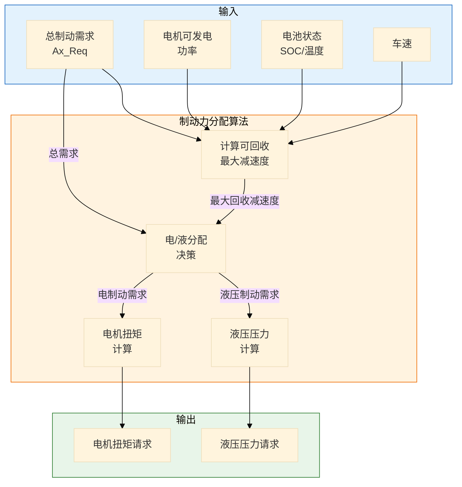
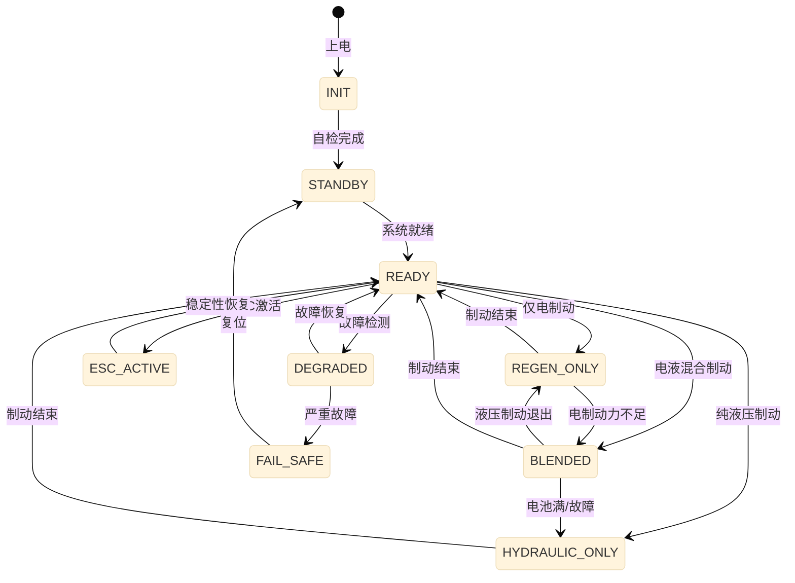

# ICC 一体化制动控制详细设计

> 模块：ICC (Integrated Chassis Control)  
> 版本：v1.0  
> ASIL等级：D  
> 依赖：系统架构设计 v1.0

---

## 一、功能需求规格

### 1.1 功能概述

ICC（一体化制动控制）是智能底盘域的核心制动控制模块，负责整合以下功能：
- 能量回收制动 (RBS - Regenerative Braking System)
- 电子稳定性控制 (ESC - Electronic Stability Control)
- 防抱死制动 (ABS - Anti-lock Braking System)
- 自动紧急制动执行 (AEB - Autonomous Emergency Braking)
- 自适应巡航执行 (ACC - Adaptive Cruise Control)

### 1.2 功能需求列表

| 需求ID | 需求描述 | 优先级 | ASIL |
|--------|----------|--------|------|
| ICC-FR-001 | 支持最大 0.3g 的电能回收减速度 | P0 | D |
| ICC-FR-002 | 实现电制动与液压制动的无缝切换 | P0 | D |
| ICC-FR-003 | 响应智驾系统的制动请求（10ms周期）| P0 | D |
| ICC-FR-004 | 驾驶员踏板输入优先于智驾请求 | P0 | D |
| ICC-FR-005 | 支持4轮独立制动力分配 | P1 | D |
| ICC-FR-006 | 提供制动系统状态反馈 | P0 | D |
| ICC-FR-007 | 故障时进入安全降级模式 | P0 | D |

### 1.3 性能指标

| 指标 | 目标值 | 说明 |
|------|--------|------|
| 制动响应延迟 | < 50ms | 从请求到执行器响应 |
| 制动精度 | ±0.05m/s² | 加速度控制误差 |
| 能量回收效率 | > 85% | 理论可回收能量占比 |
| 切换平滑度 | < 0.1m/s³ | 电/液切换冲击度 |

---

## 二、控制算法设计

### 2.1 制动力分配算法



#### 分配逻辑伪代码

```c
// 制动力分配算法
void ICC_BrakeForceDistribution(float ax_req, VehicleState_t* state) {
    // 1. 计算最大可回收减速度
    float ax_regen_max = CalculateMaxRegenDeceleration(state);
    
    // 2. 电/液分配决策
    float ax_regen = MIN(ax_req, ax_regen_max);
    float ax_hydraulic = ax_req - ax_regen;
    
    // 3. 平滑过渡处理（避免切换冲击）
    if (ABS(ax_regen - last_ax_regen) > REGEN_RAMP_LIMIT) {
        ax_regen = last_ax_regen + SIGN(ax_regen - last_ax_regen) * REGEN_RAMP_LIMIT;
        ax_hydraulic = ax_req - ax_regen;
    }
    
    // 4. 计算电机扭矩请求
    motor_torque_req = ax_regen * VEHICLE_MASS * WHEEL_RADIUS / GEAR_RATIO;
    
    // 5. 计算液压压力请求
    hydraulic_pressure_req = ax_hydraulic * BRAKE_GAIN;
    
    // 6. 输出
    Output_MotorTorque(motor_torque_req);
    Output_HydraulicPressure(hydraulic_pressure_req);
}
```

### 2.2 能量回收控制算法

#### 回收功率计算

```c
// 计算最大可回收减速度
float CalculateMaxRegenDeceleration(VehicleState_t* state) {
    // 1. 电机最大发电功率限制
    float P_motor_max = GetMotorRegenPowerLimit();
    
    // 2. 电池充电功率限制
    float P_batt_max = GetBatteryChargePowerLimit(state->SOC, state->batt_temp);
    
    // 3. 可回收功率 = 最小值
    float P_regen_max = MIN(P_motor_max, P_batt_max);
    
    // 4. 转换为减速度
    float ax_regen_max = P_regen_max / (state->vehicle_speed * VEHICLE_MASS);
    
    // 5. 限制最大回收减速度（舒适性考虑）
    return MIN(ax_regen_max, MAX_REGEN_DECELERATION);
}
```

### 2.3 ESC 横摆力矩控制

当 VDMC 请求横摆力矩时，ICC 通过差动制动实现：

```c
// ESC 横摆力矩控制
void ICC_ESControl(float yaw_moment_req, VehicleState_t* state) {
    // 1. 计算单侧制动力增量
    float delta_brake_force = yaw_moment_req / TRACK_WIDTH;
    
    // 2. 判断转向方向
    if (yaw_moment_req > 0) {
        // 需要增加右转力矩 → 左轮增加制动
        brake_force_fl += delta_brake_force / 2;
        brake_force_rl += delta_brake_force / 2;
    } else {
        // 需要增加左转力矩 → 右轮增加制动
        brake_force_fr += delta_brake_force / 2;
        brake_force_rr += delta_brake_force / 2;
    }
    
    // 3. 限制单轮制动力（避免抱死）
    ApplyABSLogic(&brake_force_fl, &brake_force_fr, &brake_force_rl, &brake_force_rr, state);
}
```

---

## 三、状态机设计

### 3.1 ICC 主状态机



### 3.2 状态转换条件

| 转换 | 条件 | 动作 |
|------|------|------|
| READY → REGEN_ONLY | 制动请求 < 最大回收减速度 且 电池可充电 | 启动电机发电 |
| READY → BLENDED | 制动请求 > 最大回收减速度 | 电制动+液压制动 |
| READY → ESC_ACTIVE | VDMC 请求横摆力矩 | 差动制动 |
| READY → DEGRADED | 检测到非安全故障 | 限制功能，报警 |
| ANY → FAIL_SAFE | 检测到安全相关故障 | 进入安全状态 |

---

## 四、故障处理策略

### 4.1 故障分类

| 故障ID | 故障描述 | 等级 | 响应策略 |
|--------|----------|------|----------|
| ICC-FLT-001 | 电机发电故障 | Level 2 | 切换到纯液压制动 |
| ICC-FLT-002 | 液压压力传感器故障 | Level 3 | 进入Fail-Safe，请求接管 |
| ICC-FLT-003 | 踏板传感器故障 | Level 3 | 进入Fail-Safe |
| ICC-FLT-004 | 轮速传感器故障 | Level 2 | 禁用ABS/ESC |
| ICC-FLT-005 | 电池充电故障 | Level 1 | 限制回收减速度 |

### 4.2 Fail-Safe 策略

```c
// Fail-Safe 处理
void ICC_EnterFailSafeMode(FaultType_t fault) {
    // 1. 立即切断电制动
    SetMotorTorque(0);
    
    // 2. 建立最小液压制动（保持压力）
    if (fault != HYDRAULIC_SENSOR_FAULT) {
        SetHydraulicPressure(MIN_SAFE_PRESSURE);
    }
    
    // 3. 通知上层系统
    ReportFaultToVDMC(fault);
    
    // 4. 点亮警告灯
    SetWarningLamp(WARNING_LEVEL_3);
    
    // 5. 记录故障信息
    LogFaultInfo(fault);
}
```

---

## 五、与外部系统接口

### 5.1 与动力域交互

| 信号方向 | 信号名称 | 说明 | 周期 |
|----------|----------|------|------|
| DCU → VCU | ICC_MotorTorqueReq | 电机发电扭矩请求 | 10ms |
| DCU → VCU | ICC_RegenActive | 能量回收激活状态 | 50ms |
| VCU → DCU | VCU_MotorTorqueAvail | 电机可用发电扭矩 | 10ms |
| VCU → DCU | VCU_RegenLimit | 回收功率限制 | 50ms |
| BMS → DCU | BMS_ChargePowerLimit | 电池充电功率限制 | 100ms |
| BMS → DCU | BMS_SOC | 电池SOC | 100ms |

### 5.2 与VDMC交互

| 信号方向 | 信号名称 | 说明 | 周期 |
|----------|----------|------|------|
| VDMC → ICC | VDMC_DecelerationReq | 目标减速度请求 | 10ms |
| VDMC → ICC | VDMC_YawMomentReq | 横摆力矩请求 | 10ms |
| ICC → VDMC | ICC_AxActual | 实际纵向加速度 | 10ms |
| ICC → VDMC | ICC_BrakeForceAvail | 可用制动力 | 50ms |
| ICC → VDMC | ICC_Status | ICC工作状态 | 50ms |

---

## 六、关键参数定义

```c
// ICC 关键参数配置
#define ICC_CYCLE_TIME_MS           10      // 控制周期 10ms
#define ICC_MAX_REGEN_DECELERATION  3.0f    // 最大回收减速度 0.3g
#define ICC_MAX_HYDRAULIC_PRESSURE  20.0f   // 最大液压压力 20MPa
#define ICC_RAMP_RATE_LIMIT         5.0f    // 制动力变化率限制 m/s³
#define ICC_ABS_SLIP_THRESHOLD      0.15f   // ABS触发滑移率阈值
#define ICC_ESC_YAW_RATE_THRESHOLD  5.0f    // ESC触发横摆角速度阈值 deg/s

// 车辆参数
#define VEHICLE_MASS                2000.0f // 整车质量 kg
#define WHEEL_RADIUS                0.35f   // 车轮半径 m
#define TRACK_WIDTH                 1.6f    // 轮距 m
#define BRAKE_GAIN                  0.8f    // 制动增益
```

---

## 七、测试要点

### 7.1 单元测试用例

| 用例ID | 测试场景 | 预期结果 |
|--------|----------|----------|
| ICC-TC-001 | 轻踩制动（能量回收区间） | 仅电机发电，无液压 |
| ICC-TC-002 | 重踩制动（超出回收能力） | 电液混合制动 |
| ICC-TC-003 | 电池满电状态制动 | 纯液压制动 |
| ICC-TC-004 | 电液切换过程 | 减速度平滑过渡 |
| ICC-TC-005 | ESC触发场景 | 差动制动激活 |

### 7.2 HIL测试场景

1. **能量回收效率测试**
2. **制动踏板感觉一致性测试**
3. **故障注入测试**
4. **与智驾系统联调测试**

---

> 🏷️ **标签**：`ICC`, `制动控制`, `能量回收`, `ESC`, `详细设计`, `ASIL-D`
