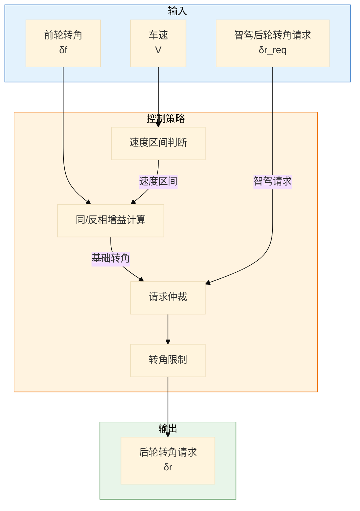
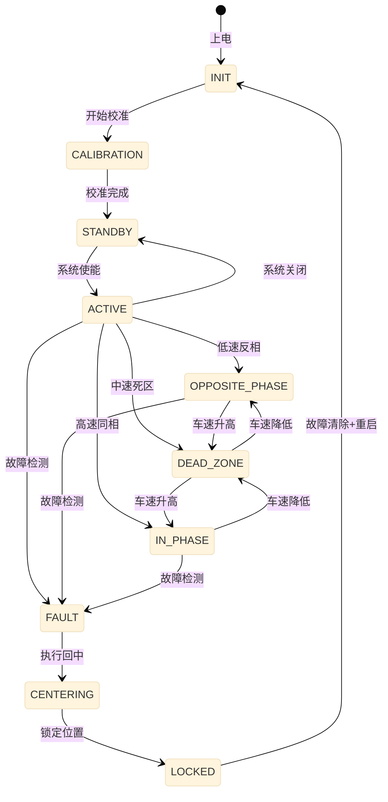

# RWS 后轮转向控制详细设计

> 模块：RWS (Rear Wheel Steering)  
003e 版本：v1.0  
> ASIL等级：D  
> 依赖：系统架构设计 v1.0

---

## 一、功能需求规格

### 1.1 功能概述

RWS（后轮转向控制）通过主动控制后轮转角，实现以下功能：
- **低速反相转向**：提升车辆机动性（转弯半径减小）
- **高速同相转向**：提升高速稳定性（变道平稳性）
- **横摆响应增强**：与前轮转向协同，优化车辆响应
- **稳定性控制**：在极限工况下辅助车辆稳定

### 1.2 功能需求列表

| 需求ID | 需求描述 | 优先级 | ASIL |
|--------|----------|--------|------|
| RWS-FR-001 | 支持后轮最大 ±10° 转角范围 | P0 | D |
| RWS-FR-002 | 低速时后轮与前轮反向（反相）| P0 | D |
| RWS-FR-003 | 高速时后轮与前轮同向（同相）| P0 | D |
| RWS-FR-004 | 前后轮转角响应延迟 < 50ms | P0 | D |
| RWS-FR-005 | 支持智驾系统的后轮转角请求 | P0 | D |
| RWS-FR-006 | 驾驶员转向输入优先 | P0 | D |
| RWS-FR-007 | 故障时自动回中并锁定 | P0 | D |

### 1.3 性能指标

| 指标 | 目标值 | 说明 |
|------|--------|------|
| 后轮转角范围 | ±10° | 机械限位 |
| 转角控制精度 | ±0.5° | 稳态误差 |
| 响应延迟 | < 50ms | 请求到执行 |
| 切换平滑度 | < 2°/s | 同/反相切换速率 |
| 最大转向速率 | 30°/s | 后轮转角速度 |

---

## 二、控制算法设计

### 2.1 前后轮转角关系模型



#### 核心控制算法

```c
// RWS 核心控制算法
void RWS_ControlAlgorithm(float delta_f, float vehicle_speed, float delta_r_req_adas) {
    // 1. 基础后轮转角计算（基于前轮转角和车速）
    float K_rws = RWS_CalculateGain(vehicle_speed);
    float delta_r_base = K_rws * delta_f;
    
    // 2. 智驾请求仲裁
    float delta_r_req;
    if (IsADASRequestValid() && IsDriverOverride() == FALSE) {
        // 智驾请求有效且驾驶员未接管
        delta_r_req = delta_r_req_adas;
    } else {
        // 使用基础控制
        delta_r_req = delta_r_base;
    }
    
    // 3. 转角限制（机械限位+安全边界）
    delta_r_req = LIMIT(delta_r_req, RWS_MAX_ANGLE, -RWS_MAX_ANGLE);
    
    // 4. 转角速度限制（平滑性）
    float delta_rate = (delta_r_req - delta_r_last) / RWS_CYCLE_TIME;
    if (ABS(delta_rate) > RWS_MAX_RATE) {
        delta_r_req = delta_r_last + SIGN(delta_rate) * RWS_MAX_RATE * RWS_CYCLE_TIME;
    }
    
    // 5. 输出到电机控制
    RWS_SetTargetAngle(delta_r_req);
    
    delta_r_last = delta_r_req;
}
```

### 2.2 同/反相增益曲线设计

```c
// RWS 增益曲线（速度相关）
float RWS_CalculateGain(float vehicle_speed) {
    float gain;
    
    if (vehicle_speed < RWS_LOW_SPEED_THRESHOLD) {
        // 低速区间：反相（负增益）
        // 车速0时增益最大（-0.5），达到阈值时增益为0
        gain = RWS_LOW_SPEED_GAIN * (1 - vehicle_speed / RWS_LOW_SPEED_THRESHOLD);
    } else if (vehicle_speed < RWS_HIGH_SPEED_THRESHOLD) {
        // 中速区间：过渡（死区）
        gain = 0.0f;
    } else {
        // 高速区间：同相（正增益）
        // 随车速增加，增益从0逐渐增加到最大值
        float speed_ratio = (vehicle_speed - RWS_HIGH_SPEED_THRESHOLD) / 
                           (RWS_MAX_SPEED - RWS_HIGH_SPEED_THRESHOLD);
        gain = RWS_HIGH_SPEED_GAIN * speed_ratio;
    }
    
    return LIMIT(gain, RWS_MAX_GAIN, RWS_MIN_GAIN);
}

// 增益参数定义
#define RWS_LOW_SPEED_THRESHOLD     30.0f   // 低速阈值 30km/h
#define RWS_HIGH_SPEED_THRESHOLD    60.0f   // 高速阈值 60km/h
#define RWS_MAX_SPEED               200.0f  // 最大车速
#define RWS_LOW_SPEED_GAIN          -0.5f   // 低速增益（反相）
#define RWS_HIGH_SPEED_GAIN         0.3f    // 高速增益（同相）
#define RWS_MAX_GAIN                0.3f
#define RWS_MIN_GAIN                -0.5f
```

### 2.3 增益曲线可视化

```
后轮转角增益 K_rws
     │
 0.3 ┤                    ╱ 高速同相
     │                 ╱
   0 ┤─────┬──────────┘
     │     │ 死区
-0.5 ┤     ╲ 低速反相
     │
     └─────┼──────────┼──────────
          30km/h    60km/h    200km/h
              车速
```

### 2.4 电机位置闭环控制

```c
// RWS 电机位置控制
void RWS_MotorPositionControl(float target_angle) {
    // 1. 读取当前后轮转角
    float actual_angle = RWS_ReadActualAngle();
    
    // 2. 计算位置误差
    float angle_error = target_angle - actual_angle;
    
    // 3. PID 控制器
    float P = RWS_KP * angle_error;
    
    RWS_integral += angle_error * RWS_CYCLE_TIME;
    RWS_integral = LIMIT(RWS_integral, RWS_INTEGRAL_MAX, -RWS_INTEGRAL_MAX);
    float I = RWS_KI * RWS_integral;
    
    float derivative = (angle_error - RWS_last_error) / RWS_CYCLE_TIME;
    float D = RWS_KD * derivative;
    
    // 4. PID 输出
    float motor_torque = P + I + D;
    
    // 5. 电机扭矩限制
    motor_torque = LIMIT(motor_torque, RWS_MAX_TORQUE, -RWS_MAX_TORQUE);
    
    // 6. 输出到电机
    RWS_SetMotorTorque(motor_torque);
    
    RWS_last_error = angle_error;
}

// PID 参数
#define RWS_KP          5.0f    // 比例增益
#define RWS_KI          0.5f    // 积分增益
#define RWS_KD          0.1f    // 微分增益
#define RWS_INTEGRAL_MAX 10.0f  // 积分限幅
```

---

## 三、状态机设计

### 3.1 RWS 主状态机



### 3.2 状态说明

| 状态 | 说明 | 后轮转角 |
|------|------|----------|
| INIT | 系统初始化 | 保持当前位置 |
| CALIBRATION | 零位校准 | 寻找机械中点 |
| STANDBY | 待机状态 | 保持当前位置 |
| ACTIVE | 激活状态 | 根据策略控制 |
| OPPOSITE_PHASE | 低速反相 | 与前轮反向 |
| IN_PHASE | 高速同相 | 与前轮同向 |
| DEAD_ZONE | 中速死区 | 保持0° |
| FAULT | 故障状态 | 启动回中 |
| CENTERING | 回中过程 | 向0°运动 |
| LOCKED | 锁定状态 | 锁定在0° |

---

## 四、故障处理策略

### 4.1 故障分类与响应

| 故障ID | 故障描述 | 等级 | 响应策略 |
|--------|----------|------|----------|
| RWS-FLT-001 | 电机故障 | Level 3 | 立即回中并锁定 |
| RWS-FLT-002 | 转角传感器故障 | Level 3 | 立即回中并锁定 |
| RWS-FLT-003 | 转角超限 | Level 2 | 限制在安全范围 |
| RWS-FLT-004 | 通信故障 | Level 2 | 保持当前策略，报警 |
| RWS-FLT-005 | 供电异常 | Level 3 | 进入Fail-Safe |

### 4.2 回中策略

```c
// RWS 回中控制
void RWS_CenteringControl(void) {
    // 1. 切断外部请求
    DisableExternalRequest();
    
    // 2. 读取当前角度
    float current_angle = RWS_ReadActualAngle();
    
    // 3. 计算回中所需扭矩
    float centering_torque = -SIGN(current_angle) * RWS_CENTERING_TORQUE;
    
    // 4. 根据距离调整扭矩（越接近0°扭矩越小）
    if (ABS(current_angle) < 2.0f) {
        centering_torque *= 0.5f;
    }
    
    // 5. 输出扭矩
    RWS_SetMotorTorque(centering_torque);
    
    // 6. 判断是否回中完成
    if (ABS(current_angle) < RWS_CENTER_THRESHOLD) {
        RWS_SetMotorTorque(0);
        RWS_LockPosition();
        EnterState(LOCKED);
    }
}

#define RWS_CENTERING_TORQUE    3.0f    // 回中扭矩 Nm
#define RWS_CENTER_THRESHOLD    0.5f    // 回中完成阈值 °
```

---

## 五、与外部系统接口

### 5.1 与VDMC交互

| 信号方向 | 信号名称 | 说明 | 周期 |
|----------|----------|------|------|
| VDMC → RWS | VDMC_RearAngleReq | 目标后轮转角请求 | 20ms |
| VDMC → RWS | VDMC_YawRateReq | 目标横摆角速度 | 10ms |
| RWS → VDMC | RWS_ActualAngle | 实际后轮转角 | 10ms |
| RWS → VDMC | RWS_ActualRate | 实际转角速度 | 10ms |
| RWS → VDMC | RWS_Status | RWS工作状态 | 50ms |

### 5.2 与EPS交互（前后轮协调）

| 信号方向 | 信号名称 | 说明 |
|----------|----------|------|
| EPS → RWS | EPS_SteeringAngle | 方向盘转角 |
| EPS → RWS | EPS_SteeringSpeed | 方向盘转角速度 |
| RWS → EPS | RWS_Active | RWS激活状态 |

---

## 六、关键参数定义

```c
// RWS 关键参数
#define RWS_CYCLE_TIME_MS           20      // 控制周期 20ms
#define RWS_MAX_ANGLE               10.0f   // 最大转角 ±10°
#define RWS_MAX_RATE                30.0f   // 最大转角速度 °/s
#define RWS_MAX_TORQUE              10.0f   // 最大扭矩 Nm

// 速度阈值
#define RWS_VEL_LOW_THRESHOLD       30.0f   // 低速阈值 km/h
#define RWS_VEL_HIGH_THRESHOLD      60.0f   // 高速阈值 km/h

// 增益参数
#define RWS_GAIN_LOW_SPEED          -0.5f   // 低速反相增益
#define RWS_GAIN_HIGH_SPEED         0.3f    // 高速同相增益

// 车辆参数
#define RWS_WHEELBASE               2.8f    // 轴距 m
#define RWS_TRACK_WIDTH             1.6f    // 轮距 m
```

### 6.1 性能对比（有无RWS）

| 场景 | 无RWS | 有RWS | 改善 |
|------|-------|-------|------|
| 最小转弯半径 | 6.0m | 5.2m | -13% |
| 100km/h变道时间 | 3.5s | 3.0s | -14% |
| 高速侧风稳定性 | 基准 | +20% | - |

---

## 七、测试要点

### 7.1 关键测试场景

| 用例ID | 测试场景 | 预期结果 |
|--------|----------|----------|
| RWS-TC-001 | 低速掉头（20km/h） | 后轮反相，转弯半径减小 |
| RWS-TC-002 | 高速变道（100km/h） | 后轮同相，变道更平稳 |
| RWS-TC-003 | 同/反相切换 | 切换平滑，无冲击 |
| RWS-TC-004 | 智驾请求跟随 | 准确跟踪智驾转角请求 |
| RWS-TC-005 | 故障回中 | 故障后自动回中并锁定 |

---

> 🏷️ **标签**：`RWS`, `后轮转向`, `4WS`, `详细设计`, `ASIL-D`
