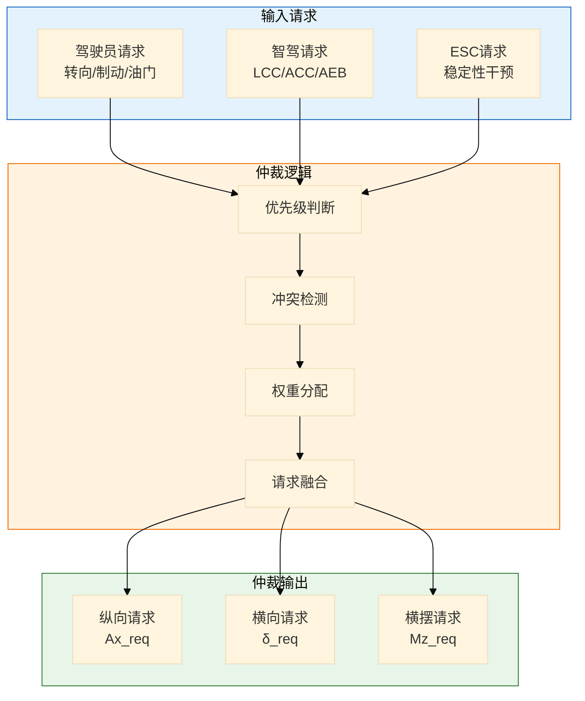
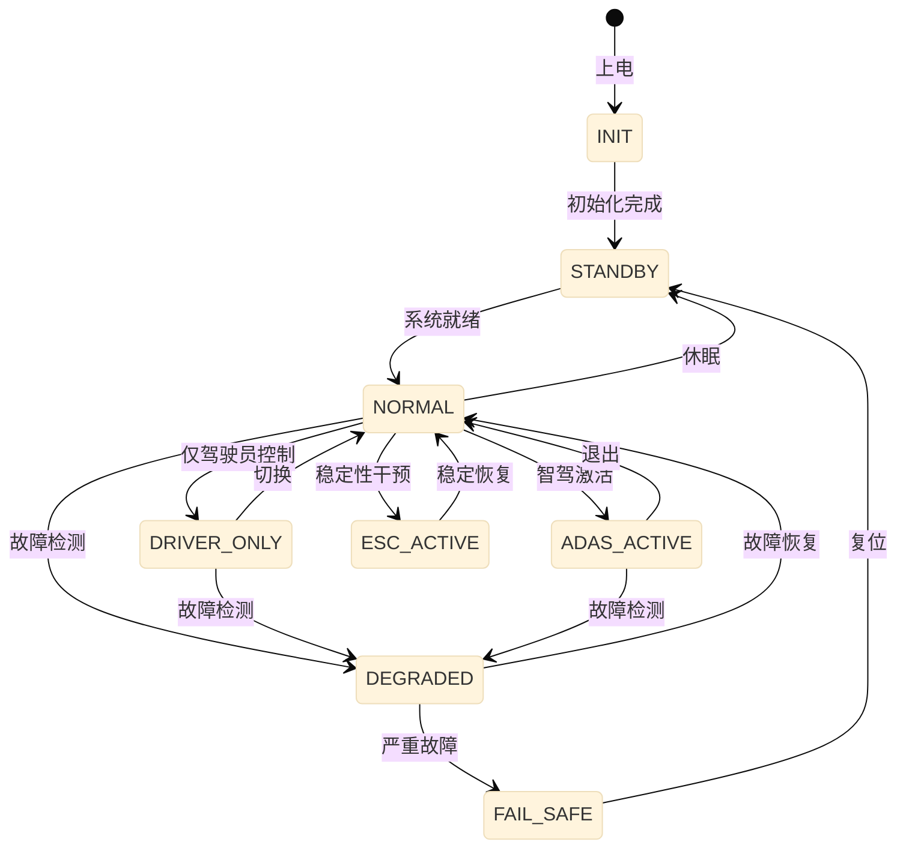

# VDMC 整车动态稳定控制详细设计

> 模块：VDMC (Vehicle Dynamic Motion Control)  
> 版本：v1.0  
> ASIL等级：D  
> 依赖：系统架构设计 v1.0

---

## 一、功能需求规格

### 1.1 功能概述

VDMC（整车动态稳定控制）是智能底盘域的**核心协调控制模块**，负责：
- **请求仲裁**：驾驶员、智驾系统、各底盘子系统的请求仲裁
- **动态协调**：制动、转向、悬架的多系统协调控制
- **稳定性控制**：横摆/侧倾/俯仰的全方位稳定控制
- **安全监控**：实时监控系统状态，触发降级策略

### 1.2 功能需求列表

| 需求ID | 需求描述 | 优先级 | ASIL |
|--------|----------|--------|------|
| VDMC-FR-001 | 实现驾驶员与智驾请求的仲裁 | P0 | D |
| VDMC-FR-002 | 实现多执行器的协调控制 | P0 | D |
| VDMC-FR-003 | 提供车辆稳定性控制 | P0 | D |
| VDMC-FR-004 | 实时监控系统安全状态 | P0 | D |
| VDMC-FR-005 | 故障时触发降级策略 | P0 | D |
| VDMC-FR-006 | 支持不同的驾驶模式 | P1 | D |

### 1.3 性能指标

| 指标 | 目标值 | 说明 |
|------|--------|------|
| 仲裁延迟 | < 10ms | 请求到分配 |
| 协调精度 | 误差 < 5% | 力矩分配精度 |
| 稳定性响应 | < 50ms | 失稳检测到干预 |
| 控制周期 | 10ms | 主控制周期 |

---

## 二、控制算法设计

### 2.1 请求仲裁算法



#### 仲裁算法实现

```c
// VDMC 请求仲裁算法
void VDMC_RequestArbitration(void) {
    // 1. 读取各来源请求
    DriverRequest_t driver_req = GetDriverRequest();
    ADASRequest_t adas_req = GetADASRequest();
    ESCRequest_t esc_req = GetESCRequest();
    
    // 2. 优先级判断
    // Level 1: ESC（最高优先级，安全相关）
    // Level 2: AEB
    // Level 3: 驾驶员
    // Level 4: 智驾（LCC/ACC）
    
    if (esc_req.active) {
        // ESC优先
        final_req.ax = esc_req.ax;
        final_req.yaw_moment = esc_req.yaw_moment;
    } else if (adas_req.aeb_active) {
        // AEB优先
        final_req.ax = adas_req.ax;
        final_req.steering_angle = adas_req.steering_angle;
    } else if (IsDriverOverride()) {
        // 驾驶员接管
        final_req.ax = driver_req.ax;
        final_req.steering_angle = driver_req.steering_angle;
    } else if (adas_req.active) {
        // 智驾请求
        final_req.ax = adas_req.ax;
        final_req.steering_angle = adas_req.steering_angle;
    } else {
        // 仅驾驶员
        final_req.ax = driver_req.ax;
        final_req.steering_angle = driver_req.steering_angle;
    }
    
    // 3. 输出仲裁结果
    OutputFinalRequest(final_req);
}
```

### 2.2 多执行器协调控制

```c
// VDMC 协调控制算法
void VDMC_CoordinatedControl(VehicleState_t* state) {
    // 1. 获取仲裁后的请求
    float ax_req = GetLongitudinalRequest();
    float delta_req = GetLateralRequest();
    float Mz_req = GetYawMomentRequest();
    
    // 2. 纵向控制分配（ICC + 动力域）
    float ax_motor, ax_brake;
    if (ax_req > 0) {
        // 驱动
        ax_motor = ax_req;
        ax_brake = 0;
    } else {
        // 制动
        ax_motor = 0;
        ax_brake = -ax_req;
    }
    
    // 3. 横向控制分配（EPS + RWS）
    float delta_front, delta_rear;
    VDMC_AllocateSteering(delta_req, state->speed, &delta_front, &delta_rear);
    
    // 4. 横摆力矩分配（差动制动）
    float brake_diff = Mz_req / (TRACK_WIDTH / 2);
    
    // 5. 输出到各子系统
    SetMotorAcceleration(ax_motor);           // 动力域
    SetBrakeDeceleration(ax_brake);           // ICC
    SetFrontSteeringAngle(delta_front);       // EPS
    SetRearSteeringAngle(delta_rear);         // RWS
    SetDifferentialBraking(brake_diff);       // ICC
}

// 前后轮转向分配
void VDMC_AllocateSteering(float delta_total, float speed, 
                           float* delta_front, float* delta_rear) {
    // 基于车速的分配策略
    float gain_rear = RWS_CalculateGain(speed);
    *delta_rear = gain_rear * delta_total;
    *delta_front = delta_total - *delta_rear * (WHEELBASE_REAR / WHEELBASE);
}
```

### 2.3 稳定性控制算法

```c
// VDMC 车辆稳定性控制
void VDMC_StabilityControl(VehicleState_t* state) {
    // 1. 计算理想横摆角速度
    float yaw_rate_desired = (state->speed / WHEELBASE) * 
                             tan(state->steering_angle / STEERING_RATIO);
    
    // 2. 计算横摆角速度误差
    float yaw_rate_error = yaw_rate_desired - state->yaw_rate;
    
    // 3. 判断是否失稳
    if (ABS(yaw_rate_error) > YAW_RATE_ERROR_THRESHOLD) {
        // 车辆失稳，触发ESC
        float Mz_correct = YAW_CONTROL_KP * yaw_rate_error +
                          YAW_CONTROL_KD * (yaw_rate_error - last_yaw_error);
        
        // 4. 横摆力矩分配（差动制动）
        VDMC_DistributeYawMoment(Mz_correct, state);
        
        // 5. 设置ESC激活标志
        SetESCActive(TRUE);
    } else {
        SetESCActive(FALSE);
    }
    
    last_yaw_error = yaw_rate_error;
}

// 横摆力矩分配（差动制动）
void VDMC_DistributeYawMoment(float Mz, VehicleState_t* state) {
    // 需要产生Mz的横摆力矩
    // Mz = (Fxr - Fxl) * track_width / 2
    
    float delta_force = Mz / (TRACK_WIDTH / 2);
    
    if (Mz > 0) {
        // 需要右转力矩 → 左轮增加制动
        SetLeftBrakeForceIncrease(delta_force / 2);
    } else {
        // 需要左转力矩 → 右轮增加制动
        SetRightBrakeForceIncrease(-delta_force / 2);
    }
}
```

---

## 三、状态机设计

### 3.1 VDMC 主状态机



---

## 四、故障处理策略

### 4.1 故障响应表

| 故障ID | 故障描述 | 等级 | 响应策略 |
|--------|----------|------|----------|
| VDMC-FLT-001 | ICC故障 | Level 2 | 限制减速度，增加安全距离 |
| VDMC-FLT-002 | RWS故障 | Level 2 | 禁用智驾横向控制 |
| VDMC-FLT-003 | 通信故障 | Level 2 | 切换到局部控制模式 |
| VDMC-FLT-004 | 传感器故障 | Level 3 | 请求接管，进入Fail-Safe |

---

## 五、与外部系统接口

### 5.1 输入接口汇总

| 来源 | 信号名称 | 说明 | 周期 |
|------|----------|------|------|
| Driver | Driver_SteeringAngle | 方向盘转角 | 10ms |
| Driver | Driver_AccelPedal | 加速踏板 | 10ms |
| Driver | Driver_BrakePedal | 制动踏板 | 10ms |
| ADAS | ADAS_LatReq | 横向控制请求 | 10ms |
| ADAS | ADAS_LongReq | 纵向控制请求 | 10ms |
| Vehicle | Vehicle_Speed | 车速 | 10ms |
| Vehicle | Vehicle_YawRate | 横摆角速度 | 10ms |

### 5.2 输出接口汇总

| 目标 | 信号名称 | 说明 | 周期 |
|------|----------|------|------|
| ICC | VDMC_BrakeReq | 制动请求 | 10ms |
| RWS | VDMC_SteerReq | 转向请求 | 20ms |
| ASC | VDMC_DampingReq | 阻尼请求 | 50ms |
| VCU | VDMC_DriveReq | 驱动请求 | 10ms |

---

## 六、关键参数定义

```c
// VDMC 关键参数
#define VDMC_CYCLE_TIME_MS          10      // 控制周期 10ms

// 稳定性阈值
#define YAW_RATE_ERROR_THRESHOLD    5.0f    // 横摆角速度误差阈值 °/s
#define YAW_CONTROL_KP              100.0f  // 横摆控制比例增益
#define YAW_CONTROL_KD              20.0f   // 横摆控制微分增益

// 车辆参数
#define WHEELBASE                   2.8f    // 轴距 m
#define WHEELBASE_REAR              1.6f    // 后轮距 m
#define TRACK_WIDTH                 1.6f    // 轮距 m
#define STEERING_RATIO              15.0f   // 转向比
```

---

## 七、测试要点

| 用例ID | 测试场景 | 预期结果 |
|--------|----------|----------|
| VDMC-TC-001 | 驾驶员接管 | 智驾请求被覆盖 |
| VDMC-TC-002 | ESC触发 | 差动制动激活 |
| VDMC-TC-003 | 多请求冲突 | 按优先级仲裁 |
| VDMC-TC-004 | 子系统故障 | 触发降级策略 |

---

> 🏷️ **标签**：`VDMC`, `整车控制`, `稳定性`, `仲裁`, `详细设计`, `ASIL-D`
