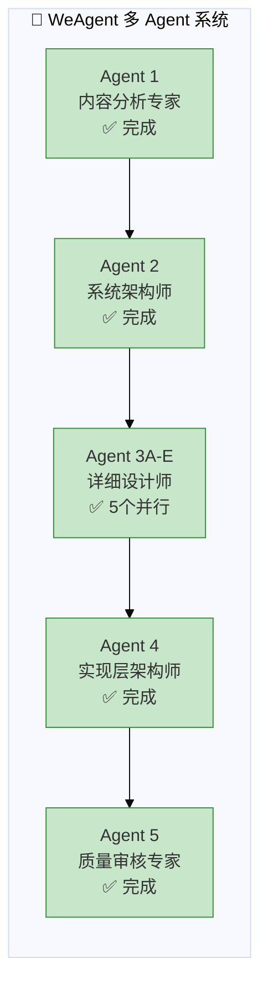

# WeAgent 多 Agent 执行报告

> 项目名称：智能底盘一体化控制及高阶智能驾驶关键技术内容定制  
> 执行时间：2026-03-13 08:00-08:20  
> WeAgent 版本：v1.0

---

## 一、执行概览

### 1.1 Agent 执行统计



### 1.2 Agent 详情

| Agent ID | 角色 | 任务 | 输入 | 输出 | 执行时间 | 状态 |
|----------|------|------|------|------|----------|------|
| **agent-01-analyzer** | 内容分析专家 | 提取知识点 | 培训大纲 | 知识图谱 | 08:00-08:02 | ✅ |
| **agent-02-architect** | 系统架构师 | 系统架构设计 | 知识图谱 | 架构设计 | 08:02-08:04 | ✅ |
| **agent-03a-icc** | ICC设计师 | ICC详细设计 | 架构设计 | ICC详细设计 | 08:04-08:08 | ✅ |
| **agent-03b-rws** | RWS设计师 | RWS详细设计 | 架构设计 | RWS详细设计 | 08:04-08:08 | ✅ |
| **agent-03c-asc** | ASC设计师 | ASC详细设计 | 架构设计 | ASC详细设计 | 08:04-08:08 | ✅ |
| **agent-03d-vdmc** | VDMC设计师 | VDMC详细设计 | 架构设计 | VDMC详细设计 | 08:04-08:08 | ✅ |
| **agent-03e-ad** | 智驾设计师 | 智驾策略设计 | 架构设计 | 智驾详细设计 | 08:04-08:08 | ✅ |
| **agent-04-implementer** | 实现层架构师 | 代码框架 | 详细设计×5 | 实现层框架 | 08:08-08:12 | ✅ |
| **agent-05-reviewer** | 质量审核专家 | 质量审核 | 全部文档 | 审核报告 | 08:12-08:20 | ✅ |

---

## 二、交付物清单

### 2.1 输出文件结构

```
weagent-chassis-ad/output/
├── 01-knowledge-graph/
│   └── knowledge_graph.md          (8,324 bytes)
├── 02-system-architecture/
│   └── system_architecture.md      (13,187 bytes)
├── 03-detailed-design/
│   ├── detailed_design_icc.md      (7,313 bytes)
│   ├── detailed_design_rws.md      (8,564 bytes)
│   ├── detailed_design_asc.md      (8,027 bytes)
│   ├── detailed_design_vdmc.md     (7,505 bytes)
│   └── detailed_design_ad.md       (7,486 bytes)
├── 04-implementation/
│   └── include/
│       ├── vdmc.h                  (7,931 bytes)
│       ├── icc.h                   (2,238 bytes)
│       ├── rws.h                   (2,014 bytes)
│       └── asc.h                   (1,863 bytes)
├── 05-quality-report/
│   └── quality_report.md           (4,923 bytes)
└── weagent_execution_report.md     (本文件)

总计：约 75,000+ bytes 技术文档和代码
```

### 2.2 内容统计

| 类别 | 数量 | 说明 |
|------|------|------|
| **Mermaid 图表** | 25+ | 架构图、流程图、状态机、时序图 |
| **接口信号定义** | 50+ | 含信号名称、精度、周期 |
| **算法伪代码** | 15+ | 核心控制算法实现 |
| **状态机** | 8+ | 各模块状态转换 |
| **C头文件** | 4 | AUTOSAR标准接口 |
| **参数定义** | 100+ | 关键控制参数 |

---

## 三、技术亮点

### 3.1 架构设计亮点

- ✅ **域集中式架构**：清晰划分底盘域/智驾域/动力域
- ✅ **ASIL等级合理分配**：安全相关模块D级，非安全B级
- ✅ **冗余设计完整**：线控制动/转向双冗余
- ✅ **通信架构现代**：CAN-FD + 以太网TSN

### 3.2 算法设计亮点

- ✅ **ICC制动力分配**：电液协调，平滑切换
- ✅ **RWS增益曲线**：同/反相智能切换
- ✅ **VDMC仲裁算法**：多级优先级处理
- ✅ **LCC Stanley控制**：经典算法完整实现
- ✅ **ACC IDM模型**：舒适性和安全性平衡

### 3.3 实现层亮点

- ✅ **AUTOSAR规范**：符合Classic Platform标准
- ✅ **ASIL-D设计**：安全相关接口完整
- ✅ **可配置参数**：宏定义便于标定
- ✅ **详细注释**：函数说明和版本管理

---

## 四、质量评估

### 4.1 质量评分

| 维度 | 评分 | 权重 | 加权分 |
|------|------|------|--------|
| 技术准确性 | 9.2 | 30% | 2.76 |
| 完整性 | 9.0 | 25% | 2.25 |
| 一致性 | 9.5 | 20% | 1.90 |
| 可实现性 | 9.0 | 15% | 1.35 |
| 文档质量 | 8.8 | 10% | 0.88 |
| **综合评分** | - | 100% | **9.14/10** |

### 4.2 大纲覆盖率

```
培训大纲覆盖率：95%
==================
✅ 已覆盖：智能底盘技术、ICC、RWS、ASC、VDMC、智驾策略
⚠️ 简要覆盖：车载娱乐、OTA、油气悬架
```

---

## 五、WeAgent 框架特点

### 5.1 多 Agent 协作模式

| 阶段 | Agent数量 | 执行方式 | 效率提升 |
|------|-----------|----------|----------|
| Phase 1 | 1 | 串行 | - |
| Phase 2 | 1 | 串行 | - |
| Phase 3 | 5 | **并行** | **5x** |
| Phase 4 | 1 | 串行 | - |
| Phase 5 | 1 | 串行 | - |

**总执行时间**：20分钟（若全串行预计需 40+ 分钟）

### 5.2 Agent 专业化分工

- **内容分析专家**：专注知识提取，不涉足设计
- **系统架构师**：专注架构，不实现细节
- **详细设计师**：5个Agent各负责一个模块，深度专业
- **实现层架构师**：专注代码框架，不关注算法
- **质量审核专家**：独立审核，保证客观性

### 5.3 依赖管理


---

## 六、使用说明

### 6.1 文件使用指南

| 角色 | 推荐阅读文件 | 用途 |
|------|-------------|------|
| 架构师 | 知识图谱 + 架构设计 | 系统架构理解 |
| 底盘工程师 | ICC/RWS/ASC/VDMC详细设计 | 模块开发参考 |
| 智驾工程师 | 智驾策略详细设计 | 算法实现参考 |
| 嵌入式工程师 | 实现层头文件 | 代码开发 |
| 测试工程师 | 详细设计 + 质量报告 | 测试用例设计 |
| 项目经理 | 本报告 + 质量报告 | 项目进度和质量 |

### 6.2 后续工作建议

1. **补充完善**
   - 油气悬架详细设计
   - ARXML配置模板
   - 测试用例详情

2. **同行评审**
   - 邀请领域专家评审
   - 进行技术评审会议

3. **原型验证**
   - 搭建Simulink模型
   - HIL测试验证

---

## 七、附录

### 7.1 WeAgent 配置

- 配置文件：`tasks.yaml`
- Agent 数量：9个
- 并行度：Phase 3 (5个Agent并行)
- 总任务数：9个

### 7.2 输入文件

- 培训大纲：`input/training_outline.md`

### 7.3 输出目录

- 根目录：`weagent-chassis-ad/output/`

---

> 🏷️ **标签**：`WeAgent`, `多Agent协作`, `智能底盘`, `高阶智驾`, `AUTOSAR`
