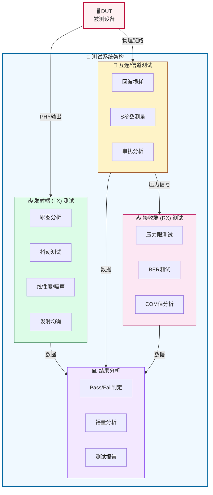
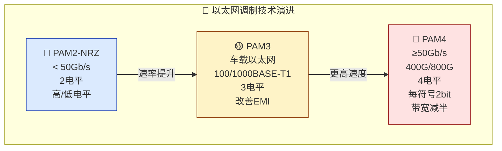
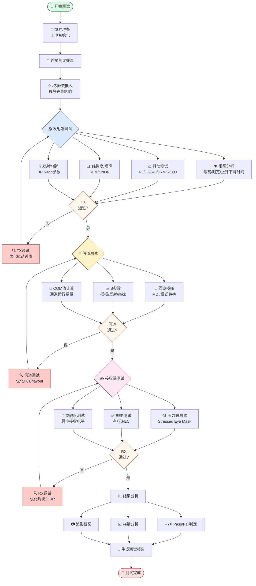
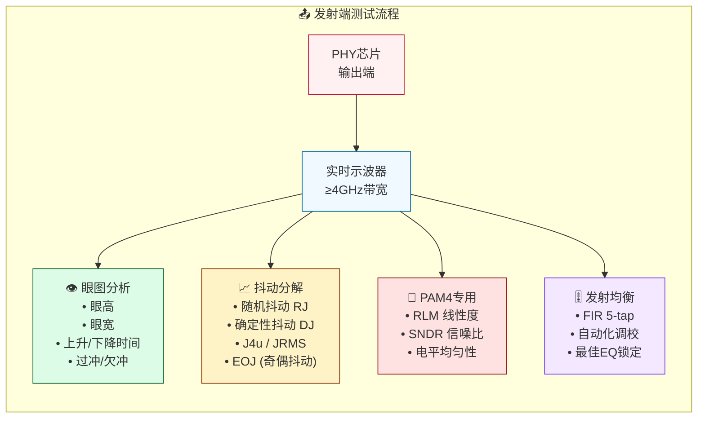
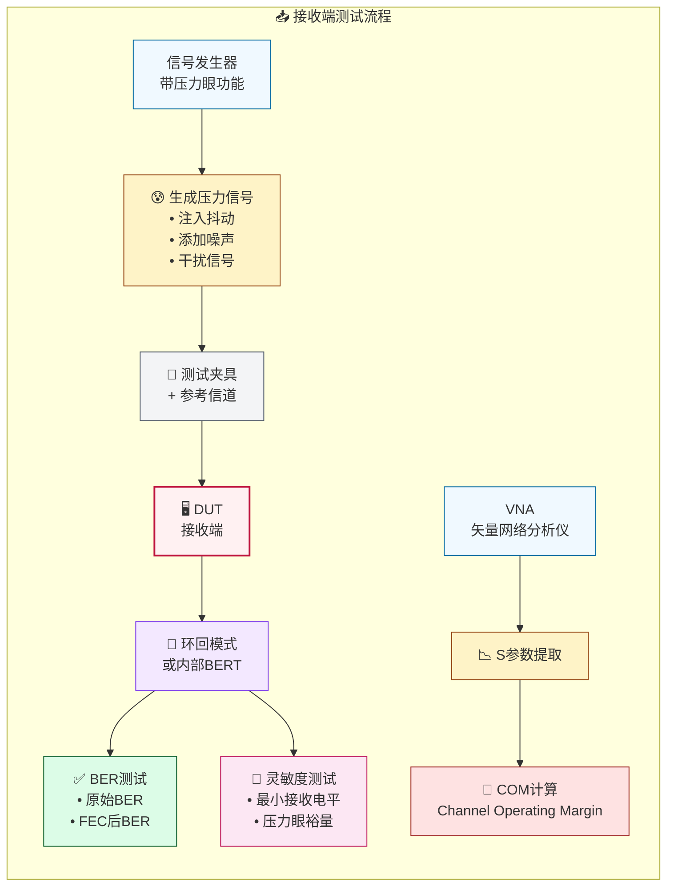
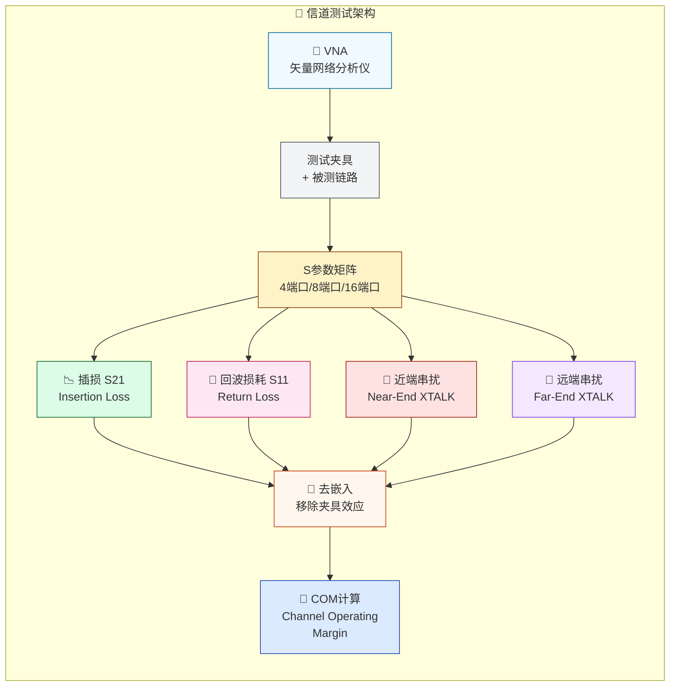
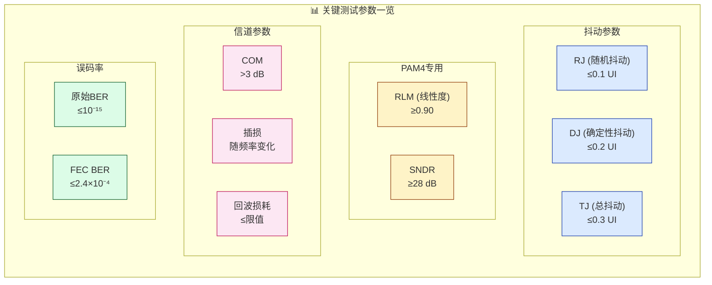
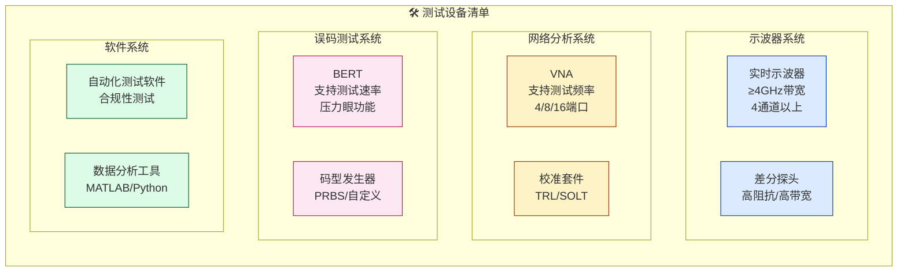
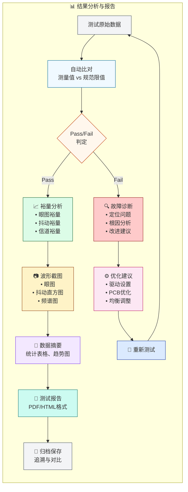
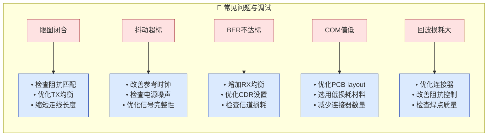

# 以太网信号完整性测试实战 - 完整测试方案

> 来源: 微信公众号《克劳德高速数字信号测试实验室》  
> 原文链接: https://mp.weixin.qq.com/s/ycB_IWoylStiLomEHUI6rA  
> 抓取日期: 2026-03-11  
> 文章类型: 硬件测试 / 信号完整性 / 以太网

---

## 📌 测试概览

| 项目 | 内容 |
|------|------|
| **测试对象** | 以太网接口信号完整性 (Signal Integrity, SI) |
| **测试速率** | 1000M（千兆以太网）及更高速率 |
| **测试标准** | IEEE 802.3 系列标准 |
| **测试目的** | 确保数据可靠传输，验证信号质量裕量 |
| **关键挑战** | 高速率下对损耗、反射和串扰极度敏感 |

---

## 一、整体测试架构图

---

## 二、信号编码技术演进

---

## 三、完整测试流程

---

## 四、发射端(TX)测试详细设计

### 4.1 TX测试流程

### 4.2 TX测试参数表

| 序号 | 测试项目 | 具体设计 | 观察目标 | 判定标准 |
|:----:|----------|----------|----------|----------|
| 1 | **眼图分析** | 使用≥4GHz实时示波器捕获叠加波形 | 眼图张开度、信号失真、过冲/欠冲 | 眼高≥规范值，眼宽≥0.5UI |
| 2 | **上升/下降时间** | 测量20%-80%信号边沿过渡时间 | 边沿斜率、对称性 | 符合IEEE 802.3规范限值 |
| 3 | **随机抖动(RJ)** | 统计随机噪声引起的抖动RMS值 | RJ分布特性 | ≤0.1 UI |
| 4 | **确定性抖动(DJ)** | 测量周期性/数据相关抖动成分 | DJ峰峰值 | ≤0.2 UI |
| 5 | **总抖动(TJ)** | RJ×14 + DJ (BER=10⁻¹⁵) | 整体抖动裕量 | ≤0.3 UI |
| 6 | **PAM4特有抖动** | J4u、JRMS、EOJ测量 | 电平间抖动分布 | 满足IEEE 802.3bs/cd |
| 7 | **线性度(RLM)** | 电平分离失配比测量 | 4电平均匀性 | RLM ≥ 0.90 |
| 8 | **SNDR** | 信号与噪声失真比计算 | 信号质量指数 | SNDR ≥ 28 dB |
| 9 | **发射均衡** | 5-tap FIR均衡器系数调校 | EQ参数优化 | 自动化平台锁定最佳值 |

---

## 五、接收端(RX)测试详细设计

### 5.1 RX测试流程

### 5.2 RX测试参数表

| 序号 | 测试项目 | 具体设计 | 观察目标 | 判定标准 |
|:----:|----------|----------|----------|----------|
| 1 | **压力眼校准** | 按规范注入特定RJ/DJ/噪声/干扰 | Stressed Eye Mask裕量 | 眼图通过Mask测试 |
| 2 | **压力信号源** | 产生规范定义的最恶劣信号 | 接收器容忍度极限 | 误码率达标 |
| 3 | **原始BER测试** | 无FEC时直接测量误码率 | 比特错误数/总比特数 | BER ≤ 10⁻¹⁵ |
| 4 | **FEC BER测试** | 开启RS-FEC/LL-FEC后测量 | FEC纠错能力验证 | BER ≤ 2.4×10⁻⁴ |
| 5 | **COM值分析** | 通过S参数计算通道运行余量 | 信道质量评估 | COM > 3dB |
| 6 | **灵敏度测试** | 逐步降低信号幅度至误码阈值 | 最小可接收信号电平 | 满足规范灵敏度要求 |

---

## 六、互连与信道测试

### 6.1 信道测试架构

### 6.2 信道测试参数表

| 序号 | 测试项目 | 具体设计 | 观察目标 | 判定标准 |
|:----:|----------|----------|----------|----------|
| 1 | **MDI回波损耗** | VNA测量MDI接口反射能量 | 阻抗连续性、连接器质量 | ≤规范限值(dB) |
| 2 | **模式转换损耗** | 差分-共模转换参数测量 | EMC性能评估 | ≤规范限值(dB) |
| 3 | **插损(S21)** | 传输损耗频响测量 | 频率衰减特性、损耗斜率 | 满足距离/速率要求 |
| 4 | **近端串扰(NEXT)** | 相邻线对近端耦合测量 | 线间干扰水平 | ≤规范限值(dB) |
| 5 | **远端串扰(FEXT)** | 相邻线对远端耦合测量 | 远端线间干扰 | ≤规范限值(dB) |
| 6 | **去嵌入(De-embedding)** | 数学移除测试夹具影响 | 提取真实DUT特性 | 夹具效应<可接受范围 |

---

## 七、关键测试参数速查表

| 参数 | 符号 | 含义 | 典型限值 | 适用场景 |
|------|------|------|----------|----------|
| 随机抖动 | RJ | Random Jitter | ≤0.1 UI | 所有速率 |
| 确定性抖动 | DJ | Deterministic Jitter | ≤0.2 UI | 所有速率 |
| 总抖动 | TJ | Total Jitter | ≤0.3 UI | 所有速率 |
| 电平分离失配比 | RLM | Relative Level Mismatch | ≥0.90 | PAM4信号 |
| 信号噪声失真比 | SNDR | Signal-to-Noise Distortion Ratio | ≥28 dB | PAM4信号 |
| 通道运行裕量 | COM | Channel Operating Margin | >3 dB | 背板/长电缆 |
| 原始误码率 | BER | Bit Error Rate (无FEC) | ≤10⁻¹⁵ | 传统以太网 |
| FEC误码率 | BER(FEC) | With Forward Error Correction | ≤2.4×10⁻⁴ | 400G/800G |

---

## 八、测试设备清单

| 设备类型 | 具体规格要求 | 用途 | 备注 |
|----------|--------------|------|------|
| 实时示波器 | ≥4GHz带宽，4通道以上 | 眼图、抖动测量 | 需支持PAM4解码(高速) |
| 差分探头 | 高阻抗，≥4GHz带宽 | 信号采集 | 低探头噪声 |
| 矢量网络分析仪(VNA) | 支持到测试频率，4/8/16端口 | S参数、回波损耗 | 需支持去嵌入功能 |
| 误码率测试仪(BERT) | 支持测试速率，带压力眼功能 | BER测试、压力信号产生 | 可编程抖动注入 |
| 信号发生器 | 高精度，低抖动 | 参考时钟、辅助信号 | 与BERT同步 |
| 测试夹具 | 符合规范要求 | 信号接入 | 需校准 characterization |
| 自动化测试软件 | 支持以太网测试套件 | 自动判Pass/Fail | Tek/Keysight/Anritsu |

---

## 九、结果分析与报告流程

---

## 十、典型测试问题与调试思路

---

## 十一、相关标准参考

| 标准编号 | 名称 | 适用范围 |
|----------|------|----------|
| IEEE 802.3-2018 | IEEE Standard for Ethernet | 以太网基础标准 |
| IEEE 802.3bz | 2.5G/5GBASE-T | 2.5G/5G电口 |
| IEEE 802.3an | 10GBASE-T | 万兆电口 |
| IEEE 802.3bs | 200G/400G Ethernet | 200G/400G光口 |
| IEEE 802.3ck | 800G Ethernet | 800G光口 |
| IEEE 802.3bw | 100BASE-T1 | 车载百兆 |
| IEEE 802.3bp | 1000BASE-T1 | 车载千兆 |

---

## 标签

`#以太网` `#信号完整性` `#SI测试` `#眼图` `#抖动` `#BER` `#PAM4` `#高速信号` `#硬件测试` `# compliance测试`

---

*本文内容来自微信公众号《克劳德高速数字信号测试实验室》，仅供学习交流使用*
