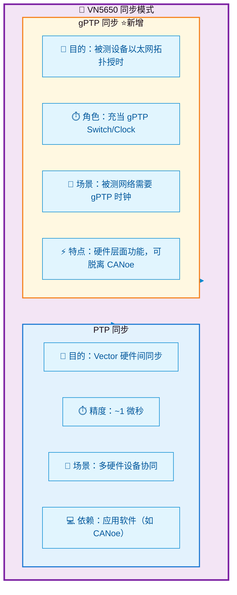
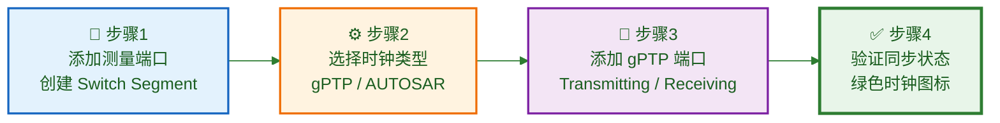
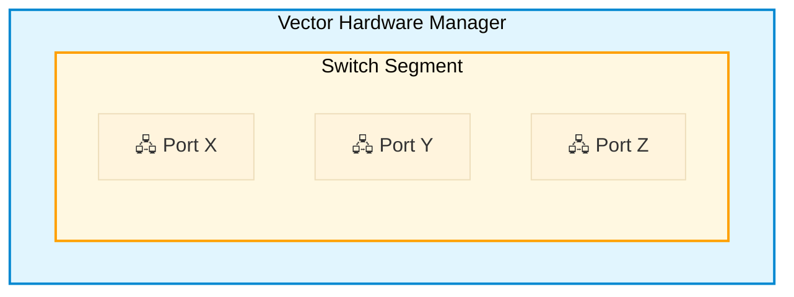
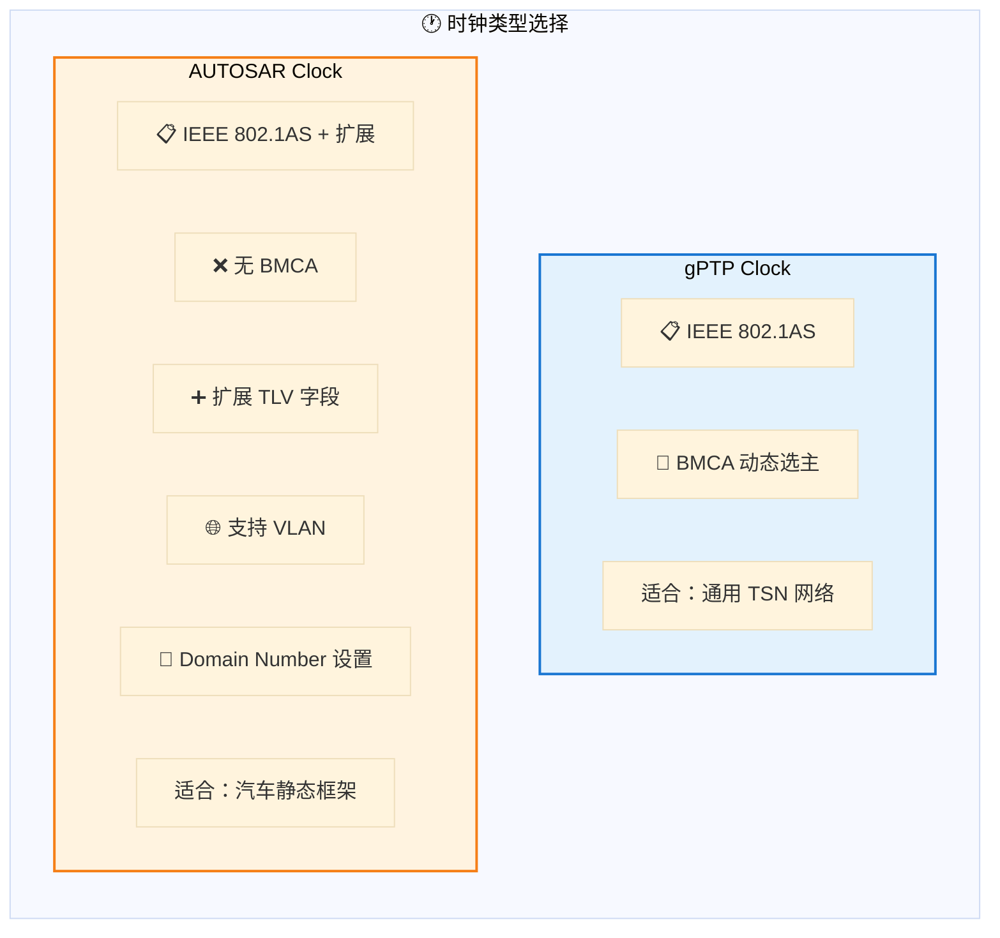
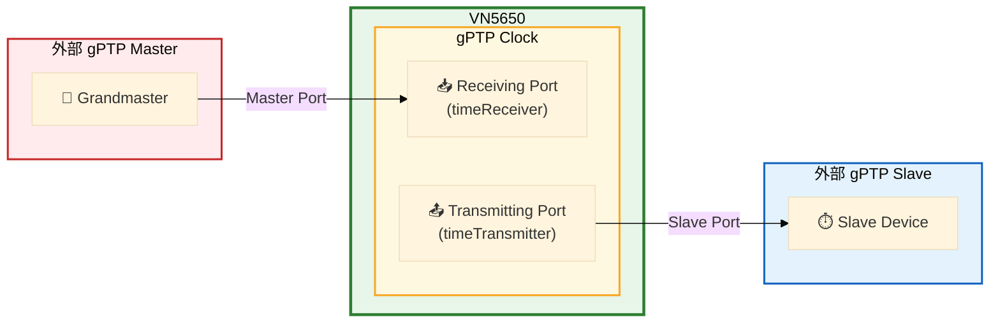
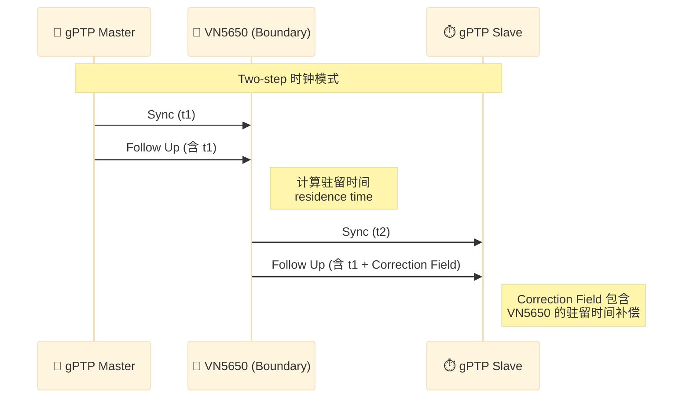
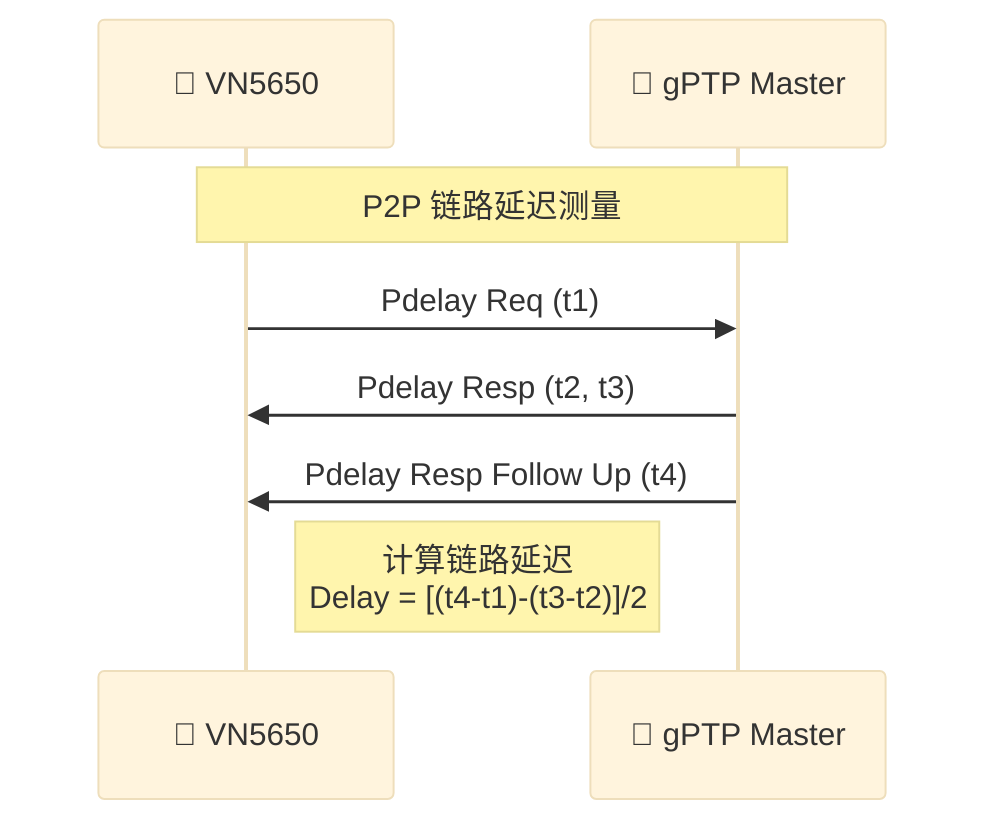
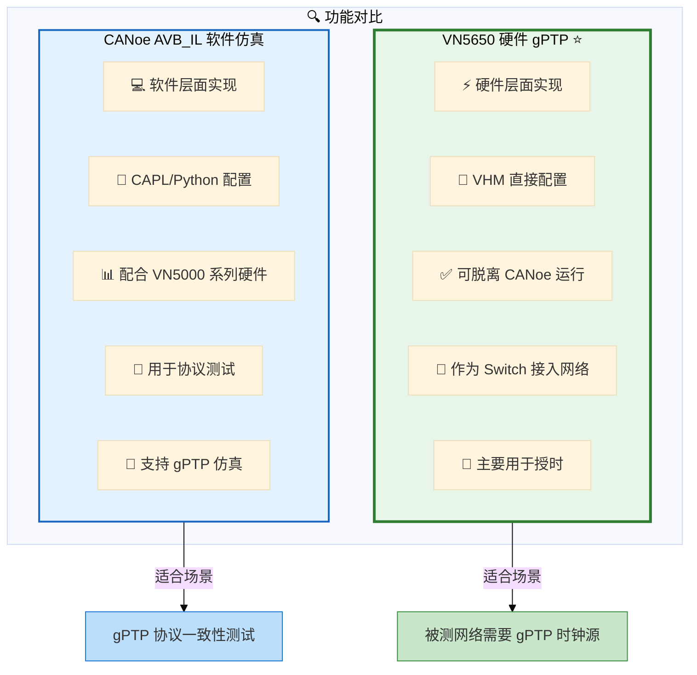
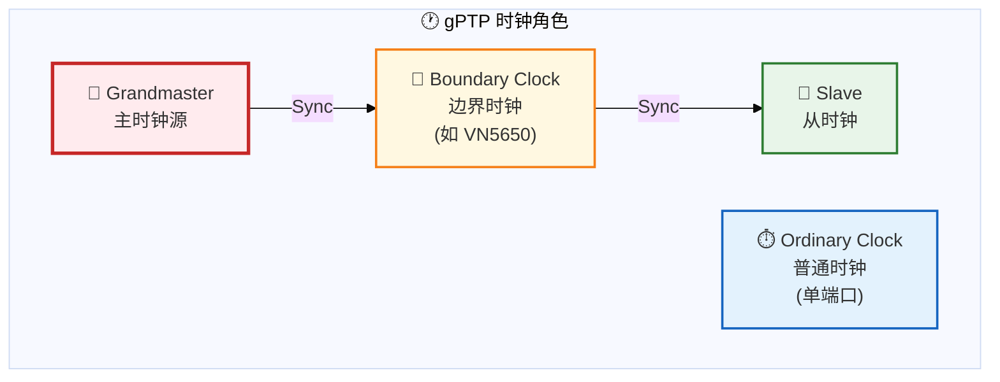
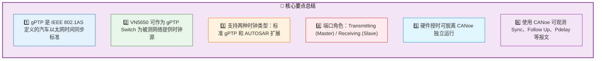

# VN5650 gPTP 时间同步功能详解

> 原文来源：Vector China 微信公众号  
> 文章主题：VN5650 的 gPTP (IEEE 802.1AS) 硬件授时功能与配置方法  
> 创建时间：2026-03-13

---

## 一、背景知识：TSN 与 gPTP

### 1.1 TSN 技术概述

**时间敏感网络（Time-Sensitive Networking, TSN）** 是一个庞大的协议簇，最初由 **AVB（Audio Video Bridging）** 任务组制定，后由 TSN 任务组继续完善。

**核心目标**：确保以太网能够提供**确定性通信服务**：
- ✅ 时间同步
- ✅ 流量调度
- ✅ 网络冗余

### 1.2 gPTP vs PTP 对比

| 特性 | PTP (IEEE 1588) | gPTP (IEEE 802.1AS) |
|------|-----------------|---------------------|
| **定位** | 通用时间同步协议 | 面向以太网/LAN的受限扩展 Profile |
| **时钟类型** | Ordinary Clock / Boundary Clock / Transparent Clock | Time-Aware End Station / Time-Aware Bridge |
| **延时测量** | 支持 E2E (End-to-End) 和 P2P (Peer-to-Peer) | **仅 P2P** |
| **选主机制** | BMC (Best Master Clock Algorithm) | **专用 BMCA** |
| **应用场景** | 通用网络 | 汽车以太网（时频/相位一致性要求严格） |

> 💡 **关键理解**：gPTP 不是 PTP 的简单子集，而是面向汽车以太网场景的**受限且带扩展的配置文件（Profile）**。

---

## 二、VN5650 同步模式对比



### 2.1 PTP 同步

| 属性 | 说明 |
|------|------|
| **目的** | Vector 硬件设备之间的时钟同步 |
| **精度** | 可达 **1 微秒** |
| **使用场景** | 同时使用**多个 Vector 硬件**时建立公共时钟基准 |
| **单设备情况** | 无需使用 |

### 2.2 gPTP 同步 ⭐

| 属性 | 说明 |
|------|------|
| **目的** | 为被测设备的以太网拓扑网络提供 gPTP 时钟 |
| **角色** | VN5650 充当 **gPTP Switch** 接入网络 |
| **使用场景** | 以太网拓扑中需要一个 gPTP 时钟源 |
| **独立性** | 属于**硬件层面功能**，可脱离 CANoe 直接配置 |

---

## 三、gPTP 配置方法详解

### 3.1 配置流程概览



### 3.2 详细配置步骤

#### Step 1: 添加测量端口

在 **Vector Hardware Manager (VHM)** 中：
1. 进入以太网网络配置页面
2. 添加一个 **Switch Segment**
3. 为 Switch 添加**两个物理端口**（至少）



#### Step 2: 选择时钟类型

切换至 **Time Sync** 页面，选择时钟类型：

| 时钟类型 | 标准规范 | 特点 |
|----------|----------|------|
| **gPTP Clock** | IEEE 802.1AS | 使用 BMCA 动态选择最优主时钟 |
| **AUTOSAR Clock** | IEEE 802.1AS + 汽车扩展 | 去掉 BMCA，添加 TLV 字段，支持 VLAN 和 Domain Number |

> 💡 **选择建议**：
> - 通用 TSN 网络 → **gPTP Clock**
> - 汽车静态框架应用 → **AUTOSAR Clock**



#### Step 3: 添加 gPTP 端口

添加 gPTP Clock 后，配置端口角色：

| 端口类型 | 数量限制 | 功能 | 连接对象 |
|----------|----------|------|----------|
| **Transmitting Port** | 多个 | **timeTransmitter** (Master) | gPTP Slave Port |
| **Receiving Port** | 最多 1 个 | **timeReceiver** (Slave) | gPTP Master Port |

> ⚠️ **重要规则**：
> - **无 Transmitting Port** → Clock 作为 **Ordinary Clock** 使用
> - **无 Receiving Port** → Clock 成为 **Grandmaster**



#### Step 4: 同步状态验证

正确连接后，在 VHM 视图模式中：
- ✅ **绿色时钟图标** = 同步成功
- ❌ 灰色/红色 = 同步失败

**典型配置示例**：
- Port4 (Transmitting Port) → 连接外部 gPTP Slave
- Port8 (Receiving Port) → 连接外部 gPTP Master

---

## 四、gPTP 通信报文观测

### 4.1 观测 Sync 和 Follow Up 消息



**报文流向说明**：

| 端口 | 方向 | 报文类型 | 说明 |
|------|------|----------|------|
| Port8 | RX | Sync + Follow Up | 接收真实 gPTP Master 的同步消息 |
| Port4 | TX | Follow Up (修正) | 发送给 Slave，Correction Field 添加驻留时间 |

### 4.2 观测 Pdelay 消息（链路延迟测量）



**Pdelay 测量流程**：

| 步骤 | 端口 | 报文 | 说明 |
|------|------|------|------|
| 1 | Port8 | **Pdelay Req** | VN5650 发起链路延迟测量请求 |
| 2 | Port4 | **Pdelay Resp** | 回复延迟响应 |
| 3 | Port4 | **Pdelay Resp Follow Up** | 提供精确时间戳 |

---

## 五、VN5650 gPTP vs CANoe AVB_IL 对比



| 特性 | VN5650 硬件 gPTP | CANoe AVB_IL 软件仿真 |
|------|------------------|----------------------|
| **实现层级** | 硬件层面 | 软件层面 |
| **配置工具** | Vector Hardware Manager (VHM) | CANoe + CAPL/Python |
| **CANoe 依赖** | ❌ 可脱离 CANoe | ✅ 需要 CANoe |
| **硬件要求** | VN5650 | VN5000 系列 |
| **主要用途** | **授时**（提供时钟源） | **仿真/测试**（协议验证） |
| **网络角色** | Switch + Clock | 仿真节点 |

---

## 六、关键概念速查

### 6.1 gPTP 角色定义



### 6.2 gPTP 报文类型

| 报文 | 作用 | 方向 |
|------|------|------|
| **Sync** | 时间同步主消息 | Master → Slave |
| **Follow Up** | 携带精确发送时间戳 | Master → Slave |
| **Pdelay Req** | 链路延迟测量请求 | 双向 |
| **Pdelay Resp** | 延迟测量响应 | 双向 |
| **Pdelay Resp Follow Up** | 延迟测量精确时间戳 | 双向 |
| **Announce** | 时钟能力宣告（用于 BMCA）| 广播 |

### 6.3 重要术语

| 术语 | 解释 |
|------|------|
| **BMCA** | Best Master Clock Algorithm，最佳主时钟算法 |
| **P2P** | Peer-to-Peer，点到点链路延迟测量 |
| **Residence Time** | 报文在设备内部的驻留时间 |
| **Correction Field** | 修正字段，用于补偿路径延迟 |
| **Two-step Clock** | 两步时钟，Sync 和 Follow Up 分开发送 |
| **Time-Aware Bridge** | gPTP 定义的时间感知桥设备 |

---

## 七、实战配置检查清单

```markdown
□ 1. VN5650 驱动已升级至最新版本
□ 2. VHM 中已创建 Switch Segment
□ 3. 已为 Switch 添加至少两个物理端口
□ 4. 已选择正确的时钟类型（gPTP / AUTOSAR）
□ 5. 已配置 Transmitting Port（可多个）
□ 6. 已配置 Receiving Port（最多一个）
□ 7. 物理端口已正确连接外部设备
□ 8. VHM 视图中显示绿色时钟图标
□ 9. CANoe Trace 中可观测到 Sync/Follow Up
□ 10. Pdelay 消息交互正常
```

---

## 八、总结



---

## 相关链接

- 🏢 **厂商**：Vector China / Vector 维克多
- 📧 **联系**：info@cn.vector.com
- 📞 **电话**：021-2283 4688

---

> 🏷️ **标签**：`TSN`, `gPTP`, `IEEE 802.1AS`, `VN5650`, `时间同步`, `汽车以太网`, `Vector`, `CANoe`
