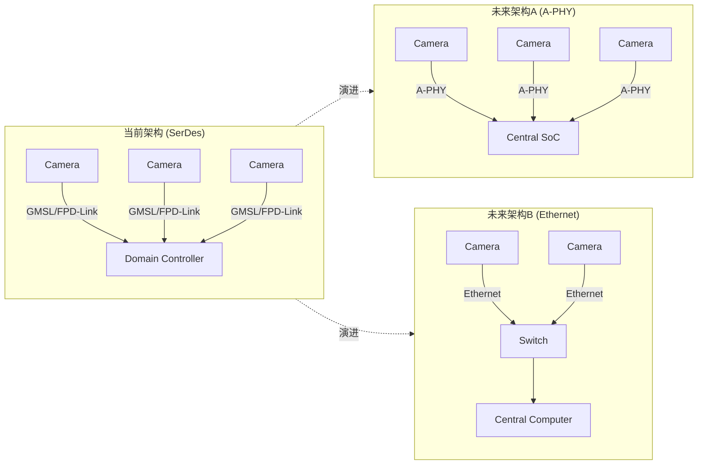

# 车载 SerDes 技术完全解析 - 总结报告

> 原文: https://mp.weixin.qq.com/s/lGHxL0aejtf7mbxQRzE2tQ  
> 作者: 智能空间机器人  
> 总结时间: 2026-03-14

---

## 📋 核心要点

### 1. SerDes 是什么？
**SerDes = Serializer / Deserializer（串行器/解串器）**

**作用**: 解决摄像头与SoC之间长距离数据传输问题
- 普通MIPI传输距离短（<30cm）
- SerDes可实现10~15m长距离传输
- 优势：EMI低、带宽高、可同轴供电

**典型应用场景**:
```
前视摄像头 → [3m同轴线缆] → 域控制器SoC
```

---

## 🔧 三大技术对比

| 维度 | GMSL | FPD-Link | A-PHY |
|------|------|----------|-------|
| **厂商** | ADI (原Maxim) | TI | MIPI联盟标准 |
| **最新带宽** | 12 Gbps (GMSL3) | 8 Gbps (FPD-Link IV) | 16 Gbps |
| **传输距离** | 15m | 15m | 15m |
| **协议类型** | 私有协议 | 私有协议 | **开放标准** |
| **生态支持** | ADI一家 | TI一家 | 多厂商支持 |
| **当前市场地位** | **主流** | 次主流 | 未来标准 |

---

## 📊 技术版本演进

### GMSL 版本
| 版本 | 带宽 | 典型应用 |
|------|------|---------|
| GMSL1 | 3Gbps | 早期ADAS |
| GMSL2 | 6Gbps | 当前主流（8MP摄像头）|
| GMSL3 | 12Gbps | 高分辨率/多摄像头 |

### FPD-Link 版本
| 版本 | 带宽 | 备注 |
|------|------|------|
| FPD-Link II | 1Gbps | 早期 |
| FPD-Link III | 4Gbps | 当前主流 |
| FPD-Link IV | 8Gbps | 最新 |

### A-PHY 规格
| 参数 | 数值 |
|------|------|
| 带宽 | 16Gbps |
| 距离 | 15m |
| 延迟 | <6μs |
| 协议 | 开放标准 |

---

## 🔌 典型芯片对照

| 功能 | GMSL (ADI) | FPD-Link (TI) |
|------|-----------|---------------|
| **Serializer** | MAX9295, MAX96705 | DS90UB953, DS90UB935 |
| **Deserializer** | MAX9296, MAX96712, MAX96792 | DS90UB954, DS90UB960 |

---

## 🎯 技术选型建议

### 当前项目 (2024-2025)
推荐 **GMSL2/GMSL3**
- 理由：生态成熟、ADI市场推广强、ADAS量产项目多
- 适用：8MP摄像头约需6Gbps，GMSL2刚好满足

### 中长期规划 (2025+)
关注 **A-PHY**
- 理由：开放标准、多厂商支持、带宽更高(16Gbps)、避免供应商锁定
- 风险：生态仍在建设中

### 成本敏感项目
考虑 **FPD-Link**
- 理由：TI生态稳定，成本控制较好
- 局限：带宽略低(8Gbps max)

---

## 🚀 未来架构演进



---

## 📈 市场趋势判断

| 技术 | 当前状态 | 2024-2025 | 2026+ |
|------|---------|-----------|-------|
| **GMSL** | 主流 | 仍为主流 | 逐步被替代 |
| **FPD-Link** | 次主流 | 稳定份额 |  niche市场 |
| **A-PHY** | 初期 | 开始渗透 | 成为主流 |
| **Ethernet** | 萌芽 | 高端尝试 | 中央计算架构 |

---

## ⚠️ 关键风险提示

1. **私有协议锁定风险**
   - GMSL只能用ADI芯片，FPD-Link只能用TI芯片
   - 成本高、议价能力弱

2. **技术切换窗口**
   - A-PHY虽先进，但生态建设需要时间
   - 建议在2025年后新项目中评估A-PHY

3. **带宽需求增长**
   - 8MP摄像头 → 6Gbps
   - 12MP/16MP摄像头 → 需要12Gbps+
   - 多摄像头聚合 → 带宽需求指数增长

---

## 💡 关键结论

> **短期选GMSL，中期看A-PHY，长期关注Ethernet**

1. **GMSL当前最流行**：ADI市场推广强，GMSL2带宽满足8MP需求
2. **A-PHY是未来**：开放标准、16Gbps高带宽、多厂商支持
3. **SerDes终将演进**：从私有协议走向开放标准，从专用走向统一

---

## 📚 延伸阅读

- MIPI A-PHY 规范: https://www.mipi.org/specifications/a-phy
- ADI GMSL产品: https://www.analog.com/en/product-category/gmsl.html
- TI FPD-Link: https://www.ti.com/interface/fpd-link-serdes/overview.html
