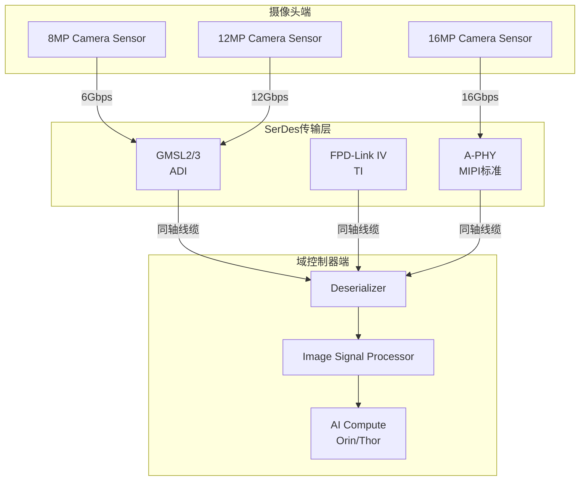
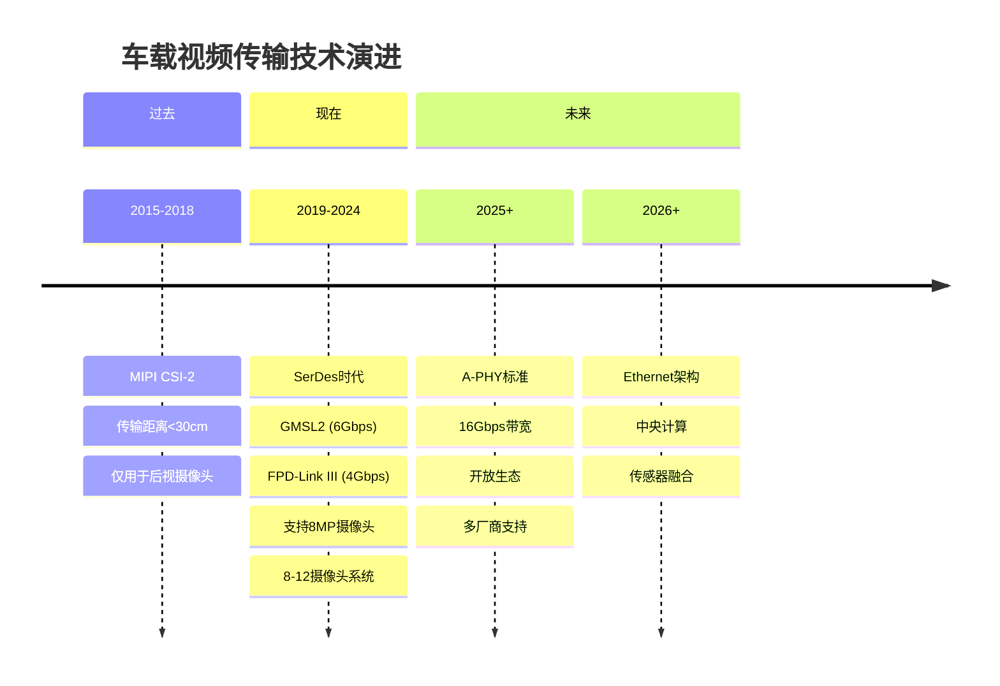
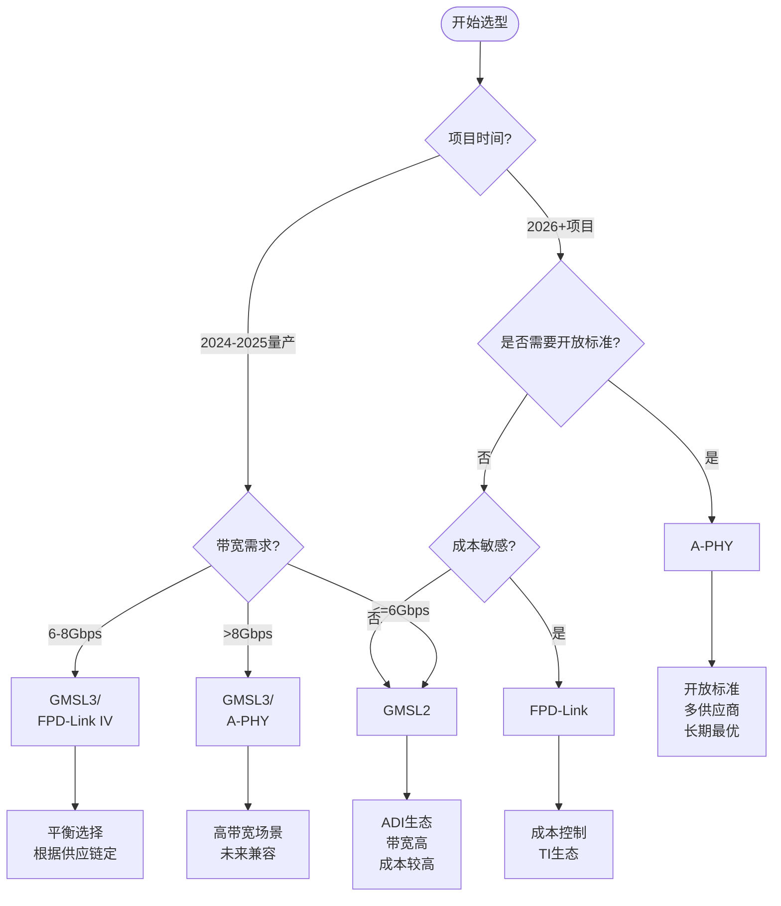
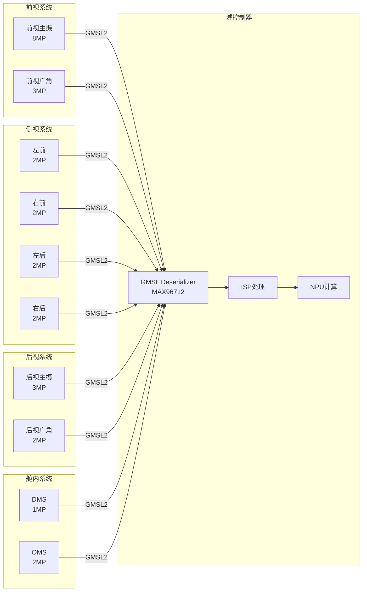
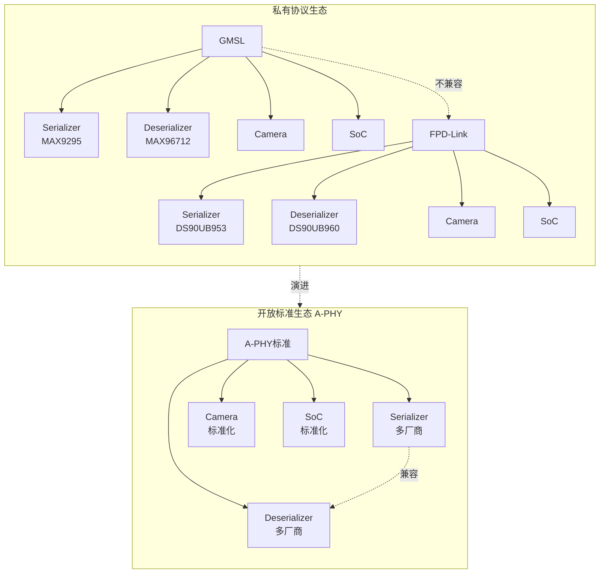
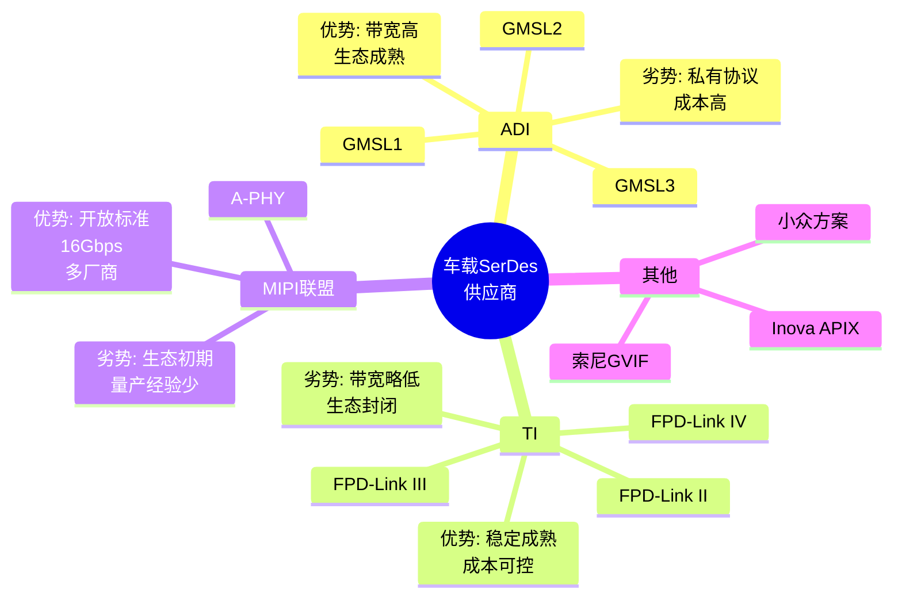

# 车载 SerDes 技术架构图

## 1. 技术架构对比



## 2. 技术演进时间线



## 3. 技术选型决策树



## 4. 自动驾驶摄像头系统架构



## 5. SerDes vs A-PHY 生态对比



## 6. 带宽需求与SerDes匹配

```mermaid
xychart-beta
    title "摄像头分辨率 vs 带宽需求"
    x-axis [1MP, 2MP, 3MP, 5MP, 8MP, 12MP, 16MP]
    y-axis "带宽(Gbps)" 0 --> 20
    
    line "Raw Data Rate" [1.5, 3, 4.5, 7.5, 12, 18, 24]
    line "GMSL2 Limit" [6, 6, 6, 6, 6, 6, 6]
    line "GMSL3 Limit" [12, 12, 12, 12, 12, 12, 12]
    line "A-PHY Limit" [16, 16, 16, 16, 16, 16, 16]
    
    annotation "GMSL2适合8MP" [4, 6]
    annotation "GMSL3适合12MP" [5, 12]
    annotation "A-PHY适合16MP+" [6, 16]
```

## 7. 技术特点雷达图对比

```mermaid
radar
    title 三大SerDes技术能力对比
    
    axis Bandwidth [0, 4, 8, 12, 16, 20]
    axis Distance [0, 5, 10, 15, 20]
    axis Maturity [0, 2, 4, 6, 8, 10]
    axis Cost [0, 2, 4, 6, 8, 10]
    axis Openness [0, 2, 4, 6, 8, 10]
    
    GMSL: 12, 15, 9, 5, 2
    FPD-Link: 8, 15, 8, 7, 2
    A-PHY: 16, 15, 4, 6, 10
```

## 8. 供应商生态系统


