# VMC车辆运动控制系列—EMB电子机械制动

> **来源**: 汽车电子设计（微信公众号）  
> **发布时间**: 2025-08-17  
> **整理时间**: 2026-03-18

---

## 一、VMC核心概念与背景

### 1.1 传统汽车电子架构

传统汽车电子按照功能划分为五域模型：

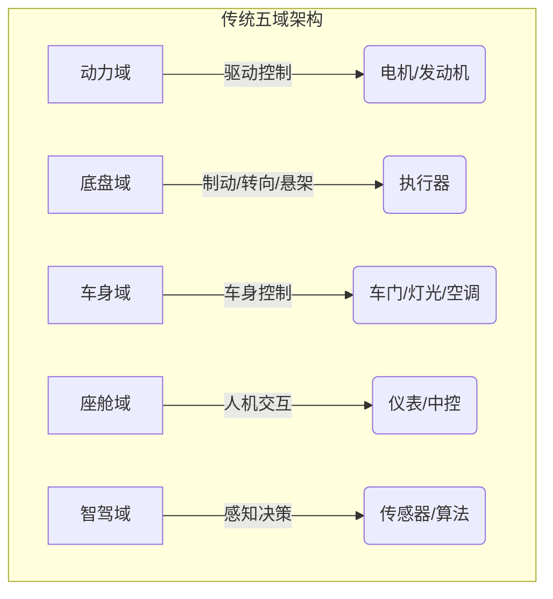

### 1.2 VMC融合控制理念

**VMC（Vehicle Motion Control）** 打破传统域间壁垒，实现一体化融合控制：

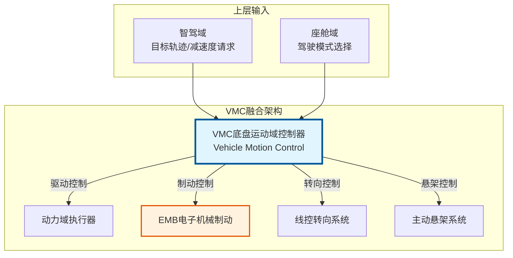

**核心价值**: 多系统协同实现 **1+1>2** 的效果，拓展车辆动态性能边界

---

## 二、制动系统技术演进

### 2.1 制动系统分类总览

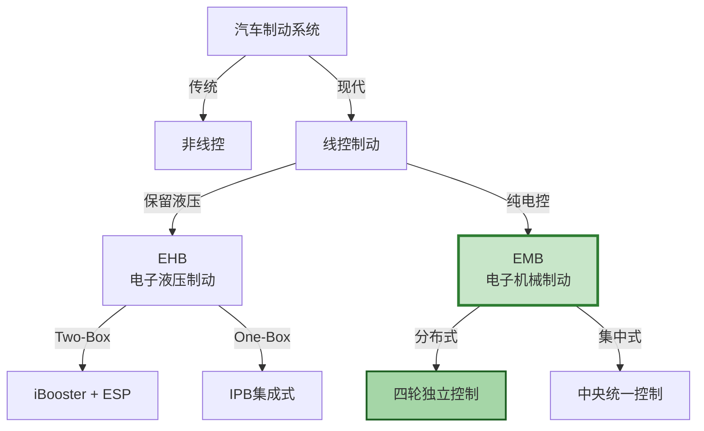

### 2.2 EHB vs EMB 对比

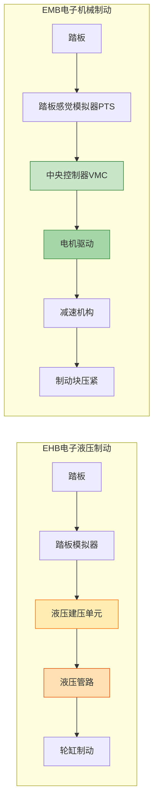

| 特性 | EHB | EMB |
|------|-----|-----|
| **传动介质** | 液压油 | 电机机械传动 |
| **响应时间** | ~120-150ms | ~80-100ms |
| **系统复杂度** | 中（需液压管路） | 低（纯电控） |
| **维护成本** | 需更换制动液 | 几乎免维护 |
| **能量回收** | 优秀 | 更优秀 |
| **功能安全** | 成熟方案 | 需多重冗余 |
| **量产状态** | 已大规模量产 | 逐步导入中 |

---

## 三、EMB系统硬件架构

### 3.1 整体系统架构

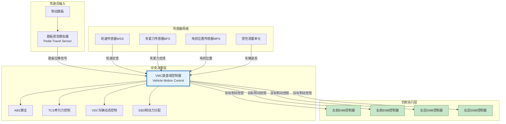

### 3.2 EMB轮边执行器内部结构

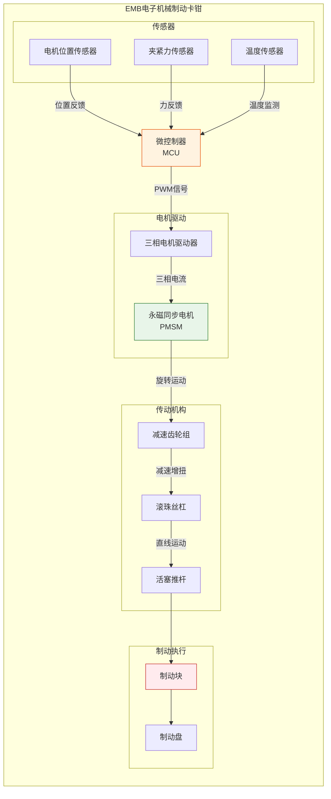

---

## 四、EMB控制工作流程

### 4.1 制动请求处理流程

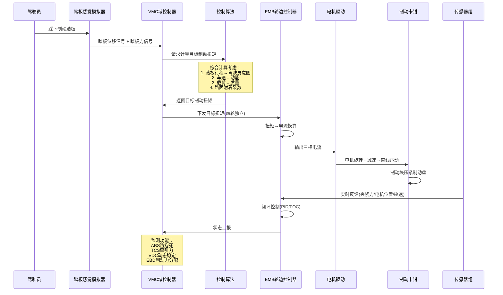

### 4.2 制动力分配策略

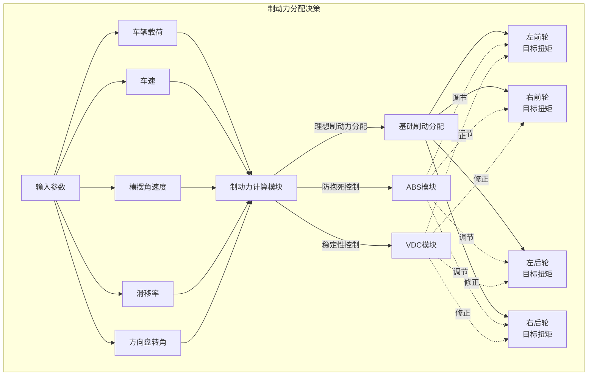

---

## 五、EMB软件架构方案

### 5.1 方案一：EMB作为独立域控系统

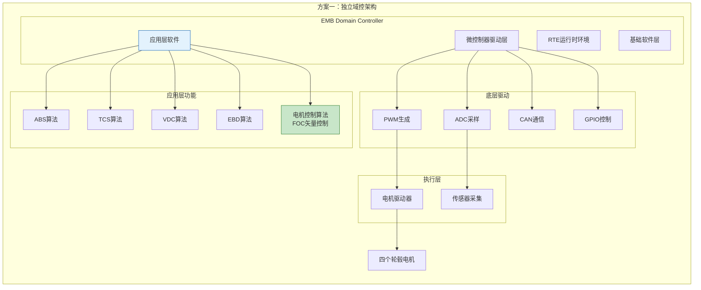

### 5.2 方案二：EMB作为轮边控制器

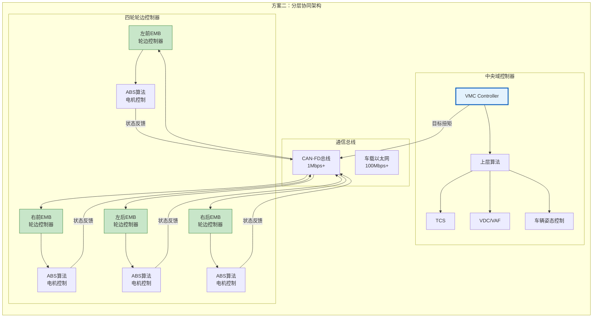

### 5.3 两种方案对比

| 对比维度 | 方案一：独立域控 | 方案二：轮边控制器 |
|---------|-----------------|-------------------|
| **控制延迟** | 低（单芯片内部） | 中（需总线通信） |
| **系统复杂度** | 高（集中处理） | 低（分布式处理） |
| **扩展性** | 较差 | 好（可灵活增加节点） |
| **功能安全** | ASIL-D需复杂设计 | 更易实现ASIL-D |
| **成本** | 较低（单控制器） | 较高（多个控制器） |
| **适用场景** | 高性能需求 | 高安全等级需求 |

---

## 六、EMB冗余安全设计

### 6.1 冗余架构设计

```mermaid
graph TB
    subgraph "EMB冗余安全架构"
        direction TB
        
        subgraph "主控制通道"
            MAIN_CPU[主CPU<br/>Core 0]
            MAIN_DRV[主电机驱动]
            MAIN_PWR[主电源]
        end
        
        subgraph "冗余监控通道"
            MON_CPU[监控CPU<br/>Core 1]
            MON_DRV[冗余电机驱动]
            MON_PWR[冗余电源]
        end
        
        subgraph "安全机制"
            WD[独立看门狗]
            LVC[低压监控]
            OVC[过流保护]
            OTC[过温保护]
        end
        
        MAIN_CPU -->|主控制信号| ACTUATOR[执行机构]
        MON_CPU -.->|监控/接管| ACTUATOR
        
        MAIN_CPU <->|交叉监控| MON_CPU
        
        WD --> MAIN_CPU
        WD --> MON_CPU
        
        LVC -.-> MAIN_PWR
        OVC -.-> MAIN_DRV
        OTC -.-> ACTUATOR
    end
    
    style MAIN_CPU fill:#c8e6c9,stroke:#2e7d32
    style MON_CPU fill:#fff3e0,stroke:#e65100
```

### 6.2 故障降级策略

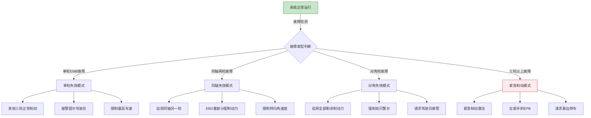

---

## 七、EMB关键技术参数

### 7.1 性能指标

| 参数 | 典型值 | 说明 |
|------|--------|------|
| **响应时间** | 80-100ms | 踏板触发到制动建立 |
| **夹紧力范围** | 0-30kN | 单轮最大夹紧力 |
| **电机功率** | 200-350W | 单轮电机额定功率 |
| **控制精度** | ±2% | 夹紧力控制精度 |
| **工作电压** | 12V/24V/48V | 根据系统配置 |
| **防护等级** | IP6K9K | 防尘防水最高等级 |
| **工作温度** | -40°C~150°C | 全温度范围工作 |

### 7.2 功能安全等级

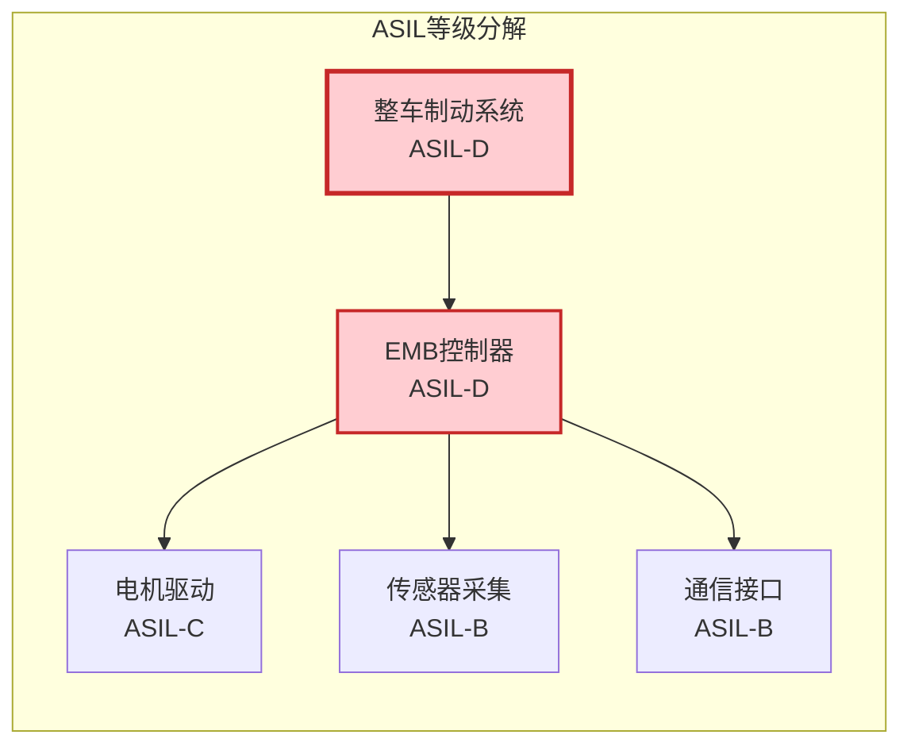

---

## 八、总结与展望

### 8.1 EMB技术优势

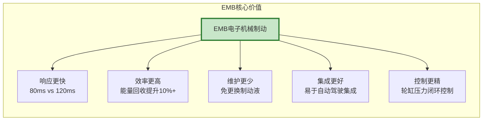

### 8.2 发展趋势

1. **短期（2025-2027）**: EHB仍是主流，EMB在高端车型试量产
2. **中期（2027-2030）**: EMB逐步放量，成本下降推动普及
3. **长期（2030+）**: EMB成为线控制动主流方案，与自动驾驶深度融合

### 8.3 挑战与对策

| 挑战 | 对策 |
|------|------|
| 功能安全认证难度大 | 采用双冗余架构，通过ASIL-D认证 |
| 成本高于EHB | 规模化生产，供应链本土化 |
| 驾驶员接受度 | 踏板感觉模拟器优化，保持熟悉感 |
| 极端工况可靠性 | 严格环境测试，故障降级策略 |

---

**参考资料**:
- 汽车电子设计微信公众号
- 博世/大陆EMB技术白皮书
- ISO 26262功能安全标准
- ECE R13-H制动法规

**文档版本**: v1.0  
**更新时间**: 2026-03-18
