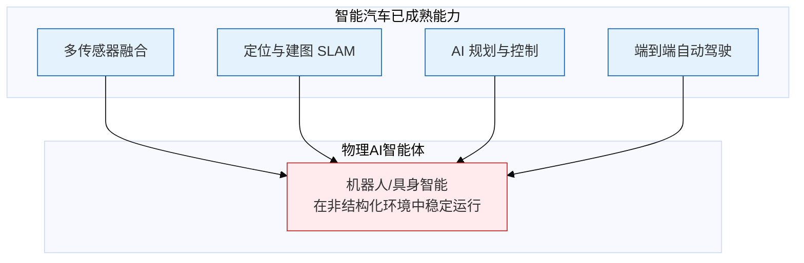
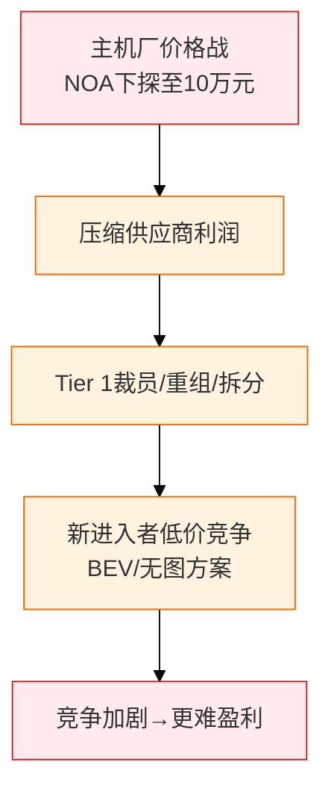
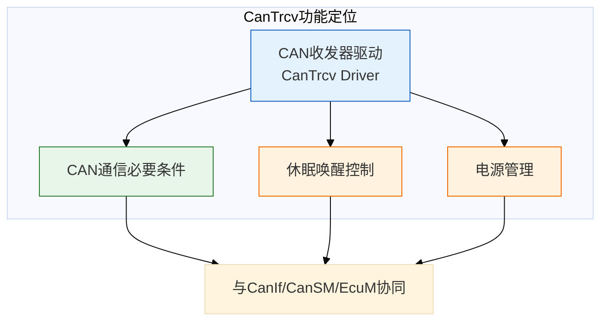
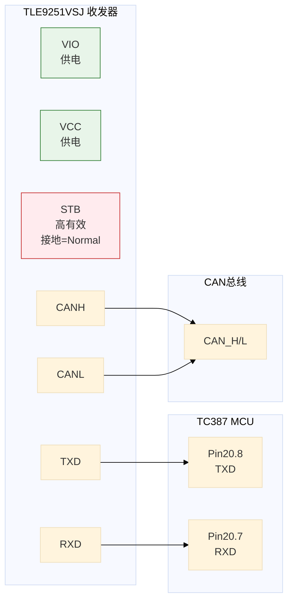
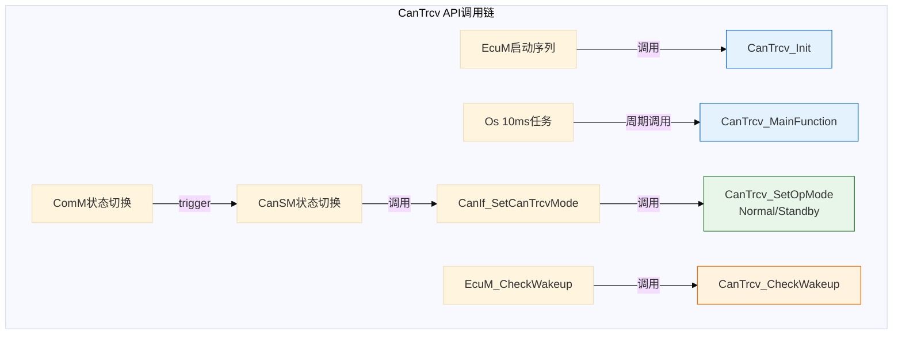
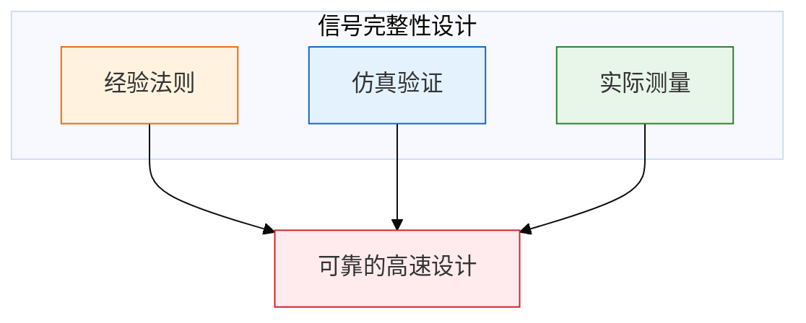

# 2026-03-22 公众号精选文章深度整理

> 整理日期：2026-03-22  
> 来源：佐思汽车研究、高工智能汽车、AUTOSAR中国、信号完整性学习之路  
> 文章数：4篇深度整理

---

## 一、物理AI成汽车行业新战略重心

### 1.1 核心概念：什么是物理AI？

**定义**：能够理解现实世界并与之进行交互的AI模型，使自主机器（机器人、自动驾驶汽车等）在真实物理世界中感知、理解和执行复杂操作。

**AI演进四阶段**（英伟达黄仁勋）：

**物理AI核心**：AI与物理世界的融合，让AI系统理解并应用重力、摩擦、材料特性等物理规律，实现从虚拟智能到实体执行的跨越。

### 1.2 车企布局案例

| 车企 | 动作 | 投资/目标 |
|------|------|-----------|
| **特斯拉** | 停产Model S/X，产线转产Optimus机器人 | 2026年资本支出超200亿美元 |
| **理想汽车** | 史上最大组织架构调整 | "硅基生命"终极目标，构建"硅基家人" |
| **现代汽车** | 2026 CES发布AI机器人战略 | 从实验阶段迈向规模化工业部署 |
| **吉利/小鹏/奇瑞** | 跟进布局 | 从智能汽车到智能机器人能力迁移 |

### 1.3 能力迁移逻辑

**关键洞察**：参考高通业务逻辑，车企转向物理AI能把在汽车辅助驾驶中高度成熟的能力迁移到机器人系统，实现技术复用。

### 1.4 2026 CES 九大技术趋势

1. **物理AI成CES热词** - 英伟达/高通/现代均有产品发布
2. **机器人产业链完善** - 从零部件到整机量产
3. **L4级Robotaxi接近量产** - 前装量产合作模式
4. **跨域融合芯片抢滩** - 舱驾一体、中央计算
5. **汽车全域AI** - 从智驾到智舱全面AI化
6. **VLA加速汽车智能化** - Vision-Language-Action模型
7. **AI Box规模化量产** - 车载大算力模块
8. **AI眼镜成新交互入口** - 智能穿戴与车联动

---

## 二、零部件厂商陷入智能化「价格战」阵痛

### 2.1 Tier 1巨头业绩下滑

| 公司 | 2024业绩 | 应对措施 |
|------|----------|----------|
| **博世** | 营业利润暴跌1/3至32亿欧元，利润率3.5%（目标7%） | 全球裁员超5000人 |
| **采埃孚** | 高额债务 | 2028年前德国裁员1.1-1.4万人（占德国员工1/4） |
| **大陆集团** | 承压 | 拆分汽车子集团，强化轮胎/康迪泰克独立运营 |
| **安波福** | 利润率低 | 分拆电气分配系统(EDS)业务，保留高毛利智驾业务 |
| **经纬恒润** | 2024预计亏损4.5-5.8亿元 | 加大研发和市场开拓投入 |

### 2.2 价格战传导路径

### 2.3 NOA价格下探趋势

| NOA类型 | 2024标配价位 | 趋势 |
|---------|--------------|------|
| 高速NOA | **已进入10万元区间** | 持续下探 |
| 城区NOA | **刚进入20万元区间** | 加速下探 |
| 激光雷达方案 | 零跑B系列10-15万将标配 | 技术降本 |

**典型价格战案例**：
- 华为乾崑智驾包：720元/月 → **199元/月**（3折）
- 卓驭科技（大疆智驾）：7V+32TOPS实现**端到端城市领航**

### 2.4 供应商应对策略

**反向输出趋势**：
- 中国开发的产品和技术输出，反哺国际市场
- 安波福：中国区成为独立事业部，加快本土决策
- 博世徐大全："将国内开发的产品输出，支持其他地区业务"

**未来投资方向**：
- 德赛西威：募资45亿元扩产，布局舱驾融合平台
- 高通8775舱驾一体平台 + 英伟达Thor千TOPS方案

---

## 三、AUTOSAR CanTrcv模块配置实践

### 3.1 CanTrcv核心作用

**常用收发器型号**：
- TJA1044（基础款）
- TJA1043（带Sleep模式）
- TJA1145（SPI控制，支持更多唤醒源）
- TLE9251VSJ（英飞凌，本文硬件）

### 3.2 硬件连接分析（TC387开发板）

**关键发现**：本文硬件STB引脚直接接地，收发器永远处于Normal模式（无法通过软件控制Standby）。

### 3.3 EB配置要点

#### CanTrcvGeneral配置

| 参数 | 说明 | 建议 |
|------|------|------|
| **Dev Error Detect** | 启用Det检测 | 开发阶段勾选，便于发现低级错误 |
| **User Config File** | 自定义头文件 | 功能安全跨OsApplication时使用 |
| **Wake Up Support** | 唤醒源检测支持 | 根据实际需求配置 |

#### CanTrcvChannel配置

| 参数 | 功能 | 备注 |
|------|------|------|
| **Icu Channel Ref** | ICU唤醒参考 | 一般不用，参考《ICU唤醒详解》 |
| **Por Wakeup Source** | 上电唤醒源 | TJA1145特有，SPI控制收发器用 |
| **Syserr Wakeup Source** | 系统错误唤醒 | TJA1145特有 |
| **Wakeup By Bus Used** | CAN总线唤醒使能 | ECU一般需要一路CAN支持唤醒 |
| **Wakeup Source Ref** | 引用EcuM唤醒源 | CanTrcv检测到唤醒后通知EcuM |

#### CanTrcvDioChannelAccess配置

- 引用DIO模块配置的STB和Rx Channel
- CanTrcv使用`Dio_ReadChannel`和`Dio_WriteChannel`控制硬件

### 3.4 CanTrcv模块使用场景

### 3.5 进阶学习路径

1. **CanTrcv_TJA1040/1043/1145** 软硬件如何配合检测唤醒源？
2. **收发器切换**（硬件换芯片）时注意事项
3. **CAN Bus唤醒不了/唤醒太慢** 问题分析
4. **功能安全跨OsApplication** 配置方法

---

## 四、DDR5 vs DDR4 信号完整性设计要点

### 4.1 关键参数对比

| 参数 | DDR4 | DDR5 | 变化 |
|------|------|------|------|
| **最高速率** | 3.2 Gbps | **6.4 Gbps** | 翻倍 |
| **工作电压** | 1.2V | **1.1V** | 降低 |
| **均衡技术** | CTLE | **CTLE + DFE** | 增加判决反馈均衡 |
| **功耗** | 基准 | **更低** | 能效提升 |
| **信号完整性挑战** | 中等 | **更高** | 速率提升带来挑战 |

### 4.2 信号完整性三要素

### 4.3 DDR5设计要点

**1. DFE均衡器的重要性**
- 6.4Gbps速率下，码间干扰(ISI)严重
- DFE通过反馈抵消前序比特的影响
- 设计时需确保DFE参数可配置

**2. 电源完整性**
- 1.1V电压容限更窄
- 电源噪声对信号质量影响更大
- 需加强去耦设计

**3. 布线考虑**
- 走线长度匹配更严格
- 差分对间距控制
- 参考平面完整性

---

## 五、要点速查与行动项

### 5.1 产业趋势要点

| 领域 | 关键趋势 | 影响 |
|------|----------|------|
| **物理AI** | 车企战略重心转移 | 机器人赛道升温，能力迁移是关键 |
| **智能驾驶** | NOA下探10万元 | 价格战加剧，供应商承压 |
| **芯片算力** | 舱驾一体中央计算 | 8775/Thor等单芯片方案量产 |
| **OTA争议** | 锁电/升级门槛/宣传不符 | 监管与消费者维权加强 |

### 5.2 技术学习要点

| 模块 | 核心技能 | 进阶方向 |
|------|----------|----------|
| **CanTrcv** | 收发器配置、休眠唤醒 | TJA1145 SPI控制、唤醒问题排查 |
| **DDR5 SI** | 高速信号设计、DFE均衡 | 6.4Gbps仿真、电源完整性 |

### 5.3 待深入研究

- [ ] OTA争议案例深度分析（佐思原文链接失效，需重新获取）
- [ ] 高通/英伟达物理AI芯片架构对比
- [ ] 舱驾一体中央计算平台软件架构
- [ ] TJA1145 SPI控制CanTrcv完整配置流程

---

## 参考来源

1. **佐思汽研**《车载手机无线充电趋势研究——汽车新技术月度监测与分析报告2026年2月期》
2. **高工智能汽车**《零部件厂商陷入智能化「价格战」阵痛！2025恐"难上加难"》(2026-03-20)
3. **AUTOSAR中国**《AUTOSAR项目实战(9) - CanTrcv模块配置实践》
4. **信号完整性学习之路**《DDR5 vs DDR4的不同点》

---

**标签**: `#物理AI` `#智能驾驶` `#AUTOSAR` `#CanTrcv` `#DDR5` `#信号完整性` `#产业趋势` `#价格战`
