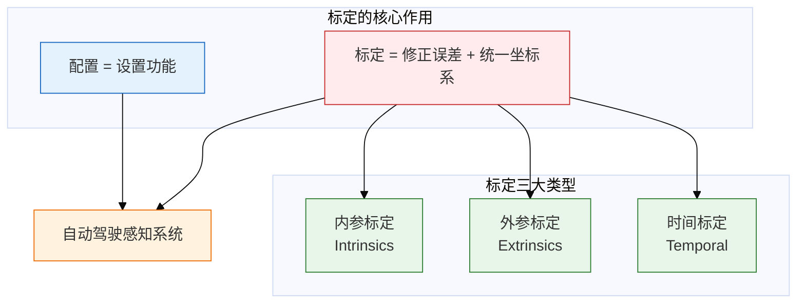
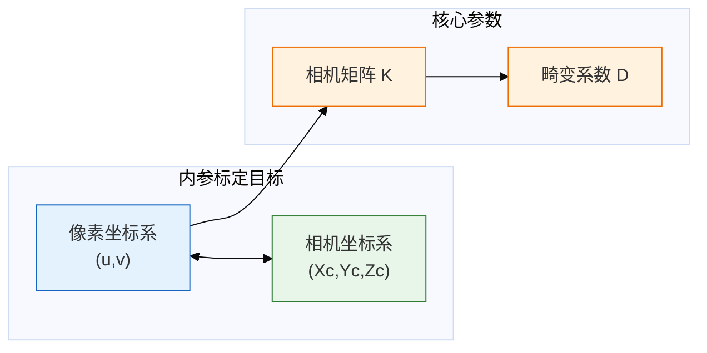
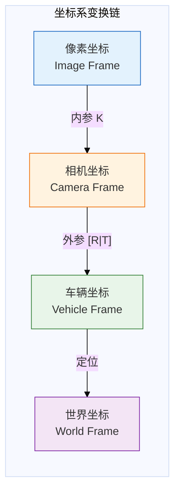
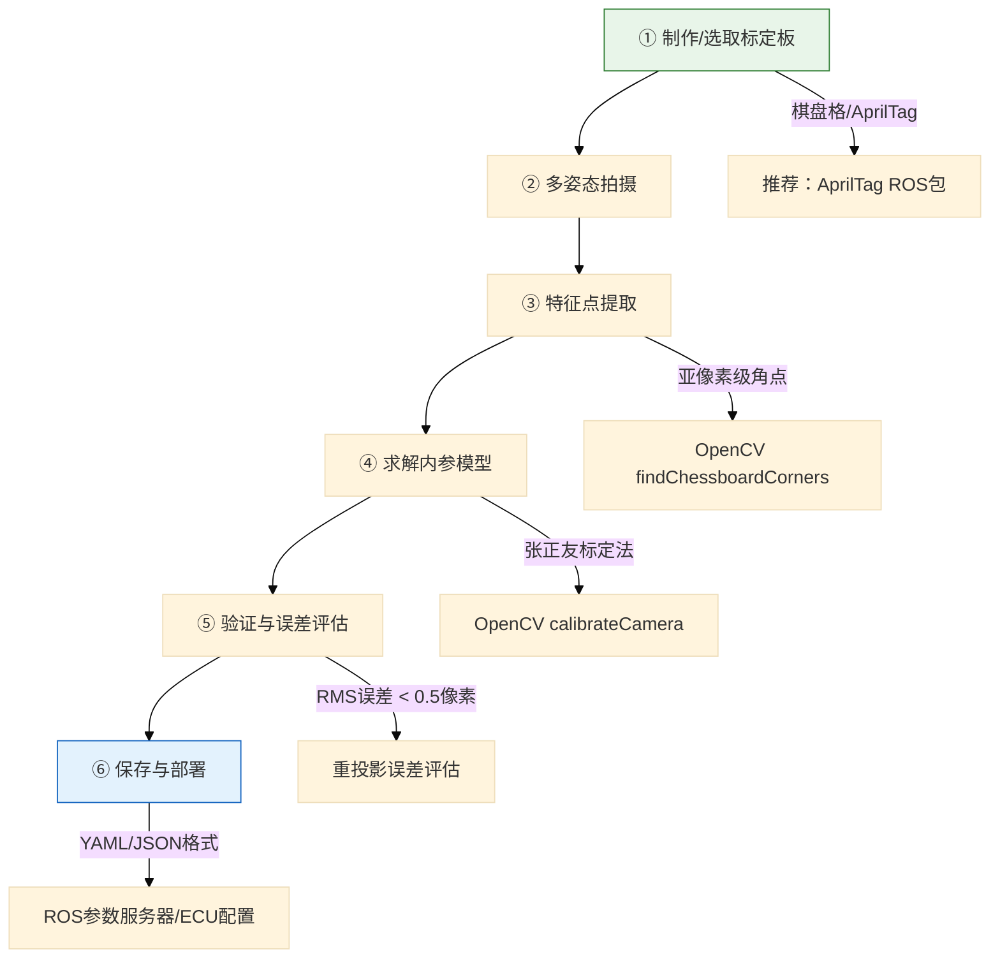
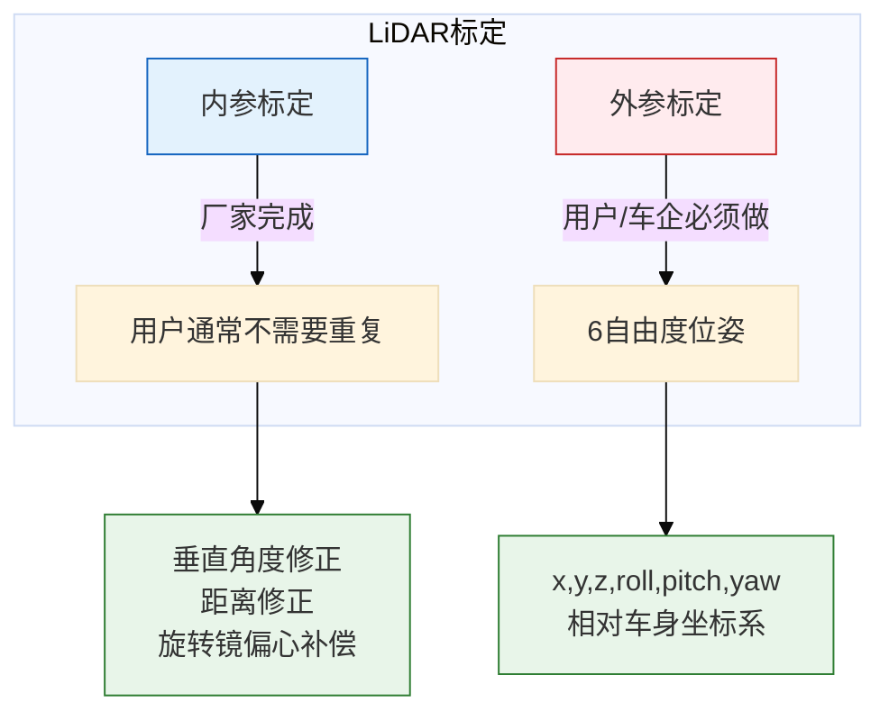
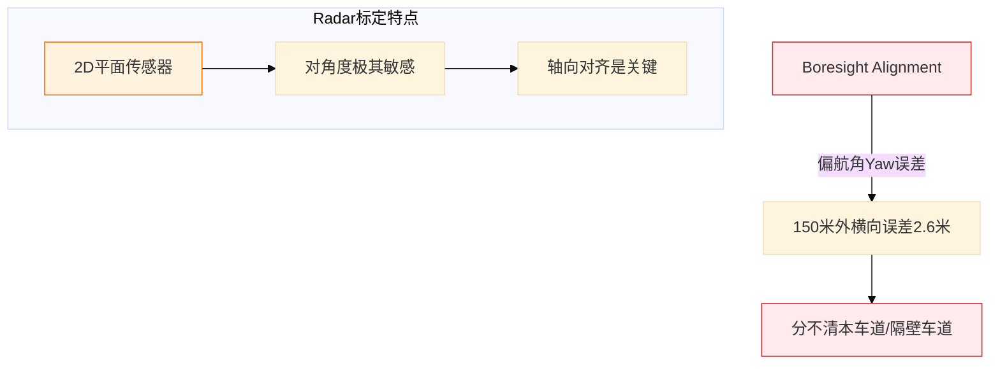
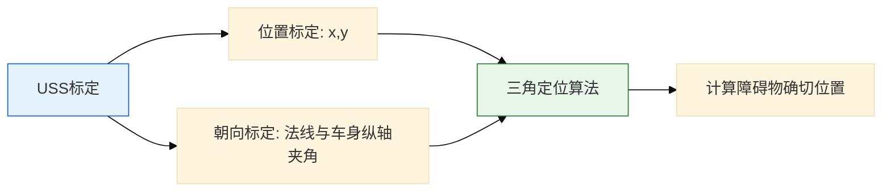
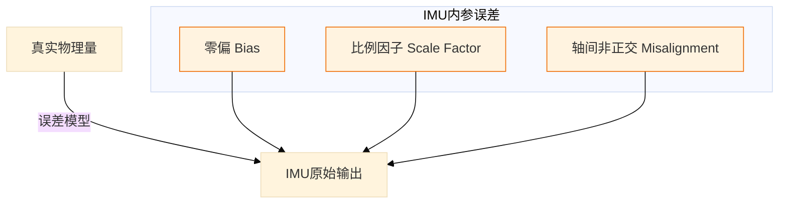
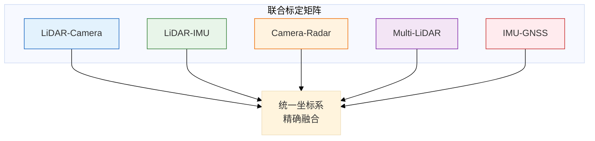
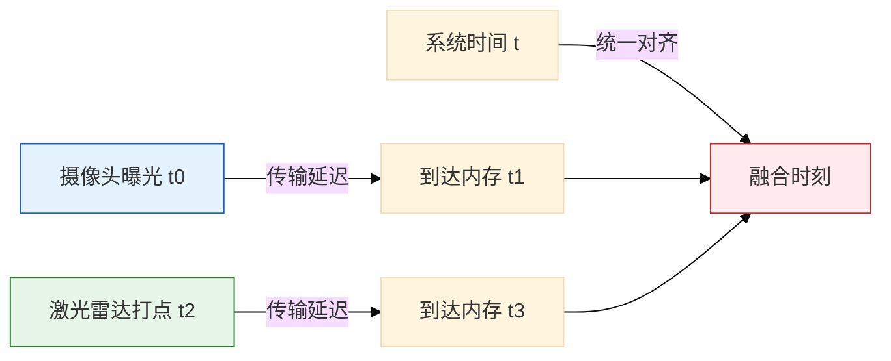

# 自动驾驶传感器标定技术深度解析

> 原文：汽车电子设计 / Godspeed  
> 主题：Sensor Fusion - 内外参数标定  
> 整理时间：2026-03-22

---

## 一、标定全景图：为什么标定是感知系统的基石？



### 标定类型速查

| 类型 | 解决什么问题 | 关键参数 |
|------|-------------|----------|
| **内参标定** | 传感器自身制造误差、物理特性 | 焦距、主点、畸变系数、零偏、比例因子 |
| **外参标定** | 传感器在车上的位置姿态（6自由度） | 旋转矩阵R、平移向量T（x,y,z,roll,pitch,yaw）|
| **时间标定** | 各传感器数据时间对齐 | 传输延迟、Time Offset |

---

## 二、摄像头标定：从3D世界到2D平面的精确映射

### 2.1 内参标定详解



#### 内参矩阵 K

| 参数 | 符号 | 含义 |
|------|------|------|
| 焦距 | fx, fy | 以像素为单位的焦距（x,y方向可能不同）|
| 主点 | cx, cy | 光心在图像上的中心坐标（图像中心）|

**典型相机矩阵形式**：
```
K = [ fx  0  cx ]
    [ 0  fy  cy ]
    [ 0   0   1 ]
```

#### 畸变系数 D

| 畸变类型 | 参数 | 说明 |
|----------|------|------|
| **径向畸变** | k1, k2, k3 | 镜头边缘变形（桶形/枕形）|
| **切向畸变** | p1, p2 | 镜头与传感器不平行导致 |
| **鱼眼模型** | k1, k2, k3, k4 | 等距投影参数，超广角镜头必须标定 |

### 2.2 外参标定：相机坐标系 → 车辆坐标系



#### 外参参数（6自由度）

| 参数类型 | 具体参数 | 说明 |
|----------|----------|------|
| **旋转** | Roll, Pitch, Yaw（或四元数）| 相机相对于车身的朝向 |
| **平移** | x, y, z | 相机光心相对于后轴中心的距离 |

### 2.3 摄像头标定六步法



### 2.4 外参标定方法对比

| 方法 | 原理 | 适用场景 | 优缺点 |
|------|------|----------|--------|
| **标定板法** | 利用已知世界坐标的标定板特征点 | 出厂前人工标定 | 精度高，需要人工 |
| **AprilTag多目标** | 车辆周围布置多个已知姿态AprilTag | 自动化流水线 | 高重复性，适合批量 |
| **车道线自标定** | 检测道路车道线、消失点等自然特征 | 在线校正 | 无需标定物，精度较低 |
| **时空融合联合标定** | 多帧时间序列位姿估计+纹理拼接误差优化 | 高精度环视系统 | 误差降低0.1°-1.1° |
| **里程计/IMU融合** | 车载里程计/IMU提供先验位姿 | 多传感器融合平台 | 适合动态标定 |

---

## 三、激光雷达标定：3D空间感知的基准

### 3.1 内外参分工



### 3.2 LiDAR外参标定关键警告 ⚠️

> **Pitch角标定误差1° → 100米外地面高度误差 ≈ 2米**
> 
> 后果：把路面当成障碍物，导致**幽灵刹车**

### 3.3 LiDAR外参标定六步法

| 步骤 | 说明 | 常用技术 |
|------|------|----------|
| ① 选取标定靶标 | 平面标定板/三面靶标/反射球 | 棋盘格、ArUco、圆形阵列 |
| ② 多姿态采集 | 至少4-6组对应点 | 不同已知姿态扫描 |
| ③ 特征提取 | RANSAC点云平面分割 | OpenCV + PCL |
| ④ 求解变换 | 最小二乘法 / LM优化 | Levenberg-Marquardt |
| ⑤ 验证误差 | 重投影误差 < 2cm / < 0.2° | 实际道路对齐检查 |
| ⑥ 保存部署 | 写入ROS tf树/ECU配置 | YAML/JSON格式 |

---

## 四、毫米波雷达标定：角度敏感性最高的传感器

### 4.1 Radar特殊性



### 4.2 Radar标定参数

| 类型 | 参数 | 说明 |
|------|------|------|
| **内参** | 天线相位校准、距离偏置、波束宽度 | 消除雷达本身测距/角度偏差 |
| **外参** | x,y,z, yaw,pitch,roll | 相对车辆坐标系 |

### 4.3 Radar外参标定方法

| 方法 | 操作 | 用途 |
|------|------|------|
| **水平角标定** | 后轮两侧对称布置角反射器，调节yaw使左右回波对称 | 消除水平偏置 |
| **俯仰角标定** | 三组不同高度角反射器（同高、+15cm、-15cm），调节pitch使中高反射最强 | 消除俯仰偏置 |
| **多雷达联合标定** | 主从雷达采集同一标靶点云，求解7自由度外参 | 多雷达系统 |
| **雷达-摄像头联合标定** | 同一标靶获取图像坐标+雷达点云，LM优化得R、t矩阵 | 传感器融合 |

---

## 五、其他传感器标定要点

### 5.1 超声波雷达 (USS)



**相对简单**：主要依赖物理安装精度，用于三角定位计算障碍物确切位置。

### 5.2 GNSS标定

| 类型 | 参数 | 关键性 |
|------|------|--------|
| **内参** | 相位中心偏差(PCO)、相位中心变化(PCV) | 天线自身特性 |
| **外参** | 杆臂(Lever Arm)：天线到IMU中心的x,y,z | **转弯时定位甩尾误差** |

> **关键**：GNSS天线在车顶，IMU在车内，必须标定刚性连接矢量。

### 5.3 IMU标定（核心参考系）

#### 内参误差模型



#### IMU内参标定方法

| 方法 | 是否需要外部设备 | 特点 |
|------|------------------|------|
| **转台标定** | 需要高精度转台 | 解析法/最小二乘，精度高 |
| **静止六姿态** | 只需平稳放置 | ±X,±Y,±Z六个方向采集重力 |
| **迭代非线性优化** | 可在车辆上进行 | LM全局优化，适合大规模数据 |
| **温度补偿** | 需要温度传感器 | 建立温度-偏置模型 |

#### IMU外参标定

| 方法 | 关键思路 | 精度 |
|------|----------|------|
| **手眼标定(AX=XB)** | 利用两时刻位姿变换方程求解R | 厘米级/0.1°级 |
| **Kalibr联合标定** | 同时估计IMU-相机外参和时间偏差 | 高精度 |
| **LIO-SAM** | 点云-地图匹配细化外参 | 在线校正 |

---

## 六、联合标定：多传感器融合的核心

### 6.1 联合标定类型



### 6.2 联合标定目标

| 标定对 | 目标 | 验证方法 |
|--------|------|----------|
| **LiDAR-Camera** | 3D点云准确投影到2D图像 | 点云边缘与图像物体边缘对齐 |
| **LiDAR-IMU** | 点云运动与IMU测量一致 | Hand-Eye Calibration |
| **Camera-Radar** | 视觉检测框与雷达反射点重合 | 空间对齐验证 |

---

## 七、时间标定：多传感器数据同步

### 7.1 时间延迟来源



### 7.2 时间标定方法

| 方法 | 描述 |
|------|------|
| **固定延迟标定** | 测量每个传感器从采集到到达内存的固定传输延迟 |
| **时间戳对齐** | 将所有传感器数据对齐到同一物理时刻 |
| **插值同步** | 线性插值处理不同频率传感器数据 |

---

## 八、标定工具链汇总

| 工具/库 | 用途 | 推荐场景 |
|---------|------|----------|
| **OpenCV** | 摄像头标定、特征提取 | 单目/双目相机 |
| **Kalibr** | 多传感器联合标定 | 相机-IMU标定 |
| **LIO-SAM** | LiDAR-IMU外参标定 | 激光雷达融合 |
| **AprilTag ROS** | 自动化标定 | 批量生产线 |
| **PCL** | 点云处理 | LiDAR标定 |
| **MATLAB** | 数据分析、可视化 | 离线标定分析 |

---

## 九、标定验证Checklist

### 内参验证
- [ ] 重投影误差 RMS < 0.5 像素（Camera）
- [ ] 重投影误差 < 2cm / < 0.2°（LiDAR）
- [ ] 全视角覆盖（鱼眼镜头）

### 外参验证
- [ ] 点云与地图对齐检查
- [ ] 环视图像拼接无缝
- [ ] 多传感器目标位置一致
- [ ] 转弯时无定位甩尾（GNSS-IMU）

### 在线验证
- [ ] 实际道路场景测试
- [ ] 长距离行驶稳定性
- [ ] 温度漂移检查

---

## 十、核心结论

> **标定不是一次性工作，而是贯穿传感器生命周期的持续过程。**

1. **内参相对稳定** - 出厂标定后一般不需要重复（除非更换硬件）
2. **外参容易漂移** - 振动、温度、老化都会导致外参变化，需要定期校正
3. **联合标定是关键** - 多传感器融合的精度取决于联合标定质量
4. **时间同步不可忽视** - 高速行驶时，毫秒级时间误差会导致分米级位置误差
5. **在线自标定是趋势** - 利用自然场景特征进行行驶中自动校正

---

**标签**: `#自动驾驶` `#传感器标定` `#Camera` `#LiDAR` `#Radar` `#IMU` `#GNSS` `#多传感器融合` `#内参外参`
