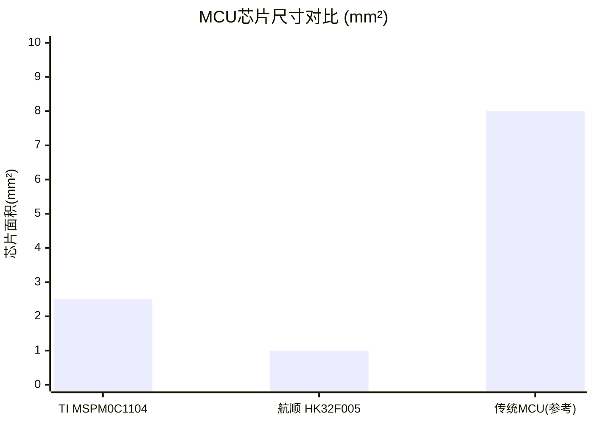
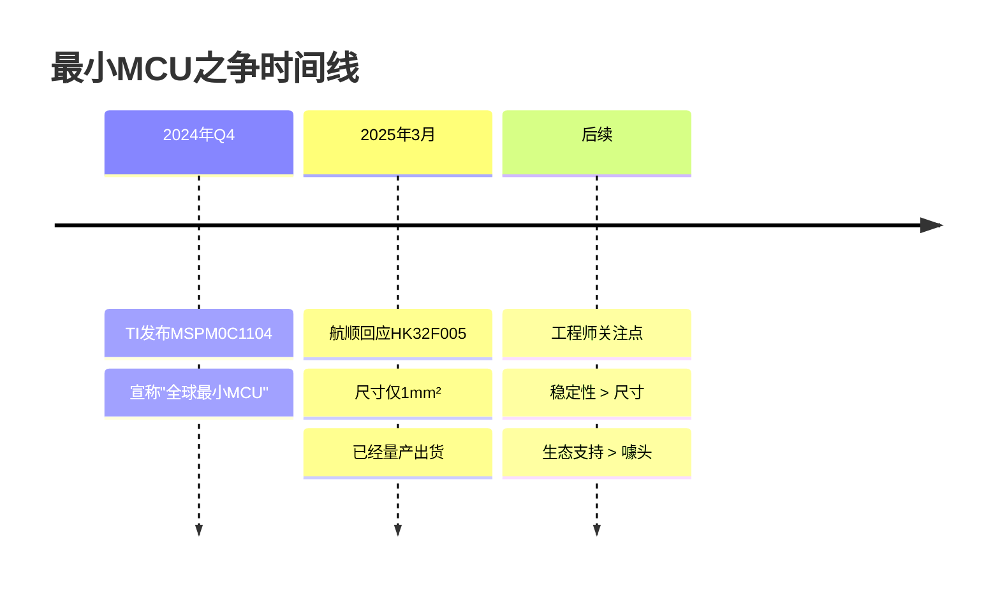
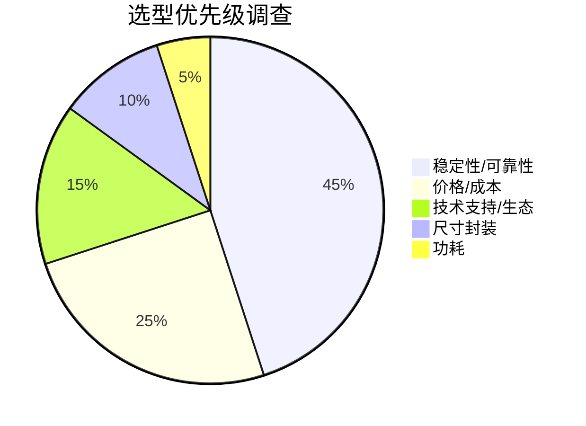

# MCU尺寸对比：TI vs 航顺

## "全球最小MCU"之争

## 规格参数对比

| 参数 | TI MSPM0C1104 | 航顺 HK32F005 | 对比结果 |
|------|---------------|---------------|----------|
| **封装尺寸** | 2.5mm² | 1.0mm² | 航顺胜 ✓ |
| **状态** | 刚发布 | 已量产 | 航顺胜 ✓ |
| **架构** | Arm Cortex-M0+ | Arm Cortex-M0 | 相当 |
| **主频** | 24MHz | 32MHz | 航顺差 |
| **Flash** | 16KB | 16KB | 相当 |
| **RAM** | 2KB | 2KB | 相当 |

## 时间线

## 工程师选型关注因素

---
*数据来源：嵌入式大杂烩 行业新闻报道*
