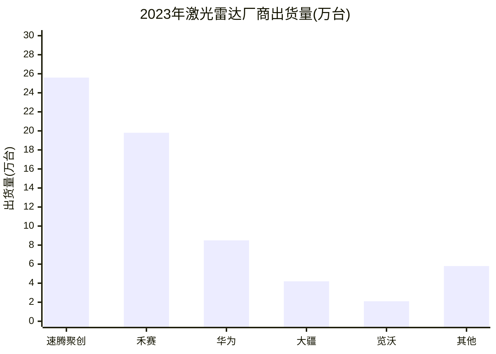
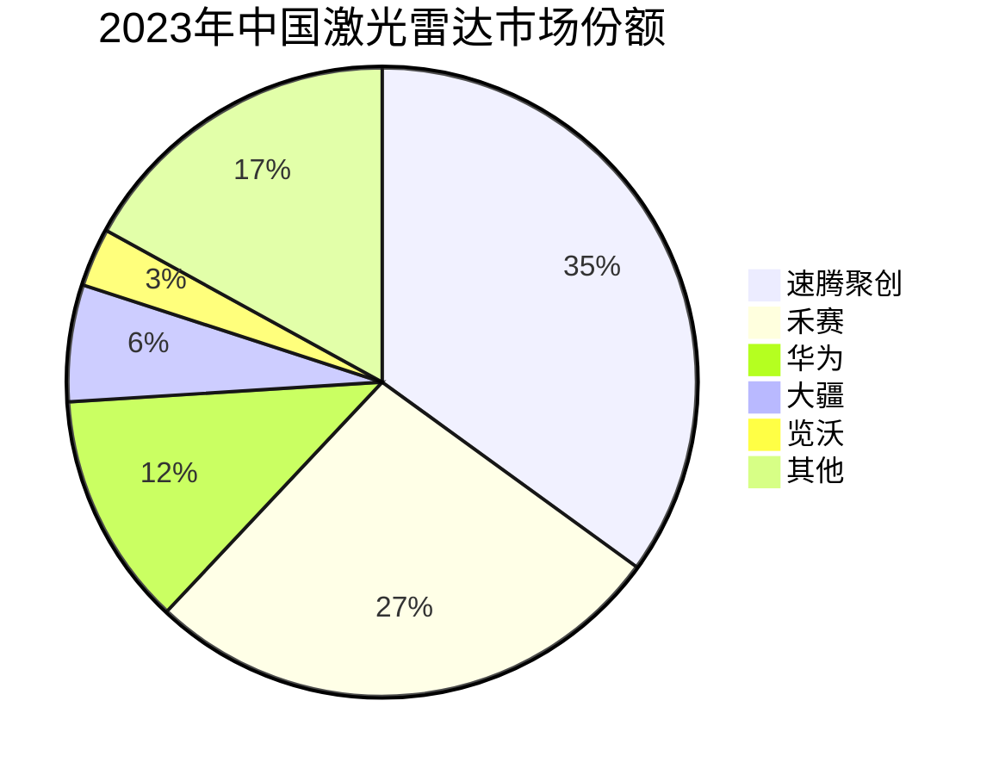
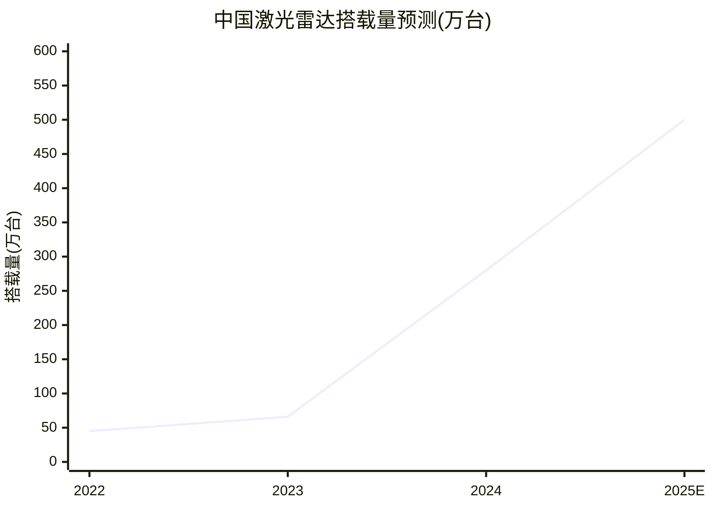

# 激光雷达市场竞争格局

## 2023年厂商出货量对比

## 市场份额演变

## 关键数据对比

| 厂商 | 2023出货量 | 同比增长 | 代表产品 | 探测距离 |
|------|-----------|----------|----------|----------|
| 速腾聚创 | 25.6万台 | +550% | M3 | 250m@10% |
| 禾赛 | 19.8万台 | +280% | AT128 | 200m@10% |
| 华为 | 8.5万台 | +150% | 96线 | 150m@10% |

## 2025年预测

---
*数据来源：高工智能汽车 激光雷达前装市场分析*
