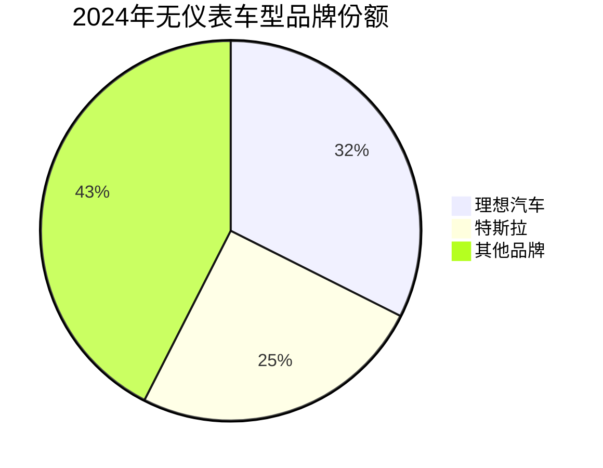
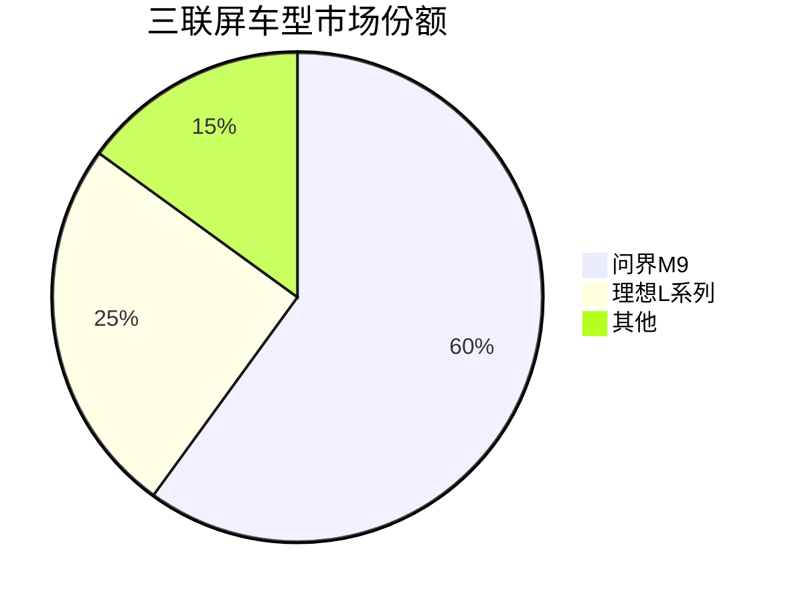

# 车载显示市场数据可视化

## 无仪表车型市场份额

## 三联屏市场格局

## 车载显示趋势对比

| 指标 | 2023年 | 2024年 | 增长率 |
|------|--------|--------|--------|
| 无仪表车型销量 | 100万辆 | 150万辆 | +50% |
| 后排娱乐屏装配 | 45万辆 | 90万辆 | +100% |
| 三联屏装配量 | 基准值 | 增长200%+ | +200% |

---
*数据来源：佐思汽车研究 2025年汽车显示屏及中控仪表行业研究报告*
