# AUTOSAR 诊断协议栈 - beautiful-mermaid 图表集

> **关联文章**: [AUTOSAR CP 诊断协议栈拆解：DCM、DEM、FiM](../articles/autosar-dcm-dem-fim-analysis.md)  
> **图表用途**: 使用 beautiful-mermaid 增强语法可视化诊断协议栈架构  
> **版本**: v1.0

---

## 1. 三模块架构关系图

```mermaid
graph TB
    subgraph External["🌐 外部系统"]
        TESTER["🔧 诊断仪
        UDS Tester"]
        ADAS["🤖 ADAS域"]
    end

    subgraph DCM_Layer["📡 DCM层 - 对外通信"]
        DCM["🔌 DCM
        Diagnostic Communication Manager"]
        UDS["📋 UDS服务处理
        0x10/0x19/0x14"]
        SESSION["🔄 会话管理
        Default/Extended/Programming"]
    end

    subgraph DEM_Layer["🗄️ DEM层 - 故障仲裁"]
        DEM["🧠 DEM
        Diagnostic Event Manager"]
        DEBOUNCE["⏱️ 去抖动判决
        Counter/Time-based"]
        STATUS["📊 状态字节管理
        8-bit UDS Status"]
        DTC_MGR["📝 DTC管理
        Confirmed/Pending"]
        NVM_WR["💾 NvM写入
        异步存储"]
    end

    subgraph FiM_Layer["🔐 FiM层 - 功能抑制"]
        FiM["⚖️ FiM
        Function Inhibition Manager"]
        PERMISSION["✅ 权限计算
        Function Permission"]
        INHIBIT["🚫 抑制源管理
        Event/Component/Summary"]
    end

    subgraph Application["💻 应用层"]
        SWC["🔧 SWC组件"]
        CDD["📟 CDD驱动"]
        SAFETY["🛡️ 安全相关功能"]
    end

    TESTER -- UDS报文 --> DCM
    DCM -- 查询DTC --> DEM
    DCM -- 清除请求 --> DEM
    
    SWC -- 故障上报 --> DEM
    CDD -- 故障上报 --> DEM
    
    DEM -- 去抖动判决 --> DEBOUNCE
    DEBOUNCE -- 更新状态 --> STATUS
    STATUS -- 生成DTC --> DTC_MGR
    DTC_MGR -- 异步写入 --> NVM_WR
    
    DEM -- 状态通知 --> FiM
    FiM -- 计算权限 --> PERMISSION
    PERMISSION -- 抑制控制 --> SWC
    PERMISSION -- 抑制控制 --> SAFETY
    
    style DCM fill:gradient(#4ecdc4,#44a3aa),color:#fff,stroke:#fff,stroke-width:2px
    style DEM fill:gradient(#667eea,#764ba2),color:#fff,stroke:#fff,stroke-width:2px
    style FiM fill:gradient(#ff6b6b,#c0392b),color:#fff,stroke:#fff,stroke-width:2px
    style TESTER fill:#ffd43b,stroke:#ff922b
```

---

## 2. 故障上报到功能抑制 - 完整调用链时序图

```mermaid
sequenceDiagram
    autonumber
    actor CDD as 📟 CDD/SWC
    participant DEM_Core as 🧠 DEM核心
    participant Debounce as ⏱️ 去抖动器
    participant Status as 📊 状态管理
    participant NvM as 💾 NvM管理
    participant FiM as 🔐 FiM
    participant SWC as 🔧 应用SWC

    rect rgb(30, 60, 90)
        Note over CDD,SWC: 🟢 故障检测与上报阶段
        
        CDD->>DEM_Core: Dem_SetEventStatus(EventId, FAILED)
        activate DEM_Core
        
        DEM_Core->>Debounce: 故障检测计数器+FDC
        activate Debounce
        
        alt FDC >= FailedThreshold
            Debounce-->>DEM_Core: 去抖完成，确认故障
            
            DEM_Core->>Status: 更新状态字节
            activate Status
            
            Note right of Status: Bit0=testFailed
            Note right of Status: Bit2=pendingDTC
            Note right of Status: Bit3=confirmedDTC
            
            Status->>DEM_Core: 状态更新完成
            deactivate Status
            
            DEM_Core->>NvM: 异步写入Freeze Frame
            activate NvM
            Note right of NvM: 异步操作，可能延迟
            NvM-->>DEM_Core: 写入请求已排队
            deactivate NvM
            
            DEM_Core->>FiM: FiM_DemTriggerOnMonitorStatus()
            deactivate DEM_Core
            
        else FDC < FailedThreshold
            Debounce-->>DEM_Core: 继续去抖
            deactivate Debounce
            deactivate DEM_Core
        end
    end

    rect rgb(90, 30, 30)
        Note over FiM,SWC: 🔴 功能抑制阶段
        
        activate FiM
        FiM->>FiM: 重新计算Permission
        
        alt 抑制计数器 > 0
            FiM-->>SWC: Function Permission = FALSE
            
            SWC->>SWC: 查询FiM_GetFunctionPermission()
            SWC->>SWC: 进入Safe State/降级模式
            
            Note right of SWC: ⚠️ 功能被抑制
        else 抑制计数器 = 0
            FiM-->>SWC: Function Permission = TRUE
            Note right of SWC: ✅ 功能正常运行
        end
        
        deactivate FiM
    end

    Note over CDD,SWC: 💡 关键时序：FiM同步更新，NvM异步写入
```

---

## 3. DEM Event 状态机 - 8-bit UDS状态字节流转

```mermaid
stateDiagram-v2
    [*] --> NOT_TESTED: 初始化
    
    NOT_TESTED: ⏸️ 未测试
    NOT_TESTED --> TESTING: 开始检测
    
    TESTING: 🔄 检测中
    TESTING --> PASSED: 检测通过
    TESTING --> FAILED: 检测到故障
    
    PASSED: ✅ PASSED
    PASSED --> TESTING: 下一周期
    
    FAILED: ❌ FAILED (Bit0=testFailed)
    FAILED --> PREFAILED: 去抖动中
    
    PREFAILED: ⏳ PREFAILED
    PREFAILED --> PENDING: FDC达到阈值
    PREFAILED --> PASSED: 故障恢复
    
    PENDING: 🟡 PENDING (Bit2)
    PENDING --> CONFIRMED: 确认阈值达成
    PENDING --> PASSED: 故障恢复
    
    CONFIRMED: 🔴 CONFIRMED (Bit3)
    CONFIRMED --> CONFIRMED_PASSED: 故障恢复但已确认
    
    CONFIRMED_PASSED: 🟠 CONFIRMED+PASSED
    CONFIRMED_PASSED --> CLEARED: 0x14清除请求
    
    CLEARED: 🧹 CLEARED (0x50)
    Note right of CLEARED
        Bit4+Bit6置位
        已清除但未完成自检
    End
    CLEARED --> TESTING: 新的检测周期

    style NOT_TESTED fill:#e0e0e0
    style PASSED fill:#c8e6c9,stroke:#388e3c
    style FAILED fill:#ffcdd2,stroke:#d32f2f
    style PREFAILED fill:#fff9c4,stroke:#fbc02d
    style PENDING fill:#ffe0b2,stroke:#f57c00
    style CONFIRMED fill:#ff6b6b,color:#fff,stroke:#c0392b,stroke-width:3px
    style CONFIRMED_PASSED fill:#ffccbc,stroke:#ff5722
    style CLEARED fill:#e3f2fd,stroke:#1976d2
```

---

## 4. DCM 会话状态机

```mermaid
stateDiagram-v2
    [*] --> DEFAULT: ECU启动
    
    DEFAULT: 🔵 Default Session
    DEFAULT --> DEFAULT: S3Server超时
    DEFAULT --> EXTENDED: 0x10 01/02
    DEFAULT --> PROGRAMMING: 0x10 03
    
    EXTENDED: 🟢 Extended Session
    EXTENDED --> DEFAULT: S3Server超时(5000ms)
    EXTENDED --> EXTENDED: 会话保持
    EXTENDED --> PROGRAMMING: 0x10 03 (OEM限制)
    
    PROGRAMMING: 🔴 Programming Session
    PROGRAMMING --> DEFAULT: ECU Reset
    PROGRAMMING --> EXTENDED: 0x10 01/02 (OEM限制)

    style DEFAULT fill:#e3f2fd,stroke:#1976d2
    style EXTENDED fill:#c8e6c9,stroke:#388e3c,stroke-width:2px
    style PROGRAMMING fill:#ffcdd2,stroke:#d32f2f,stroke-width:3px
```

---

## 5. 诊断仪读取 DTC 调用链

```mermaid
sequenceDiagram
    autonumber
    actor Tester as 🔧 诊断仪
    participant CanTp as 📡 CanTp
    participant PduR as 🔄 PduR
    participant DCM as 🔌 DCM
    participant DEM as 🧠 DEM
    participant NvM as 💾 NvM

    rect rgb(30, 60, 90)
        Note over Tester,NvM: 📥 诊断仪读取DTC流程
        
        Tester->>CanTp: 0x19 02 0xFF (读所有DTC)
        activate CanTp
        CanTp->>PduR: 传输层分帧
        activate PduR
        PduR->>DCM: 路由到DCM
        deactivate PduR
        deactivate CanTp
        
        activate DCM
        DCM->>DCM: UDS服务解析
        DCM->>DEM: Dem_SetDTCFilter(statusMask)
        activate DEM
        
        DEM->>NvM: 读取DTC存储数据
        activate NvM
        NvM-->>DEM: 返回DTC列表
        deactivate NvM
        
        loop DTC遍历
            DEM-->>DCM: Dem_GetNextFilteredDTC()
        end
        
        DEM-->>DCM: DTC查询完成
        deactivate DEM
        
        DCM->>DCM: 组织UDS响应报文
        DCM->>PduR: 发送响应
        activate PduR
        PduR->>CanTp: 路由到传输层
        activate CanTp
        CanTp->>Tester: 0x59 02 ... (DTC列表)
        deactivate CanTp
        deactivate PduR
        deactivate DCM
    end

    Note over Tester,NvM: 💡 DCM是"翻译官"，DEM负责实际存储
```



---

## 6. 五大设计陷阱 - 流程图

```mermaid
flowchart TD
    Start([🔍 设计陷阱检测]) --> Check{检查项目}
    
    Check -->|FiM实时性| Trap1[⚠️ 陷阱1：把FiM当实时保护]
    Check -->|NvM时序| Trap2[⚠️ 陷阱2：DEM/NvM时序耦合]
    Check -->|状态语义| Trap3[⚠️ 陷阱3：DTC状态位混淆]
    Check -->|清除语义| Trap4[⚠️ 陷阱4：清除≠删除]
    Check -->|初始化时序| Trap5[⚠️ 陷阱5：启动时序错乱]
    
    Trap1 --> Solution1["✅ 方案：响应<10ms用应用层自闭环
    FiM仅作全局降级触发器"]
    
    Trap2 --> Solution2["✅ 方案：配置DEM_CLRRESP_NONVOLATILE_FINISH
    确认NvM_REQ_OK后才返回成功"]
    
    Trap3 --> Solution3["✅ 方案：架构阶段明确定义
    pendingDTC vs confirmedDTC阈值语义"]
    
    Trap4 --> Solution4["✅ 方案：理解0x50协议语义
    区分待测状态vs真正故障状态"]
    
    Trap5 --> Solution5["✅ 方案：严格遵循初始化时序
    Dem_PreInit→NvM_ReadAll→FiM_Init→Dem_Init"]
    
    Solution1 --> End([✅ 设计正确])
    Solution2 --> End
    Solution3 --> End
    Solution4 --> End
    Solution5 --> End

    style Start fill:gradient(#667eea,#764ba2),color:#fff
    style End fill:gradient(#4ecdc4,#44a3aa),color:#fff
    style Trap1 fill:#ff6b6b,color:#fff
    style Trap2 fill:#ff6b6b,color:#fff
    style Trap3 fill:#ff6b6b,color:#fff
    style Trap4 fill:#ff6b6b,color:#fff
    style Trap5 fill:#ff6b6b,color:#fff
    style Solution1 fill:#c8e6c9,stroke:#388e3c
    style Solution2 fill:#c8e6c9,stroke:#388e3c
    style Solution3 fill:#c8e6c9,stroke:#388e3c
    style Solution4 fill:#c8e6c9,stroke:#388e3c
    style Solution5 fill:#c8e6c9,stroke:#388e3c
```

---

## 7. FiM 权限仲裁机制

```mermaid
graph LR
    subgraph InhibitionSources["🚫 抑制源"]
        E1["Event A FAILED"]
        E2["Event B FAILED"]
        COMP["Component X 故障"]
        SUMM["Summarized Event"]
    end
    
    subgraph FiM_Core["⚖️ FiM核心"]
        OR_LOGIC["逻辑或 OR"]
        COUNTER["抑制计数器
        Inhibition Counter"]
        PERM["Permission计算
        Counter == 0 ?"]
    end
    
    subgraph Functions["🔧 被控制功能"]
        F1["Function 1
        ABS控制"]
        F2["Function 2
        高级ADAS"]
        F3["Function 3
        舒适功能"]
    end
    
    E1 --> OR_LOGIC
    E2 --> OR_LOGIC
    COMP --> OR_LOGIC
    SUMM --> OR_LOGIC
    
    OR_LOGIC -- 任一触发 --> COUNTER
    COUNTER -- 计数+&- --> PERM
    
    PERM -- Permission=FALSE --> F1
    PERM -- Permission=FALSE --> F2
    PERM -- Permission=TRUE --> F3
    
    style FiM_Core fill:gradient(#ff6b6b,#c0392b),color:#fff
    style InhibitionSources fill:#ffe0b2,stroke:#f57c00
    style Functions fill:#e3f2fd,stroke:#1976d2
```

---

## 8. R19-11 版本演进对比

```mermaid
xychart-beta
    title "📊 AUTOSAR R19-11 诊断模块演进"
    x-axis ["R19-08", "R19-11", "R20-11", "R21-11", "R22-11"]
    y-axis "功能完整度 (%)" 0 --> 100
    
    bar [40, 65, 78, 88, 95]
    line [40, 65, 78, 88, 95]
    
    annotation ["FiM事件驱动", "DEM时间去抖", "多核Satellite", "DCM并发诊断"]
```

---

## 使用说明

### 在文档中嵌入

```markdown


<div class="mermaid">graph TB
    DCM["🔌 DCM"] --> DEM["🧠 DEM"]
    DEM --> FiM["🔐 FiM"]
</div>
```

### 渲染配置

```typescript
import { renderMermaidSVG } from 'beautiful-mermaid';

const svg = renderMermaidSVG(diagram, {
    theme: 'nord',           // 推荐主题
    backgroundColor: '#2e3440'
});
```

### 推荐主题

| 场景 | 主题 |
|------|------|
| 技术文档 | `nord`, `github` |
| 演示汇报 | `cyberpunk`, `tokyo-night` |
| 打印输出 | `neutral` |

---

*beautiful-mermaid 诊断协议栈图表集*  
*专业可视化，提升技术文档品质*