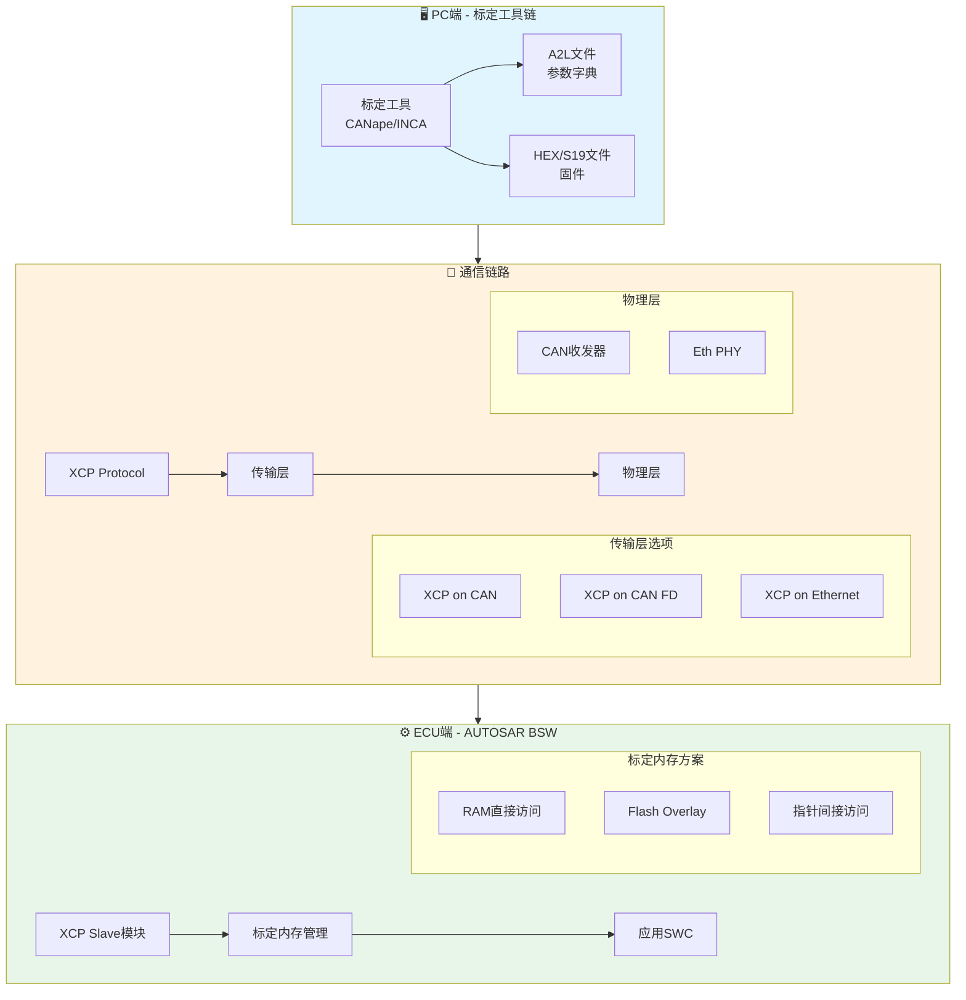
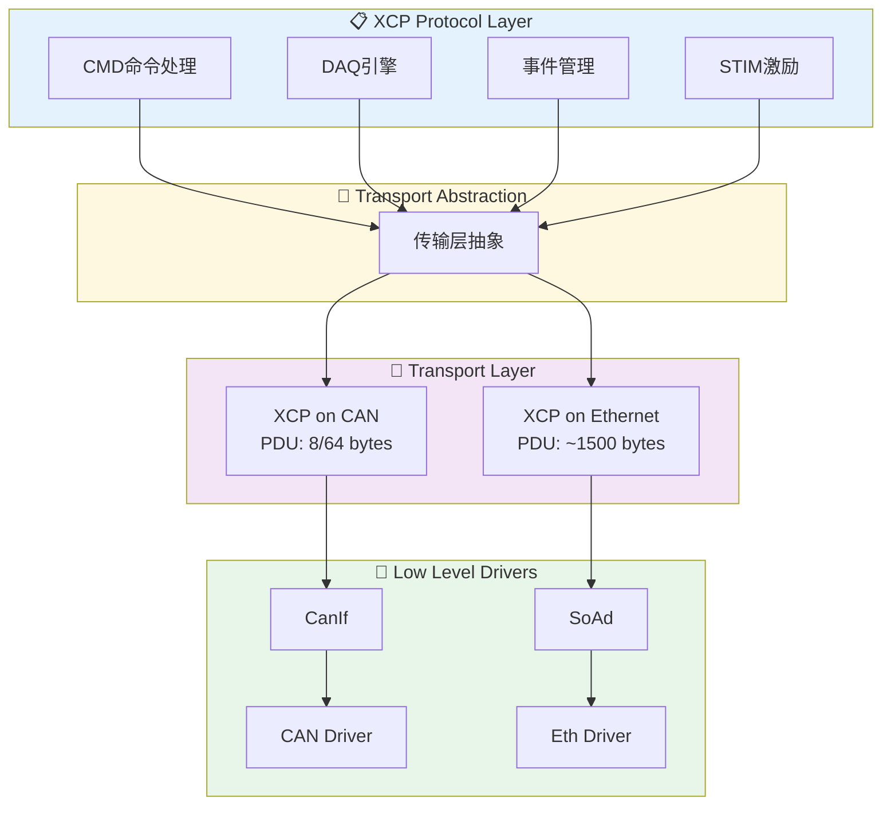
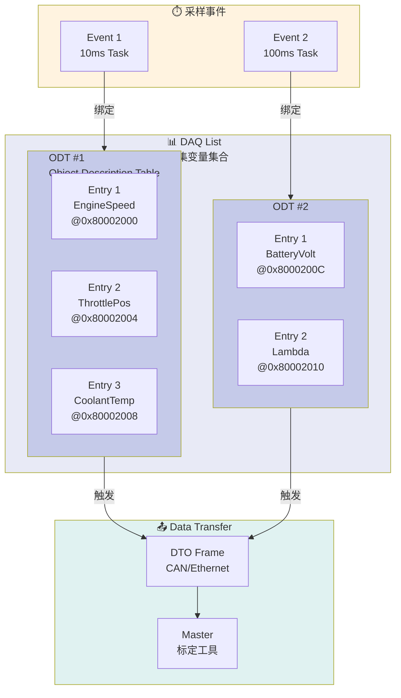
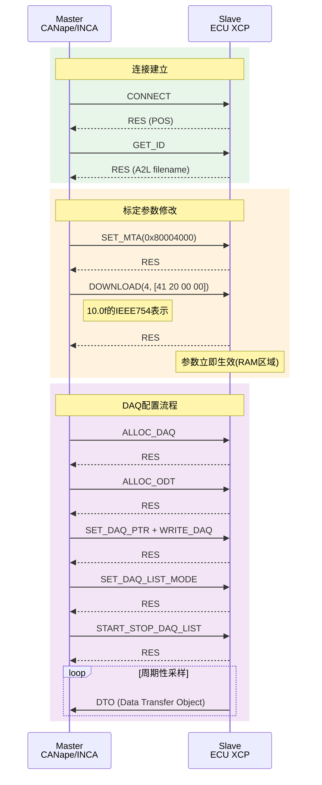
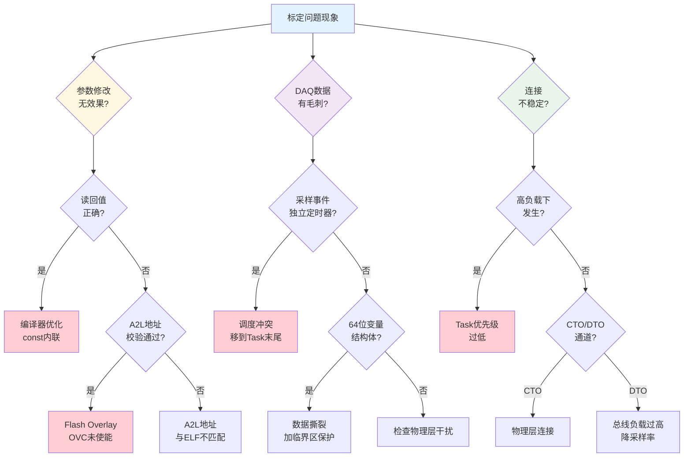
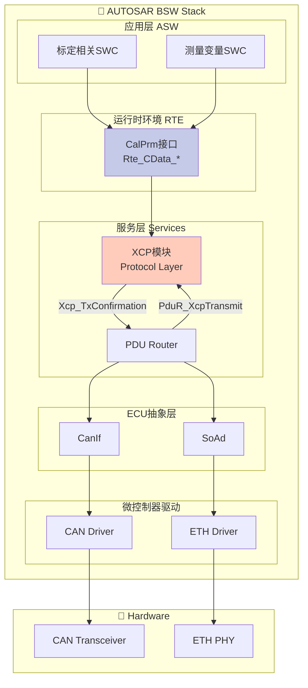
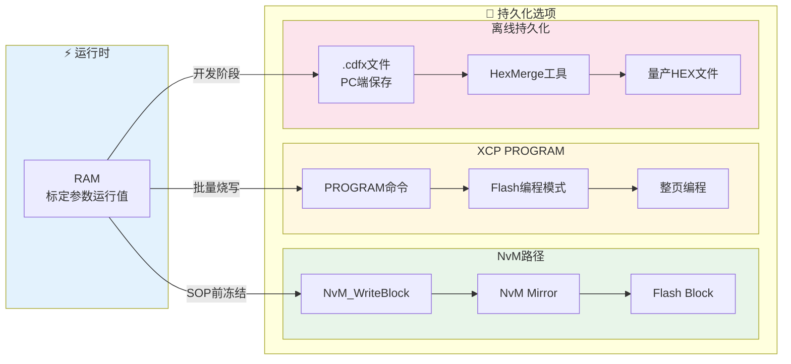
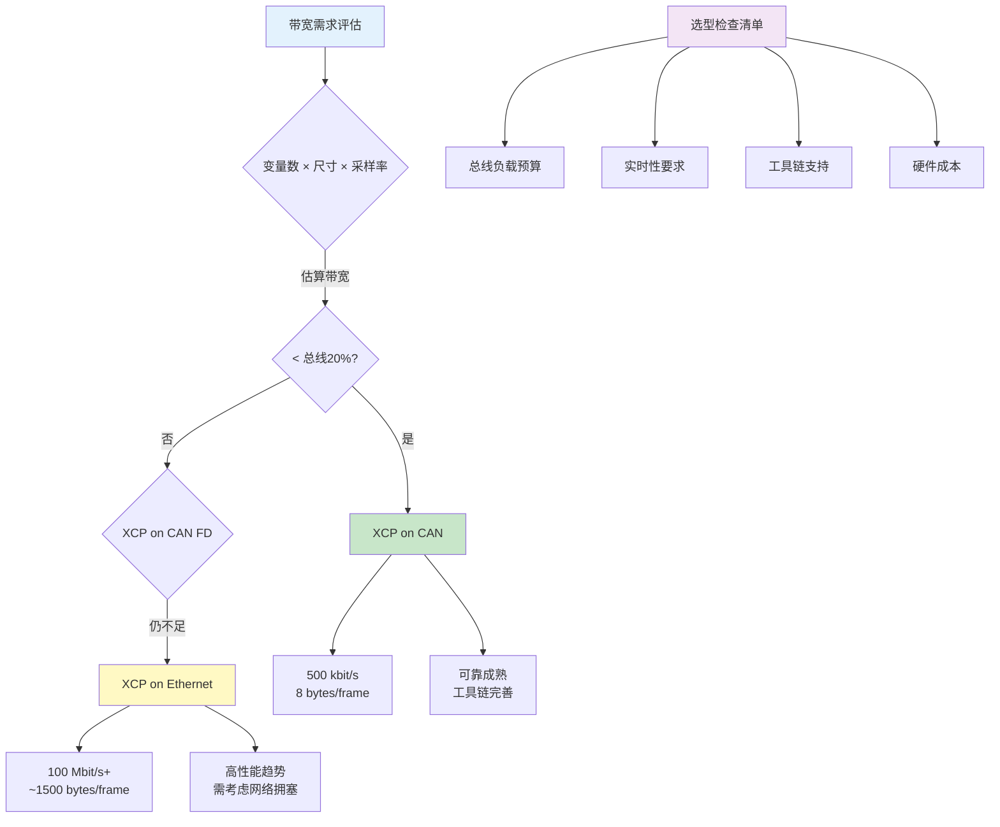

# AUTOSAR 标定系统 - 可视化图表集

本文档包含多个 Mermaid 图表，用于增强对标定系统架构、XCP协议、A2L文件和故障排查的理解。

---

## 1. 标定系统三要素架构图



---

## 2. XCP协议栈架构图



---

## 3. DAQ数据采集层级结构



---

## 4. A2L文件核心元素结构

```mermaid
graph TB
    subgraph A2L["📄 A2L File - 标定字典"]
        
        subgraph MEASUREMENT["📏 MEASUREMENT<br/>可测量变量"]
            M1[EngineSpeed<br/>UWORD @0x80002000<br/>Conversion: ×4 rpm]
            M2[ThrottlePos<br/>UBYTE @0x80002002<br/>Conversion: ×0.4 %]
        end
        
        subgraph CHARACTERISTIC["🎛️ CHARACTERISTIC<br/>可标定参数"]
            
            subgraph VALUE["VALUE - 单值"]
                V1[Kp_Throttle<br/>FLOAT @0x80004000]
            end
            
            subgraph CURVE["CURVE - 一维曲线"]
                C1[TorqueMap<br/>FLOAT[16] @0x80005000<br/>X轴: RPM]
            end
            
            subgraph MAP["MAP - 二维MAP"]
                M3[IgnitionMap<br/>FLOAT[16x16] @0x80006000<br/>X轴: RPM<br/>Y轴: Load]
            end
        end
        
        subgraph COMPU_METHOD["🔄 COMPU_METHOD<br/>转换方法"]
            CM1[RAT_FUNC<br/>物理值 = f(原始值)]
            CM2[TAB_VERB<br/>查表转换]
        end
    end

    MEASUREMENT --> COMPU_METHOD
    CHARACTERISTIC --> COMPU_METHOD

    style A2L fill:#f5f5f5
    style MEASUREMENT fill:#e3f2fd
    style CHARACTERISTIC fill:#fff8e1
    style VALUE fill:#ffecb3
    style CURVE fill:#ffe082
    style MAP fill:#ffd54f
    style COMPU_METHOD fill:#e8f5e9
```

---

## 5. 三种标定内存方案对比

```mermaid
graph TB
    subgraph 方案对比["🔧 标定内存方案对比"]
        direction TB
        
        subgraph 方案1["方案一: RAM直接访问"]
            R1["```c
            volatile float32 param = 1.5f;
            ```"]
            R2[CALIB段 - RAM]
            R3[启动时从Flash复制初值]
            R4[XCP直接写RAM]
            R1 --> R2 --> R3 --> R4
            
            R_PROS["✅ 实现简单<br/>✅ 实时生效"]
            R_CONS["❌ 掉电丢失<br/>❌ 占用RAM"]
        end
        
        subgraph 方案2["方案二: Flash Overlay"]
            O1["```c
            const float32 param = 1.5f;
            ```"]
            O2[Flash原始地址]
            O3[OVC寄存器映射]
            O4[RAM Mirror]
            O5[XCP写RAM Mirror]
            O6[CPU透明读RAM]
            
            O1 --> O2
            O2 -->|Overlay| O3
            O3 --> O4
            O4 --> O6
            O5 --> O4
            
            O_PROS["✅ 代码无需修改<br/>✅ 支持const<br/>✅ 性能最优"]
            O_CONS["❌ 硬件绑定<br/>❌ OVC配置复杂"]
        end
        
        subgraph 方案3["方案三: 指针间接访问"]
            P1["```c
            const float32* ptr = &param;
            ```"]
            P2[运行时切换指针]
            P3[RAM副本 / Flash]
            P4[XCP修改RAM]
            P5[通过指针访问]
            
            P1 --> P2
            P2 -->|切换| P3
            P4 --> P3
            P3 --> P5
            
            P_PROS["✅ 可移植性好<br/>✅ 灵活切换"]
            P_CONS["❌ 间接访问开销<br/>❌ A2L配置复杂"]
        end
    end

    style 方案1 fill:#e3f2fd
    style 方案2 fill:#fff8e1
    style 方案3 fill:#f3e5f5
```

---

## 6. XCP核心命令时序图



---

## 7. 故障排查决策树



---

## 8. AUTOSAR XCP模块集成架构



---

## 9. 标定参数持久化路径



---

## 10. XCP on CAN vs Ethernet 选型决策



---

## 快速参考卡

| 概念 | 说明 | 关键风险 |
|------|------|----------|
| **XCP** | 通用测量和标定协议 | 传输层配置与协议层不匹配 |
| **A2L** | 标定工具字典 | 地址与ELF不同步 |
| **DAQ** | 高速数据采集 | 采样事件与Task调度冲突 |
| **Overlay** | Flash→RAM硬件映射 | OVC寄存器配置遗漏 |
| **NvM** | 非易失性存储 | 并发写入导致数据撕裂 |

---

*文章来源: 莫无涯 - AUTOSAR标定系统深度解析*  
*图表生成时间: 2026-03-27*  
*用途: 配合原文增强理解*
