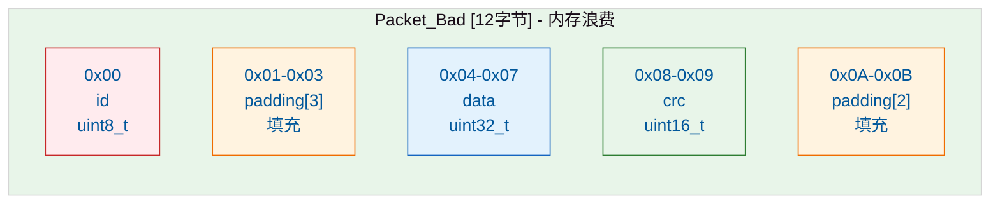
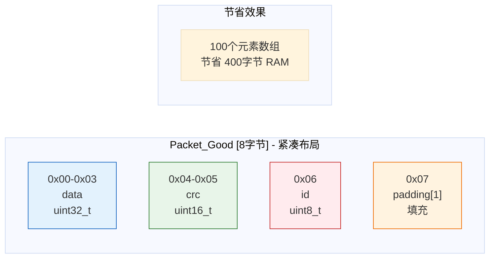
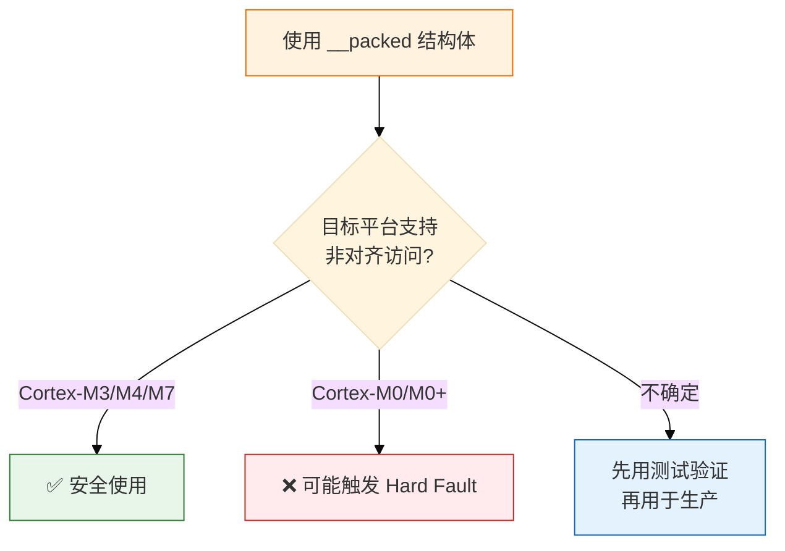
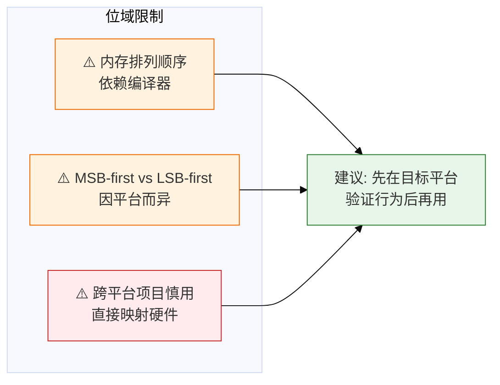
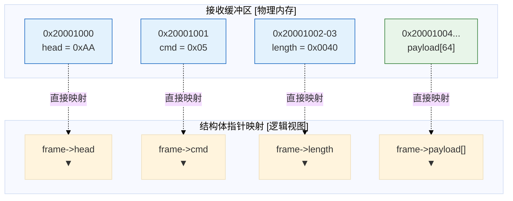
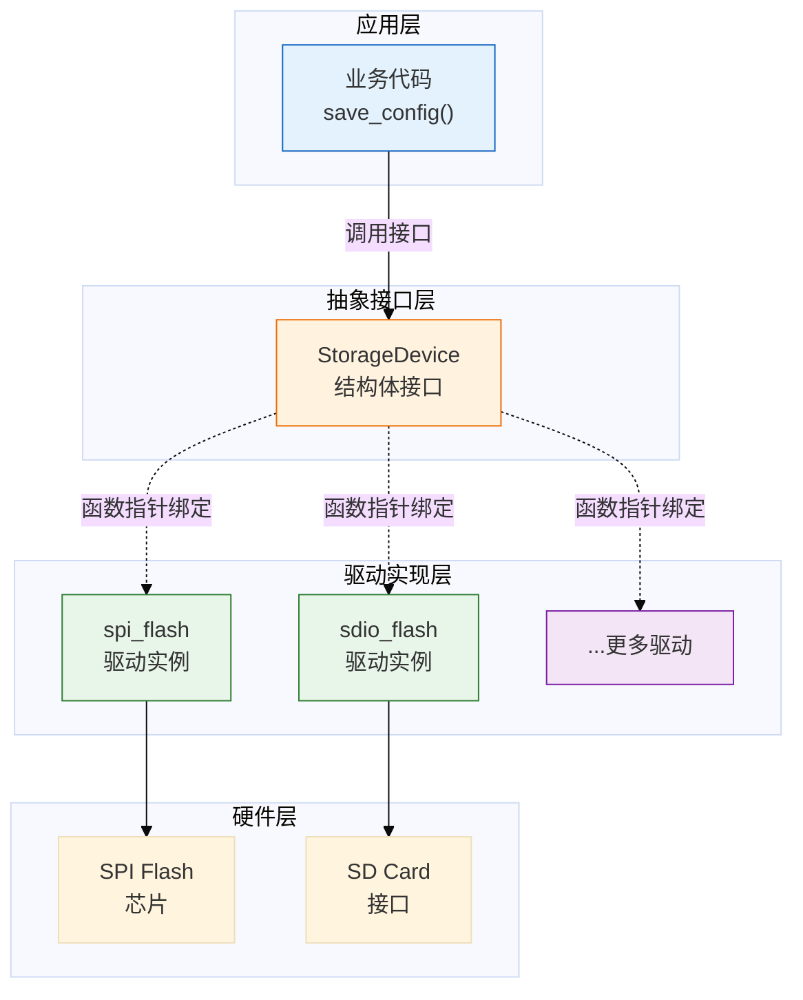
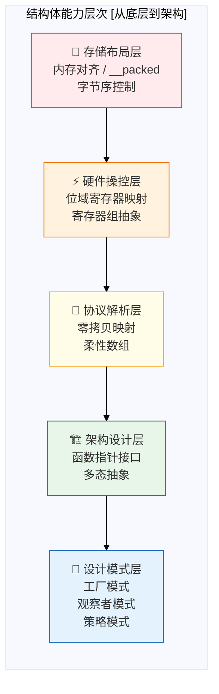

# C语言结构体深度解析：从内存布局到架构设计

> 原文：一枚嵌入式码农  
> 整理时间：2026-03-21  
> 核心主题：struct 在嵌入式开发中的全层次应用

---

## 一、结构体内存布局：你以为的7字节，实际是12字节

### 1.1 为什么 sizeof 总是"出乎意料"

```c
typedef struct {
    uint8_t  id;      // 1字节
    uint32_t data;    // 4字节
    uint16_t crc;     // 2字节
} Packet;
// 你以为: 1+4+2 = 7字节
// 实际上: sizeof(Packet) = 12字节
```

**多出来的5字节 = 填充字节(Padding)**，是编译器为了CPU访问效率自动插入的。

### 1.2 内存布局可视化



### 1.3 对齐规则（记住两条）

| 规则 | 说明 |
|------|------|
| **规则1** | 每个成员的起始地址必须是自身大小的整数倍 |
| **规则2** | 整个结构体的大小必须是最大成员大小的整数倍 |

> 例：`uint32_t` 必须放在4的倍数地址，`uint16_t` 必须放在2的倍数地址

### 1.4 优化：按大小从大到小排列

```c
// ❌ 浪费内存的写法 [12字节]
typedef struct {
    uint8_t  id;      // 偏移0，后填充3字节
    uint32_t data;    // 偏移4
    uint16_t crc;     // 偏移8，尾部填充2字节
} Packet_Bad;

// ✅ 紧凑的写法 [8字节]
typedef struct {
    uint32_t data;    // 偏移0
    uint16_t crc;     // 偏移4
    uint8_t  id;      // 偏移6，尾部填充1字节
} Packet_Good;
```



**实战价值**：在只有几十KB RAM的MCU上，100个元素的数组能省400字节——可能就是跑不跑得动的区别。

---

## 二、强制取消对齐：__packed 的双刃剑

### 2.1 何时使用 packed

网络协议包解析需要严格按定义顺序、不带填充：

```c
// GCC / Clang
typedef struct __attribute__((packed)) {
    uint8_t  type;    // 帧类型
    uint32_t seq;     // 序列号
    uint16_t length;  // 数据长度
} FrameHeader;
// sizeof = 7，无任何填充

// Keil ARM Compiler
__packed typedef struct {
    uint8_t  type;
    uint32_t seq;
    uint16_t length;
} FrameHeader;
```

### 2.2 ⚠️ 关键警告



> **packed 结构体的成员地址可能不对齐**，在ARM Cortex-M0等不支持非对齐访问的平台上，直接通过指针访问可能触发异常。

---

## 三、位域(Bit-field)：优雅操作寄存器位

### 3.1 传统位操作 vs 位域

假设某外设控制寄存器：

```mermaid
%%{init: {'theme': 'base'}}%%
bitDiagram
    title "GPIO控制寄存器位定义"
    bits 32
    
    section "Bit 0"
        ENABLE ["Enable<br/>使能"]
    section "Bit 1"
        DIR ["Dir<br/>方向"]
    section "Bit 2"
        IRQ_EN ["IrqEn<br/>中断使能"]
    section "Bit 3"
        RSV ["Reserved<br/>保留"]
    section "Bit 4-7"
        MODE ["Mode[3:0]<br/>模式选择"]
    section "Bit 8-31"
        PADDING ["Padding<br/>保留"]
```

**位域定义：**
```c
typedef struct {
    uint32_t enable   : 1;  // Bit 0
    uint32_t dir      : 1;  // Bit 1
    uint32_t irq_en   : 1;  // Bit 2
    uint32_t reserved : 1;  // Bit 3
    uint32_t mode     : 4;  // Bit 4-7
    uint32_t padding  : 24; // Bit 8-31
} GPIO_CtrlReg;
```

**操作对比：**

| 方式 | 代码 | 可读性 |
|------|------|--------|
| **位域** | `ctrl->mode = 0x05;` | ⭐⭐⭐ 直观 |
| **传统位操作** | `*reg = (*reg & ~(0xF << 4)) \| (0x05 << 4);` | ⭐ 晦涩 |

### 3.2 使用注意事项



---

## 四、零拷贝协议解析：结构体指针直接映射

### 4.1 问题场景

串口/CAN/SPI收到原始字节流，如何快速解析？

### 4.2 解决方案：柔性数组 + 指针映射

```c
typedef struct __attribute__((packed)) {
    uint8_t  head;       // 帧头 0xAA
    uint8_t  cmd;        // 命令字
    uint16_t length;     // 数据长度
    uint8_t  payload[];  // 柔性数组，变长数据
} Frame;

void on_data_received(uint8_t *buf, uint16_t len)
{
    Frame *frame = (Frame *)buf;  // 零拷贝，直接映射
    
    if (frame->head != 0xAA)
        return;
    
    printf("命令: 0x%02X, 长度: %d\n", 
           frame->cmd, frame->length);
    process_payload(frame->payload, frame->length);
}
```

### 4.3 内存映射示意



**核心价值：**
- ✅ 无 memcpy，省RAM省CPU
- ✅ 解析代码简洁直观
- ✅ lwIP等开源协议栈大量使用

---

## 五、结构体 + 函数指针 = C语言的"面向对象"

### 5.1 问题：如何抽象不同的存储设备？

产品同时支持SPI Flash和SDIO Flash，业务逻辑相同，底层操作不同。

### 5.2 Linux内核的解决方案

```c
// 定义"存储设备"抽象接口
typedef struct {
    const char *name;
    int (*init)(void);
    int (*read)(uint32_t addr, uint8_t *buf, uint32_t len);
    int (*write)(uint32_t addr, const uint8_t *buf, uint32_t len);
    int (*erase)(uint32_t addr, uint32_t len);
} StorageDevice;
```

### 5.3 驱动实现

```c
// SPI Flash 驱动实现
static int spi_flash_init(void) { /* SPI初始化 */ }
static int spi_flash_read(uint32_t addr, uint8_t *buf, uint32_t len) { /* ... */ }
static int spi_flash_write(uint32_t addr, const uint8_t *buf, uint32_t len) { /* ... */ }
static int spi_flash_erase(uint32_t addr, uint32_t len) { /* ... */ }

const StorageDevice spi_flash = {
    .name  = "W25Q128",
    .init  = spi_flash_init,
    .read  = spi_flash_read,
    .write = spi_flash_write,
    .erase = spi_flash_erase,
};
```

### 5.4 业务层完全解耦

```c
void save_config(const StorageDevice *dev, Config *cfg)
{
    dev->erase(CFG_ADDR, sizeof(Config));
    dev->write(CFG_ADDR, (uint8_t *)cfg, sizeof(Config));
}

// 调用时传入不同设备，逻辑完全一致
save_config(&spi_flash, &my_config);
save_config(&sdio_flash, &my_config);
```

### 5.5 架构图解



**这就是C语言实现多态的核心思想**，也是Linux内核驱动框架的基本设计。

---

## 六、结构体能力边界全景图



---

## 七、要点速查表

| 场景 | 技术方案 | 注意事项 |
|------|----------|----------|
| 节省内存 | 按成员大小从大到小排列 | 100个元素省400字节 |
| 协议解析 | `__packed` + 柔性数组 | Cortex-M0注意非对齐访问 |
| 寄存器操作 | 位域定义 | 跨平台先验证内存布局 |
| 零拷贝 | 结构体指针直接映射缓冲区 | 确保缓冲区对齐 |
| 驱动抽象 | 结构体+函数指针 | 学习Linux驱动框架思想 |

---

## 八、核心结论

> **把结构体用好是基本功，把设计模式用好才是内功。**

1. **内存对齐不是玄学**——理解规则后可以主动优化
2. **packed 是双刃剑**——省空间但可能牺牲性能和稳定性
3. **位域让寄存器操作可读**——但要注意编译器差异
4. **零拷贝是嵌入式利器**——lwIP等成熟项目都在用
5. **函数指针实现多态**——C语言也能写出高内聚低耦合的架构

---

**标签**: `#C语言` `#嵌入式` `#struct` `#内存对齐` `#位域` `#设计模式` `#零拷贝`
