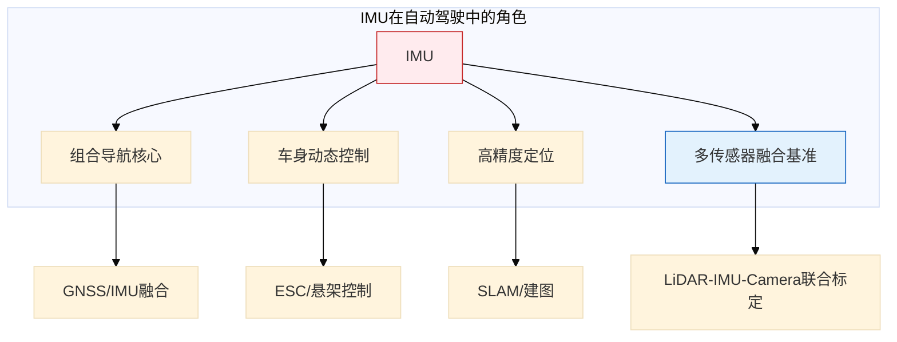
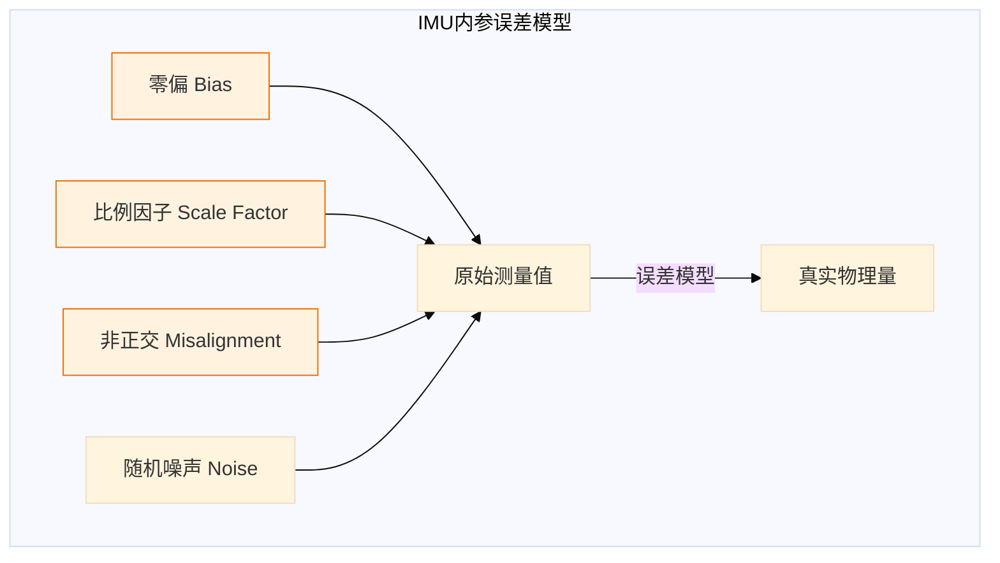
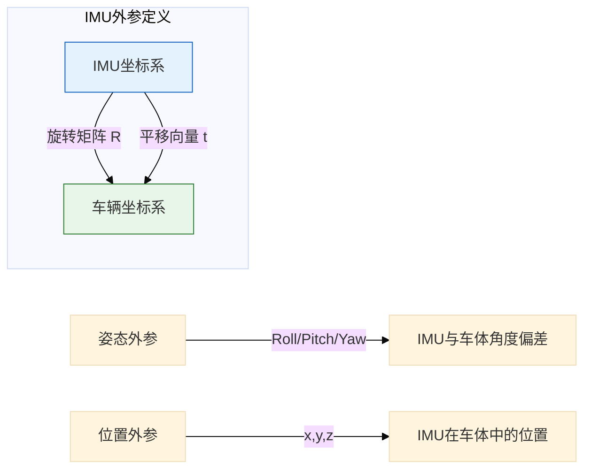
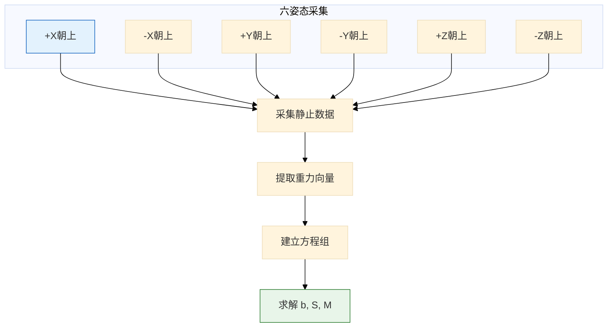
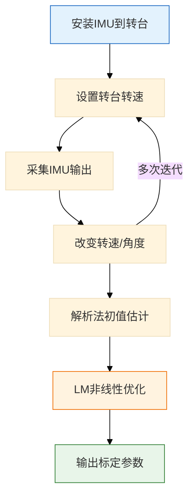
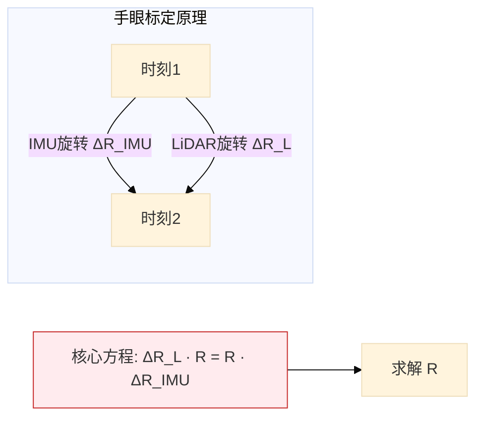
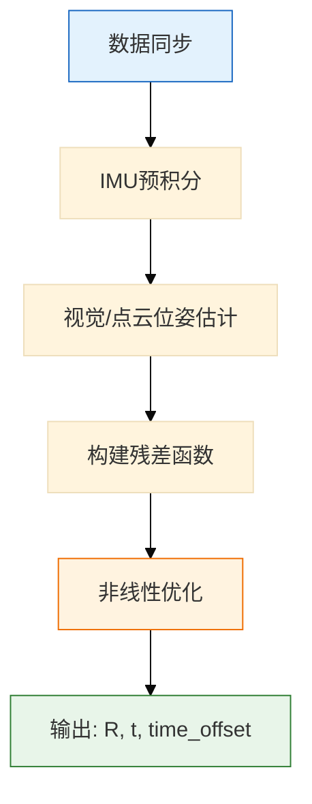
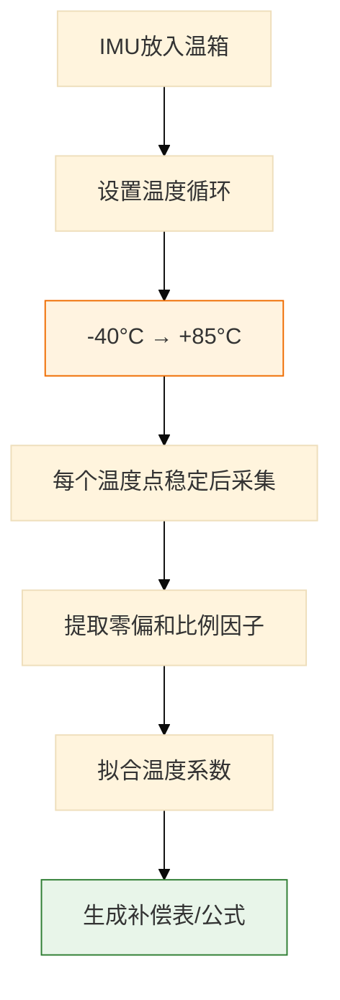
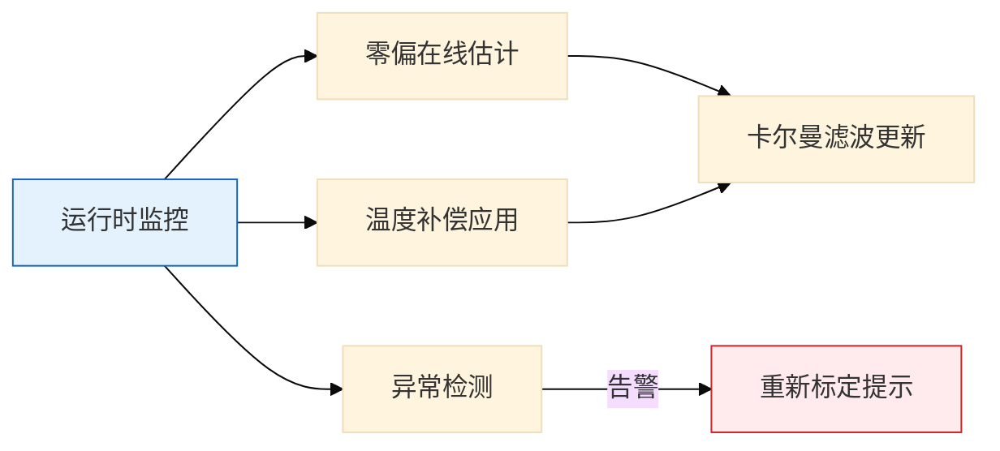

# IMU标定技术详解：从误差模型到工程实践

> 整理来源：星辰耀同光《自动驾驶传感器标定技术》  
> 主题：惯性测量单元（IMU）内参 & 外参标定  
> 更新时间：2026-03-22

---

## 一、IMU标定的重要性

### 为什么IMU是"参考系核心"？



### IMU误差导致的典型问题

| 误差类型 | 后果 | 场景 |
|----------|------|------|
| **零偏未校准** | 静止时输出非零角速度/加速度 | 车辆被认为在移动 |
| **安装倾斜** | X/Y轴分到重力分量 | 误以为车辆在加减速或转弯 |
| **外参不准** | LiDAR点云与IMU轨迹不匹配 | SLAM漂移、定位失败 |

---

## 二、IMU误差模型详解

### 2.1 内参误差（Intrinsic Errors）

IMU内参标定的目标是消除传感器本身的系统性误差。



#### 误差参数详解

| 参数 | 符号 | 定义 | 影响 |
|------|------|------|------|
| **零偏** | $b_a, b_g$ | 静止时输出不为0的系统性偏移 | 积分后产生漂移 |
| **比例因子** | $S_a, S_g$ | 输出与真实值的比例偏差 | 测量值缩放错误 |
| **非正交** | $M$ | 传感器三轴不完全垂直 | 轴间耦合误差 |
| **随机游走** | $N$ | 随机漂移、白噪声 | 长期精度下降 |

#### 数学模型

**加速度计误差模型**：
```
 a_measured = S_a · M_a · (a_true + b_a + n_a)
 
 其中：
 - S_a: 3×3 比例因子对角矩阵
 - M_a: 3×3 非正交矩阵
 - b_a: 3×1 零偏向量
 - n_a: 3×1 随机噪声
```

**陀螺仪误差模型**：
```
 ω_measured = S_g · M_g · (ω_true + b_g + n_g)
 
 类似结构，参数对应陀螺仪
```

### 2.2 外参误差（Extrinsic Errors）



---

## 三、IMU内参标定技术详解

### 3.1 标定方法对比

| 方法 | 需要设备 | 精度 | 复杂度 | 适用场景 |
|------|----------|------|--------|----------|
| **转台标定** | 高精度转台 | ⭐⭐⭐⭐⭐ | 高 | 实验室、量产前 |
| **六姿态法** | 无 | ⭐⭐⭐⭐ | 中 | 现场快速标定 |
| **迭代优化** | 无 | ⭐⭐⭐⭐ | 中 | 大规模数据处理 |
| **Allan方差** | 长时间静止 | ⭐⭐⭐ | 低 | 噪声特性评估 |
| **温度补偿** | 温箱 | ⭐⭐⭐⭐ | 高 | MEMS IMU量产 |

### 3.2 六姿态标定法（最常用）

#### 原理
利用重力加速度作为已知参考（大小为1g，方向垂直向下），通过将IMU放置在六个已知方向，建立方程组求解误差参数。



#### 六姿态示意图

```
       +Z
        │
        │  +Y
        │ /
        │/
        +─────── +X
       /
      /
     -Z

姿态1: +Z朝上（水平放置）    姿态2: -Z朝上（倒置）
姿态3: +X朝上（侧立）        姿态4: -X朝上（另一侧立）
姿态5: +Y朝上（前/后立）     姿态6: -Y朝上（相反方向）
```

#### 关键步骤

| 步骤 | 操作 | 目的 |
|------|------|------|
| **① 准备** | 确保IMU静止、无振动、温度稳定 | 消除外部干扰 |
| **② 放置** | 将IMU依次置于六姿态，每姿态保持30-60秒 | 采集足够数据 |
| **③ 提取** | 计算每姿态下加速度计输出的均值 | 消除随机噪声 |
| **④ 建模** | 建立理论重力向量与实际测量的关系 | 构建误差模型 |
| **⑤ 求解** | 线性最小二乘或非线性优化 | 估计参数 |
| **⑥ 验证** | 用标定后参数重新计算，检查误差 | 验证标定效果 |

#### 核心公式

**理论重力向量**（六姿态）：
```python
# 六个理论重力方向（在IMU坐标系下）
g_theory = [
    [ 0,  0, -1],  # +Z朝上（重力向下，Z轴负方向）
    [ 0,  0,  1],  # -Z朝上
    [-1,  0,  0],  # +X朝上
    [ 1,  0,  0],  # -X朝上
    [ 0, -1,  0],  # +Y朝上
    [ 0,  1,  0],  # -Y朝上
]
```

**误差模型方程**：
```
g_measured = S · M · (g_true + b)

展开后形成线性方程组，可用最小二乘求解：
A · x = b

其中 x = [b_x, b_y, b_z, s_x, s_y, s_z, ...] 为待求参数
```

### 3.3 转台标定法（高精度）

#### 设备要求
- **高精度转台**：角度精度 < 0.01°
- **速率范围**：覆盖IMU量程（如±2000°/s）
- **位置精度**：定位重复性 < 0.001°

#### 标定流程



#### 标定动作设计

| 动作 | 目的 | 参数估计 |
|------|------|----------|
| 静止多姿态 | 重力参考 | 零偏、比例因子、非正交 |
| 恒速旋转 | 已知角速度输入 | 陀螺仪比例因子 |
| 正反转 | 消除安装误差 | 轴间耦合系数 |
| 变加速 | 动态性能 | 带宽、延迟 |

### 3.4 Allan方差分析

#### 目的
评估IMU的随机误差特性，为后续滤波器设计提供参数。

#### 方法
1. **长时间静止采集**：通常需要数小时
2. **计算Allan方差**：分析不同时间尺度下的噪声特性

```python
# Allan方差曲线解读
tau = [1, 10, 100, 1000]  # 平均时间（秒）

# 曲线特征：
# - 短τ：角度随机游走（ARW）
# - 中τ：零偏不稳定性（Bias Instability）
# - 长τ：速率随机游走（RRW）
```

#### 关键指标

| 参数 | 物理意义 | 典型值（消费级MEMS） |
|------|----------|---------------------|
| **ARW** | 角度随机游走 | 0.1-1 °/√h |
| **Bias Instability** | 零偏不稳定性 | 10-100 °/h |
| **RRW** | 速率随机游走 | 0.001-0.01 °/h |

---

## 四、IMU外参标定技术详解

### 4.1 外参标定目标

求解IMU坐标系相对于车辆坐标系（或参考传感器）的刚体变换：
```
T = [R | t]
    [0 | 1]

其中：
- R: 3×3 旋转矩阵（或四元数 q）
- t: 3×1 平移向量
```

### 4.2 外参标定方法

#### 方法一：手眼标定（AX=XB）

**原理**：利用IMU在两个时刻的姿态变化与参考传感器（如LiDAR）的姿态变化关系求解外参。



**适用条件**：
- IMU与LiDAR/相机数据时间同步
- 车辆进行充分运动激励（大幅转向、加减速）
- 至少10-20组不同姿态的对应数据

**优缺点**：
- ✅ 无需外部设备，只需原始传感器数据
- ✅ 可在实际车辆上进行
- ❌ 需要充分运动激励（直线行驶无法求解）
- ❌ 对时间同步要求高

#### 方法二：基于轨迹匹配（Kalibr/LIO-SAM）

**原理**：同时估计IMU-相机/LiDAR外参和时间偏差，使用滑动窗口优化。



**Kalibr工具链**：
```bash
# 1. 准备数据包（包含IMU和相机数据）
# 2. 运行标定
kalibr_calibrate_imu_camera \
    --target target.yaml \
    --cam camchain.yaml \
    --imu imu.yaml \
    --bag data.bag

# 输出：相机-IMU外参 + 时间偏移
```

#### 方法三：基于GNSS/里程计真值

**原理**：利用高精度GNSS（RTK）或里程计提供的全局位姿作为真值，与IMU积分位姿匹配求解外参。

**步骤**：
1. 车辆装备高精度GNSS-RTK
2. 行驶特定轨迹（包含直线、转弯、加减速）
3. 记录IMU原始数据和GNSS位姿
4. 最小化IMU积分轨迹与GNSS轨迹的误差

**优缺点**：
- ✅ 精度高（厘米级）
- ✅ 可以同时标定内参和外参
- ❌ 需要开阔场地和RTK信号
- ❌ 需要长距离行驶（通常>1km）

### 4.3 外参标定关键步骤

| 步骤 | 关键操作 | 注意事项 |
|------|----------|----------|
| **① 时间同步** | 对IMU与其他传感器进行时间对齐 | 线性插值，确保时间戳一致 |
| **② 初始估计** | 手眼标定或CAD图纸粗略测量 | 提供优化初值，避免局部最优 |
| **③ 数据关联** | 将IMU积分姿态与参考传感器位姿对应 | 确保运动同步 |
| **④ 优化求解** | 因子图或非线性最小二乘 | 加入姿态、平移约束 |
| **⑤ 验证** | 使用已知尺度的点云或GNSS轨迹检查残差 | 平移误差<厘米级，旋转误差<0.1° |

---

## 五、温度补偿标定（MEMS IMU必需）

### 5.1 为什么需要温度补偿？

MEMS IMU的零偏和比例因子随温度变化显著，不补偿会导致：
- 冷启动时定位漂移
- 长时间运行精度下降
- 不同季节性能不一致

### 5.2 温度补偿模型

```
b(T) = b_0 + b_1·(T - T_ref) + b_2·(T - T_ref)²
s(T) = s_0 + s_1·(T - T_ref)

其中：
- T: 当前温度
- T_ref: 参考温度（通常25°C）
- b_0, b_1, b_2: 零偏温度系数
- s_0, s_1: 比例因子温度系数
```

### 5.3 温度标定流程



---

## 六、IMU标定验证方法

### 6.1 静态验证

| 验证项 | 方法 | 通过标准 |
|--------|------|----------|
| **零偏稳定性** | 静止放置，采集10分钟数据 | 输出方差 < 阈值 |
| **重力对齐** | 六姿态测试 | 各姿态测量重力模长 ≈ 1g |
| **温度漂移** | 温循测试 | 全温度范围内误差 < 规格 |

### 6.2 动态验证

| 验证项 | 方法 | 通过标准 |
|--------|------|----------|
| **积分精度** | 已知运动轨迹（如转台） | 积分结果与真值误差 < 阈值 |
| **SLAM精度** | 实际场景运行 | 定位漂移 < 1% 行驶距离 |
| **多传感器一致性** | LiDAR/相机重投影误差 | 空间对齐误差 < 像素/厘米级 |

### 6.3 在线监控



---

## 七、工程实践要点

### 7.1 标定环境要求

| 因素 | 要求 | 原因 |
|------|------|------|
| **振动** | 静止无振动 | 振动会耦合到加速度计 |
| **温度** | 稳定或记录温度 | 温度变化影响零偏 |
| **磁场** | 远离干扰源 | 影响磁力计（如有）|
| **时间** | 充分采集时间 | 平均掉随机噪声 |

### 7.2 标定周期建议

| 场景 | 标定频率 | 备注 |
|------|----------|------|
| **量产前** | 每颗IMU全温度范围标定 | 建立温度补偿表 |
| **量产中** | 抽样标定验证 | 批次一致性检查 |
| **装车后** | 首次使用前外参标定 | 安装位置差异 |
| **运维期** | 半年/一年复检 | 老化漂移检测 |

### 7.3 常见问题排查

| 现象 | 可能原因 | 解决方法 |
|------|----------|----------|
| **静止时速度不为零** | 加速度计零偏未校准 | 重新标定内参 |
| **转弯时定位甩尾** | GNSS-IMU杆臂标定不准 | 重新标定外参 |
| **SLAM快速漂移** | IMU-LiDAR外参错误 | 手眼标定或Kalibr重标 |
| **温度变化时精度下降** | 未做温度补偿 | 补做温度标定 |

---

## 八、核心结论

> **IMU标定是一个系统工程，需要内参、外参、温度补偿多管齐下。**

### 关键要点总结

1. **内参决定传感器本身精度**
   - 六姿态法适合现场快速标定
   - 转台法适合高精度量产标定
   - Allan方差用于评估噪声特性

2. **外参决定多传感器融合精度**
   - 手眼标定（AX=XB）无需外部设备
   - Kalibr适合相机-IMU联合标定
   - GNSS真值法精度最高但需场地

3. **温度补偿不可忽视**
   - MEMS IMU温漂显著
   - 全温度范围标定是必要的

4. **标定不是一劳永逸**
   - 定期复检（半年/一年）
   - 在线监控零偏漂移
   - 异常时重新标定

---

**标签**: `#IMU标定` `#惯性导航` `#传感器融合` `#内参外参` `#温度补偿` `#手眼标定` `#Kalibr`
